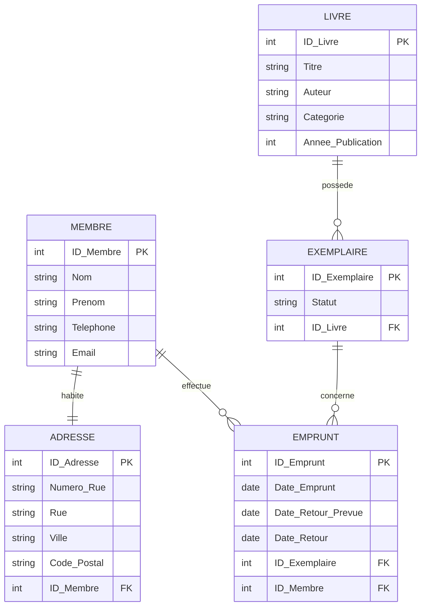

# Hocine Adjaoud 300148450
# 📚 Projet : Gestion de Bibliothèque

## 🎯 Objectif du projet

Ce projet a pour objectif de concevoir une **base de données relationnelle** pour la gestion d’une bibliothèque.
Il permet de gérer :

* les membres
* les livres
* les exemplaires
* les emprunts

Le travail respecte les règles de **normalisation (1FN, 2FN, 3FN)** et inclut un **diagramme E/R (ERD)**.

---

## 🧱 Description du système

Le système de gestion de bibliothèque permet :

* l’inscription des membres
* l’enregistrement des livres
* la gestion des exemplaires d’un livre
* le suivi des emprunts et des retours

Chaque emprunt est associé à **un membre** et **un exemplaire précis**.

---

## 🧩 Normalisation

### 🔹 Première Forme Normale (1FN)

Les données sont regroupées dans une seule relation avec des attributs atomiques, sans groupes répétitifs.

```
Membre, Nom_Membre, Email_Membre, Livre, Titre_Livre, Auteur, Catégorie, Année_Publication, Exemplaire, Statut_Exemplaire, Emprunt, Date_Emprunt, Date_Retour_Prévue, Date_Retour
```

---

### 🔹 Deuxième Forme Normale (2FN)

Les dépendances partielles sont supprimées par la séparation des entités principales.

* Membre
* Livre
* Exemplaire
* Emprunt

Chaque attribut dépend entièrement de la clé primaire de sa table.

---

### 🔹 Troisième Forme Normale (3FN)

Toutes les dépendances transitives sont éliminées.

#### Schéma relationnel (3FN)

```
Membre (ID_Membre, Nom, Prénom, Téléphone, Email)

Adresse (ID_Adresse, Numéro_Rue, Rue, Ville, Code_Postal, #ID_Membre)

Livre (ID_Livre, Titre, Auteur, Catégorie, Année_Publication)

Exemplaire (ID_Exemplaire, Statut, #ID_Livre)

Emprunt (ID_Emprunt, Date_Emprunt, Date_Retour_Prévue, Date_Retour, #ID_Exemplaire, #ID_Membre)
```

---

## 🔗 Diagramme Entité-Relation (ERD)

Le diagramme suivant représente graphiquement les entités, leurs attributs et leurs relations.



---

## ✅ Conclusion

Ce projet respecte les principes de la **modélisation relationnelle** et de la **normalisation en 3FN**.
Il permet une gestion claire, cohérente et sans redondance des données d’une bibliothèque.

Ce modèle peut être facilement implémenté dans un SGBD relationnel (MySQL, PostgreSQL, SQL Server, etc.).
