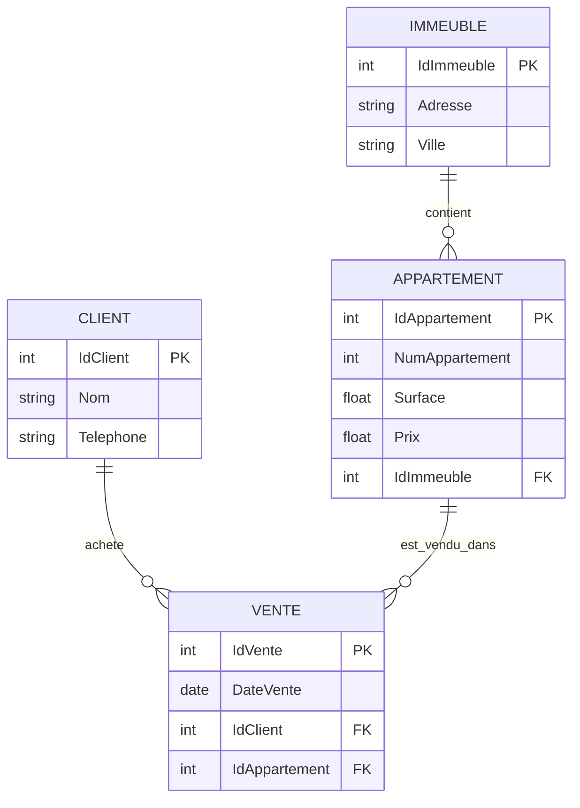

🏢 Projet – Normalisation d’une Base de Données Immobilière
🎯 Domaine

Système de gestion des ventes d’appartements dans des immeubles.

Ce projet illustre le passage d’une table non normalisée vers une base de données en 1FN, 2FN et 3FN, avec un diagramme Entité/Relation (E/R) final.

📌 1ère Forme Normale (1FN)
🔎 Description

En 1FN, toutes les données sont stockées dans une seule table VENTE.
Chaque champ contient une valeur atomique.

📄 Structure
VENTE
---------------------------------------------------------
IdVente (PK) | NomClient | TelClient | AdresseImmeuble |
Ville | NumAppartement | Surface | Prix | DateVente

⚠️ Problèmes

Redondance des informations client

Redondance des informations immeuble

Difficulté de mise à jour

Anomalies d’insertion et de suppression

📌 2ème Forme Normale (2FN)
🔎 Description

Séparation des données selon leurs dépendances fonctionnelles.

🧱 Entités créées :

CLIENT

IMMEUBLE

APPARTEMENT

VENTE

Les dépendances partielles sont éliminées.

📌 3ème Forme Normale (3FN)
🔎 Description

Élimination des dépendances transitives.

Chaque attribut dépend uniquement de la clé primaire de sa table.

✅ Structure finale

CLIENT(IdClient, Nom, Telephone)

IMMEUBLE(IdImmeuble, Adresse, Ville)

APPARTEMENT(IdAppartement, NumAppartement, Surface, Prix, IdImmeuble)

VENTE(IdVente, DateVente, IdClient, IdAppartement)

📊 Diagramme Entité / Relation (E/R)

🔗 Relations

Un client peut acheter plusieurs appartements.

Un appartement appartient à un seul immeuble.

Une vente associe un client et un appartement.

Un immeuble contient plusieurs appartements.

🛠 Technologies

Modélisation conceptuelle

Normalisation 1FN → 3FN

Diagramme E/R avec Mermaid

👨‍🎓 Auteur

Mazigh Bareche
Projet académique – Base de données

