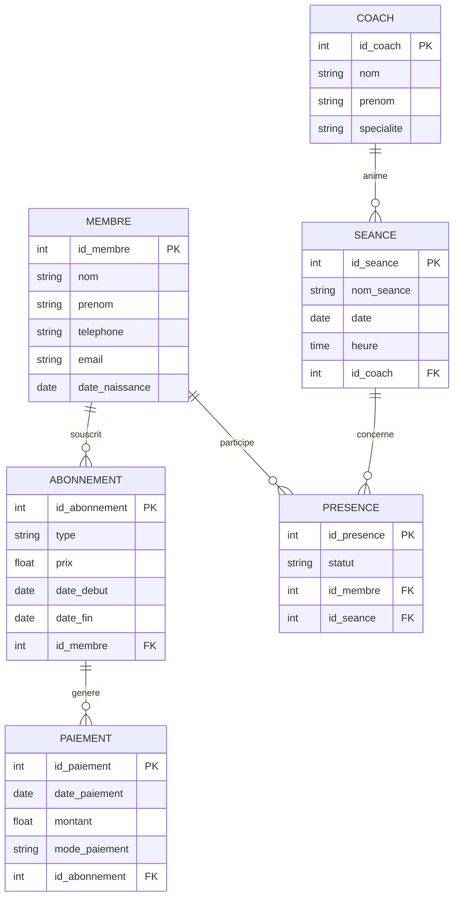

# 🏋️ Gestion d'une salle de sport
👤 Informations étudiant

Nom : Aroua Mohand Tahar

ID Boréal : 300150284

Cours : INF1099

## 📌 Description du projet

Ce projet consiste à concevoir une base de données pour la **gestion d'une salle de sport**.  
Le système permet de gérer les **membres**, les **abonnements**, les **séances d'entraînement**, les **coachs**, les **paiements** et la **présence des membres**.

---

## 🧩 Normalisation

Le modèle de données respecte les règles de normalisation suivantes :
- Première Forme Normale (1FN)
- Deuxième Forme Normale (2FN)
- Troisième Forme Normale (3FN)

---

## 📊 Diagramme ER (ERD)

---

## 🚀 Utilisation

Ce modèle de base de données peut être utilisé pour :
- Gérer les inscriptions des membres
- Suivre les abonnements et leur validité
- Organiser les séances d'entraînement
- Enregistrer la présence aux séances
- Gérer les paiements

---

## 📝 Licence

Ce projet est développé dans un cadre éducatif.
