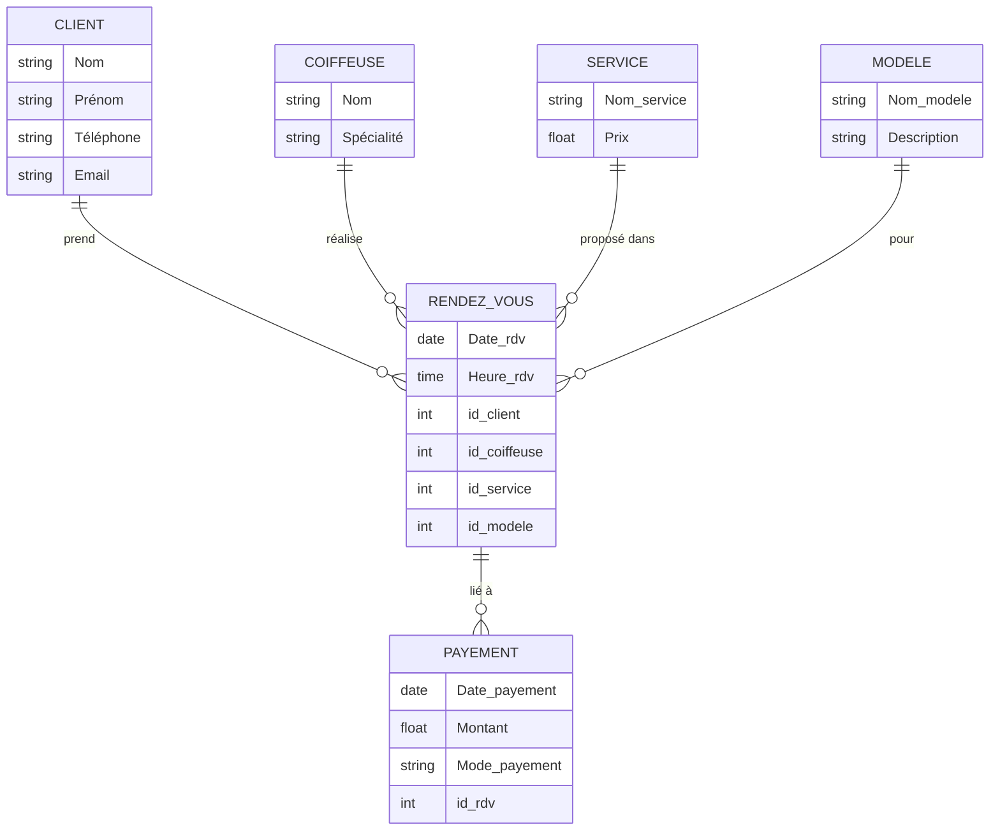

\# 📘 Projet de Modélisation de Base de Données  

\*\*Nom :\*\* Jesmina DOS-REIS

\*\*Matricule :\*\* 300150303 

---

\## 🌍 Présentation du site AFIVI'S HOUSE 

&nbsp;afivi's house est une plateforme,basée a Toronto, qui permet de reserver des prestations de coiffure en toute securiter et et a nimporte quelle moment.

---

\## 🎯 Objectifs du projet

Enregistrer les clients et leurs informations de contact.

Suivre le calendrier des disponibilités et aussi les horaires disponibles .

---

\## 🧱 Formes normales

\### ✅ Première Forme Normale (1FN)

\- Chaque champ contient \*\*une valeur atomique\*\*

\- Aucune liste ou valeur multiple dans une cellule

\- Chaque ligne est identifiable par une clé primaire

📄 Fichier : `1FN.txt`

---

\### ✅ Deuxième Forme Normale (2FN)

\- La table est déjà en \*\*1FN\*\*

\- Tous les attributs non-clés dépendent \*\*entièrement\*\* de la clé primaire

\- Suppression des \*\*dépendances partielles\*\*

📄 Fichier : `2FN.txt`

---

\### ✅ Troisième Forme Normale (3FN)

\- La table est déjà en \*\*2FN\*\*

\- Aucun attribut non-clé ne dépend d’un autre attribut non-clé

\- Suppression des \*\*dépendances transitives\*\*

📄 Fichier : `3FN.txt`

---

---

