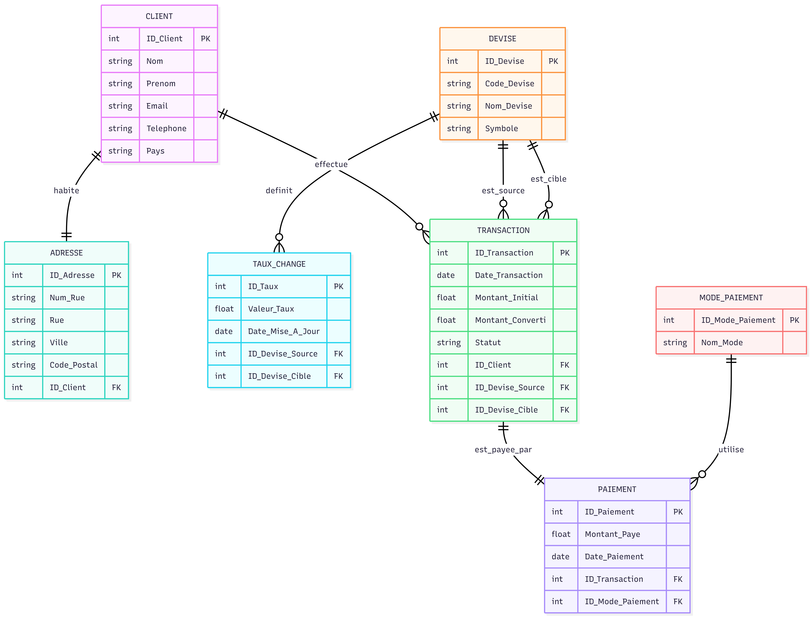

# Site d’échange de devises

## 1. Choix du Domaine

Le domaine choisi est la gestion d’un site d’échange de devises en ligne.  
Ce sujet permet de modéliser le cycle complet depuis l’inscription d’un client, la consultation des taux de change, la conversion d’un montant d’une devise vers une autre, jusqu’au paiement final et à l’enregistrement de l’historique des transactions.

---

## 2. Normalisation

### Fichier 1 : 1FN (Première Forme Normale)

Dans cette phase, toutes les données sont regroupées dans une structure plate (« Flat Table »).  
Chaque attribut est atomique. Il n’y a pas encore d’ID techniques.

**Attributs :**

Client_Nom, Client_Prenom, Client_Tel, Client_Email,  
Num_Rue, Rue, Ville, Code_Postal, Pays_Client,  
Devise_Source, Devise_Cible, Taux_Change,  
Montant_Initial, Montant_Converti, Date_Transaction, Statut_Transaction,  
Mode_Paiement, Montant_Paye, Nom_Prestataire_Paiement

---

### Fichier 2 : 2FN (Deuxième Forme Normale)

Définition des relations et des cardinalités.  
Les entités sont séparées afin d’éviter les redondances partielles.

CLIENT (1,N) —— EFFECTUE —— (1,1) TRANSACTION  
CLIENT (1,1) —— HABITE —— (1,1) ADRESSE  
CLIENT (1,1) —— POSSÈDE —— (1,1) COMPTE_CLIENT  

DEVISE (1,N) —— EST_SOURCE_DE —— (1,1) TRANSACTION  
DEVISE (1,N) —— EST_CIBLE_DE —— (1,1) TRANSACTION  

DEVISE (1,1) —— POSSÈDE —— (1,N) TAUX_CHANGE  

TRANSACTION (1,1) —— EST_PAYÉE_PAR —— (1,1) PAIEMENT  
PAIEMENT (1,1) —— UTILISE —— (1,1) MODE_PAIEMENT  
PAIEMENT (1,1) —— PASSE_PAR —— (1,1) PRESTATAIRE_PAIEMENT  

TRANSACTION (1,1) —— GÉNÈRE —— (0,N) HISTORIQUE_TRANSACTION  

---

### Fichier 3 : 3FN (Troisième Forme Normale)

Structure finale.  
Les dépendances transitives sont éliminées.  
Introduction des Clés Primaires (ID) et des Clés Étrangères (#).

Client (ID_Client, Nom, Prénom, Téléphone, Email)  

Adresse (ID_Adresse, Numéro_Rue, Rue, Ville, Code_Postal, Pays, #ID_Client)  

Compte_Client (ID_Compte, Date_Création, Statut, #ID_Client)  

Devise (ID_Devise, Code_Devise, Nom_Devise, Symbole)  

Taux_Change (ID_Taux, Valeur_Taux, Date_Mise_À_Jour, #ID_Devise_Source, #ID_Devise_Cible)  

Transaction (ID_Transaction, Date_Transaction, Montant_Initial, Montant_Converti, Statut,  
#ID_Client, #ID_Devise_Source, #ID_Devise_Cible, #ID_Taux)  

Paiement (ID_Paiement, Date_Paiement, Montant_Payé, #ID_Transaction, #ID_Mode_Paiement, #ID_Prestataire)  

Mode_Paiement (ID_Mode_Paiement, Nom_Mode)  

Prestataire_Paiement (ID_Prestataire, Nom_Prestataire, Type_Service)  

Historique_Transaction (ID_Historique, Date_Action, Action, #ID_Transaction)  

---

## 📊 Diagramme Entité-Relation

