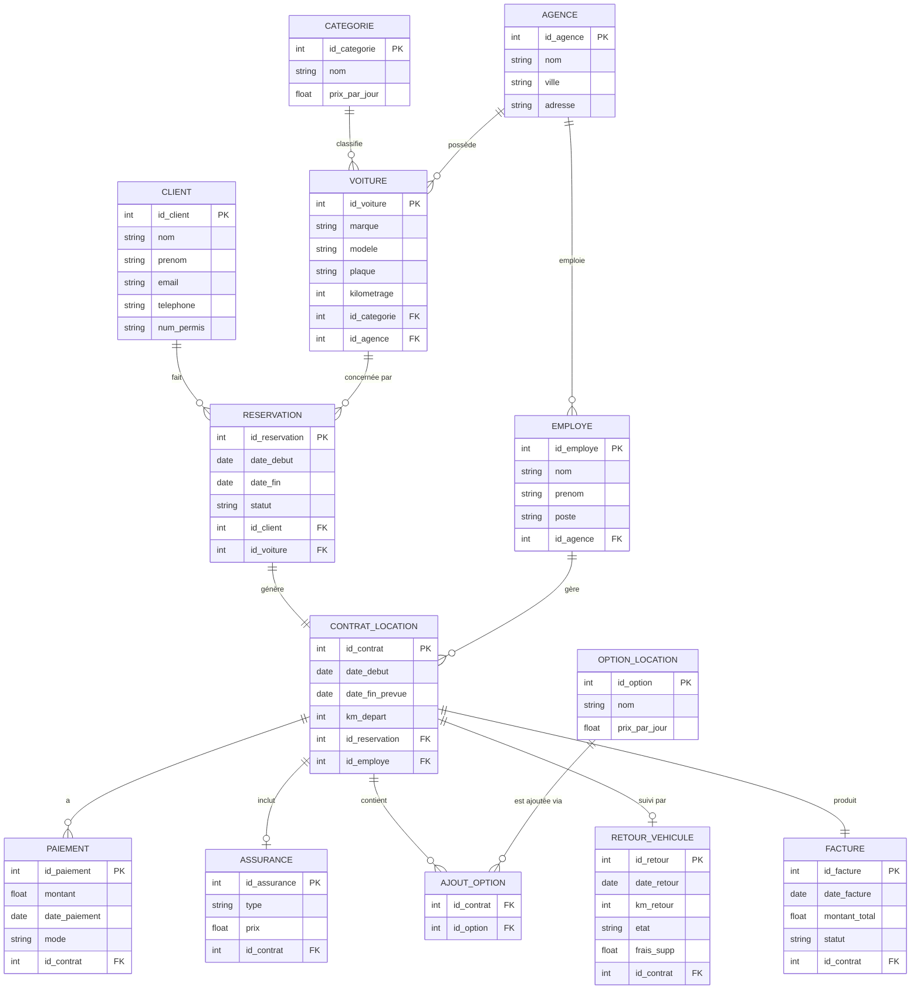

# 🚗 CarGoRent – Système de Gestion de Location de Voitures

> **Projet scolaire – Normalisation de bases de données & Modélisation Entité/Relation**

---

## 👤 Informations

| Champ | Détail |
|---|---|
| **Nom** | Taki Eddine Choufa |
| **Matricule** | 300150524 |
| **Projet** | CarGoRent |
| **Sujet** | Normalisation (1FN → 3FN) & Diagramme E/R |

---

## 📌 Présentation du projet

**CarGoRent** est un système de gestion de location de voitures.  
Il permet de gérer les clients, les véhicules, les réservations, les contrats et les paiements.

L'objectif principal est de **concevoir une base de données bien structurée** en appliquant les règles de la normalisation, pour éviter la répétition des données et les erreurs.

---

## 🎯 Objectifs du projet

- ✅ Appliquer les **formes normales** (1FN, 2FN, 3FN) étape par étape
- ✅ Identifier les **entités** et les **relations** du système
- ✅ Réduire la **redondance** et les **anomalies** dans les données
- ✅ Créer un **modèle relationnel final** prêt pour une implémentation SQL

---

## 🔄 Étapes de normalisation

### 📄 Première Forme Normale – 1FN (`1FN.txt`)

La **1FN** consiste à mettre toutes les données dans une seule table plate.  
Chaque colonne contient une seule valeur (pas de listes ou de groupes répétés).  
On s'assure que chaque ligne est **unique** grâce à une clé primaire.

> ⚠️ À ce stade, il y a beaucoup de **redondance** dans les données.

---

### 🔧 Deuxième Forme Normale – 2FN (`2FN.txt`)

La **2FN** consiste à **séparer les entités** qui existent indépendamment.  
On élimine les dépendances partielles : chaque attribut doit dépendre de **toute la clé**, pas juste d'une partie.

> ✅ On commence à avoir des tables séparées pour les clients, les voitures, etc.

---

### ✅ Troisième Forme Normale – 3FN (`3FN.txt`)

La **3FN** consiste à éliminer les **dépendances transitives**.  
Un attribut ne doit pas dépendre d'un autre attribut non-clé.

> 🏁 C'est la **structure finale** utilisée dans ce projet. Chaque table est propre, indépendante et reliée par des clés étrangères.

---

## 🗃️ Modèle relationnel final (3FN)

Voici les entités principales du système avec leurs attributs :

---

### 👤 Client
- `id_client` *(clé primaire)*
- nom, prénom, adresse, téléphone, email
- numéro de permis de conduire, date de naissance

---

### 🚘 Voiture
- `id_voiture` *(clé primaire)*
- marque, modèle, année, couleur
- plaque d'immatriculation, kilométrage
- `id_categorie` *(clé étrangère)*
- `id_agence` *(clé étrangère)*

---

### 🏷️ Categorie
- `id_categorie` *(clé primaire)*
- nom de la catégorie (ex : économique, berline, SUV)
- prix de location par jour

---

### 🏢 Agence
- `id_agence` *(clé primaire)*
- nom, adresse, ville, téléphone

---

### 📅 Reservation
- `id_reservation` *(clé primaire)*
- date de réservation, date de début, date de fin
- statut (confirmée, annulée…)
- `id_client` *(clé étrangère)*
- `id_voiture` *(clé étrangère)*

---

### 📝 Contrat_Location
- `id_contrat` *(clé primaire)*
- date de début, date de fin prévue
- kilométrage de départ
- `id_reservation` *(clé étrangère)*
- `id_employe` *(clé étrangère)*

---

### 💳 Paiement
- `id_paiement` *(clé primaire)*
- montant, date de paiement, mode de paiement
- `id_contrat` *(clé étrangère)*

---

### 🛡️ Assurance
- `id_assurance` *(clé primaire)*
- type d'assurance, couverture, prix
- `id_contrat` *(clé étrangère)*

---

### ➕ Option_Location
- `id_option` *(clé primaire)*
- nom de l'option (ex : GPS, siège bébé), prix par jour

---

### 🔗 Ajout_Option
- `id_contrat` *(clé étrangère)*
- `id_option` *(clé étrangère)*
- *(table de liaison entre contrat et option)*

---

### 🔁 Retour_Vehicule
- `id_retour` *(clé primaire)*
- date de retour réelle, kilométrage de retour
- état du véhicule, frais supplémentaires
- `id_contrat` *(clé étrangère)*

---

### 🧾 Facture
- `id_facture` *(clé primaire)*
- date, montant total, statut de paiement
- `id_contrat` *(clé étrangère)*

---

### 👔 Employe
- `id_employe` *(clé primaire)*
- nom, prénom, poste, téléphone
- `id_agence` *(clé étrangère)*

---

## 📊 Diagramme Entité-Relation



---

## 📁 Structure du projet

```
CarGoRent/
│── README.md
│── 1FN.txt
│── 2FN.txt
│── 3FN.txt
│── diagramme_ER.md
│── images/
│   └── Diagramme.png
```

| Fichier | Description |
|---|---|
| `README.md` | Documentation principale du projet |
| `1FN.txt` | Table plate – Première forme normale |
| `2FN.txt` | Tables séparées – Deuxième forme normale |
| `3FN.txt` | Structure finale – Troisième forme normale |
| `diagramme_ER.md` | Diagramme Entité-Relation (Mermaid) |
| `images/Diagramme.png` | Image du diagramme E/R |

---

## ✅ Conclusion

Ce projet présente la conception d'une base de données **normalisée** pour un système de location de voitures appelé **CarGoRent**.

En passant de la **1FN à la 3FN**, nous avons :
- ✂️ Éliminé la redondance des données
- 🔗 Organisé les entités avec des relations claires
- 🏗️ Créé une structure solide, prête pour une future implémentation

La modélisation E/R permet de **visualiser facilement** les liens entre les différentes parties du système, ce qui facilite la compréhension et le développement.

---

<div align="center">

**CarGoRent** – Projet de base de données | Taki Eddine Choufa | Matricule : 300150524

</div>
