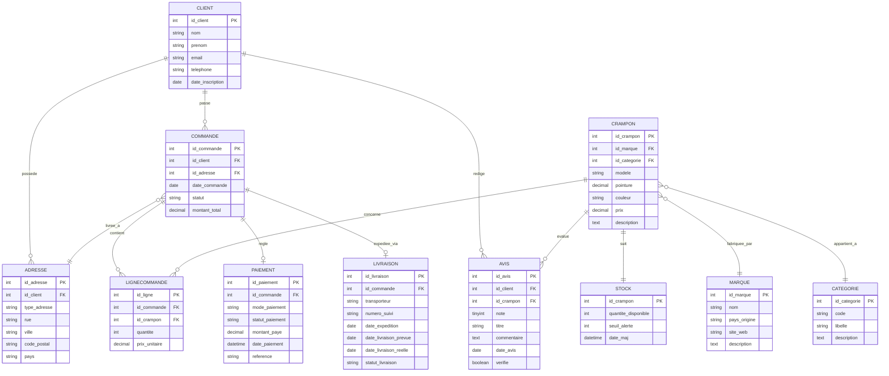

# ⚽ Système de Gestion de Vente de Crampons de Football

> Projet de base de données — 11 tables · Modélisation · Normalisation 3NF · SQL

---

## Description

Ce projet modélise un système de gestion complet pour un magasin spécialisé dans la vente de crampons de football. Il couvre l'intégralité du cycle commercial : enregistrement des clients et de leurs adresses, gestion du catalogue par marque et catégorie, traitement des commandes, suivi des paiements, des livraisons, du stock et collecte des avis clients.

---

## Structure du projet

```
📁 gestion_crampons/
├── README.md              ← Vue d'ensemble + diagramme E/R
├── 1FN.md                 ← Première Forme Normale
├── 2FN.md                 ← Deuxième Forme Normale
├── 3FN.md                 ← Troisième Forme Normale
└── gestion_crampons.docx  ← Documentation complète + script SQL
```

---

## Les 11 tables

| # | Table | Rôle |
|---|-------|------|
| 1 | CLIENT | Acheteurs enregistrés |
| 2 | ADRESSE | Adresses postales des clients |
| 3 | MARQUE | Fabricants de crampons |
| 4 | CATEGORIE | Types de surface (FG, AG, SG…) |
| 5 | CRAMPON | Produits en vente |
| 6 | STOCK | Inventaire par crampon |
| 7 | COMMANDE | Achats passés |
| 8 | LIGNECOMMANDE | Détail des commandes |
| 9 | PAIEMENT | Règlement des commandes |
| 10 | LIVRAISON | Suivi d'expédition |
| 11 | AVIS | Évaluations clients |

---

## Modèle Relationnel

```
CLIENT        (id_client*, nom, prenom, email, telephone, date_inscription)
ADRESSE       (id_adresse*, type_adresse, rue, ville, code_postal, pays, #id_client)
MARQUE        (id_marque*, nom, pays_origine, site_web, description)
CATEGORIE     (id_categorie*, code, libelle, description)
CRAMPON       (id_crampon*, modele, pointure, couleur, prix, description, #id_marque, #id_categorie)
STOCK         (id_crampon*, quantite_disponible, seuil_alerte, date_maj)
COMMANDE      (id_commande*, date_commande, statut, montant_total, #id_client, #id_adresse)
LIGNECOMMANDE (id_ligne*, quantite, prix_unitaire, #id_commande, #id_crampon)
PAIEMENT      (id_paiement*, mode_paiement, statut_paiement, montant_paye, date_paiement, reference, #id_commande)
LIVRAISON     (id_livraison*, transporteur, numero_suivi, date_expedition, date_livraison_prevue, date_livraison_reelle, statut_livraison, #id_commande)
AVIS          (id_avis*, note, titre, commentaire, date_avis, verifie, #id_client, #id_crampon)
```

`*` = Clé primaire | `#` = Clé étrangère

---

## Diagramme Entité-Relation (E/R)


---
