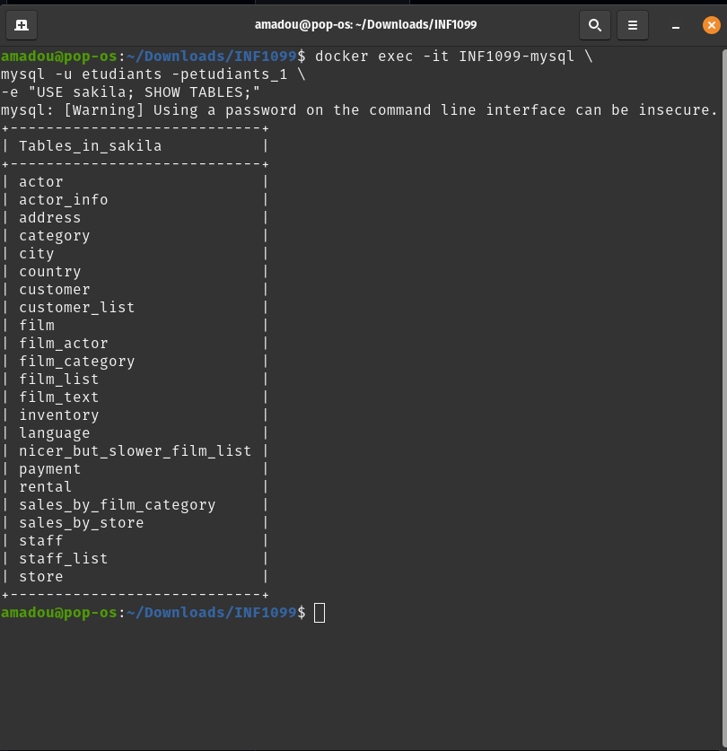
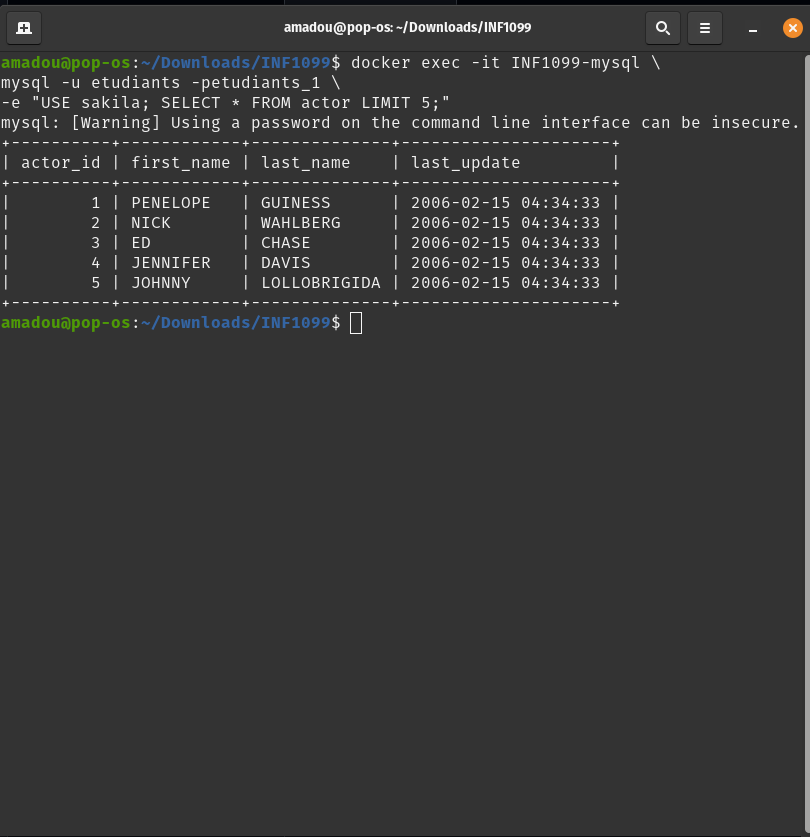

# INF1099 – TP MySQL avec Docker

> Manipulation de données avec MySQL et Docker sous Linux

## 📋 Informations du projet

- **Étudiant** : Amadou Sow
- **Cours** : INF1099
- **Environnement** : Linux (Ubuntu 64 bits)
- **Technologie** : Docker
- **Base de données** : MySQL 8.0 avec Sakila

## 🎯 Objectifs du TP

Ce travail pratique vise à maîtriser :

- Le fonctionnement des conteneurs Docker
- Le déploiement d'un serveur MySQL conteneurisé
- La gestion des bases de données via ligne de commande
- L'importation d'un schéma SQL
- L'automatisation du déploiement

## 🛠️ Prérequis

- Ubuntu Linux (64 bits)
- Docker installé
- Accès Internet pour télécharger les images et fichiers
- Terminal Bash

## 📦 Installation de Docker

```bash
# Mise à jour du système
sudo apt update

# Installation de Docker
sudo apt install docker.io -y

# Activation du service Docker
sudo systemctl enable docker
sudo systemctl start docker

# Vérification de l'installation
docker --version
```

## 🚀 Démarrage rapide

### 1. Préparation du projet

```bash
# Création du dossier de travail
mkdir -p ~/Downloads/INF1099
cd ~/Downloads/INF1099
```

### 2. Téléchargement de la base Sakila

```bash
# Téléchargement
wget https://downloads.mysql.com/docs/sakila-db.zip

# Installation de unzip (si nécessaire)
sudo apt install unzip -y

# Extraction
unzip sakila-db.zip
```

### 3. Déploiement du conteneur MySQL

```bash
docker run -d \
  --name INF1099-mysql \
  -e MYSQL_ROOT_PASSWORD=rootpass \
  -p 3306:3306 \
  mysql:8.0
```

**Paramètres expliqués :**
- `-d` : exécution en mode détaché
- `--name` : nom du conteneur
- `-e` : variable d'environnement pour le mot de passe root
- `-p 3306:3306` : mapping du port MySQL
- `mysql:8.0` : image Docker officielle

### 4. Configuration de la base de données

```bash
# Création de la base sakila
docker exec -it INF1099-mysql \
mysql -u root -prootpass \
-e "CREATE DATABASE sakila;"

# Création de l'utilisateur
docker exec -it INF1099-mysql \
mysql -u root -prootpass \
-e "CREATE USER 'etudiants'@'%' IDENTIFIED BY 'etudiants_1';"

# Attribution des privilèges
docker exec -it INF1099-mysql \
mysql -u root -prootpass \
-e "GRANT ALL PRIVILEGES ON *.* TO 'etudiants'@'%' WITH GRANT OPTION;"

# Application des permissions
docker exec -it INF1099-mysql \
mysql -u root -prootpass \
-e "FLUSH PRIVILEGES;"
```

### 5. Importation des données Sakila

```bash
# Importation du schéma
cat sakila-db/sakila-schema.sql | \
docker exec -i INF1099-mysql \
mysql -u etudiants -petudiants_1 sakila

# Importation des données
cat sakila-db/sakila-data.sql | \
docker exec -i INF1099-mysql \
mysql -u etudiants -petudiants_1 sakila
```

### 6. Vérification

```bash
# Afficher les tables
docker exec -it INF1099-mysql \
mysql -u etudiants -petudiants_1 \
-e "USE sakila; SHOW TABLES;"

# Tester une requête
docker exec -it INF1099-mysql \
mysql -u etudiants -petudiants_1 \
-e "USE sakila; SELECT * FROM actor LIMIT 5;"
```




## 🤖 Script d'automatisation

Un script bash est fourni pour automatiser tout le processus de déploiement.

### Création du script

```bash
nano start-sakila-INF1099.sh
```

Copiez le contenu suivant :

```bash
#!/bin/bash

PROJECT_DIR="$HOME/Downloads/INF1099"

# Démarrage du conteneur MySQL
docker run -d \
  --name INF1099-mysql \
  -e MYSQL_ROOT_PASSWORD=rootpass \
  -p 3306:3306 \
  mysql:8.0

# Attendre que MySQL soit prêt
sleep 20

# Création de la base de données
docker exec INF1099-mysql \
mysql -u root -prootpass \
-e "CREATE DATABASE sakila;"

# Création de l'utilisateur
docker exec INF1099-mysql \
mysql -u root -prootpass \
-e "CREATE USER 'etudiants'@'%' IDENTIFIED BY 'etudiants_1';"

# Attribution des privilèges
docker exec INF1099-mysql \
mysql -u root -prootpass \
-e "GRANT ALL PRIVILEGES ON *.* TO 'etudiants'@'%' WITH GRANT OPTION;"

# Importation du schéma
cat $PROJECT_DIR/sakila-db/sakila-schema.sql | \
docker exec -i INF1099-mysql \
mysql -u etudiants -petudiants_1 sakila

# Importation des données
cat $PROJECT_DIR/sakila-db/sakila-data.sql | \
docker exec -i INF1099-mysql \
mysql -u etudiants -petudiants_1 sakila

echo "✅ Importation terminée avec succès!"
```

### Exécution du script

```bash
# Rendre le script exécutable
chmod +x start-sakila-INF1099.sh

# Lancer le script
./start-sakila-INF1099.sh
```

---
