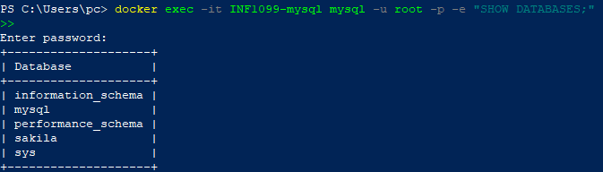
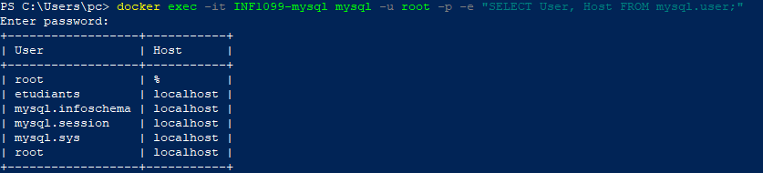
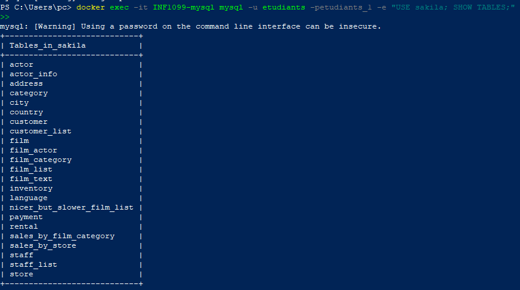
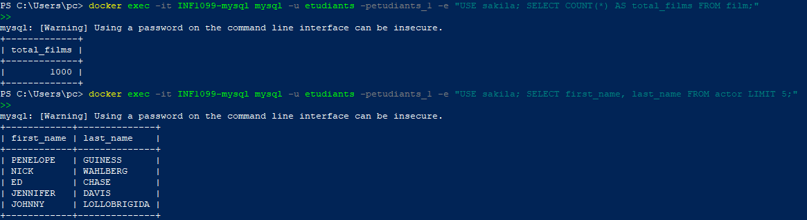

# TP MySQL avec Podman sur Windows

#Boualem BELBESSAI

#INF1099

---

Ce TP est divisé en **12 étapes PowerShell** :

### 📄 **Étape 1-2** - Préparation de l'environnement
- Vérification des prérequis système
- Création du dossier de projet dans Downloads
- Téléchargement et décompression de Sakila DB

### 📄 **Étape 3-5** - Configuration Podman
- Configuration de l'alias Docker pour Podman
- Initialisation de la machine Podman (VM Linux)
- Démarrage et vérification de la machine

### 📄 **Étape 6-8** - Conteneur MySQL et Base de données
- Lancement du conteneur MySQL
- Création de la base de données Sakila
- Création et configuration de l'utilisateur etudiants

### 📄 **Étape 9-10** - Import et Vérification
- Importation du schéma Sakila
- Importation des données Sakila
- Vérification de l'importation des tables

---

# 🚀 Étapes du laboratoire

## Étape 0 : Configuration des variables

```powershell
$projectDir = "$env:USERPROFILE\Downloads\INF1099"
```
---

## Étape 1 : Créer le dossier de projet

```powershell
# Créer le dossier INF1099 dans Downloads
$projectDir = "$env:USERPROFILE\Downloads\INF1099"
New-Item -ItemType Directory -Path $projectDir -Force
```

<details>
<summary>📋 Output</summary>

```powershell
PS C:\Users\Student> New-Item -ItemType Directory -Path $projectDir -Force


    Directory: C:\Users\Student\Downloads


Mode                 LastWriteTime         Length Name
----                 -------------         ------ ----
d-----         2/3/2026   10:30 AM                INF1099
```

</details>


---

## Étape 2 : Télécharger et décompresser Sakila DB

```powershell
# Décompresser Sakila dans le dossier projet
Expand-Archive -Path "$env:USERPROFILE\Downloads\sakila-db.zip" -DestinationPath $projectDir -Force
```

---

## Étape 3 : Configurer l'alias Docker

```powershell
# Alias temporaire
Set-Alias docker podman

# Pour rendre l'alias permanent
notepad $PROFILE
# Ajouter la ligne suivante dans le fichier :
# Set-Alias docker podman
```


---

## Étape 4 : Initialiser la machine Podman

```powershell
# Initialiser la machine Linux (VM)
podman machine init
```

<details>
<summary>📋 Output</summary>

```powershell
PS C:\Users\Student> podman machine init
Extracting compressed file
Image resized.
Machine init complete
To start your machine run:

        podman machine start
```

</details>


---

## Étape 5 : Démarrer la machine Podman

```powershell
# Démarrer la machine
podman machine start

# Vérifier le fonctionnement
podman ps -a
```

<details>
<summary>📋 Output</summary>

```powershell
PS C:\Users\Student> podman machine start
Starting machine "podman-machine-default"
Waiting for VM ...
Mounting volume... C:\Users\Student:C:\Users\Student

This machine is currently configured in rootless mode. If your containers
require root permissions (e.g. ports < 1024), or if you run into compatibility
issues with non-podman clients, you can switch using the following command:

        podman machine set --rootful

API forwarding listening on: npipe:////./pipe/docker_engine

Docker API clients default to this address. You do not need to set DOCKER_HOST.
Machine "podman-machine-default" started successfully

PS C:\Users\Student> podman ps -a
CONTAINER ID  IMAGE       COMMAND     CREATED     STATUS      PORTS       NAMES
```

</details>


---

## Étape 6 : Lancer le conteneur MySQL

```powershell
docker run -d --name INF1099-mysql -e MYSQL_ROOT_PASSWORD=rootpass -p 3306:3306 mysql:8.0

# Vérifier que le conteneur est démarré
docker ps
```

<details>
<summary>📋 Output</summary>

```powershell
PS C:\Users\Student> docker run -d --name INF1099-mysql -e MYSQL_ROOT_PASSWORD=rootpass -p 3306:3306 mysql:8.0
Trying to pull docker.io/library/mysql:8.0...
Getting image source signatures
Copying blob sha256:...
Copying config sha256:...
Writing manifest to image destination
a1b2c3d4e5f6g7h8i9j0k1l2m3n4o5p6q7r8s9t0u1v2w3x4y5z6

PS C:\Users\Student> docker ps
CONTAINER ID  IMAGE                            COMMAND     CREATED        STATUS        PORTS                   NAMES
a1b2c3d4e5f6  docker.io/library/mysql:8.0      mysqld      5 seconds ago  Up 4 seconds  0.0.0.0:3306->3306/tcp  INF1099-mysql
```

</details>


---

## Étape 7 : Créer la base de données Sakila

```powershell
# Créer la base de données
docker exec -it INF1099-mysql mysql -u root -prootpass -e "CREATE DATABASE sakila;"

# Vérifier la création
docker exec -it INF1099-mysql mysql -u root -prootpass -e "SHOW DATABASES;"
```

<details>
<summary>📋 Output</summary>

```powershell
PS C:\Users\Student> docker exec -it INF1099-mysql mysql -u root -prootpass -e "CREATE DATABASE sakila;"

PS C:\Users\Student> docker exec -it INF1099-mysql mysql -u root -prootpass -e "SHOW DATABASES;"
+--------------------+
| Database           |
+--------------------+
| information_schema |
| mysql              |
| performance_schema |
| sakila             |
| sys                |
+--------------------+
```

</details>

<details>
<summary>🖼️ Capture d'écran</summary>



</details>

---

## Étape 8 : Créer l'utilisateur etudiants

```powershell
# Créer l'utilisateur
docker exec -it INF1099-mysql mysql -u root -prootpass -e "CREATE USER 'etudiants'@'localhost' IDENTIFIED BY 'etudiants_1';"

# Accorder les privilèges
docker exec -it INF1099-mysql mysql -u root -prootpass -e "GRANT ALL PRIVILEGES ON *.* TO 'etudiants'@'localhost' WITH GRANT OPTION;"

# Vérifier la création
docker exec -it INF1099-mysql mysql -u root -prootpass -e "SELECT User, Host FROM mysql.user;"
```

<details>
<summary>📋 Output</summary>

```powershell
PS C:\Users\Student> docker exec -it INF1099-mysql mysql -u root -prootpass -e "SELECT User, Host FROM mysql.user;"
+------------------+-----------+
| User             | Host      |
+------------------+-----------+
| etudiants        | localhost |
| mysql.infoschema | localhost |
| mysql.session    | localhost |
| mysql.sys        | localhost |
| root             | localhost |
+------------------+-----------+
```

</details>

<details>
<summary>🖼️ Capture d'écran</summary>



</details>

---

## Étape 9 : Importer le schéma Sakila

```powershell
# Charger le schéma
Get-Content "$projectDir\sakila-db\sakila-schema.sql" | docker exec -i INF1099-mysql mysql -u etudiants -petudiants_1 sakila
```


---

## Étape 10 : Importer les données Sakila

```powershell
# Charger les données
Get-Content "$projectDir\sakila-db\sakila-data.sql" | docker exec -i INF1099-mysql mysql -u etudiants -petudiants_1 sakila
```


---

## Étape 11 : Vérifier l'importation

```powershell
# Afficher les tables
docker exec -it INF1099-mysql mysql -u etudiants -petudiants_1 -e "USE sakila; SHOW TABLES;"
```

<details>
<summary>📋 Output</summary>

```powershell
PS C:\Users\Student> docker exec -it INF1099-mysql mysql -u etudiants -petudiants_1 -e "USE sakila; SHOW TABLES;"
+----------------------------+
| Tables_in_sakila           |
+----------------------------+
| actor                      |
| actor_info                 |
| address                    |
| category                   |
| city                       |
| country                    |
| customer                   |
| customer_list              |
| film                       |
| film_actor                 |
| film_category              |
| film_list                  |
| film_text                  |
| inventory                  |
| language                   |
| nicer_but_slower_film_list |
| payment                    |
| rental                     |
| sales_by_film_category     |
| sales_by_store             |
| staff                      |
| staff_list                 |
| store                      |
+----------------------------+
```

</details>

<details>
<summary>🖼️ Capture d'écran</summary>



</details>

---

## Étape 12 : Tester quelques requêtes SQL

```powershell
# Se connecter de manière interactive
docker exec -it INF1099-mysql mysql -u etudiants -petudiants_1 sakila

# Ou exécuter des requêtes directement
docker exec -it INF1099-mysql mysql -u etudiants -petudiants_1 -e "USE sakila; SELECT COUNT(*) AS total_films FROM film;"
docker exec -it INF1099-mysql mysql -u etudiants -petudiants_1 -e "USE sakila; SELECT first_name, last_name FROM actor LIMIT 5;"
```

<details>
<summary>📋 Output</summary>

```powershell
PS C:\Users\Student> docker exec -it INF1099-mysql mysql -u etudiants -petudiants_1 -e "USE sakila; SELECT COUNT(*) AS total_films FROM film;"
+-------------+
| total_films |
+-------------+
|        1000 |
+-------------+

PS C:\Users\Student> docker exec -it INF1099-mysql mysql -u etudiants -petudiants_1 -e "USE sakila; SELECT first_name, last_name FROM actor LIMIT 5;"
+------------+--------------+
| first_name | last_name    |
+------------+--------------+
| PENELOPE   | GUINESS      |
| NICK       | WAHLBERG     |
| ED         | CHASE        |
| JENNIFER   | DAVIS        |
| JOHNNY     | LOLLOBRIGIDA |
+------------+--------------+
```

</details>

<details>
<summary>🖼️ Capture d'écran</summary>



</details>

---

## 📚 Commandes utiles

| Commande | Description |
|----------|-------------|
| `docker ps -a` | Lister tous les conteneurs |
| `docker stop INF1099-mysql` | Arrêter le conteneur MySQL |
| `docker start INF1099-mysql` | Démarrer le conteneur MySQL |
| `docker logs INF1099-mysql` | Voir les logs du serveur |
| `docker exec -it INF1099-mysql mysql -u etudiants -petudiants_1` | Se connecter à MySQL |
| `podman machine stop` | Arrêter la machine Podman |
| `podman machine start` | Démarrer la machine Podman |

---

## 🔄 Script d'automatisation 

`start-sakila-INF1099.ps1` :

```powershell
$projectDir = "$env:USERPROFILE\Downloads\INF1099"

# Lancer MySQL
docker run -d --name INF1099-mysql -e MYSQL_ROOT_PASSWORD=rootpass -p 3306:3306 mysql:8.0

# Attendre que MySQL soit prêt
Start-Sleep -Seconds 20

# Créer la base et l'utilisateur
docker exec -it INF1099-mysql mysql -u root -prootpass -e "CREATE DATABASE sakila;"
docker exec -it INF1099-mysql mysql -u root -prootpass -e "CREATE USER 'etudiants'@'localhost' IDENTIFIED BY 'etudiants_1';"
docker exec -it INF1099-mysql mysql -u root -prootpass -e "GRANT ALL PRIVILEGES ON *.* TO 'etudiants'@'localhost' WITH GRANT OPTION;"

# Importer le schéma et les données
Get-Content "$projectDir\sakila-db\sakila-schema.sql" | docker exec -i INF1099-mysql mysql -u etudiants -petudiants_1 sakila
Get-Content "$projectDir\sakila-db\sakila-data.sql" | docker exec -i INF1099-mysql mysql -u etudiants -petudiants_1 sakila

Write-Host "✅ Base de données Sakila importée avec succès!" -ForegroundColor Green
```

Exécuter le script :

```powershell
.\start-sakila-INF1099.ps1
```

---

## ✅ Résumé

Ce TP nous a permis de :
- ✅ Installer et configurer Podman avec alias Docker sur Windows
- ✅ Créer et démarrer une machine Podman (VM Linux)
- ✅ Lancer un conteneur MySQL 8.0
- ✅ Créer une base de données et un utilisateur MySQL
- ✅ Importer la base de données Sakila (schéma + données)
- ✅ Manipuler les tables avec des requêtes SQL

