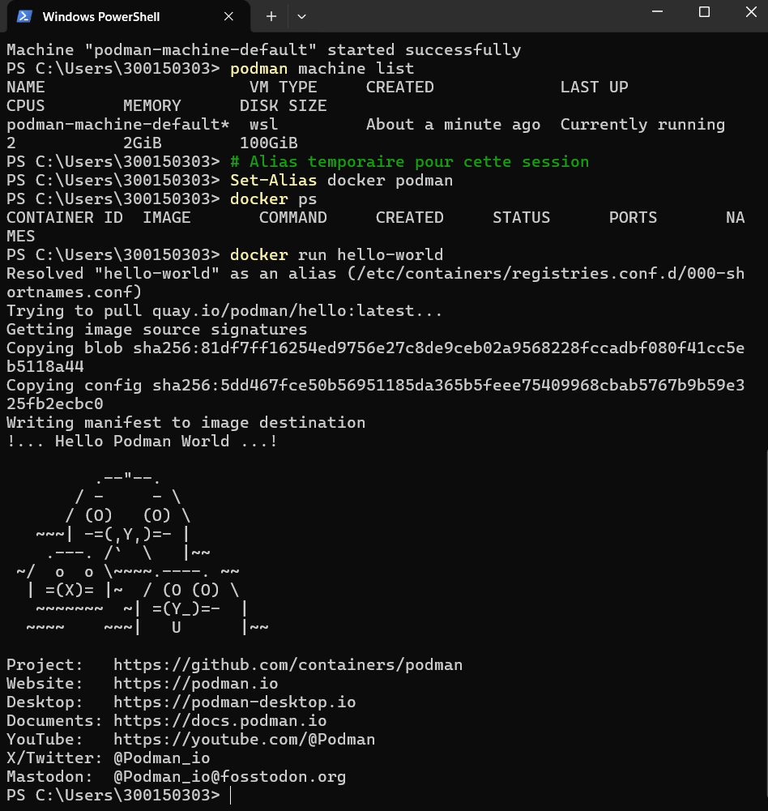
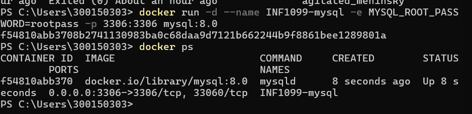
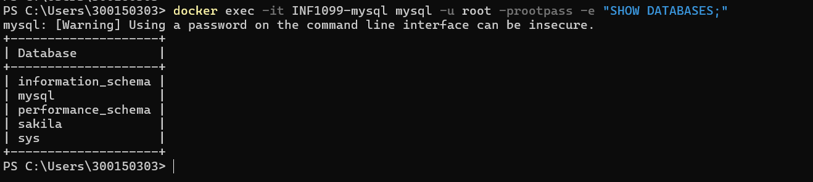
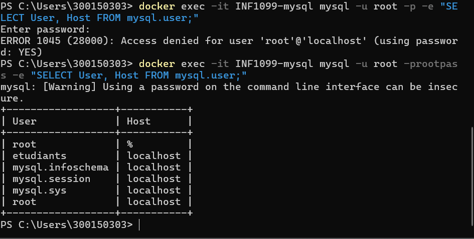
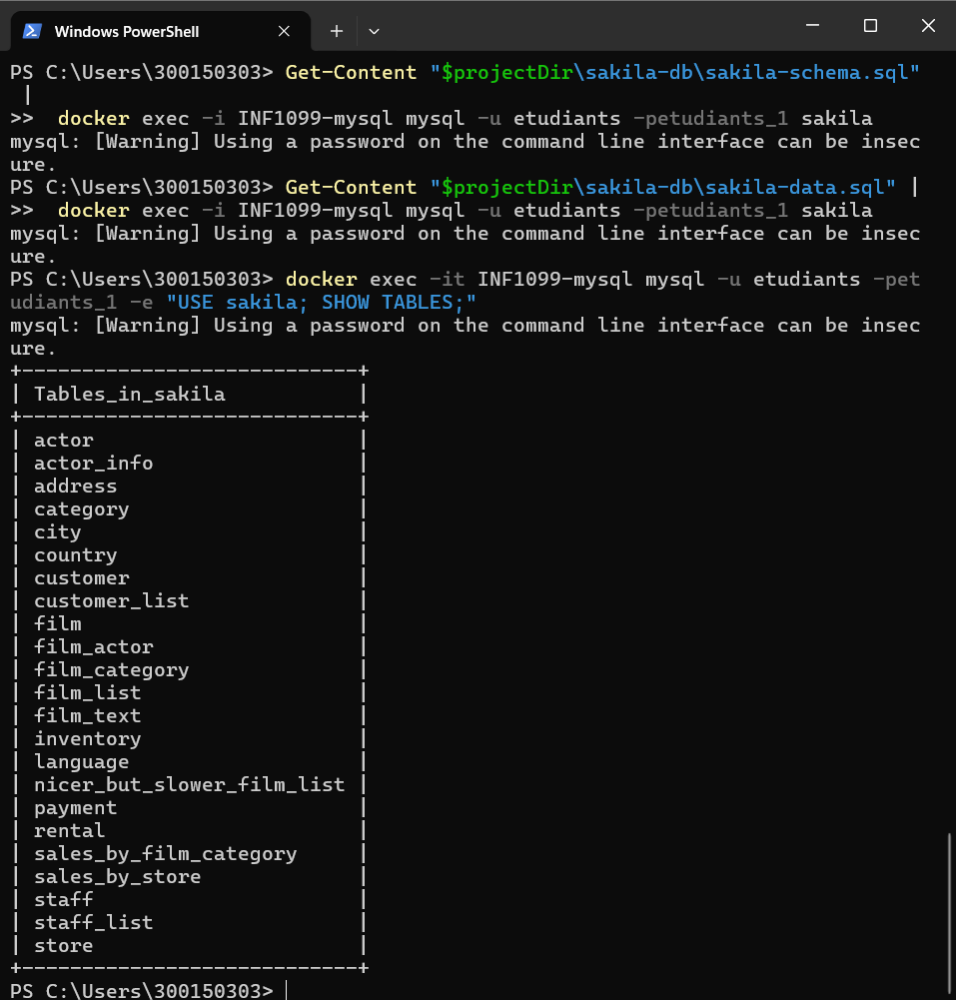

# TP INF1099 — MySQL Sakila avec Podman sur Windows
# 👩‍🎓Nom : jesmina Dos-Reis
# 👤Matricule : 300150303
## 📋 Description
Mise en place d'un environnement MySQL avec la base de données Sakila, en utilisant Podman comme moteur de conteneurs sur Windows.

---

## 🛠️ Environnement utilisé
- **OS** : Windows
- **Conteneur** : Podman (avec alias `docker`)
- **Base de données** : MySQL 8.0
- **Dataset** : Sakila DB (MySQL officiel)

---

## 📝 Étapes réalisées

### 1️⃣ Démarrage de Podman

Initialisation et démarrage de la machine virtuelle Podman, et configuration de l'alias `docker` :

```powershell
Set-Alias docker podman
podman machine start
```



---

### 2️⃣ Création du conteneur MySQL

Lancement du conteneur `INF1099-mysql` sur le port 3306 :

```powershell
docker run -d --name INF1099-mysql -e MYSQL_ROOT_PASSWORD=rootpass -p 3306:3306 mysql:8.0
docker ps
```



---

### 3️⃣ Création de la base Sakila

Création de la base de données `sakila` :

```powershell
docker exec -it INF1099-mysql mysql -u root -prootpass -e "CREATE DATABASE sakila;"
docker exec -it INF1099-mysql mysql -u root -prootpass -e "SHOW DATABASES;"
```



---

### 4️⃣ Création de l'utilisateur etudiants

Création de l'utilisateur `etudiants` avec les permissions complètes :

```powershell
docker exec -it INF1099-mysql mysql -u root -prootpass -e "CREATE USER 'etudiants'@'localhost' IDENTIFIED BY 'etudiants_1';"
docker exec -it INF1099-mysql mysql -u root -prootpass -e "GRANT ALL PRIVILEGES ON *.* TO 'etudiants'@'localhost' WITH GRANT OPTION; FLUSH PRIVILEGES;"
```



---

### 5️⃣ Import de Sakila DB

Téléchargement du ZIP depuis MySQL officiel et import du schéma + données :

```powershell
Get-Content "$projectDir\sakila-db\sakila-schema.sql" |
    docker exec -i INF1099-mysql mysql -u etudiants -petudiants_1 sakila

Get-Content "$projectDir\sakila-db\sakila-data.sql" |
    docker exec -i INF1099-mysql mysql -u etudiants -petudiants_1 sakila
```



---

## 🤖 Script d'automatisation

Le fichier `start-sakila-INF1099.ps1` automatise toutes les étapes ci-dessus :

```powershell
.\start-sakila-INF1099.ps1
```

---

## ✅ Résultat final

- ✅ VM Linux Podman opérationnelle
- ✅ Alias Docker configuré
- ✅ MySQL 8.0 en conteneur
- ✅ Base de données Sakila importée
- ✅ Utilisateur `etudiants` créé avec tous les privilèges
