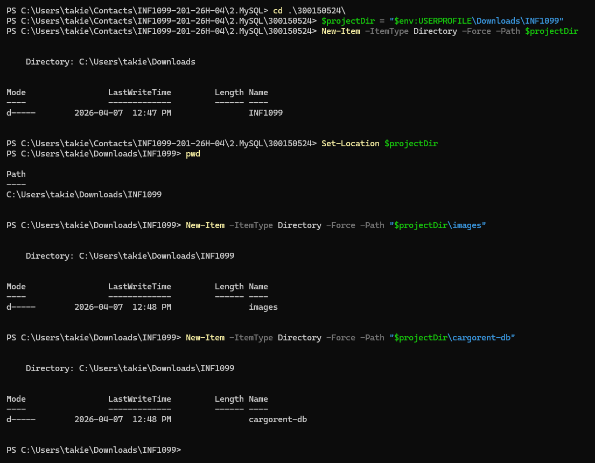
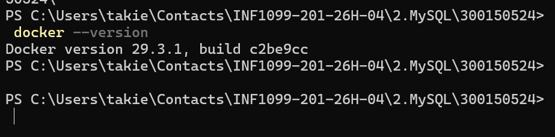
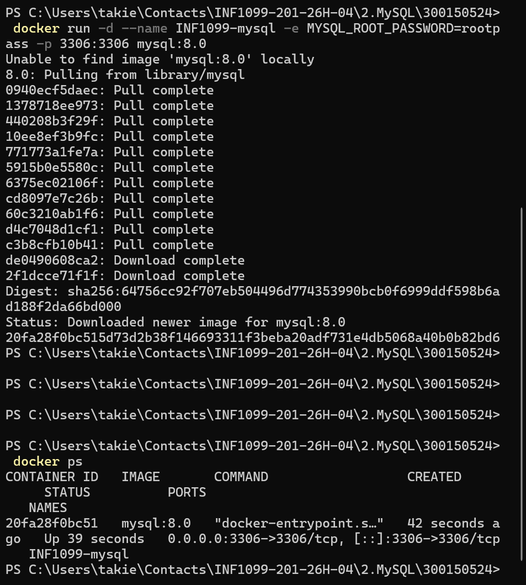
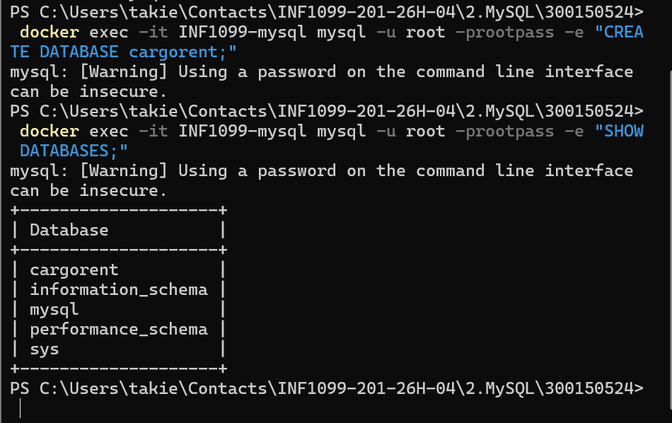
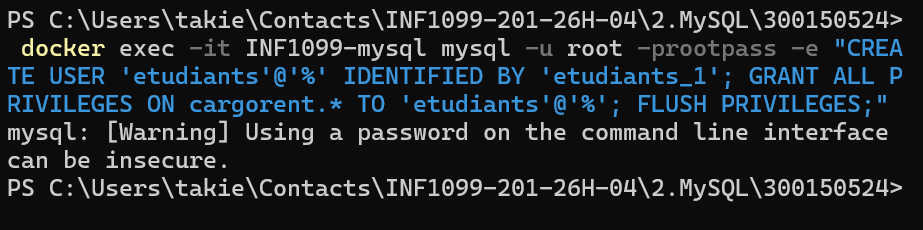
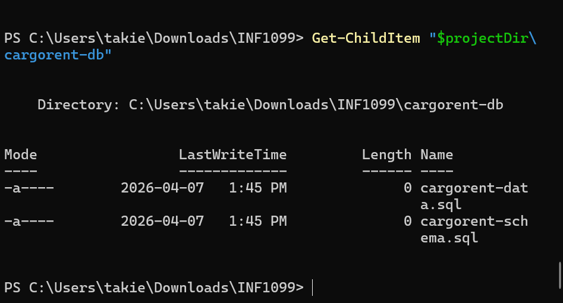
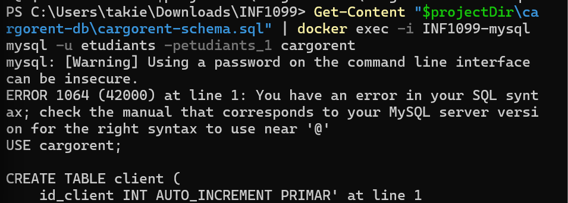
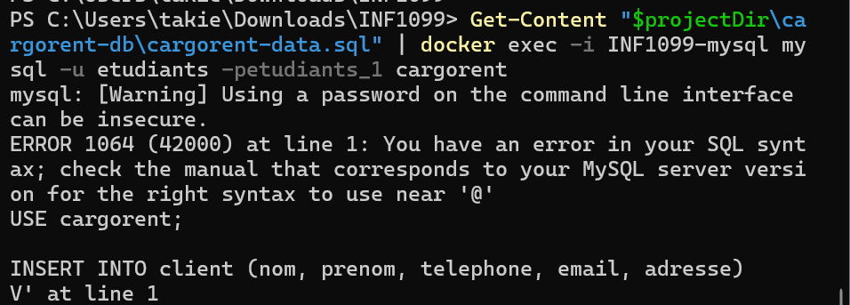
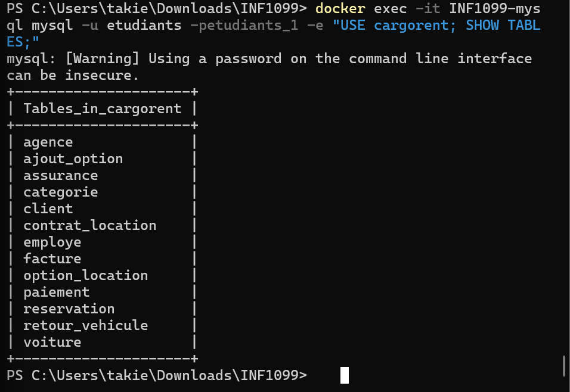

# 🚗 Automatisation de la base CarGoRent avec Docker

<br>

| Champ | Détail |
|---|---|
| 👤 **Nom** | Taki Eddine Choufa |
| 🎓 **Numéro étudiant** | 300150524 |
| 📚 **Cours** | INF1099 |

---

## 📋 Description du projet

**CarGoRent** est une base de données simulant un système de **location de véhicules**.

Ce TP a pour but d'automatiser le déploiement de cette base de données en utilisant **Docker** et **MySQL 8**, sans installation locale de MySQL. Toutes les opérations sont réalisées via **PowerShell** sous Windows.

---

## 🎯 Objectifs

- ✅ Lancer un conteneur MySQL avec Docker
- ✅ Créer la base de données `cargorent`
- ✅ Créer un utilisateur dédié avec ses permissions
- ✅ Importer le schéma SQL (tables, relations)
- ✅ Importer les données (enregistrements)
- ✅ Vérifier le bon fonctionnement avec des requêtes SQL

---

## 🛠️ Environnement utilisé

| Outil | Détail |
|---|---|
| 💻 **OS** | Windows |
| ⚡ **Terminal** | PowerShell |
| 🐳 **Conteneurisation** | Docker |
| 🗄️ **Base de données** | MySQL 8 |

---

## 🚀 Étapes du TP

<br>

### Étape 1 – Création du dossier de travail

Création du dossier principal du projet et organisation des fichiers nécessaires.

```powershell
mkdir cargorent-tp
cd cargorent-tp
```



---

### Étape 2 – Vérification de Docker

Avant de commencer, on s'assure que Docker est bien installé et en cours d'exécution.

```powershell
docker --version
docker ps
```



---

### Étape 3 – Lancement du conteneur MySQL

Démarrage d'un conteneur MySQL 8 avec un mot de passe root défini.

```powershell
docker run --name cargorent-mysql `
  -e MYSQL_ROOT_PASSWORD=rootpass `
  -p 3306:3306 `
  -d mysql:8
```

> **Note :** L'option `-d` lance le conteneur en arrière-plan.



---

### Étape 4 – Création de la base de données

Connexion au conteneur MySQL et création de la base `cargorent`.

```powershell
docker exec -it cargorent-mysql mysql -u root -prootpass
```

```sql
CREATE DATABASE cargorent;
SHOW DATABASES;
```



---

### Étape 5 – Création de l'utilisateur

Création d'un utilisateur spécifique avec tous les droits sur la base `cargorent`.

```sql
CREATE USER 'cargouser'@'%' IDENTIFIED BY 'cargopass';
GRANT ALL PRIVILEGES ON cargorent.* TO 'cargouser'@'%';
FLUSH PRIVILEGES;
```



---

### Étape 6 – Vérification des fichiers SQL

Vérification que les fichiers de schéma et de données sont bien présents dans le dossier du projet.

```powershell
ls
```

> Les fichiers `schema.sql` et `data.sql` doivent être visibles.



---

### Étape 7 – Importation du schéma

Copie du fichier SQL dans le conteneur, puis importation du schéma (tables et relations).

```powershell
docker cp schema.sql cargorent-mysql:/schema.sql

docker exec -it cargorent-mysql mysql -u root -prootpass cargorent `
  -e "source /schema.sql"
```



---

### Étape 8 – Importation des données

Importation des données dans les tables créées à l'étape précédente.

```powershell
docker cp data.sql cargorent-mysql:/data.sql

docker exec -it cargorent-mysql mysql -u root -prootpass cargorent `
  -e "source /data.sql"
```



---

### Étape 9 – Vérification finale

Connexion à la base et exécution de requêtes pour confirmer que tout est bien importé.

```sql
USE cargorent;
SHOW TABLES;
SELECT * FROM vehicule LIMIT 5;
```



---

## ✅ Résultat final

La base de données **CarGoRent** est entièrement opérationnelle :

- 🟢 Le conteneur MySQL fonctionne correctement
- 🟢 La base de données et l'utilisateur sont créés
- 🟢 Le schéma et les données sont importés avec succès
- 🟢 Les requêtes de vérification retournent les bons résultats

---

## 📝 Conclusion

Ce TP a permis de mettre en pratique le déploiement d'une base de données MySQL dans un environnement **conteneurisé avec Docker**. L'approche est simple, reproductible et ne nécessite aucune installation locale de MySQL — tout passe par le conteneur.
