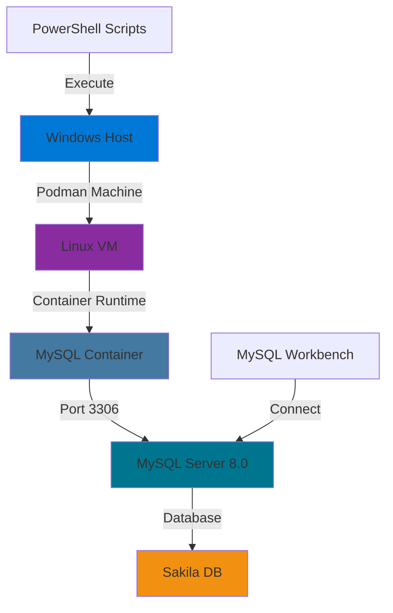

<div align="center">

# 🎓 INF1099 - Manipulation de Données avec MySQL & Podman

### *Laboratoire Pratique - Base de Données Sakila*

[](https://www.mysql.com/)
[](https://podman.io/)
[](https://docs.microsoft.com/en-us/powershell/)
[](https://www.microsoft.com/windows)

*Déploiement conteneurisé d'une base de données MySQL avec gestion complète des utilisateurs et importation automatisée*

[🚀 Démarrage Rapide](#-démarrage-rapide) • [📋 Prérequis](#-prérequis) • [🎯 Fonctionnalités](#-fonctionnalités) • [📚 Documentation](#-documentation-complète)

---

</div>

## 📑 Table des Matières

- [🎯 À Propos du Projet](#-à-propos-du-projet)
- [✨ Fonctionnalités](#-fonctionnalités)
- [📋 Prérequis](#-prérequis)
- [🚀 Démarrage Rapide](#-démarrage-rapide)
- [📚 Documentation Complète](#-documentation-complète)
- [🛠️ Architecture Technique](#️-architecture-technique)
- [📊 Structure de la Base de Données](#-structure-de-la-base-de-données)
- [🔧 Scripts d'Automatisation](#-scripts-dautomatisation)
- [💡 Commandes Utiles](#-commandes-utiles)
- [🐛 Dépannage](#-dépannage)
- [📈 Résultats et Validation](#-résultats-et-validation)
- [🤝 Contribution](#-contribution)
- [📄 Licence](#-licence)

---

## 🎯 À Propos du Projet

Ce projet démontre une **approche moderne et professionnelle** du déploiement de bases de données en environnement conteneurisé. Il illustre les compétences suivantes :

- ✅ **Virtualisation** : Utilisation de Podman pour la conteneurisation
- ✅ **Gestion de Bases de Données** : Configuration MySQL 8.0 avancée
- ✅ **Automatisation** : Scripts PowerShell pour déploiement rapide
- ✅ **Sécurité** : Gestion des utilisateurs et permissions SQL
- ✅ **DevOps** : Pratiques de développement modernes avec conteneurs

### 🎬 Base de Données Sakila

La base de données **Sakila** est une base de données exemple créée par MySQL AB pour démontrer les fonctionnalités de MySQL. Elle modélise un système de location de DVD avec :

- 🎭 Gestion des films et acteurs
- 👥 Gestion des clients et locations
- 🏪 Gestion des magasins et inventaire
- 💰 Système de paiements et transactions

---

## ✨ Fonctionnalités

### 🔐 Gestion Complète des Utilisateurs

```sql
👤 Root     : Administrateur système (rootpass)
👥 Etudiants: Utilisateur applicatif (etudiants_1)
```

### 🗄️ Base de Données Complète

- **16 tables** interconnectées
- **+1000 enregistrements** de données exemple
- **Relations complexes** (clés étrangères, contraintes)
- **Vues et procédures stockées** pré-configurées

### ⚡ Déploiement Automatisé

- Script PowerShell one-click
- Importation automatique du schéma et des données
- Validation post-déploiement

---

## 📋 Prérequis

### Système d'Exploitation
```
💻 Windows 10/11 (64 bits)
```

### Logiciels Requis

| Logiciel | Version | Téléchargement |
|----------|---------|----------------|
| **Podman Desktop** | Latest | [podman.io](https://podman.io/getting-started/installation) |
| **PowerShell** | 5.1+ | Intégré à Windows |
| **MySQL Workbench** (Optionnel) | 8.0+ | [mysql.com](https://dev.mysql.com/downloads/workbench/) |

### Installation de Podman

```powershell
# Via Chocolatey (recommandé)
choco install podman-desktop

# Ou téléchargement direct depuis podman.io
```

---

## 🚀 Démarrage Rapide

### Option 1 : Commande Unique (Recommandé)

```powershell
# Cloner le repository
git clone https://github.com/votre-username/INF1099-MySQL-Podman.git
cd INF1099-MySQL-Podman

# Exécuter le script d'installation
.\start-sakila-INF1099.ps1
```

### Option 2 : Installation Manuelle

<details>
<summary>Cliquez pour voir les étapes détaillées</summary>

#### 1️⃣ Créer le projet

```powershell
$projectDir = "$env:USERPROFILE\Downloads\INF1099"
New-Item -ItemType Directory -Path $projectDir -Force
```

#### 2️⃣ Télécharger Sakila DB

```powershell
# Télécharger depuis : http://downloads.mysql.com/docs/sakila-db.zip
Expand-Archive -Path "$env:USERPROFILE\Downloads\sakila-db.zip" -DestinationPath $projectDir
```

#### 3️⃣ Configurer l'alias Docker

```powershell
Set-Alias docker podman
# Pour permanence : ajouter dans $PROFILE
```

#### 4️⃣ Initialiser Podman

```powershell
podman machine init
podman machine start
```

#### 5️⃣ Lancer MySQL

```powershell
docker run -d --name INF1099-mysql -e MYSQL_ROOT_PASSWORD=rootpass -p 3306:3306 mysql:8.0
```

</details>

---

## 📚 Documentation Complète

### 📂 Structure du Projet

```
INF1099-MySQL-Podman/
│
├── 📄 README.md                          # Ce fichier
├── 📜 start-sakila-INF1099.ps1           # Script d'automatisation principal
├── 📜 verify-installation.ps1             # Script de vérification
│
├── 📁 sakila-db/
│   ├── sakila-schema.sql                 # Schéma de la base de données
│   ├── sakila-data.sql                   # Données d'exemple
│   └── sakila-mv-schema.sql              # Vues matérialisées
│
├── 📁 docs/
│   ├── installation-guide.md             # Guide d'installation détaillé
│   ├── sql-exercises.md                  # Exercices SQL
│   └── troubleshooting.md                # Guide de dépannage
│
└── 📁 scripts/
    ├── backup-database.ps1               # Script de sauvegarde
    ├── restore-database.ps1              # Script de restauration
    └── cleanup.ps1                       # Script de nettoyage
```

---

## 🛠️ Architecture Technique



### Flux de Données

1. **PowerShell** envoie les commandes à **Podman**
2. **Podman Machine** (VM Linux) exécute le conteneur
3. **MySQL Container** expose le port 3306
4. **Sakila DB** stocke les données persistantes
5. **MySQL Workbench** se connecte pour les requêtes

---

## 📊 Structure de la Base de Données

### Schéma Relationnel

La base Sakila contient **16 tables principales** :

#### 📋 Tables Principales

| Table | Description | Enregistrements |
|-------|-------------|-----------------|
| `actor` | Informations sur les acteurs | 200 |
| `film` | Catalogue de films | 1000 |
| `customer` | Base clients | 599 |
| `rental` | Historique des locations | 16,044 |
| `payment` | Transactions financières | 16,049 |
| `inventory` | Stock disponible | 4,581 |
| `store` | Magasins | 2 |
| `staff` | Employés | 2 |

#### 🔗 Relations Clés

```sql
-- Exemple de relations complexes
film_actor (M:N)     : actor ↔ film
film_category (M:N)  : film ↔ category
inventory (1:N)      : film → inventory → rental
rental (1:N)         : customer → rental → payment
```

### 📈 Diagramme ERD

```
┌─────────┐       ┌──────┐       ┌──────────┐
│  ACTOR  │──────▶│ FILM │◀──────│ CATEGORY │
└─────────┘       └──────┘       └──────────┘
                     │
                     ▼
                ┌───────────┐
                │ INVENTORY │
                └───────────┘
                     │
                     ▼
    ┌──────────┐  ┌────────┐  ┌─────────┐
    │ CUSTOMER │─▶│ RENTAL │─▶│ PAYMENT │
    └──────────┘  └────────┘  └─────────┘
```

---

## 🔧 Scripts d'Automatisation

### 🎯 Script Principal : `start-sakila-INF1099.ps1`

```powershell
# Ce script automatise l'ensemble du déploiement
# ✅ Vérifie Podman
# ✅ Lance MySQL
# ✅ Crée la base et l'utilisateur
# ✅ Importe les données
# ✅ Valide l'installation

.\start-sakila-INF1099.ps1
```

### 🔍 Script de Vérification

```powershell
# verify-installation.ps1
docker exec -it INF1099-mysql mysql -u etudiants -petudiants_1 -e "
SELECT 
    'Sakila Database Verification' as Status;
SELECT COUNT(*) as Total_Tables FROM information_schema.tables 
WHERE table_schema = 'sakila';
SELECT COUNT(*) as Total_Films FROM sakila.film;
SELECT COUNT(*) as Total_Actors FROM sakila.actor;
SELECT COUNT(*) as Total_Customers FROM sakila.customer;
"
```

### 💾 Script de Sauvegarde

```powershell
# backup-database.ps1
$backupDir = "$env:USERPROFILE\Downloads\INF1099\backups"
$timestamp = Get-Date -Format "yyyyMMdd-HHmmss"

docker exec INF1099-mysql mysqldump -u root -prootpass sakila > `
    "$backupDir\sakila-backup-$timestamp.sql"

Write-Host "✅ Backup créé : sakila-backup-$timestamp.sql" -ForegroundColor Green
```

---

## 💡 Commandes Utiles

### 🐳 Gestion du Conteneur

```powershell
# Démarrer le conteneur
docker start INF1099-mysql

# Arrêter le conteneur
docker stop INF1099-mysql

# Redémarrer le conteneur
docker restart INF1099-mysql

# Voir les logs en temps réel
docker logs -f INF1099-mysql

# Voir les statistiques
docker stats INF1099-mysql

# Inspecter le conteneur
docker inspect INF1099-mysql
```

### 🗄️ Connexion MySQL

```powershell
# Connexion interactive
docker exec -it INF1099-mysql mysql -u etudiants -petudiants_1

# Exécuter une requête directe
docker exec -it INF1099-mysql mysql -u etudiants -petudiants_1 -e "SHOW DATABASES;"

# Utiliser la base Sakila
docker exec -it INF1099-mysql mysql -u etudiants -petudiants_1 sakila
```

### 📊 Requêtes SQL Utiles

```sql
-- Voir toutes les tables
SHOW TABLES;

-- Compter les films par catégorie
SELECT c.name, COUNT(*) as nb_films 
FROM category c 
JOIN film_category fc ON c.category_id = fc.category_id 
GROUP BY c.name 
ORDER BY nb_films DESC;

-- Top 10 acteurs les plus présents
SELECT a.first_name, a.last_name, COUNT(*) as nb_films
FROM actor a
JOIN film_actor fa ON a.actor_id = fa.actor_id
GROUP BY a.actor_id
ORDER BY nb_films DESC
LIMIT 10;

-- Chiffre d'affaires total
SELECT SUM(amount) as total_revenue FROM payment;

-- Films les plus loués
SELECT f.title, COUNT(*) as nb_rentals
FROM film f
JOIN inventory i ON f.film_id = i.film_id
JOIN rental r ON i.inventory_id = r.inventory_id
GROUP BY f.film_id
ORDER BY nb_rentals DESC
LIMIT 10;
```

---

## 🐛 Dépannage

### ❌ Problème : Podman machine ne démarre pas

```powershell
# Solution 1 : Réinitialiser la machine
podman machine stop
podman machine rm
podman machine init
podman machine start

# Solution 2 : Vérifier WSL2
wsl --status
wsl --update
```

### ❌ Problème : Port 3306 déjà utilisé

```powershell
# Trouver le processus utilisant le port
netstat -ano | findstr :3306

# Arrêter le processus ou utiliser un autre port
docker run -d --name INF1099-mysql -e MYSQL_ROOT_PASSWORD=rootpass -p 3307:3306 mysql:8.0
```

### ❌ Problème : Erreur d'importation des données

```powershell
# Vérifier que le conteneur est démarré
docker ps

# Vérifier les logs
docker logs INF1099-mysql

# Réimporter manuellement
docker exec -i INF1099-mysql mysql -u etudiants -petudiants_1 sakila < sakila-schema.sql
docker exec -i INF1099-mysql mysql -u etudiants -petudiants_1 sakila < sakila-data.sql
```

### ❌ Problème : Connexion refusée

```powershell
# Vérifier que MySQL est prêt
docker exec -it INF1099-mysql mysqladmin -u root -prootpass ping

# Attendre quelques secondes après le démarrage
Start-Sleep -Seconds 10
```

---

## 📈 Résultats et Validation

### ✅ Checklist de Validation

- [ ] Podman machine démarre sans erreur
- [ ] Conteneur MySQL en état "running"
- [ ] Base de données `sakila` créée
- [ ] Utilisateur `etudiants` configuré
- [ ] 16 tables présentes dans Sakila
- [ ] Données importées (1000+ films)
- [ ] Connexion MySQL Workbench fonctionnelle

### 📊 Statistiques Attendues

```sql
-- Exécuter pour validation complète
SELECT 
    (SELECT COUNT(*) FROM actor) as Total_Actors,
    (SELECT COUNT(*) FROM film) as Total_Films,
    (SELECT COUNT(*) FROM customer) as Total_Customers,
    (SELECT COUNT(*) FROM rental) as Total_Rentals,
    (SELECT SUM(amount) FROM payment) as Total_Revenue;
```

**Résultats attendus :**
- Acteurs : 200
- Films : 1000
- Clients : 599
- Locations : 16,044
- Revenu total : $67,416.51

---

