# 300151825 Freedy Ebah

INF1099 – TP : Manipulation de données avec MySQL et Podman sur Windows
🎯 Objectifs
À la fin de ce TP, l’étudiant sera capable de :

Installer et configurer Podman avec alias Docker sur Windows
Créer et démarrer la machine Podman (VM Linux)
Lancer un conteneur MySQL
Créer une base de données et un utilisateur
Importer la base de données Sakila
Manipuler les tables pour des exercices SQL

1️⃣ Prérequis
Windows 10/11 64 bits
Podman installé
PowerShell (de préférence Administrateur)
Accès Internet

2️⃣ Préparer le projet dans Downloads
On utilise un dossier temporaire dans Downloads :

# Créer le dossier INF1099 dans Downloads
```Powershell
$projectDir = "$env:USERPROFILE\Downloads\INF1099"
New-Item -ItemType Directory -Path $projectDir -Force
```
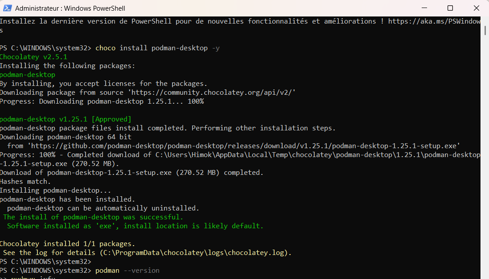
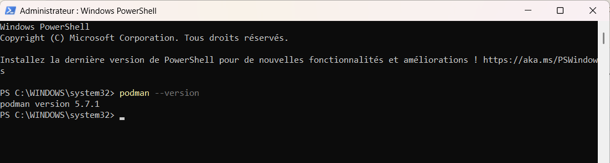

3️⃣ Télécharger et décompresser Sakila DB
Télécharger ZIP : Sakila DB
Décompresser dans $projectDir :
Expand-Archive -Path "$env:USERPROFILE\Downloads\sakila-db.zip" -DestinationPath $projectDir
Le contenu sera dans $projectDir\sakila-db


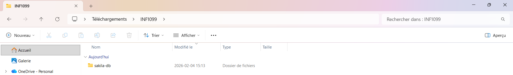

4️⃣ Configurer Podman avec alias Docker
# Alias temporaire
```Powershell
Set-Alias docker podman
```

# Pour rendre l'alias permanent
```Powershell
notepad $PROFILE
```

# Ajouter la ligne suivante dans le fichier :
# Set-Alias docker podman


5️⃣ Initialiser et démarrer la machine Podman
# Initialiser la machine Linux
```Powershell
podman machine init
```

# Démarrer la machine
```Powershell
podman machine start
```
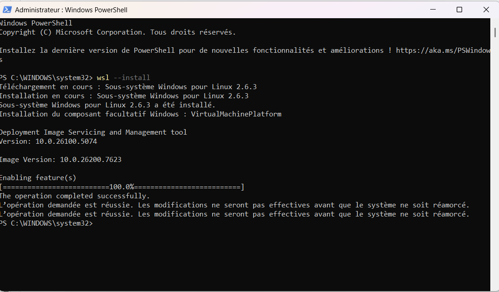
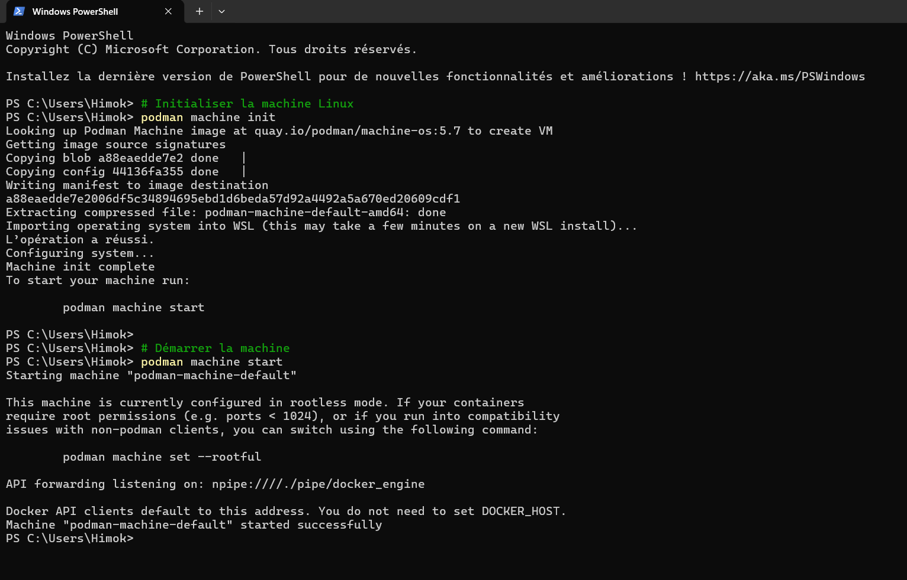

Vérifie le fonctionnement :
```Powershell
podman ps -a
```

La liste peut être vide → normal, aucune VM/MySQL lancée encore
6️⃣ Lancer le conteneur MySQL
```Powershell
docker run -d --name INF1099-mysql -e MYSQL_ROOT_PASSWORD=rootpass -p 3306:3306 mysql:8.0
```

Vérifie :
```Powershell
docker ps
```
Tu devrais voir INF1099-mysql en cours d’exécution

7️⃣ Créer la base de données Sakila
```Powershell
docker exec -it INF1099-mysql mysql -u root -p -e "CREATE DATABASE sakila;"
Mot de passe root : rootpass
```
# Vérification :

```Powershell
docker exec -it INF1099-mysql mysql -u root -p -e "SHOW DATABASES;"
```
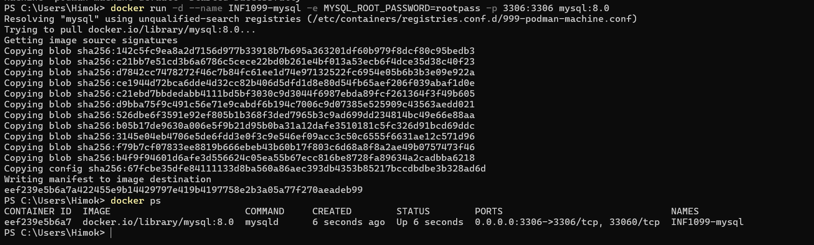

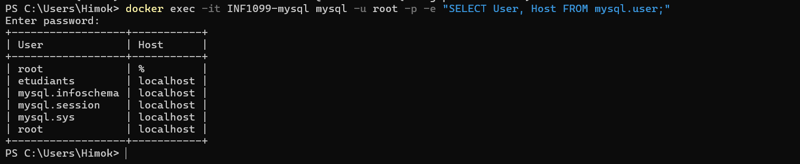


8️⃣ Créer l’utilisateur etudiants
```Powershell
docker exec -it INF1099-mysql `
     mysql -u root -prootpass -e "CREATE USER 'etudiants'@'localhost' IDENTIFIED BY 'etudiants_1';"
docker exec -it INF1099-mysql `
  mysql -u root -prootpass -e "GRANT ALL PRIVILEGES ON *.* TO 'etudiants'@'localhost' WITH GRANT OPTION;"
Mot de passe : etudiants_1
```
Vérifie la création :
```Powershell
docker exec -it INF1099-mysql mysql -u root -p -e "SELECT User, Host FROM mysql.user;"
```

9️⃣ Importer la base Sakila

Charger le schéma
```Powershell
Get-Content "$projectDir\sakila-db\sakila-schema.sql" |
 docker exec -i INF1099-mysql mysql -u etudiants -petudiants_1 sakila
```

Charger les données
```Powershell
Get-Content "$projectDir\sakila-db\sakila-data.sql" |
 docker exec -i INF1099-mysql mysql -u etudiants -petudiants_1 sakila
```

10️⃣ Vérifier l’importation
```Powershell
docker exec -it INF1099-mysql mysql -u etudiants -petudiants_1 -e "USE sakila; SHOW TABLES;"
```

Tables attendues : actor, film, customer, etc.
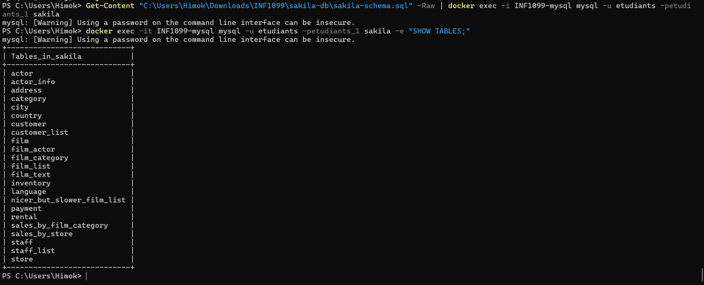
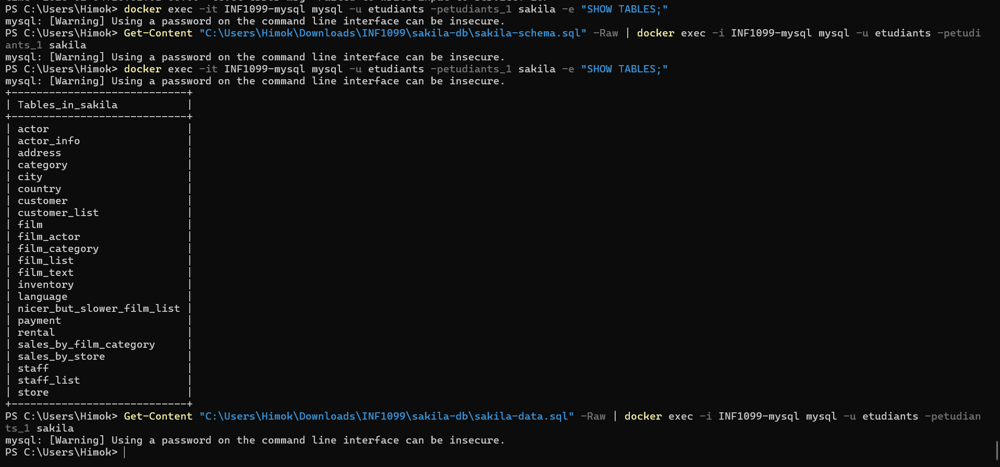
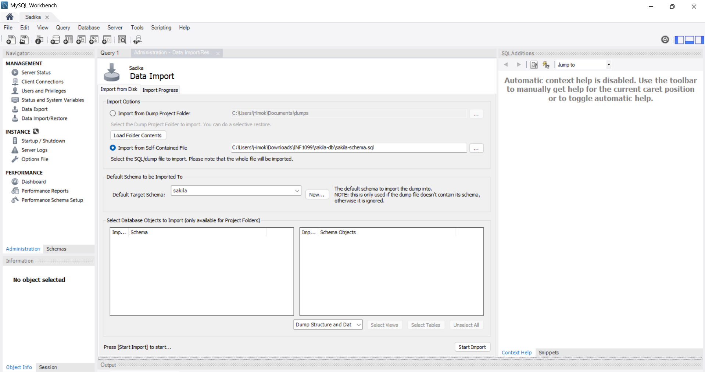
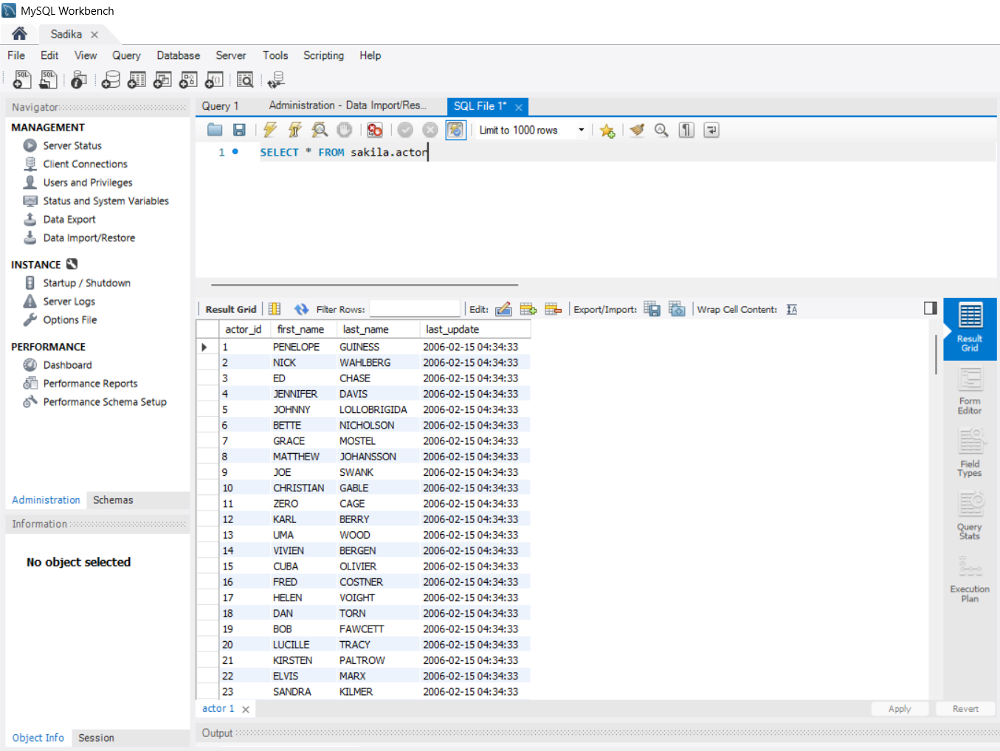


11️⃣ Commandes Podman/Docker utiles
```Powershell
Commande	Description
docker ps -a	Lister tous les conteneurs
docker stop INF1099-mysql	Arrêter le conteneur
docker start INF1099-mysql	Démarrer le conteneur
docker logs INF1099-mysql	Voir les logs du serveur
docker exec -it INF1099-mysql mysql -u etudiants -petudiants_1	Se connecter à MySQL
```


12️⃣ Automatiser le TP avec un script

Crée start-sakila-INF1099.ps1 :
```Powershell
$projectDir = "$env:USERPROFILE\Downloads\INF1099"
```

# Lancer MySQL
```Powershell
docker run -d --name INF1099-mysql -e MYSQL_ROOT_PASSWORD=rootpass -p 3306:3306 mysql:8.0
```

# Créer la base et l’utilisateur
```Powershell
docker exec -it INF1099-mysql mysql -u root -prootpass -e "CREATE DATABASE sakila;"
docker exec -it INF1099-mysql mysql -u root -prootpass -e "GRANT ALL PRIVILEGES ON *.* TO 'etudiants'@'localhost' IDENTIFIED BY 'etudiants_1' WITH GRANT OPTION;"
```

Importer le schéma et les données
```Powershell
Get-Content "$projectDir\sakila-db\sakila-schema.sql" |
  docker exec -i INF1099-mysql mysql -u etudiants -petudiants_1 sakila
Get-Content "$projectDir\sakila-db\sakila-data.sql" |
  docker exec -i INF1099-mysql mysql -u etudiants -petudiants_1 sakila
```

Exécuter :

.\start-sakila-INF1099.ps1
✅ Ce TP est maintenant complètement fonctionnel sur Windows avec Podman, avec :

VM Linux Podman
Alias Docker
MySQL en conteneur
Base Sakila importée
📚 References
choco install mysql.workbench

