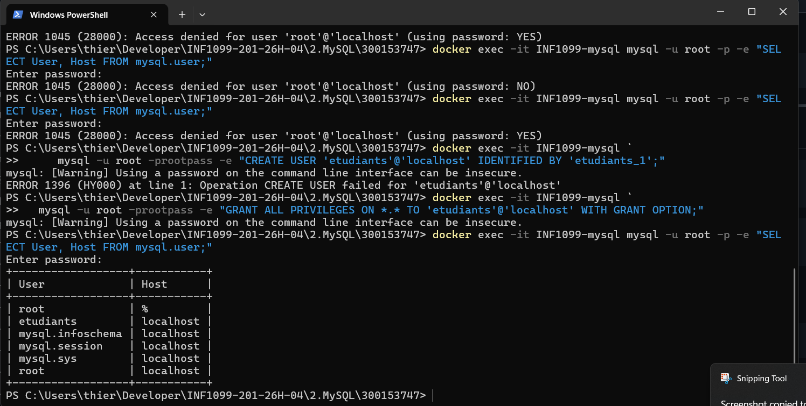
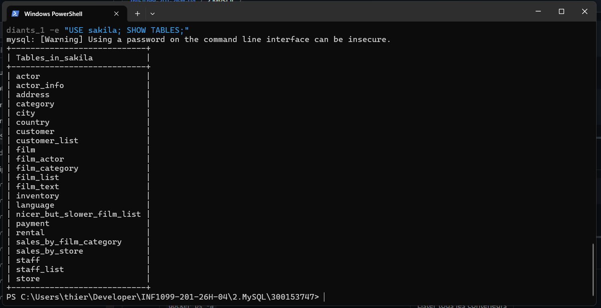
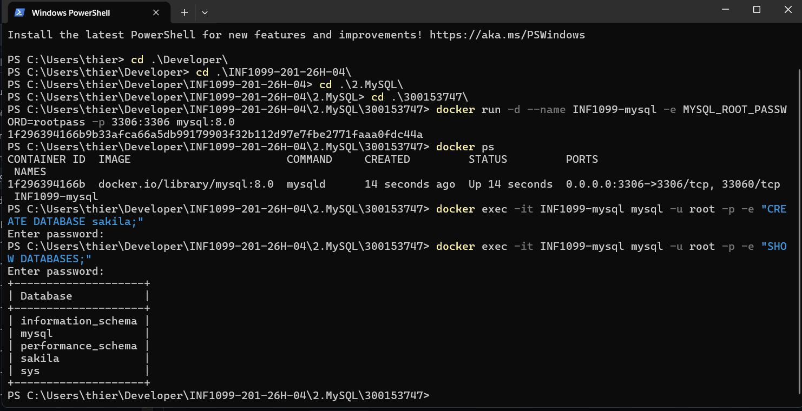

# 📘 TP INF1099 — Automatisation de la base Sakila avec Docker / Podman

<div align="center">


</div>

---

## 👤 Informations de l'étudiant

| Champ | Valeur |
|-------|--------|
| **Nom** |  |
| **Cours** | INF1099 |
| **Sujet** | Automatisation du déploiement de la base Sakila avec Docker (Podman) et MySQL 8 |

---

## 🎯 Objectif du TP

L'objectif de ce travail est de mettre en place un environnement MySQL conteneurisé permettant :

- 🐳 Le lancement d'un serveur MySQL avec **Docker** (via Podman)
- 🗄️ La création de la base de données **Sakila**
- 👤 La création d'un utilisateur applicatif (`etudiants`)
- 📥 L'importation automatique du **schéma** et des **données** Sakila
- ✅ La vérification du bon fonctionnement à l'aide de requêtes SQL

> L'ensemble du processus est **automatisable** et **reproductible**.

---

## 🧰 Environnement utilisé

| Composant | Détail |
|-----------|--------|
| 💻 Système d'exploitation | Windows |
| 🖥️ Shell | PowerShell |
| 🐳 Moteur de conteneurs | Podman (alias Docker) |
| 📦 Image Docker | `mysql:8.0` |
| 🗃️ Base de données | MySQL 8 |
| 📊 Jeu de données | Sakila |

---

## 🚀 Étapes de déploiement

---

### 🟢 Étape 1 — Lancement du conteneur MySQL

Lancement du conteneur MySQL avec un mot de passe root et l'exposition du port MySQL standard.

```powershell
docker run -d --name INF1099-mysql `
  -e MYSQL_ROOT_PASSWORD=rootpass `
  -p 3306:3306 `
  mysql:8.0
```

> Vérification que le conteneur tourne bien :
```powershell
docker ps
```

---

### 🟢 Étape 2 — Création de la base de données Sakila

Création de la base de données `sakila` à l'intérieur du conteneur MySQL, puis vérification.

```powershell
docker exec -it INF1099-mysql mysql -u root -p -e "CREATE DATABASE sakila;"
```

```sql
docker exec -it INF1099-mysql mysql -u root -p -e "SHOW DATABASES;"
```

📸 **Résultat :**


> ✅ La base `sakila` apparaît bien dans la liste des bases de données.

---

### 🟢 Étape 3 — Création de l'utilisateur `etudiants`

Création d'un utilisateur applicatif dédié pour accéder à la base Sakila de manière sécurisée.

```powershell
docker exec -it INF1099-mysql `
  mysql -u root -prootpass -e "CREATE USER 'etudiants'@'localhost' IDENTIFIED BY 'etudiants_1';"
```

```powershell
docker exec -it INF1099-mysql `
  mysql -u root -prootpass -e "GRANT ALL PRIVILEGES ON *.* TO 'etudiants'@'localhost' WITH GRANT OPTION;"
```

📸 **Résultat — Vérification des utilisateurs :**



> ✅ L'utilisateur `etudiants` apparaît bien dans la table `mysql.user`.

---

### 🟢 Étape 4 — Importation du schéma Sakila

Importation de la structure de la base Sakila (tables, vues, procédures) à partir du fichier `sakila-schema.sql`.

```powershell
Get-Content "$projectDir\sakila-db\sakila-schema.sql" |
docker exec -i INF1099-mysql mysql -u etudiants -petudiants_1 sakila
```

📸 **Progression de l'importation :**



---

### 🟢 Étape 5 — Importation des données Sakila

Importation des données réelles de la base Sakila à partir du fichier `sakila-data.sql`.

```powershell
Get-Content "$projectDir\sakila-db\sakila-data.sql" |
docker exec -i INF1099-mysql mysql -u etudiants -petudiants_1 sakila
```

📸 **Importation en cours :**


---

### 🟢 Étape 6 — Vérification de l'importation

Vérification de la présence de toutes les tables dans la base Sakila après importation.

```powershell
docker exec -it INF1099-mysql mysql -u etudiants -petudiants_1 -e "USE sakila; SHOW TABLES;"
```

📸 **Liste des tables importées :**



> ✅ Toutes les tables principales sont bien présentes :

| Tables présentes |
|-----------------|
| `actor`, `actor_info` |
| `address`, `category`, `city`, `country` |
| `customer`, `customer_list` |
| `film`, `film_actor`, `film_category`, `film_list`, `film_text` |
| `inventory`, `language` |
| `nicer_but_slower_film_list` |
| `payment`, `rental` |
| `sales_by_film_category`, `sales_by_store` |
| `staff`, `staff_list`, `store` |

---

## 📂 Structure du projet

```
300153747/
│
├── sakila-db/
│   ├── sakila-schema.sql    # Structure de la base de données
│   └── sakila-data.sql      # Données de la base de données
│
└── README.md                # Ce fichier
```

---

## 🔁 Résumé des commandes

```powershell
# 1. Lancer le conteneur MySQL
docker run -d --name INF1099-mysql -e MYSQL_ROOT_PASSWORD=rootpass -p 3306:3306 mysql:8.0

# 2. Créer la base de données
docker exec -it INF1099-mysql mysql -u root -p -e "CREATE DATABASE sakila;"

# 3. Créer l'utilisateur etudiants
docker exec -it INF1099-mysql mysql -u root -prootpass -e "CREATE USER 'etudiants'@'localhost' IDENTIFIED BY 'etudiants_1';"
docker exec -it INF1099-mysql mysql -u root -prootpass -e "GRANT ALL PRIVILEGES ON *.* TO 'etudiants'@'localhost' WITH GRANT OPTION;"

# 4. Importer le schéma
Get-Content "$projectDir\sakila-db\sakila-schema.sql" | docker exec -i INF1099-mysql mysql -u etudiants -petudiants_1 sakila

# 5. Importer les données
Get-Content "$projectDir\sakila-db\sakila-data.sql" | docker exec -i INF1099-mysql mysql -u etudiants -petudiants_1 sakila

# 6. Vérifier l'importation
docker exec -it INF1099-mysql mysql -u etudiants -petudiants_1 -e "USE sakila; SHOW TABLES;"
```

---

<div align="center">

**INF1099 — **

</div>


