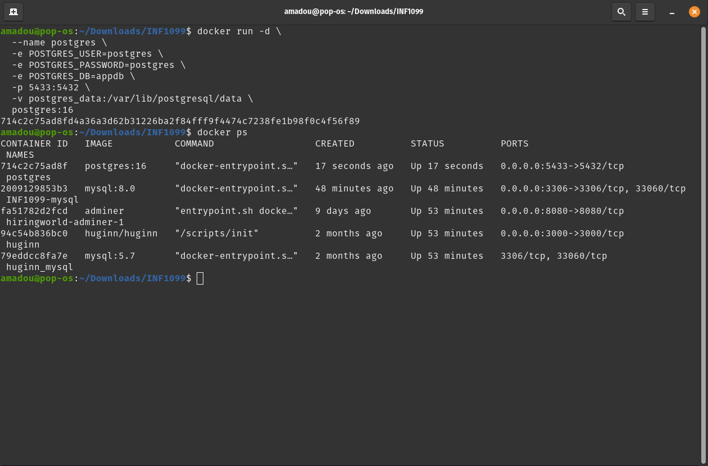
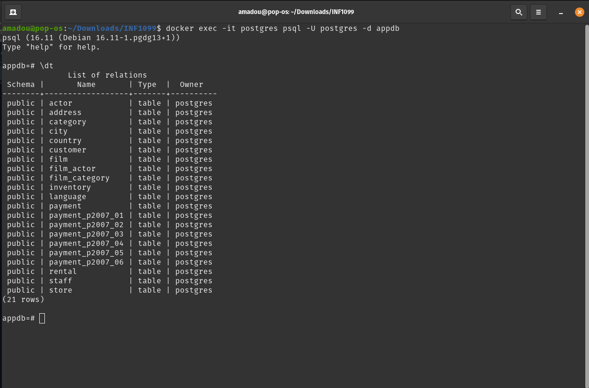

# INF1099 – PostgreSQL avec Docker

Déploiement et manipulation de PostgreSQL avec Docker sous Linux

## 📋 Informations du projet

- **Cours** : INF1099
- **Environnement** : Linux (Pop!_OS / Ubuntu)
- **Technologie** : Docker
- **Base de données** : PostgreSQL 16 avec Sakila
- **Port** : 5433 (évite le conflit avec PostgreSQL système sur 5432)

## 🎯 Objectif

Déployer PostgreSQL avec Docker, importer la base de données Sakila (version PostgreSQL) et explorer les données avec `psql`.

## 🛠️ Prérequis

- Linux (Pop!_OS, Ubuntu ou autre distribution)
- Docker installé et fonctionnel
- Accès Internet pour télécharger les images et fichiers
- Terminal Bash

## 🖥️ Configuration de l'environnement

| Paramètre | Valeur |
|-----------|--------|
| Image Docker | `postgres:16` |
| Nom du conteneur | `postgres` |
| Port hôte | `5433` |
| Port conteneur | `5432` |
| Volume | `postgres_data` |
| Utilisateur | `postgres` |
| Mot de passe | `postgres` |
| Base de données | `appdb` |

## 🚀 Démarrage rapide

### 1️⃣ Lancer PostgreSQL avec Docker

```bash
docker run -d \
  --name postgres \
  -e POSTGRES_USER=postgres \
  -e POSTGRES_PASSWORD=postgres \
  -e POSTGRES_DB=appdb \
  -p 5433:5432 \
  -v postgres_data:/var/lib/postgresql/data \
  postgres:16
```

**Paramètres expliqués :**
- `-d` : exécution en mode détaché (arrière-plan)
- `--name postgres` : nom du conteneur
- `-e POSTGRES_USER` : nom d'utilisateur PostgreSQL
- `-e POSTGRES_PASSWORD` : mot de passe
- `-e POSTGRES_DB` : nom de la base de données initiale
- `-p 5433:5432` : mapping de port (5433 sur l'hôte → 5432 dans le conteneur)
- `-v postgres_data:/var/lib/postgresql/data` : volume pour la persistance des données
- `postgres:16` : image PostgreSQL version 16

**Vérification :**

```bash
docker ps
```



Vous devriez voir le conteneur `postgres` en état `Up`.

### 2️⃣ Télécharger Sakila (PostgreSQL)

```bash
# Télécharger le schéma
wget https://raw.githubusercontent.com/jOOQ/sakila/master/postgres-sakila-db/postgres-sakila-schema.sql

# Télécharger les données
wget https://raw.githubusercontent.com/jOOQ/sakila/master/postgres-sakila-db/postgres-sakila-insert-data.sql
```

### 3️⃣ Copier les fichiers dans le conteneur

```bash
docker cp postgres-sakila-schema.sql postgres:/schema.sql
docker cp postgres-sakila-insert-data.sql postgres:/data.sql
```

### 4️⃣ Importer la base de données

```bash
# Importer le schéma
docker exec -it postgres psql -U postgres -d appdb -f /schema.sql

# Importer les données
docker exec -it postgres psql -U postgres -d appdb -f /data.sql
```

### 5️⃣ Vérification et exploration

**Connexion à PostgreSQL :**

```bash
docker exec -it postgres psql -U postgres -d appdb
```

**Lister les tables :**

```sql
\dt
```

