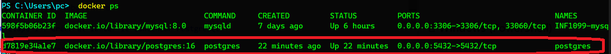
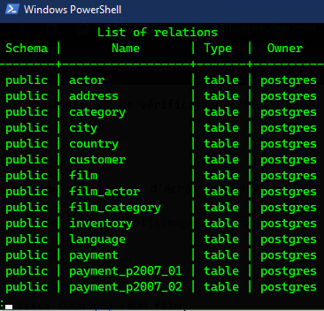
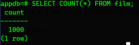
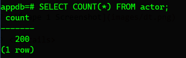
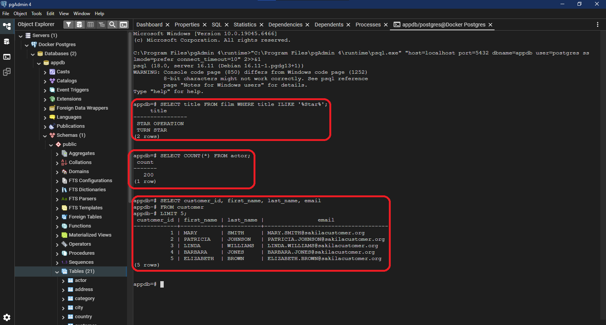

# TP PostgreSQL avec Docker - Base Sakila
#Boualem Belbessai

#300150205

---

Ce TP nous guide à travers l'installation et la configuration de PostgreSQL avec Docker, ainsi que l'utilisation de pgAdmin 4.

## 🎯 **Objectifs**
1. Installer PostgreSQL dans Docker
2. Charger la base de données Sakila dans PostgreSQL
3. Installer pgAdmin 4 avec Chocolatey (Windows)
4. Utiliser pgAdmin 4 pour se connecter et explorer la base de données

---

# 🚀 Étapes du laboratoire

## Étape 1 : Créer et lancer le conteneur PostgreSQL

### 🐧 Linux/Unix
```bash
docker run -d \
  --name postgres \
  -e POSTGRES_USER=postgres \
  -e POSTGRES_PASSWORD=postgres \
  -e POSTGRES_DB=appdb \
  -p 5432:5432 \
  -v postgres_data:/var/lib/postgresql/data \
  postgres:16
```

### 🪟 Windows (PowerShell)
```powershell
docker run -d `
  --name postgres `
  -e POSTGRES_USER=postgres `
  -e POSTGRES_PASSWORD=postgres `
  -e POSTGRES_DB=appdb `
  -p 5432:5432 `
  -v postgres_data:/var/lib/postgresql/data `
  postgres:16
```

**Explications des paramètres :**
- `POSTGRES_USER` : nom de l'utilisateur principal
- `POSTGRES_PASSWORD` : mot de passe de l'utilisateur
- `POSTGRES_DB` : base de données principale
- `-p 5432:5432` : mappe le port du conteneur sur le port local
- `-v postgres_data:/var/lib/postgresql/data` : persistance des données


---

## Étape 2 : Vérifier que PostgreSQL fonctionne

```bash
docker ps
```

<details>
<summary>🖼️ Capture d'écran</summary>



</details>

---

## Étape 3 : Télécharger les fichiers Sakila

### 🐧 Linux
```bash
wget https://raw.githubusercontent.com/jOOQ/sakila/master/postgres-sakila-db/postgres-sakila-schema.sql
wget https://raw.githubusercontent.com/jOOQ/sakila/master/postgres-sakila-db/postgres-sakila-insert-data.sql
```

### 🪟 Windows (PowerShell)
```powershell
Invoke-WebRequest `
  https://raw.githubusercontent.com/jOOQ/sakila/master/postgres-sakila-db/postgres-sakila-schema.sql `
  -OutFile postgres-sakila-schema.sql

Invoke-WebRequest `
  https://raw.githubusercontent.com/jOOQ/sakila/master/postgres-sakila-db/postgres-sakila-insert-data.sql `
  -OutFile postgres-sakila-insert-data.sql
```


---

## Étape 4 : Copier les fichiers dans le conteneur

```bash
docker cp postgres-sakila-schema.sql postgres:/schema.sql
docker cp postgres-sakila-insert-data.sql postgres:/data.sql
```


---

## Étape 5 : Exécuter les fichiers SQL dans PostgreSQL

```bash
docker exec -it postgres psql -U postgres -d appdb -f /schema.sql
docker exec -it postgres psql -U postgres -d appdb -f /data.sql
```


---

## Étape 6 : Vérifier que les tables Sakila sont présentes

```bash
docker exec -it postgres psql -U postgres -d appdb
```

**Commandes SQL de vérification :**
```sql
\dt
```
<details>
<summary>🖼️ Capture d'écran</summary>



</details>

```sql
SELECT COUNT(*) FROM film;
```
<details>
<summary>🖼️ Capture d'écran</summary>



</details>

```sql
SELECT COUNT(*) FROM actor;
```
<details>
<summary>🖼️ Capture d'écran</summary>



</details>

---

## Étape 7 : Installer pgAdmin 4 avec Chocolatey (Windows)

### Ouvrir PowerShell en mode Administrateur

```powershell
choco install pgadmin4 -y
```

### Lancer pgAdmin
- Depuis le menu Démarrer → **pgAdmin 4**
- Ou depuis PowerShell :
```powershell
pgadmin4
```


---

## Étape 8 : Configurer la connexion dans pgAdmin 4

### Ajouter un nouveau serveur

1. Cliquer sur **Add New Server**

2. **Onglet General :**
   - Name : `Postgres Docker`

3. **Onglet Connection :**
   - Host name / address : `localhost`
   - Port : `5432`
   - Username : `postgres`
   - Password : `postgres`
   - Maintenance database : `appdb`

4. Cliquer sur **Save**

<details>
<summary>🖼️ Capture d'écran</summary>


</details>

---

## Étape 9 : Explorer la base Sakila dans pgAdmin

1. Naviguer vers : **Servers → Postgres Docker → Databases → appdb → Schemas → public → Tables**

2. Clic droit sur une table (ex: `film`) → **View/Edit Data → All Rows**

3. Utiliser l'éditeur SQL intégré : **Tools → Query Tool**

<details>
<summary>🖼️ Capture d'écran</summary>


</details>

---

## Étape 10 : Exercices pratiques

### 📝 Exercice 1 : Lister tous les films dont le titre contient "Star"

```sql
SELECT title FROM film WHERE title ILIKE '%Star%';
```


</details>

### 📝 Exercice 2 : Compter le nombre d'acteurs

```sql
SELECT COUNT(*) FROM actor;
```


</details>

### 📝 Exercice 3 : Afficher les 5 premiers clients

```sql
SELECT customer_id, first_name, last_name, email 
FROM customer 
LIMIT 5;
```

<details>
<summary>🖼️ Capture d'écran</summary>



</details>

---


