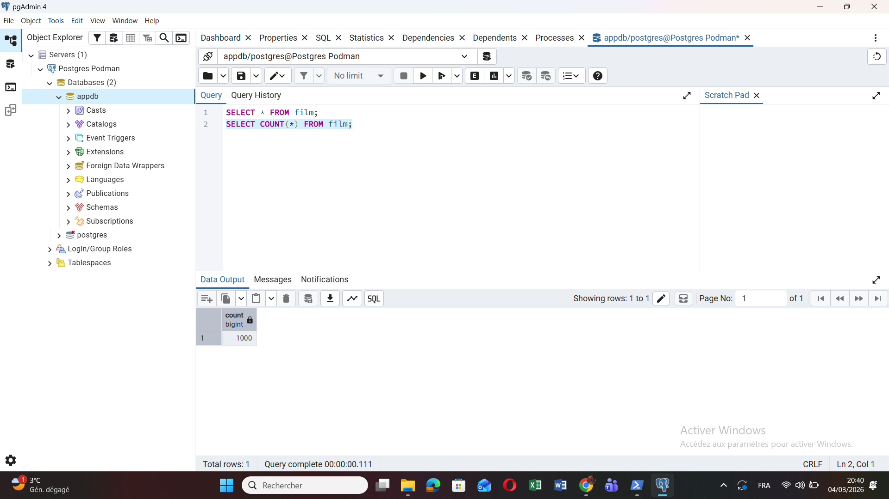
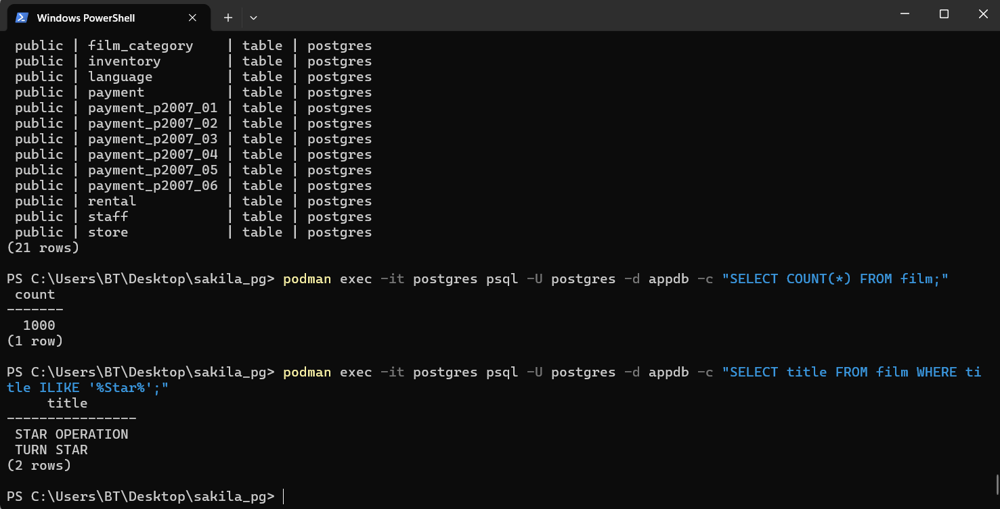
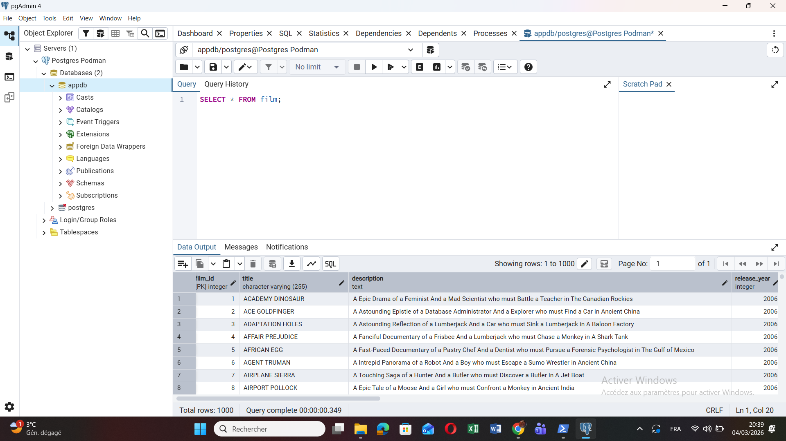

# PostgreSQL Sakila Database  
### Podman + pgAdmin4

---

## 👨‍🎓 Étudiant

**Nom :** Rahmani Chakib  
**Numéro étudiant :** 300150399  
**Cours :** INF1099  

---

# 🎯 Objectif du TP

Ce laboratoire a pour objectif de :

- Installer PostgreSQL dans un conteneur avec **Podman**
- Importer la base de données **Sakila**
- Vérifier les données avec **psql**
- Se connecter avec **pgAdmin 4**
- Exécuter des requêtes SQL pour valider l’importation

---

# 💻 Environnement utilisé

| Outil | Version |
|------|------|
| OS | Windows 11 |
| Terminal | PowerShell |
| Conteneur | Podman |
| Base de données | PostgreSQL 16 |
| Interface graphique | pgAdmin 4 |

---

# 🚀 1. Lancement de PostgreSQL avec Podman

Commande utilisée :

```bash
podman run -d \
--name postgres \
-e POSTGRES_USER=postgres \
-e POSTGRES_PASSWORD=postgres \
-e POSTGRES_DB=appdb \
-p 5432:5432 \
-v postgres_data:/var/lib/postgresql/data \
postgres:16
```

Vérification du conteneur :

```bash
podman ps
```

---

# 📥 2. Téléchargement de la base Sakila

Téléchargement du schéma :

```powershell
Invoke-WebRequest https://raw.githubusercontent.com/jOOQ/sakila/master/postgres-sakila-db/postgres-sakila-schema.sql -OutFile postgres-sakila-schema.sql
```

Téléchargement des données :

```powershell
Invoke-WebRequest https://raw.githubusercontent.com/jOOQ/sakila/master/postgres-sakila-db/postgres-sakila-insert-data.sql -OutFile postgres-sakila-insert-data.sql
```

---

# 🗄️ 3. Importation de la base Sakila

Copie des fichiers dans le conteneur :

```powershell
podman cp postgres-sakila-schema.sql postgres:/schema.sql
podman cp postgres-sakila-insert-data.sql postgres:/data.sql
```

Import du schéma :

```powershell
podman exec -it postgres psql -U postgres -d appdb -f /schema.sql
```

Import des données :

```powershell
podman exec -it postgres psql -U postgres -d appdb -f /data.sql
```

---

# 🔎 4. Vérification avec psql

Liste des tables :

```powershell
podman exec -it postgres psql -U postgres -d appdb -c "\dt"
```

Vérification du nombre de films :

```powershell
podman exec -it postgres psql -U postgres -d appdb -c "SELECT COUNT(*) FROM film;"
```

Résultat attendu :

```
1000
```

### 📷 Capture



---

# ⭐ 5. Requête SQL (films contenant "Star")

Requête exécutée :

```sql
SELECT title FROM film WHERE title ILIKE '%Star%';
```

Résultat :

- STAR OPERATION  
- TURN STAR  

### 📷 Capture



---

# 🧰 6. Vérification dans pgAdmin

Connexion au serveur PostgreSQL :

| Paramètre | Valeur |
|----------|-------|
| Host | localhost |
| Port | 5432 |
| User | postgres |
| Password | postgres |
| Database | appdb |

Requête exécutée :

```sql
SELECT * FROM film;
```

### 📷 Capture




---

# ✅ Conclusion

Ce laboratoire a permis de :

- Déployer PostgreSQL dans un conteneur **Podman**
- Importer la base de données **Sakila**
- Vérifier les données avec **psql**
- Se connecter via **pgAdmin**
- Exécuter des requêtes SQL pour valider l’importation

La base **Sakila contient 1000 films**, confirmant que l’importation a été réalisée avec succès.

---
