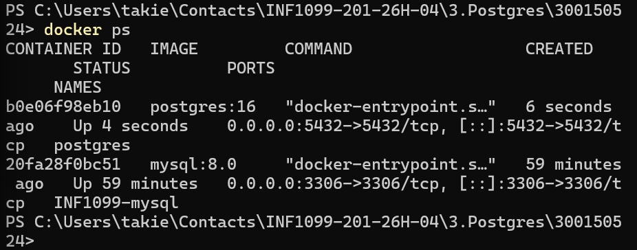
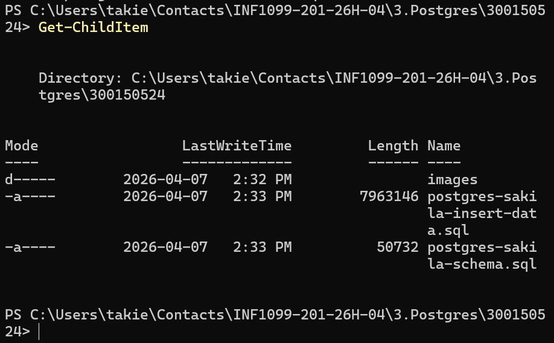
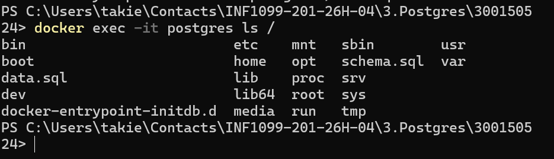
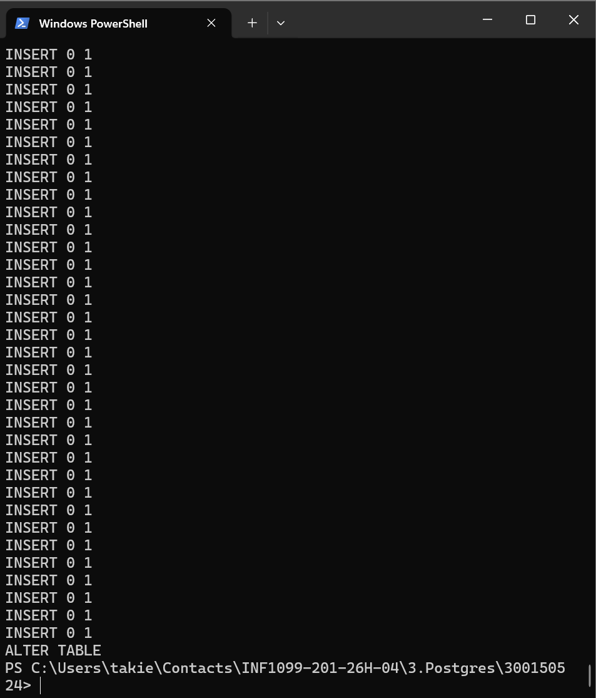
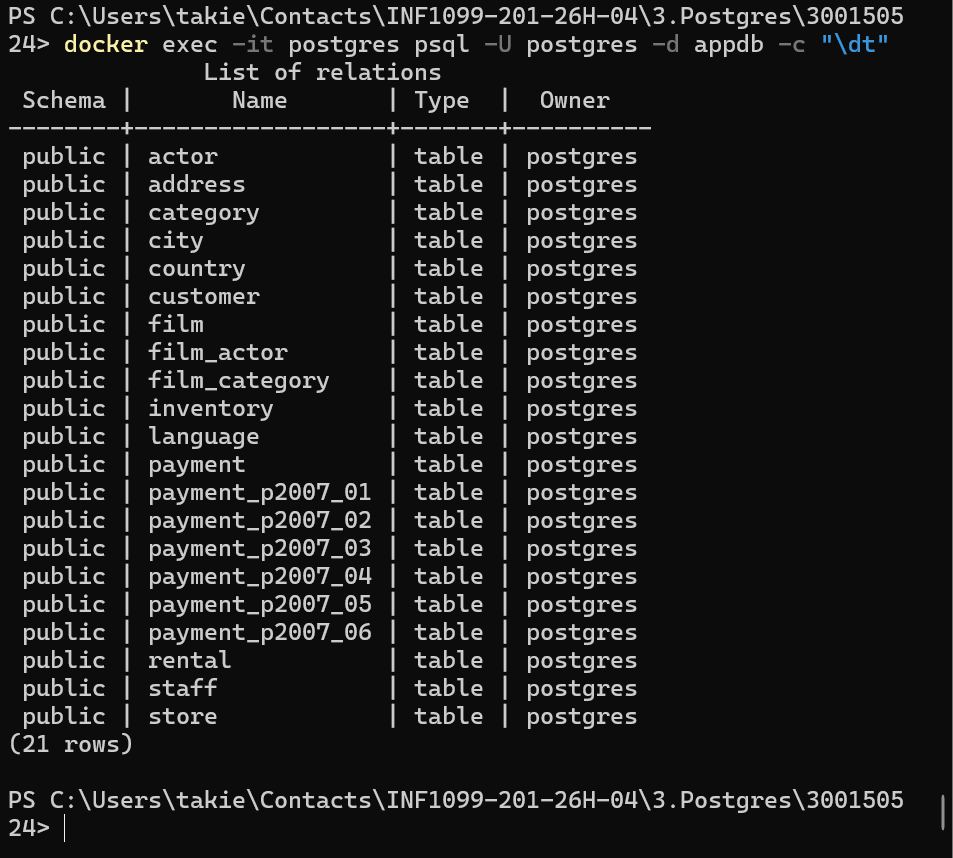
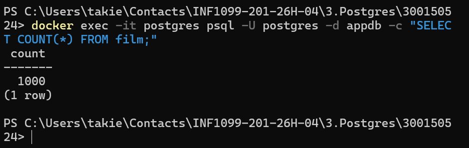
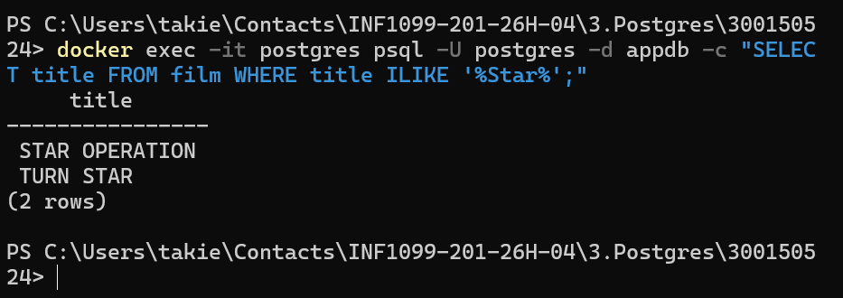
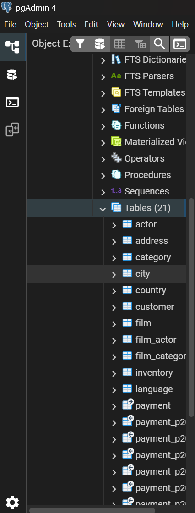

<div align="center">

# 🐘 PostgreSQL Sakila Database

### Déploiement & Exploration avec Docker et pgAdmin 4


---

> **Cours :** INF1099 &nbsp;|&nbsp; **Étudiant :** Taki Eddine Choufa &nbsp;|&nbsp; **No. étudiant :** 300150524

</div>

---

## 📋 Table des matières

1. [🎯 Objectif du TP](#-objectif-du-tp)
2. [💻 Environnement](#-environnement)
3. [🚀 Étape 1 — Lancement du conteneur](#-étape-1--lancement-du-conteneur-postgresql)
4. [📥 Étape 2 — Téléchargement de Sakila](#-étape-2--téléchargement-de-sakila)
5. [🗄️ Étape 3 — Copie des fichiers](#%EF%B8%8F-étape-3--copie-des-fichiers)
6. [⚙️ Étape 4 — Importation de la base](#%EF%B8%8F-étape-4--importation-de-la-base)
7. [🔎 Étape 5 — Vérification](#-étape-5--vérification)
8. [⭐ Étape 6 — Requête SQL](#-étape-6--requête-sql)
9. [🧰 Étape 7 — pgAdmin 4](#-étape-7--vérification-avec-pgadmin-4)
10. [✅ Conclusion](#-conclusion)
11. [📁 Structure du projet](#-structure-du-projet)

---

## 🎯 Objectif du TP

Ce laboratoire a pour objectif de maîtriser le déploiement et l'utilisation d'une base de données relationnelle en environnement conteneurisé.

| # | Objectif |
|---|----------|
| 1 | 🐳 Déployer **PostgreSQL** via **Docker** |
| 2 | 📦 Importer la base de données **Sakila** |
| 3 | 🔍 Vérifier les données avec **psql** |
| 4 | 🖥️ Se connecter via **pgAdmin 4** |
| 5 | 📊 Exécuter des requêtes SQL pour valider l'importation |

---

## 💻 Environnement

| Outil | Version |
|-------|---------|
| 🖥️ Système d'exploitation | Windows 11 |
| 💻 Terminal | PowerShell |
| 🐳 Conteneur | Docker |
| 🐘 Base de données | PostgreSQL 16 |
| 🖱️ Interface graphique | pgAdmin 4 |

---

## 🚀 Étape 1 — Lancement du conteneur PostgreSQL

> Démarrage d'un conteneur PostgreSQL 16 avec persistance des données via un volume Docker.

```bash
docker run -d \
  --name postgres \
  -e POSTGRES_USER=postgres \
  -e POSTGRES_PASSWORD=postgres \
  -e POSTGRES_DB=appdb \
  -p 5432:5432 \
  -v postgres_data:/var/lib/postgresql/data \
  postgres:16
```

Vérification que le conteneur est bien en cours d'exécution :

```bash
docker ps
```

📸 **Capture d'écran :**



---

## 📥 Étape 2 — Téléchargement de Sakila

> Récupération des fichiers SQL officiels de la base de données **Sakila** depuis le dépôt jOOQ.

**Schéma (structure des tables) :**

```powershell
Invoke-WebRequest `
  https://raw.githubusercontent.com/jOOQ/sakila/master/postgres-sakila-db/postgres-sakila-schema.sql `
  -OutFile postgres-sakila-schema.sql
```

**Données (contenu des tables) :**

```powershell
Invoke-WebRequest `
  https://raw.githubusercontent.com/jOOQ/sakila/master/postgres-sakila-db/postgres-sakila-insert-data.sql `
  -OutFile postgres-sakila-insert-data.sql
```

📸 **Capture d'écran :**



---

## 🗄️ Étape 3 — Copie des fichiers

> Transfert des fichiers SQL depuis l'hôte vers l'intérieur du conteneur Docker.

```powershell
docker cp postgres-sakila-schema.sql postgres:/schema.sql
docker cp postgres-sakila-insert-data.sql postgres:/data.sql
```

📸 **Capture d'écran :**



---

## ⚙️ Étape 4 — Importation de la base

> Exécution des scripts SQL dans la base `appdb` pour créer les tables et insérer les données.

**1. Création du schéma :**

```powershell
docker exec -it postgres psql -U postgres -d appdb -f /schema.sql
```

**2. Insertion des données :**

```powershell
docker exec -it postgres psql -U postgres -d appdb -f /data.sql
```

📸 **Capture d'écran :**



---

## 🔎 Étape 5 — Vérification

> Contrôle de la bonne importation en listant les tables et en comptant les enregistrements.

**Liste des tables :**

```powershell
docker exec -it postgres psql -U postgres -d appdb -c "\dt"
```

**Comptage des films :**

```powershell
docker exec -it postgres psql -U postgres -d appdb -c "SELECT COUNT(*) FROM film;"
```

**Résultat attendu :**

```
 count
-------
  1000
(1 row)
```

> ✅ **1 000 films** confirmés dans la base de données.

📸 **Capture d'écran :**



---

## ⭐ Étape 6 — Requête SQL

> Recherche de films contenant le mot **"Star"** dans leur titre (insensible à la casse).

```sql
SELECT title
FROM film
WHERE title ILIKE '%Star%';
```

**Résultats attendus :**

| Titre |
|-------|
| `STAR OPERATION` |
| `TURN STAR` |

📸 **Capture d'écran :**



---

## 🧰 Étape 7 — Vérification avec pgAdmin 4

> Connexion à la base de données via l'interface graphique **pgAdmin 4** et exécution d'une requête de validation.

### 🔌 Paramètres de connexion

| Paramètre | Valeur |
|-----------|--------|
| 🌐 Host | `localhost` |
| 🔢 Port | `5432` |
| 👤 Utilisateur | `postgres` |
| 🔑 Mot de passe | `postgres` |
| 🗄️ Base de données | `appdb` |

### 📊 Requête de validation

```sql
SELECT * FROM film;
```

📸 **Capture d'écran — Connexion pgAdmin :**



📸 **Capture d'écran — Résultat de la requête :**



---

## ✅ Conclusion

Ce laboratoire a permis de maîtriser l'ensemble du flux de déploiement d'une base de données relationnelle en environnement Docker :

- 🐳 **Déploiement** de PostgreSQL 16 en conteneur isolé
- 📦 **Importation** réussie de la base Sakila
- 🔍 **Vérification** des données via `psql`
- 🖥️ **Visualisation** et administration via pgAdmin 4
- 📊 **Validation** du contenu avec des requêtes SQL

> 🎉 La base de données contient **1 000 films**, confirmant le succès complet de l'importation.

---

## 📁 Structure du projet

```
📦 postgres-sakila/
├── 📂 images/
│   ├── 🖼️  1.png       ← Conteneur Docker lancé
│   ├── 🖼️  2.png       ← Téléchargement Sakila
│   ├── 🖼️  3.png       ← Copie des fichiers SQL
│   ├── 🖼️  4.png       ← Importation de la base
│   ├── 🖼️  5.png       ← Vérification psql
│   ├── 🖼️  6.png       ← Requête ILIKE
│   ├── 🖼️  7.png       ← Connexion pgAdmin
│   └── 🖼️  8.png       ← Requête SELECT pgAdmin
├── 📄 postgres-sakila-schema.sql
├── 📄 postgres-sakila-insert-data.sql
└── 📄 README.md
```

---

<div align="center">

Réalisé dans le cadre du cours **INF1099** · Taki Eddine Choufa · `300150524`

</div>
