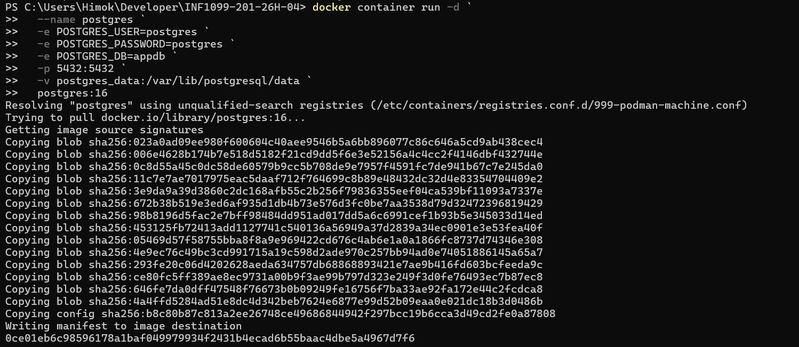
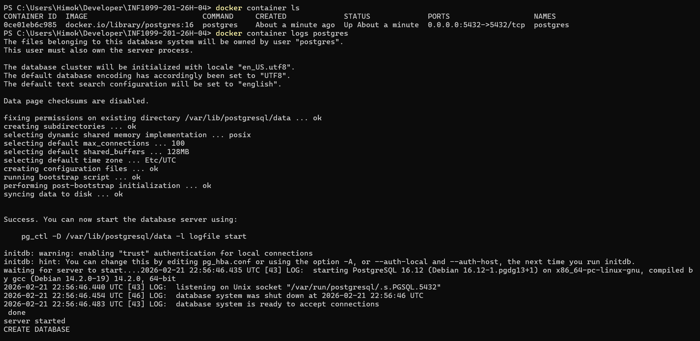
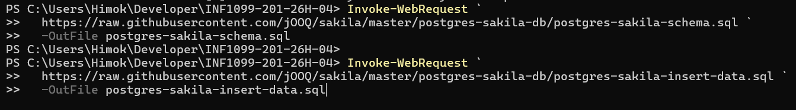
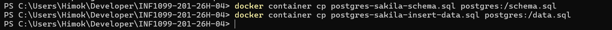
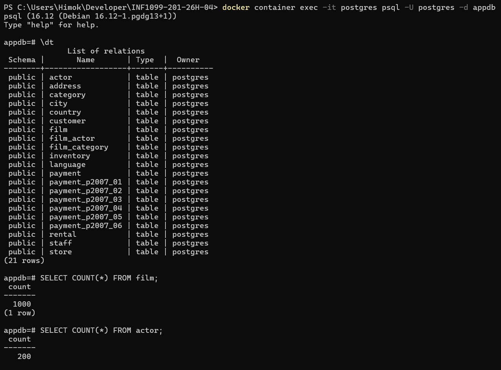
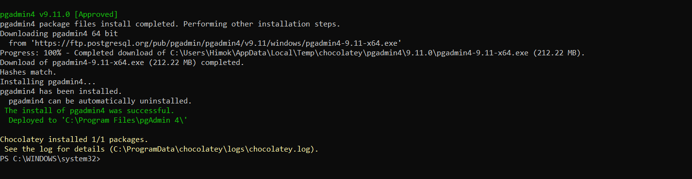
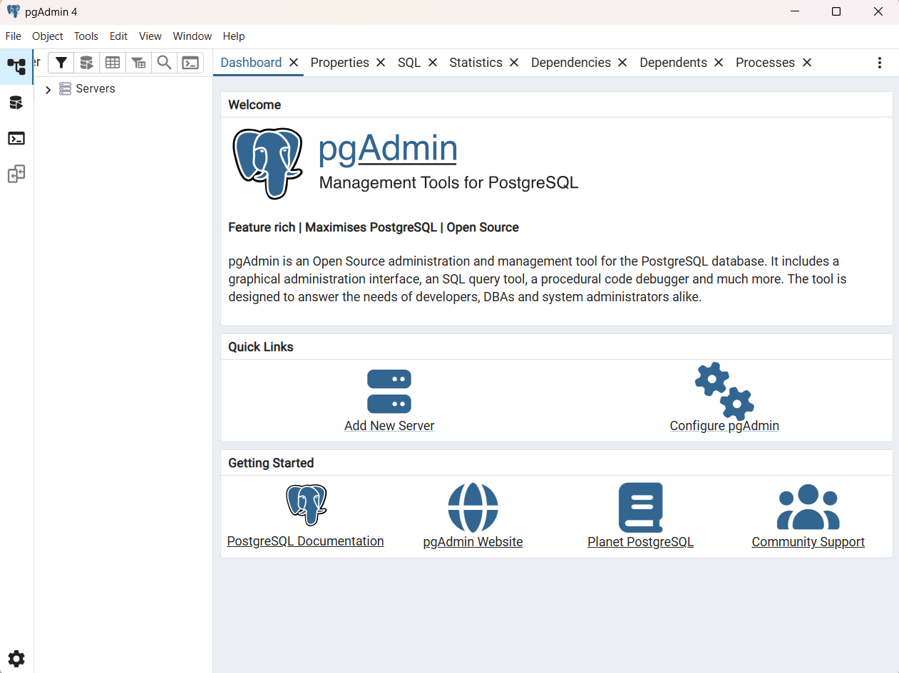
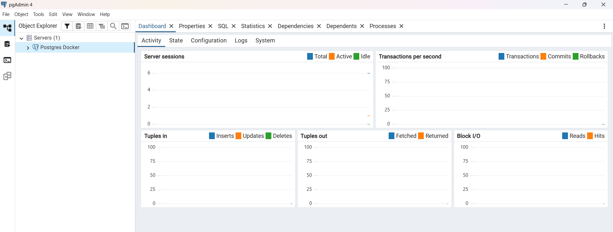
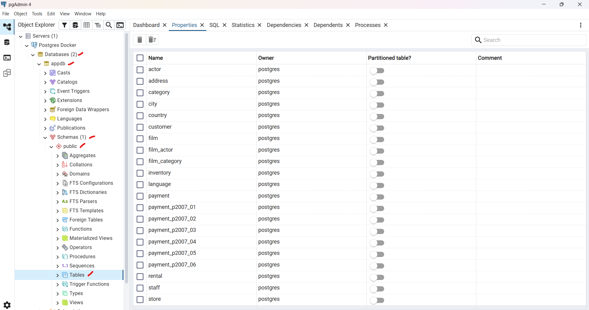
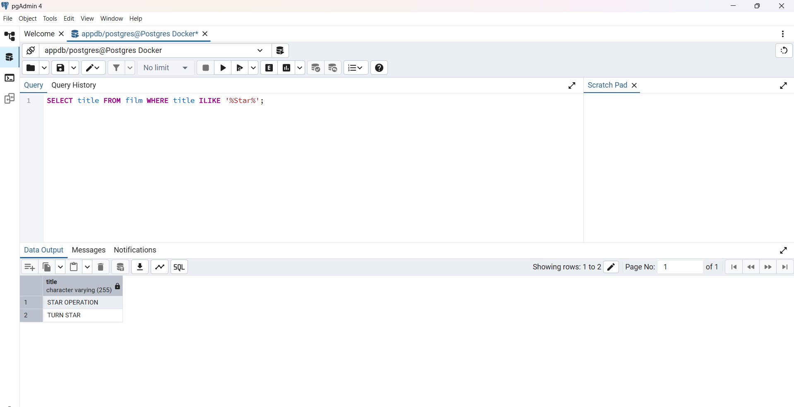

# PostgreSQL DB

# 300151825


## Objectifs

À la fin de cette leçon, nous serons capable de:

1. Installer PostgreSQL dans Docker.
2. Charger la base de données Sakila dans PostgreSQL.
3. Installer pgAdmin 4 avec Chocolatey (Windows).
4. Utiliser pgAdmin 4 pour se connecter et explorer la base de données.

---

## 1️⃣ Installer PostgreSQL avec Docker

### Étape 1 : Créer et lancer le conteneur PostgreSQL

Avant cette etape, nous avons d'abord demarrer postgres.
```powershell
PS C:\Users\Himok\Developer\INF1099-201-26H-04> podman machine start
```


- [ ] 🪟 Windows

```bash
docker container run -d `
  --name postgres `
  -e POSTGRES_USER=postgres `
  -e POSTGRES_PASSWORD=postgres `
  -e POSTGRES_DB=appdb `
  -p 5432:5432 `
  -v postgres_data:/var/lib/postgresql/data `
  postgres:16
```



### Étape 2 : Vérifier que PostgreSQL fonctionne

```bash
docker container ls
docker container logs postgres
```


---

## 2️⃣ Charger la base Sakila

### Étape 1 : Télécharger les fichiers PostgreSQL Sakila

- [ ] 🪟 Windows

```bash
Invoke-WebRequest `
  https://raw.githubusercontent.com/jOOQ/sakila/master/postgres-sakila-db/postgres-sakila-schema.sql `
  -OutFile postgres-sakila-schema.sql

Invoke-WebRequest `
  https://raw.githubusercontent.com/jOOQ/sakila/master/postgres-sakila-db/postgres-sakila-insert-data.sql `
  -OutFile postgres-sakila-insert-data.sql
```



### Étape 2 : Copier les fichiers dans le conteneur

```bash
docker container cp postgres-sakila-schema.sql postgres:/schema.sql
docker container cp postgres-sakila-insert-data.sql postgres:/data.sql
```


### Étape 3 : Exécuter les fichiers SQL dans PostgreSQL

```bash
docker container exec -it postgres psql -U postgres -d appdb -f /schema.sql
docker container exec -it postgres psql -U postgres -d appdb -f /data.sql
```


### Étape 4 : Vérifier que les tables Sakila sont présentes

```bash
docker container exec -it postgres psql -U postgres -d appdb
```

```sql
\dt
SELECT COUNT(*) FROM film;
SELECT COUNT(*) FROM actor;
```


---

## 3️⃣ Installer pgAdmin 4 avec Chocolatey (Windows)

### Étape 1 : Ouvrir PowerShell en mode Administrateur

### Étape 2 : Installer pgAdmin

```powershell
choco install pgadmin4 -y
```


### Étape 3 : Lancer pgAdmin

* Depuis le menu Démarrer → **pgAdmin 4**
* Ou depuis PowerShell :



---

## 4️⃣ Utiliser pgAdmin 4 pour se connecter à PostgreSQL

### Étape 1 : Ajouter un serveur

1. Cliquer sur **Add New Server**.
2. Onglet **General** :

   * Name : `Postgres Docker`
3. Onglet **Connection** :

   * Host name / address : `localhost`
   * Port : `5432`
   * Username : `postgres`
   * Password : `postgres`
   * Maintenance database : `appdb`


---

### Étape 2 : Explorer la base Sakila

* Tables → `actor`, `film`, `customer`, etc.
* Visualiser les données avec **View/Edit Data**
* Exécuter vos propres requêtes SQL avec l’éditeur intégré.



---

## 5️⃣ Exercices pratiques (facultatif)

1. Lister tous les films dont le titre contient “Star” :

```sql
SELECT title FROM film WHERE title ILIKE '%Star%';
```

2. Compter le nombre d’acteurs :

```sql
SELECT COUNT(*) FROM actor;
```



---
