<div align="center">

# 🏟️ Modélisation TP SQL
## Centre Sportif — Gestion de Terrains & Réservations


</div>

---

## 📚 Table des matières

- [🎯 Aperçu du projet](#-aperçu-du-projet)
- [📁 Structure du projet](#-structure-du-projet)
- [🔄 Normalisation](#-normalisation)
- [📊 Diagramme ER](#-diagramme-er)
- [🚀 Démarrage rapide](#-démarrage-rapide)
- [🏗️ DDL — Définition des structures](#️-ddl--définition-des-structures)
- [📝 DML — Manipulation des données](#-dml--manipulation-des-données)
- [🔐 DCL — Contrôle des accès](#-dcl--contrôle-des-accès)

---

## 🎯 Aperçu du projet

Le domaine choisi est la **gestion d'un centre sportif de réservation de terrains**. Ce sujet permet de modéliser le cycle complet depuis l'inscription d'un client jusqu'au paiement d'une réservation, en passant par la gestion des créneaux, des équipes, des matchs et des avis.

| Catégorie | Détails |
|-----------|---------|
| 🗄️ SGBD | PostgreSQL 16 |
| 🐳 Environnement | Docker |
| 📐 Schéma | `centre_sportif` |
| 🗂️ Tables | 15 tables normalisées |
| 👤 Utilisateurs | `employe_user`, `gestionnaire_user` |

---

## 📁 Structure du projet

```
TP_SQL/
├── 📄 README.md
├── 📄 ddl.sql          ← Création des tables
├── 📄 dml.sql          ← Insertion, lecture, modification, suppression
├── 📄 dcl.sql          ← Gestion des droits
└── 📁 images/
    ├── 1.png
    ├── 2.png
    ├── ...
    ├── 12.png
    └── 13.png
```

> ⚠️ **Ordre d'exécution obligatoire :** `ddl.sql` → `dml.sql` → `dcl.sql`

---

## 🔄 Normalisation

### 1️⃣ 1FN — Première Forme Normale

Dans cette phase, toutes les données sont regroupées dans une structure plate (« Flat Table »). Chaque attribut est atomique. **Il n'y a pas encore d'ID techniques.**

**Attributs :**

> Client, Centre, Employé, Disponibilité, Terrain, Créneau, Réservation, Paiement, Promotion, Équipe, Joueur, Match, Avis

---

### 2️⃣ 2FN — Deuxième Forme Normale

Définition des relations et des cardinalités. On sépare les entités pour éviter les redondances partielles.

| Entité A | Cardinalité | Relation | Cardinalité | Entité B |
|----------|-------------|----------|-------------|----------|
| Centre | (1,N) | EMPLOIE | (1,1) | Employé |
| Centre | (1,N) | DÉFINIT | (1,1) | Disponibilité |
| Centre | (1,N) | POSSÈDE | (1,1) | Terrain |
| Terrain | (1,N) | PROPOSE | (1,1) | Créneau |
| Client | (1,N) | EFFECTUE | (1,1) | Réservation |
| Créneau | (0,N) | CONCERNE | (1,1) | Réservation |
| Réservation | (1,1) | RÈGLE | (1,1) | Paiement |
| Réservation | (0,N) | UTILISE | (0,N) | Promotion |
| Client | (1,N) | CRÉE | (1,1) | Équipe |
| Équipe | (0,N) | CONTIENT | (0,N) | Joueur |
| Réservation | (0,1) | DONNE_LIEU_À | (1,1) | Match |
| Client | (0,N) | DONNE | (1,1) | Avis |
| Terrain | (0,N) | REÇOIT | (1,1) | Avis |

---

### 3️⃣ 3FN — Troisième Forme Normale

Structure finale. Les dépendances transitives sont éliminées. Introduction des **Clés Primaires (ID)** et des **Clés Étrangères (#)**.

| Table | Attributs |
|-------|-----------|
| **Client** | ID_Client 🔑, Nom, Prénom, Téléphone, Email, Date_Inscription, Statut |
| **Centre** | ID_Centre 🔑, Nom_Centre, Adresse, Ville, Téléphone, Email |
| **Employé** | ID_Employé 🔑, Nom, Prénom, Rôle, Téléphone, Email, #ID_Centre |
| **Disponibilité** | ID_Disponibilité 🔑, Jour_Semaine, Heure_Ouverture, Heure_Fermeture, #ID_Centre |
| **Terrain** | ID_Terrain 🔑, Nom_Terrain, Type_Surface, Taille, Tarif_Horaire, Éclairage, Statut, #ID_Centre |
| **Créneau** | ID_Créneau 🔑, Date_Créneau, Heure_Debut, Heure_Fin, Statut, #ID_Terrain |
| **Réservation** | ID_Reservation 🔑, Date_Reservation, Statut_Reservation, Nb_Joueurs, Montant_Total, #ID_Client, #ID_Créneau |
| **Paiement** | ID_Paiement 🔑, Date_Paiement, Montant, Mode_Paiement, Statut_Paiement, Référence_Transaction, #ID_Reservation |
| **Promotion** | ID_Promotion 🔑, Code, Type_Remise, Valeur, Date_Debut, Date_Fin, Actif |
| **Reservation_Promotion** | #ID_Reservation 🔑, #ID_Promotion 🔑 |
| **Équipe** | ID_Equipe 🔑, Nom_Equipe, Niveau, Date_Creation, #ID_Client |
| **Joueur** | ID_Joueur 🔑, Nom, Prénom, Téléphone, Email |
| **Equipe_Joueur** | #ID_Equipe 🔑, #ID_Joueur 🔑, Rôle, Date_Ajout |
| **Match** | ID_Match 🔑, Score_Local, Score_Visiteur, Statut_Match, #ID_Reservation, #ID_Equipe_Local, #ID_Equipe_Visiteur |
| **Avis** | ID_Avis 🔑, Note, Commentaire, Date_Avis, #ID_Client, #ID_Terrain |

> 💡 **Légende :** 🔑 Clé Primaire &nbsp;|&nbsp; `#` Clé Étrangère

---

## 📊 Diagramme ER

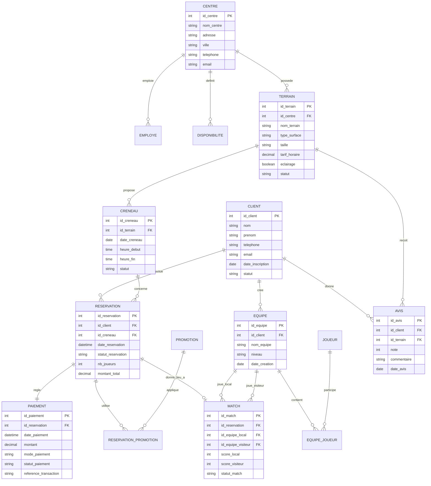

---

## 🚀 Démarrage rapide

```bash
# 1. Entrer dans le container Docker
docker container exec --interactive --tty postgres bash

# 2. Se connecter en superutilisateur
psql -U postgres

# 3. Créer la base de données
CREATE DATABASE centre_sportif;
\c centre_sportif

# 4. Exécuter les fichiers dans l'ordre
\i ddl.sql
\i dml.sql
\i dcl.sql
```

---

## 🏗️ DDL — Définition des structures

### Étape 1 : Connexion et création de la base

```bash
docker container exec --interactive --tty postgres bash
psql -U postgres
```

```sql
CREATE DATABASE centre_sportif;
\c centre_sportif
CREATE SCHEMA centre_sportif;
```

<details>
<summary>🖼️ Capture d'écran</summary>

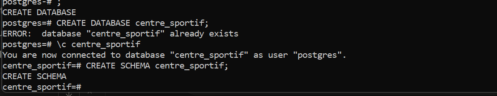

</details>

---

### Étape 2 : Création des tables (partie 1)

```sql
CREATE TABLE centre_sportif.Client (
    id_client        SERIAL PRIMARY KEY,
    nom              TEXT NOT NULL,
    prenom           TEXT NOT NULL,
    telephone        TEXT,
    email            TEXT,
    date_inscription DATE,
    statut           TEXT
);

CREATE TABLE centre_sportif.Centre (
    id_centre   SERIAL PRIMARY KEY,
    nom_centre  TEXT NOT NULL,
    adresse     TEXT NOT NULL,
    ville       TEXT NOT NULL,
    telephone   TEXT,
    email       TEXT
);

CREATE TABLE centre_sportif.Employe (
    id_employe  SERIAL PRIMARY KEY,
    id_centre   INT NOT NULL REFERENCES centre_sportif.Centre(id_centre),
    nom         TEXT NOT NULL,
    prenom      TEXT NOT NULL,
    role        TEXT,
    telephone   TEXT,
    email       TEXT
);

CREATE TABLE centre_sportif.Disponibilite (
    id_disponibilite SERIAL PRIMARY KEY,
    id_centre        INT NOT NULL REFERENCES centre_sportif.Centre(id_centre),
    jour_semaine     TEXT NOT NULL,
    heure_ouverture  TIME NOT NULL,
    heure_fermeture  TIME NOT NULL
);

CREATE TABLE centre_sportif.Terrain (
    id_terrain    SERIAL PRIMARY KEY,
    id_centre     INT NOT NULL REFERENCES centre_sportif.Centre(id_centre),
    nom_terrain   TEXT NOT NULL,
    type_surface  TEXT,
    taille        TEXT,
    tarif_horaire NUMERIC(10,2) NOT NULL,
    eclairage     BOOLEAN DEFAULT FALSE,
    statut        TEXT NOT NULL
);
```

<details>
<summary>🖼️ Capture d'écran</summary>


</details>

---

### Étape 3 : Création des tables (partie 2)

```sql
CREATE TABLE centre_sportif.Creneau (
    id_creneau   SERIAL PRIMARY KEY,
    id_terrain   INT NOT NULL REFERENCES centre_sportif.Terrain(id_terrain),
    date_creneau DATE NOT NULL,
    heure_debut  TIME NOT NULL,
    heure_fin    TIME NOT NULL,
    statut       TEXT NOT NULL
);

CREATE TABLE centre_sportif.Reservation (
    id_reservation     SERIAL PRIMARY KEY,
    id_client          INT NOT NULL REFERENCES centre_sportif.Client(id_client),
    id_creneau         INT NOT NULL REFERENCES centre_sportif.Creneau(id_creneau),
    date_reservation   TIMESTAMP NOT NULL,
    statut_reservation TEXT NOT NULL,
    nb_joueurs         INT,
    montant_total      NUMERIC(10,2)
);

CREATE TABLE centre_sportif.Paiement (
    id_paiement           SERIAL PRIMARY KEY,
    id_reservation        INT NOT NULL REFERENCES centre_sportif.Reservation(id_reservation),
    date_paiement         TIMESTAMP NOT NULL,
    montant               NUMERIC(10,2) NOT NULL,
    mode_paiement         TEXT NOT NULL,
    statut_paiement       TEXT NOT NULL,
    reference_transaction TEXT
);

CREATE TABLE centre_sportif.Promotion (
    id_promotion SERIAL PRIMARY KEY,
    code         TEXT NOT NULL UNIQUE,
    type_remise  TEXT NOT NULL,
    valeur       NUMERIC(10,2) NOT NULL,
    date_debut   DATE NOT NULL,
    date_fin     DATE NOT NULL,
    actif        BOOLEAN DEFAULT TRUE
);

CREATE TABLE centre_sportif.Reservation_Promotion (
    id_reservation INT NOT NULL REFERENCES centre_sportif.Reservation(id_reservation),
    id_promotion   INT NOT NULL REFERENCES centre_sportif.Promotion(id_promotion),
    PRIMARY KEY (id_reservation, id_promotion)
);

CREATE TABLE centre_sportif.Equipe (
    id_equipe     SERIAL PRIMARY KEY,
    id_client     INT NOT NULL REFERENCES centre_sportif.Client(id_client),
    nom_equipe    TEXT NOT NULL,
    niveau        TEXT,
    date_creation DATE
);

CREATE TABLE centre_sportif.Joueur (
    id_joueur  SERIAL PRIMARY KEY,
    nom        TEXT NOT NULL,
    prenom     TEXT NOT NULL,
    telephone  TEXT,
    email      TEXT
);

CREATE TABLE centre_sportif.Equipe_Joueur (
    id_equipe  INT NOT NULL REFERENCES centre_sportif.Equipe(id_equipe),
    id_joueur  INT NOT NULL REFERENCES centre_sportif.Joueur(id_joueur),
    role       TEXT,
    date_ajout DATE,
    PRIMARY KEY (id_equipe, id_joueur)
);

CREATE TABLE centre_sportif.Match (
    id_match           SERIAL PRIMARY KEY,
    id_reservation     INT NOT NULL REFERENCES centre_sportif.Reservation(id_reservation),
    id_equipe_local    INT NOT NULL REFERENCES centre_sportif.Equipe(id_equipe),
    id_equipe_visiteur INT NOT NULL REFERENCES centre_sportif.Equipe(id_equipe),
    score_local        INT DEFAULT 0,
    score_visiteur     INT DEFAULT 0,
    statut_match       TEXT NOT NULL
);

CREATE TABLE centre_sportif.Avis (
    id_avis     SERIAL PRIMARY KEY,
    id_client   INT NOT NULL REFERENCES centre_sportif.Client(id_client),
    id_terrain  INT NOT NULL REFERENCES centre_sportif.Terrain(id_terrain),
    note        INT CHECK (note BETWEEN 1 AND 5),
    commentaire TEXT,
    date_avis   DATE NOT NULL
);
```

<details>
<summary>🖼️ Capture d'écran</summary>

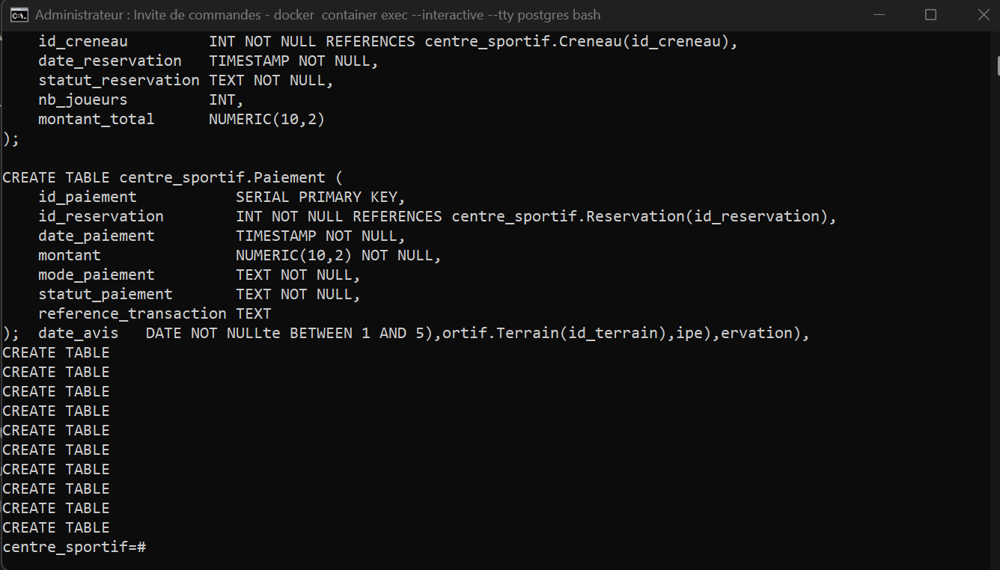

</details>

---

### Étape 4 : Vérifier les tables créées

```sql
\dt centre_sportif.*
```

<details>
<summary>📋 Résultat attendu</summary>

```
                   List of relations
     Schema       |         Name          | Type  |  Owner
------------------+-----------------------+-------+----------
 centre_sportif   | avis                  | table | postgres
 centre_sportif   | client                | table | postgres
 centre_sportif   | centre                | table | postgres
 centre_sportif   | creneau               | table | postgres
 centre_sportif   | disponibilite         | table | postgres
 centre_sportif   | employe               | table | postgres
 centre_sportif   | equipe                | table | postgres
 centre_sportif   | equipe_joueur         | table | postgres
 centre_sportif   | joueur                | table | postgres
 centre_sportif   | match                 | table | postgres
 centre_sportif   | paiement              | table | postgres
 centre_sportif   | promotion             | table | postgres
 centre_sportif   | reservation           | table | postgres
 centre_sportif   | reservation_promotion | table | postgres
 centre_sportif   | terrain               | table | postgres
(15 rows)
```

</details>

<details>
<summary>🖼️ Capture d'écran</summary>

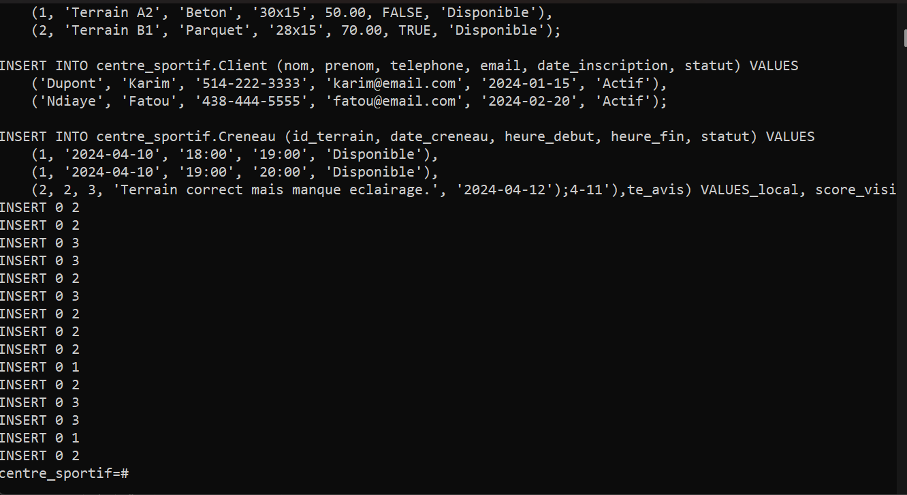

</details>

---

## 📝 DML — Manipulation des données

### Étape 5 : Insérer des données (INSERT)

```sql
INSERT INTO centre_sportif.Centre (nom_centre, adresse, ville, telephone, email) VALUES
    ('Centre Sportif Laval', '100 Boul. des Sports', 'Laval', '450-111-2222', 'laval@sport.com'),
    ('Arena Montreal Est', '55 Rue Sherbrooke E', 'Montreal', '514-333-4444', 'mtl@sport.com');

INSERT INTO centre_sportif.Employe (id_centre, nom, prenom, role, telephone, email) VALUES
    (1, 'Bergeron', 'Julie', 'Receptionniste', '450-555-0001', 'julie@sport.com'),
    (2, 'Leblanc', 'Marc', 'Gerant', '514-555-0002', 'marc@sport.com');

INSERT INTO centre_sportif.Disponibilite (id_centre, jour_semaine, heure_ouverture, heure_fermeture) VALUES
    (1, 'Lundi', '08:00', '22:00'),
    (1, 'Samedi', '09:00', '21:00'),
    (2, 'Lundi', '07:00', '23:00');

INSERT INTO centre_sportif.Terrain (id_centre, nom_terrain, type_surface, taille, tarif_horaire, eclairage, statut) VALUES
    (1, 'Terrain A1', 'Gazon synthetique', '40x20', 80.00, TRUE, 'Disponible'),
    (1, 'Terrain A2', 'Beton', '30x15', 50.00, FALSE, 'Disponible'),
    (2, 'Terrain B1', 'Parquet', '28x15', 70.00, TRUE, 'Disponible');

INSERT INTO centre_sportif.Client (nom, prenom, telephone, email, date_inscription, statut) VALUES
    ('Dupont', 'Karim', '514-222-3333', 'karim@email.com', '2024-01-15', 'Actif'),
    ('Ndiaye', 'Fatou', '438-444-5555', 'fatou@email.com', '2024-02-20', 'Actif');

INSERT INTO centre_sportif.Creneau (id_terrain, date_creneau, heure_debut, heure_fin, statut) VALUES
    (1, '2024-04-10', '18:00', '19:00', 'Disponible'),
    (1, '2024-04-10', '19:00', '20:00', 'Disponible'),
    (2, '2024-04-11', '10:00', '11:00', 'Disponible');

INSERT INTO centre_sportif.Reservation (id_client, id_creneau, date_reservation, statut_reservation, nb_joueurs, montant_total) VALUES
    (1, 1, '2024-04-08 14:30:00', 'Confirmee', 10, 80.00),
    (2, 3, '2024-04-09 10:00:00', 'Confirmee', 6, 50.00);

INSERT INTO centre_sportif.Paiement (id_reservation, date_paiement, montant, mode_paiement, statut_paiement, reference_transaction) VALUES
    (1, '2024-04-08 14:35:00', 80.00, 'Carte credit', 'Paye', 'TXN-001-2024'),
    (2, '2024-04-09 10:05:00', 50.00, 'Comptant', 'Paye', 'TXN-002-2024');

INSERT INTO centre_sportif.Promotion (code, type_remise, valeur, date_debut, date_fin, actif) VALUES
    ('PROMO10', 'Pourcentage', 10.00, '2024-04-01', '2024-04-30', TRUE),
    ('BIENVENUE', 'Montant fixe', 15.00, '2024-01-01', '2024-12-31', TRUE);

INSERT INTO centre_sportif.Reservation_Promotion (id_reservation, id_promotion) VALUES (1, 1);

INSERT INTO centre_sportif.Equipe (id_client, nom_equipe, niveau, date_creation) VALUES
    (1, 'Les Aigles', 'Intermediaire', '2024-03-01'),
    (2, 'Star FC', 'Debutant', '2024-03-10');

INSERT INTO centre_sportif.Joueur (nom, prenom, telephone, email) VALUES
    ('Benali', 'Omar', '514-700-0001', 'omar@email.com'),
    ('Cote', 'Emile', '514-700-0002', 'emile@email.com'),
    ('Traore', 'Awa', '514-700-0003', 'awa@email.com');

INSERT INTO centre_sportif.Equipe_Joueur (id_equipe, id_joueur, role, date_ajout) VALUES
    (1, 1, 'Capitaine', '2024-03-01'),
    (1, 2, 'Joueur', '2024-03-01'),
    (2, 3, 'Capitaine', '2024-03-10');

INSERT INTO centre_sportif.Match (id_reservation, id_equipe_local, id_equipe_visiteur, score_local, score_visiteur, statut_match) VALUES
    (1, 1, 2, 3, 1, 'Termine');

INSERT INTO centre_sportif.Avis (id_client, id_terrain, note, commentaire, date_avis) VALUES
    (1, 1, 5, 'Excellent terrain, bien entretenu et eclaire.', '2024-04-11'),
    (2, 2, 3, 'Terrain correct mais manque eclairage.', '2024-04-12');
```

<details>
<summary>🖼️ Capture d'écran</summary>

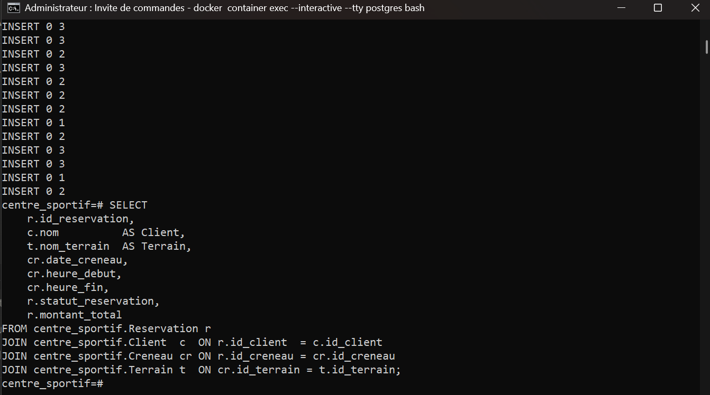

</details>

---

### Étape 6 : Lire les données (SELECT)

```sql
SELECT
    r.id_reservation,
    c.nom          AS Client,
    t.nom_terrain  AS Terrain,
    cr.date_creneau,
    cr.heure_debut,
    cr.heure_fin,
    r.statut_reservation,
    r.montant_total
FROM centre_sportif.Reservation r
JOIN centre_sportif.Client  c  ON r.id_client  = c.id_client
JOIN centre_sportif.Creneau cr ON r.id_creneau = cr.id_creneau
JOIN centre_sportif.Terrain t  ON cr.id_terrain = t.id_terrain;
```

<details>
<summary>📋 Résultat attendu</summary>

```
 id_reservation | client  |  terrain   | date_creneau | heure_debut | heure_fin | statut_reservation | montant_total
----------------+---------+------------+--------------+-------------+-----------+--------------------+---------------
              1 | Dupont  | Terrain A1 | 2024-04-10   | 18:00:00    | 19:00:00  | Confirmee          |         80.00
              2 | Ndiaye  | Terrain A2 | 2024-04-11   | 10:00:00    | 11:00:00  | Confirmee          |         50.00
(2 rows)
```

</details>

<details>
<summary>🖼️ Capture d'écran</summary>

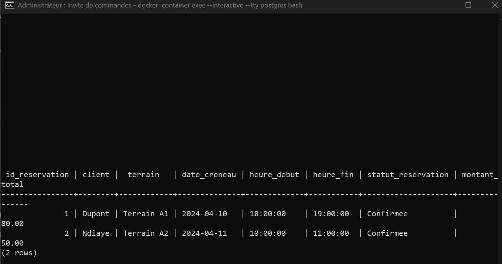

</details>

---

### Étape 7 : Modifier des données (UPDATE)

```sql
UPDATE centre_sportif.Creneau
SET statut = 'Reserve'
WHERE id_creneau = 1;

SELECT id_creneau, statut FROM centre_sportif.Creneau;
```

<details>
<summary>📋 Résultat attendu</summary>

```
UPDATE 1
 id_creneau |   statut
------------+------------
          2 | Disponible
          3 | Disponible
          1 | Reserve
(3 rows)
```

</details>

<details>
<summary>🖼️ Capture d'écran</summary>

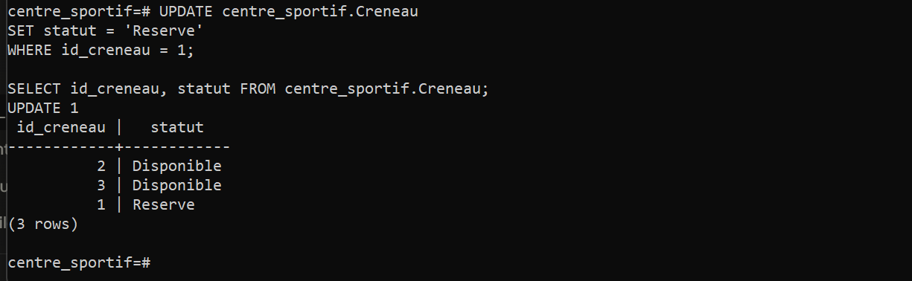

</details>

---

### Étape 8 : Supprimer des données (DELETE)

```sql
DELETE FROM centre_sportif.Avis WHERE id_avis = 2;

SELECT * FROM centre_sportif.Avis;
```

<details>
<summary>📋 Résultat attendu</summary>

```
DELETE 1
 id_avis | id_client | id_terrain | note |              commentaire               | date_avis
---------+-----------+------------+------+----------------------------------------+------------
       1 |         1 |          1 |    5 | Excellent terrain, bien entretenu...   | 2024-04-11
(1 row)
```

</details>

<details>
<summary>🖼️ Capture d'écran</summary>

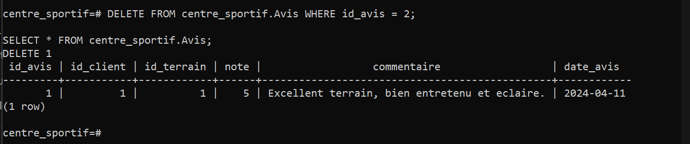

</details>

---

## 🔐 DCL — Contrôle des accès

### Matrice des permissions

| Permission | `employe_user` | `gestionnaire_user` |
|------------|:--------------:|:-------------------:|
| SELECT | ✅ | ✅ |
| INSERT | ❌ | ✅ |
| UPDATE | ❌ | ✅ |
| DELETE | ❌ | ✅ |
| SEQUENCES | ❌ | ✅ |

---

### Étape 9 : Créer les utilisateurs

```sql
CREATE USER employe_user WITH PASSWORD 'emp123';
CREATE USER gestionnaire_user WITH PASSWORD 'gest123';
```

<details>
<summary>📋 Résultat attendu</summary>

```
CREATE ROLE
CREATE ROLE
```

</details>

<details>
<summary>🖼️ Capture d'écran</summary>

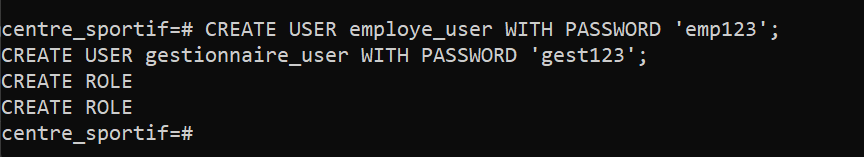

</details>

---

### Étape 10 : Donner les droits (GRANT)

```sql
GRANT CONNECT ON DATABASE centre_sportif TO employe_user, gestionnaire_user;
GRANT USAGE ON SCHEMA centre_sportif TO employe_user, gestionnaire_user;
GRANT SELECT ON ALL TABLES IN SCHEMA centre_sportif TO employe_user;
GRANT SELECT, INSERT, UPDATE, DELETE ON ALL TABLES IN SCHEMA centre_sportif TO gestionnaire_user;
GRANT USAGE, SELECT, UPDATE ON ALL SEQUENCES IN SCHEMA centre_sportif TO gestionnaire_user;
```

<details>
<summary>📋 Résultat attendu</summary>

```
GRANT
GRANT
GRANT
GRANT
GRANT
```

</details>

<details>
<summary>🖼️ Capture d'écran</summary>

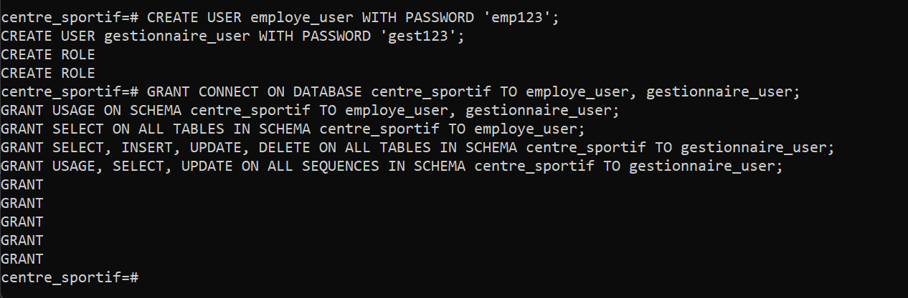

</details>

---

### Étape 11 : Tester les droits de l'employé

```bash
psql -U employe_user -d centre_sportif
```

```sql
SELECT * FROM centre_sportif.Reservation;                                     -- ✅ OK

INSERT INTO centre_sportif.Terrain (id_centre, nom_terrain, type_surface, taille, tarif_horaire, statut)
VALUES (1, 'Test', 'Gazon', '20x10', 40.00, 'Disponible');                   -- ❌ Doit échouer
```

<details>
<summary>📋 Résultat attendu</summary>

```
ERROR:  permission denied for table terrain
```

</details>

<details>
<summary>🖼️ Capture d'écran</summary>

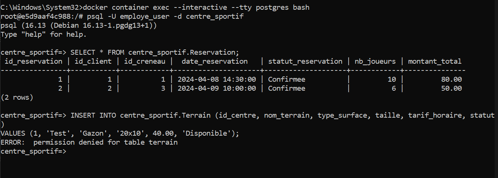

</details>

---

### Étape 12 : Tester les droits du gestionnaire

```bash
psql -U gestionnaire_user -d centre_sportif
```

```sql
INSERT INTO centre_sportif.Promotion (code, type_remise, valeur, date_debut, date_fin, actif)
VALUES ('SUMMER25', 'Pourcentage', 25.00, '2024-06-01', '2024-08-31', TRUE);   -- ✅ OK

UPDATE centre_sportif.Terrain SET tarif_horaire = 90.00 WHERE id_terrain = 1;  -- ✅ OK

SELECT * FROM centre_sportif.Terrain;                                           -- ✅ OK
```

<details>
<summary>🖼️ Capture d'écran</summary>

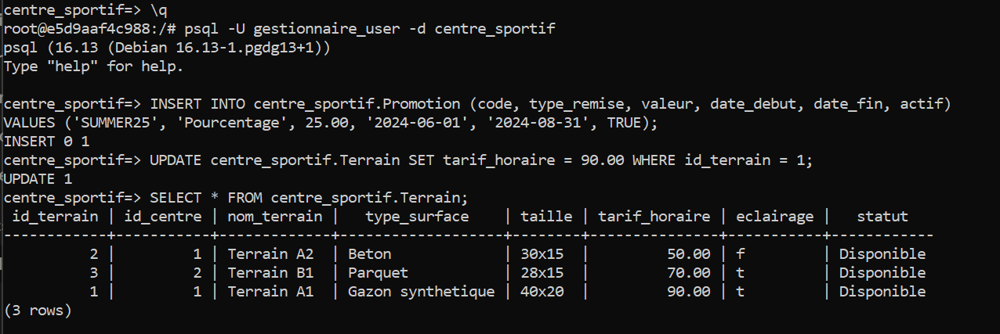

</details>

---

### Étape 13 : Retirer les droits (REVOKE) et Supprimer les utilisateurs (DROP USER)

```sql
REVOKE SELECT ON ALL TABLES IN SCHEMA centre_sportif FROM employe_user;
```

```sql
\c - employe_user
SELECT * FROM centre_sportif.Reservation;   -- ❌ Doit échouer
```

```sql
DROP USER employe_user;
DROP USER gestionnaire_user;
```

<details>
<summary>📋 Résultat attendu</summary>

```
ERROR:  permission denied for table reservation

ERROR:  role "employe_user" cannot be dropped because some objects depend on it
DETAIL:  privileges for database centre_sportif
         privileges for schema centre_sportif

ERROR:  role "gestionnaire_user" cannot be dropped because some objects depend on it
```

</details>

<details>
<summary>🖼️ Capture d'écran</summary>

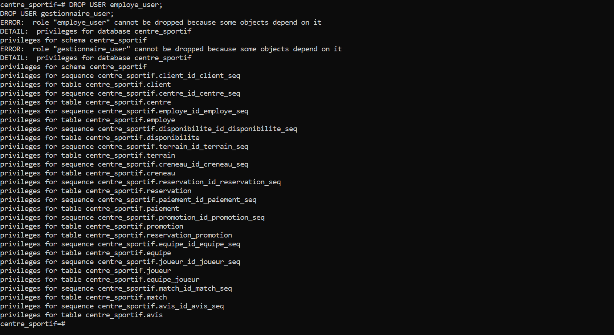

</details>
