# 📝 TP DCL – Gestion des utilisateurs et permissions PostgreSQL

**Nom : Amadou Sow**
**TP : Data Control Language (DCL)**

---

## 🎯 Objectif du TP

Ce TP a pour but de :

* Créer des utilisateurs dans PostgreSQL
* Gérer les permissions (lecture, écriture)
* Tester les accès selon les rôles
* Comprendre la sécurité des données

---

## 📚 Rappel théorique

### 🔹 DCL (Data Control Language)

Le DCL permet de contrôler les accès aux données dans une base.

Commandes principales :

* `CREATE USER` → créer un utilisateur
* `DROP USER` → supprimer un utilisateur
* `GRANT` → donner des permissions
* `REVOKE` → retirer des permissions

👉 DCL = **Qui peut faire quoi dans la base de données**

---

### 🔹 Différence DCL vs ACL

| Aspect   | DCL                    | ACL                      |
| -------- | ---------------------- | ------------------------ |
| Niveau   | Base de données        | Système / fichiers       |
| Objectif | Gérer accès aux tables | Gérer accès aux fichiers |
| Outils   | GRANT, REVOKE          | chmod, setfacl           |
| Exemple  | GRANT SELECT           | chmod 755                |

---

## ⚙️ 1. Préparation

### Connexion à PostgreSQL

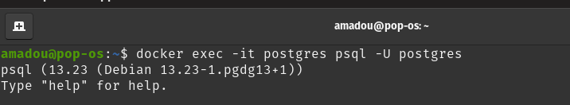

### Création de la base

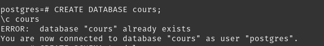

### Création du schéma

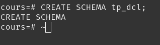

### Création de la table

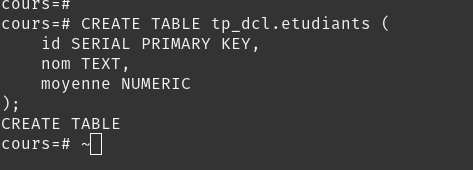

---

## 👤 2. Création des utilisateurs

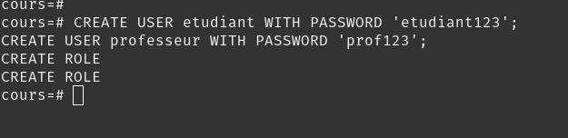

---

## 🔐 3. Attribution des droits (GRANT)

### Accès à la base

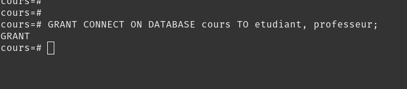

### Accès au schéma

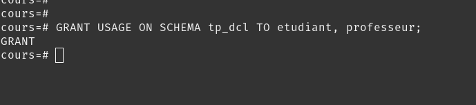

### Permissions sur la table

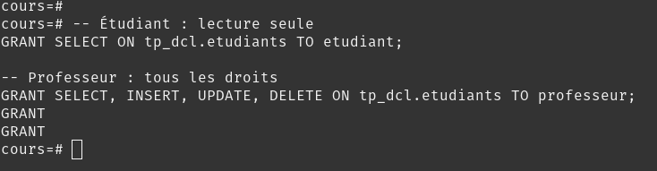

### Accès à la séquence

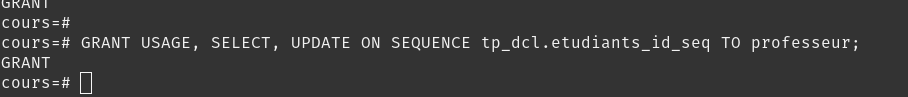

---

## 🧪 4. Vérification des droits

### Connexion étudiant et tests

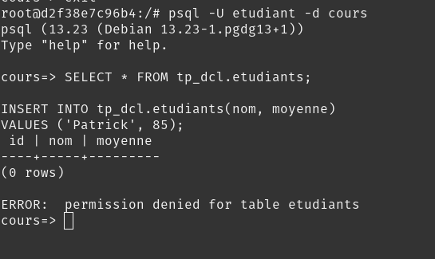

---

### Connexion professeur et tests

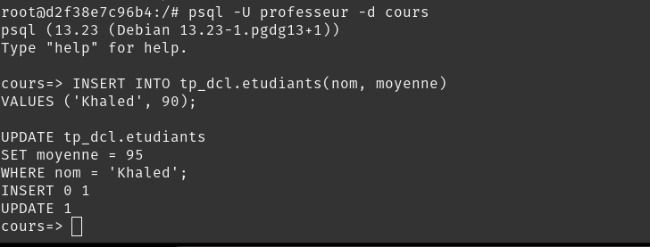

---

## 🧠 Conclusion

Dans ce TP, nous avons appris que :

* DCL permet de sécuriser une base de données
* PostgreSQL fonctionne par niveaux :

  * Base (connexion)
  * Schéma (organisation)
  * Table (données)
* Les permissions sont essentielles pour éviter les accès non autorisés

---

## ✅ Résumé

* `GRANT` → donner accès
* `REVOKE` → retirer accès
* `CREATE USER` → créer utilisateur
* `DROP USER` → supprimer utilisateur

👉 DCL est essentiel pour la **sécurité et la gestion des accès**

---

## 🚀 Bonus (Bonne pratique)

Utiliser des **rôles** au lieu de gérer utilisateur par utilisateur :

```sql
CREATE ROLE lecture;
GRANT SELECT ON tp_dcl.etudiants TO lecture;
GRANT lecture TO etudiant;
```

---

**✔️ TP réalisé avec succès**
