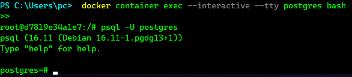
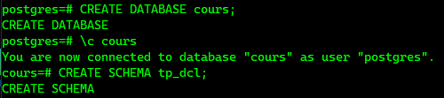
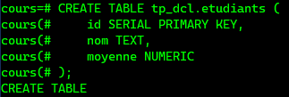
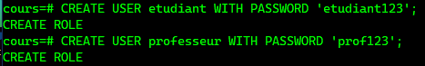
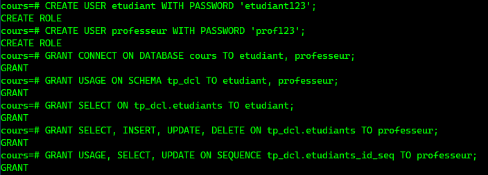
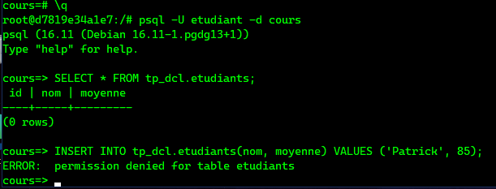
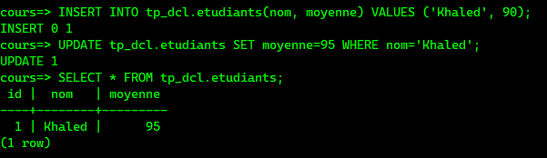
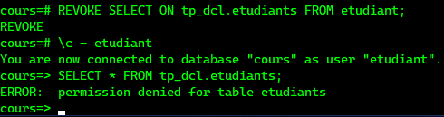
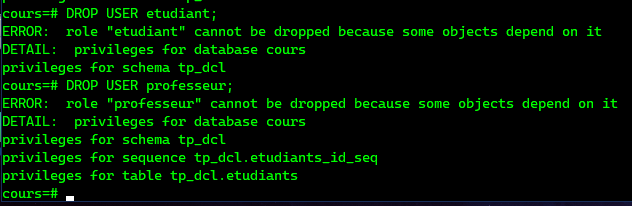

# TP PostgreSQL - DCL (Data Control Language)
#Boualem BELBESSAI

#300150205

---

# 🚀 Étapes du laboratoire

## Étape 0 : Connexion au container Docker

```bash
docker container exec --interactive --tty postgres bash
```

Puis se connecter à PostgreSQL en tant que superutilisateur :

```bash
psql -U postgres
```

<details>
<summary>🖼️ Capture d'écran</summary>



</details>

---

## Étape 1 : Créer la base de données et le schéma

```sql
CREATE DATABASE cours;
\c cours
CREATE SCHEMA tp_dcl;
```

<details>
<summary>📋 Output attendu</summary>

```
CREATE DATABASE
You are now connected to database "cours" as user "postgres".
CREATE SCHEMA
```
</details>

<details>
<summary>🖼️ Capture d'écran</summary>



</details>

---

## Étape 2 : Créer la table

```sql
CREATE TABLE tp_dcl.etudiants (
    id SERIAL PRIMARY KEY,
    nom TEXT,
    moyenne NUMERIC
);
```

<details>
<summary>📋 Output attendu</summary>

```
CREATE TABLE
```
</details>

<details>
<summary>🖼️ Capture d'écran</summary>



</details>

---

## Étape 3 : Créer les utilisateurs

```sql
-- Étudiant simple (lecture)
CREATE USER etudiant WITH PASSWORD 'etudiant123';

-- Professeur (lecture/écriture)
CREATE USER professeur WITH PASSWORD 'prof123';
```

<details>
<summary>📋 Output attendu</summary>

```
CREATE ROLE
CREATE ROLE
```
</details>

<details>
<summary>🖼️ Capture d'écran</summary>



</details>

---

## Étape 4 : Donner les droits (GRANT)

```sql
-- Connexion à la base
GRANT CONNECT ON DATABASE cours TO etudiant, professeur;

-- Accès au schéma
GRANT USAGE ON SCHEMA tp_dcl TO etudiant, professeur;

-- Étudiant : lecture seule
GRANT SELECT ON tp_dcl.etudiants TO etudiant;

-- Professeur : lecture + écriture complète
GRANT SELECT, INSERT, UPDATE, DELETE ON tp_dcl.etudiants TO professeur;

-- Droits sur la séquence (nécessaire pour les INSERT avec SERIAL)
GRANT USAGE, SELECT, UPDATE ON SEQUENCE tp_dcl.etudiants_id_seq TO professeur;
```

<details>
<summary>📋 Output attendu</summary>

```
GRANT
GRANT
GRANT
GRANT
GRANT
```
</details>

<details>
<summary>🖼️ Capture d'écran</summary>



</details>

---

## Étape 5 : Tester les droits de l'étudiant

Se déconnecter puis reconnecter en tant qu'étudiant :

```bash
\q
psql -U etudiant -d cours
```

```sql
SELECT * FROM tp_dcl.etudiants;  -- ✅ Doit fonctionner

INSERT INTO tp_dcl.etudiants(nom, moyenne) VALUES ('Patrick', 85);  -- ❌ Doit échouer
```

<details>
<summary>📋 Output attendu</summary>

```
 id | nom | moyenne
----+-----+---------
(0 rows)

ERROR:  permission denied for table etudiants
```
</details>

<details>
<summary>🖼️ Capture d'écran</summary>



</details>

---

## Étape 6 : Tester les droits du professeur

Se déconnecter puis reconnecter en tant que professeur :

```bash
\q
psql -U professeur -d cours
```

```sql
INSERT INTO tp_dcl.etudiants(nom, moyenne) VALUES ('Khaled', 90);  -- ✅ OK
UPDATE tp_dcl.etudiants SET moyenne=95 WHERE nom='Khaled';          -- ✅ OK
SELECT * FROM tp_dcl.etudiants;                                     -- ✅ OK
```

<details>
<summary>📋 Output attendu</summary>

```
INSERT 0 1
UPDATE 1
 id |  nom   | moyenne
----+--------+---------
  1 | Khaled |      95
(1 row)
```
</details>

<details>
<summary>🖼️ Capture d'écran</summary>



</details>

---

## Étape 7 : Retirer des droits (REVOKE)

Reconnecter en tant que superutilisateur :

```bash
\q
psql -U postgres -d cours
```

```sql
-- Retirer le droit de lecture à l'étudiant
REVOKE SELECT ON tp_dcl.etudiants FROM etudiant;
```

Vérifier que le droit a bien été retiré :

```sql
\c - etudiant
SELECT * FROM tp_dcl.etudiants;  -- ❌ Doit maintenant échouer
```

<details>
<summary>📋 Output attendu</summary>

```
REVOKE
ERROR:  permission denied for table etudiants
```
</details>

<details>
<summary>🖼️ Capture d'écran</summary>



</details>

---

## Étape 8 : Supprimer les utilisateurs (DROP USER)

Reconnecter en superutilisateur :

```bash
\c - postgres
```

```sql
DROP USER etudiant;
DROP USER professeur;
```

> ⚠️ PostgreSQL **ne permet pas** de supprimer un utilisateur si celui-ci possède encore des privilèges (tables, schémas). Ici, tout reste dans le schéma `tp_dcl`.

<details>
<summary>📋 Output attendu</summary>

```
ERROR:  role "etudiant" cannot be dropped because some objects depend on it
DETAIL:  privileges for database cours
         privileges for schema tp_dcl

ERROR:  role "professeur" cannot be dropped because some objects depend on it
DETAIL:  privileges for database cours
         privileges for schema tp_dcl
         privileges for sequence tp_dcl.etudiants_id_seq
         privileges for table tp_dcl.etudiants
```
</details>

<details>
<summary>🖼️ Capture d'écran</summary>



</details>

---

## 🔑 Rappel : Hiérarchie des droits PostgreSQL

```
Cluster PostgreSQL
 ├── Base : cours
 │     └── Schéma : tp_dcl
 │           ├── Table : etudiants
 │           └── Séquence : etudiants_id_seq
 └── Utilisateurs : etudiant, professeur
```

> Pour qu'un utilisateur puisse accéder à une table, il faut **3 niveaux de droits** :
> 1. `GRANT CONNECT` sur la **base**
> 2. `GRANT USAGE` sur le **schéma**
> 3. `GRANT SELECT/INSERT/...` sur la **table**