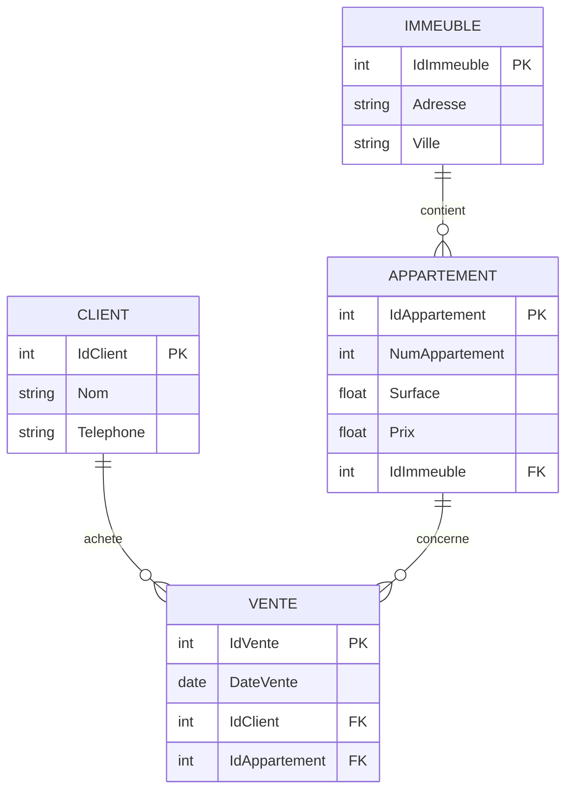

# 🏢 Projet – Normalisation d’une Base de Données Immobilière

## 👨‍🎓 Auteur

Mazigh Bareche

---

# 🎯 Description du projet

Ce projet consiste à concevoir une base de données pour la gestion des ventes d’appartements dans des immeubles.

L’objectif est de démontrer :

* La transformation d’une table non normalisée
* L’application des formes normales (1FN, 2FN, 3FN)
* La création d’un modèle relationnel optimisé
* La modélisation avec un diagramme Entité/Relation (E/R)

---

# 🚀 Étapes du projet

---

## 📌 Étape 1 : Table non normalisée

### 🔎 Description

Toutes les données sont regroupées dans une seule table.

### 📄 Structure

```sql
VENTE
---------------------------------------------------------
IdVente (PK)
NomClient
TelClient
AdresseImmeuble
Ville
NumAppartement
Surface
Prix
DateVente
```

---

### ⚠️ Problèmes

* Redondance des clients
* Redondance des immeubles
* Difficulté de mise à jour
* Anomalies d’insertion et de suppression

---

## 📌 Étape 2 : Première Forme Normale (1FN)

### 🔎 Objectif

* Données atomiques
* Pas de groupes répétitifs

### ✅ Résultat

Structure inchangée mais validée :

* chaque champ contient une seule valeur

---

## 📌 Étape 3 : Deuxième Forme Normale (2FN)

### 🔎 Objectif

Éliminer les dépendances partielles

---

### 🧱 Décomposition

```sql
CLIENT(IdClient, NomClient, TelClient)

IMMEUBLE(IdImmeuble, AdresseImmeuble, Ville)

APPARTEMENT(IdAppartement, NumAppartement, Surface, Prix, IdImmeuble)

VENTE(IdVente, DateVente, IdClient, IdAppartement)
```

---

### ✅ Avantages

* Réduction des redondances
* Meilleure organisation
* Données mieux structurées

---

## 📌 Étape 4 : Troisième Forme Normale (3FN)

### 🔎 Objectif

Supprimer les dépendances transitives

---

### ✅ Structure finale

```sql
CLIENT (
    IdClient SERIAL PRIMARY KEY,
    Nom TEXT,
    Telephone TEXT
);

IMMEUBLE (
    IdImmeuble SERIAL PRIMARY KEY,
    Adresse TEXT,
    Ville TEXT
);

APPARTEMENT (
    IdAppartement SERIAL PRIMARY KEY,
    NumAppartement INT,
    Surface NUMERIC,
    Prix NUMERIC,
    IdImmeuble INT REFERENCES IMMEUBLE(IdImmeuble)
);

VENTE (
    IdVente SERIAL PRIMARY KEY,
    DateVente DATE,
    IdClient INT REFERENCES CLIENT(IdClient),
    IdAppartement INT REFERENCES APPARTEMENT(IdAppartement)
);
```

---

# 📊 Diagramme Entité / Relation (E/R)



---

# 🔗 Relations

* Un client peut acheter plusieurs appartements
* Un appartement appartient à un seul immeuble
* Une vente relie un client et un appartement
* Un immeuble contient plusieurs appartements

---

# 🧪 Exemple de requêtes SQL

### Ajouter un client

```sql
INSERT INTO CLIENT (Nom, Telephone)
VALUES ('Mazigh', '5140000000');
```

---

### Ajouter un immeuble

```sql
INSERT INTO IMMEUBLE (Adresse, Ville)
VALUES ('123 Rue Toronto', 'Toronto');
```

---

### Ajouter un appartement

```sql
INSERT INTO APPARTEMENT (NumAppartement, Surface, Prix, IdImmeuble)
VALUES (101, 75, 250000, 1);
```

---

### Créer une vente

```sql
INSERT INTO VENTE (DateVente, IdClient, IdAppartement)
VALUES ('2026-04-08', 1, 1);
```

---

### Voir les ventes

```sql
SELECT c.Nom, a.NumAppartement, v.DateVente
FROM VENTE v
JOIN CLIENT c ON v.IdClient = c.IdClient
JOIN APPARTEMENT a ON v.IdAppartement = a.IdAppartement;
```

---

# 🛠 Technologies utilisées

* PostgreSQL
* SQL
* Docker
* pgAdmin
* Mermaid (diagrammes)

---

# ✅ Conclusion

Ce projet démontre :

* L’importance de la normalisation
* La structuration efficace des données
* La réduction des anomalies
* La création d’un modèle relationnel optimisé

---

🔥 Projet réalisé dans le cadre du cours de base de données
