# 🐘 Gestion des Utilisateurs PostgreSQL (DCL)
### Projet académique — Base de données CarGoRent

---

<div align="center">


</div>

---

## 📋 Informations du Projet

| Champ | Détail |
|---|---|
| 👤 **Étudiant** | Taki Eddine Choufa |
| 🆔 **Numéro étudiant** | 300150524 |
| 📚 **Cours** | INF1099 — Conception et déploiement de bases de données |
| 🗂️ **Projet** | Gestion des utilisateurs PostgreSQL (DCL) |
| 🏢 **Base de données** | CarGoRent |

---

## 🎯 Objectifs du Projet

Ce laboratoire a pour but de maîtriser les commandes **DCL (Data Control Language)** de PostgreSQL, incluant la gestion des utilisateurs, des rôles et des permissions dans un environnement conteneurisé Docker.

À la fin de ce projet, les compétences suivantes sont acquises :

- ✅ Créer une base de données PostgreSQL et un schéma structuré
- ✅ Insérer et modifier des données dans une table
- ✅ Créer des utilisateurs avec des accès spécifiques
- ✅ Gérer les permissions avec `GRANT` et `REVOKE`
- ✅ Administrer des rôles PostgreSQL et les attribuer
- ✅ Comprendre les permissions sur les séquences et les schémas

---

## 🛠️ Environnement Technique

| Composant | Version / Détail |
|---|---|
| 💻 **Système d'exploitation** | Windows 11 |
| 🖥️ **Terminal** | PowerShell |
| 🐳 **Conteneurisation** | Docker Desktop |
| 🐘 **Base de données** | PostgreSQL 16 |
| 🔧 **Client SQL** | psql (CLI) |

---

## 1️⃣ Connexion à PostgreSQL via Docker

La première étape consiste à accéder au conteneur Docker PostgreSQL et à lancer le client `psql` en tant que superutilisateur.

```powershell
docker exec -it <nom_du_conteneur> psql -U postgres
```

Cette commande exécute `psql` directement à l'intérieur du conteneur, en se connectant avec l'utilisateur `postgres` (superutilisateur par défaut).

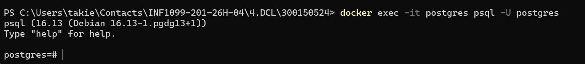

---

## 2️⃣ Création de la Base de Données `cargorent`

Une fois connecté, on crée la base de données dédiée au projet.

```sql
CREATE DATABASE cargorent;
\c cargorent
```

La commande `\c cargorent` permet de basculer vers la nouvelle base de données afin d'y exécuter toutes les prochaines opérations.

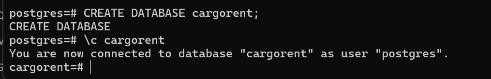

---

## 3️⃣ Création du Schéma et de la Table `clients`

On organise la base de données en créant un schéma dédié, puis une table `clients` pour stocker les informations des clients de CarGoRent.

```sql
CREATE SCHEMA gestion;

CREATE TABLE gestion.clients (
    id        SERIAL PRIMARY KEY,
    nom       VARCHAR(100) NOT NULL,
    email     VARCHAR(150) UNIQUE NOT NULL,
    telephone VARCHAR(20)
);
```

L'utilisation d'un schéma (`gestion`) permet d'isoler logiquement les objets de la base de données, une bonne pratique en architecture SQL.

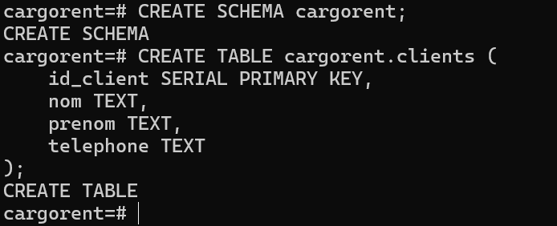

---

## 4️⃣ Insertion de Données

On insère deux enregistrements de test représentant des clients réels de l'application CarGoRent.

```sql
INSERT INTO gestion.clients (nom, email, telephone)
VALUES ('Taki Eddine Choufa', 'taki@cargorent.com', '514-000-0001');

INSERT INTO gestion.clients (nom, email, telephone)
VALUES ('Lidia', 'lidia@cargorent.com', '514-000-0002');
```

Ces données serviront de référence tout au long des tests de permissions.

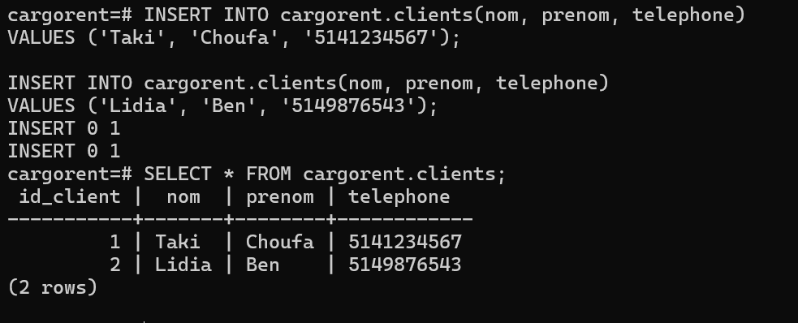

---

## 5️⃣ Création des Utilisateurs

Deux utilisateurs sont créés avec des niveaux d'accès différents : un utilisateur à accès limité (`client_user`) et un administrateur (`admin_user`).

```sql
CREATE USER client_user WITH PASSWORD 'client123';
CREATE USER admin_user  WITH PASSWORD 'admin123';
```

Ces utilisateurs n'ont aucune permission par défaut — celles-ci seront accordées explicitement dans les étapes suivantes.

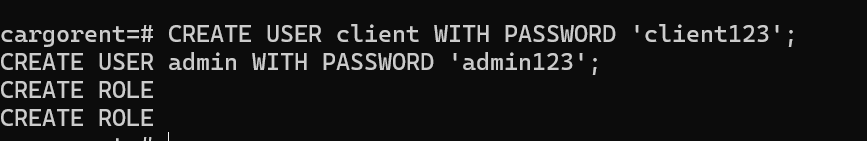

---

## 6️⃣ Attribution des Permissions (`GRANT`)

On accorde des permissions ciblées à chaque utilisateur selon le principe du **moindre privilège**.

```sql
-- Permissions pour client_user (lecture seule)
GRANT USAGE  ON SCHEMA gestion              TO client_user;
GRANT SELECT ON gestion.clients             TO client_user;

-- Permissions pour admin_user (lecture + écriture)
GRANT USAGE  ON SCHEMA gestion              TO admin_user;
GRANT SELECT, INSERT, UPDATE ON gestion.clients TO admin_user;
```

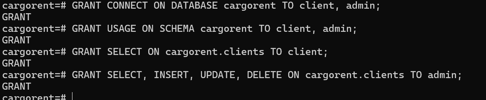

---

## 7️⃣ Test `SELECT` par `client_user`

On vérifie que l'utilisateur `client_user` peut lire les données de la table, conformément aux permissions accordées.

```sql
\c cargorent client_user
SELECT * FROM gestion.clients;
```

Le résultat affiche correctement les deux enregistrements insérés. La permission `SELECT` fonctionne comme attendu.

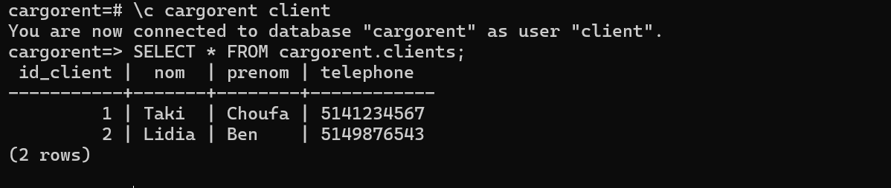

---

## 8️⃣ Test `INSERT` refusé pour `client_user`

On tente une insertion avec `client_user` afin de confirmer que la permission `INSERT` lui est bien refusée.

```sql
INSERT INTO gestion.clients (nom, email, telephone)
VALUES ('Test Refus', 'refus@test.com', '000-000-0000');
```

PostgreSQL retourne une erreur de type `ERROR: permission denied for table clients`, ce qui valide le bon fonctionnement du contrôle d'accès.

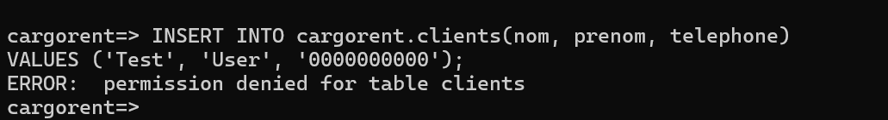

---

## 9️⃣ Erreur de Séquence pour `admin_user`

Lors du premier `INSERT` effectué par `admin_user`, une erreur survient en raison d'un accès manquant sur la séquence associée à la colonne `id` (de type `SERIAL`).

```sql
\c cargorent admin_user

INSERT INTO gestion.clients (nom, email, telephone)
VALUES ('Admin Test', 'admintest@cargorent.com', '514-111-0001');
-- ERROR: permission denied for sequence clients_id_seq
```

Cette erreur est courante et attendue : la colonne `SERIAL` utilise une séquence interne qui nécessite une permission distincte.

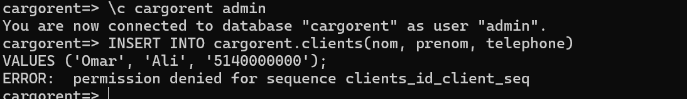

---

## 🔟 Correction de la Permission sur la Séquence

Pour corriger l'erreur, on accorde explicitement à `admin_user` le droit d'utiliser la séquence.

```sql
\c cargorent postgres

GRANT USAGE, SELECT ON SEQUENCE gestion.clients_id_seq TO admin_user;
```

La permission `USAGE` sur la séquence est indispensable pour que la valeur automatique de `id` soit générée correctement lors d'un `INSERT`.

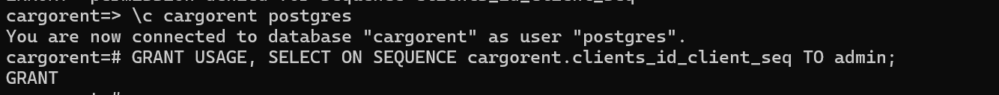

---

## 1️⃣1️⃣ `INSERT` réussi par `admin_user`

Après correction, on reteste l'insertion avec `admin_user`. L'opération se déroule sans erreur.

```sql
\c cargorent admin_user

INSERT INTO gestion.clients (nom, email, telephone)
VALUES ('Admin Test', 'admintest@cargorent.com', '514-111-0001');
-- INSERT 0 1
```

L'enregistrement est créé avec succès, confirmant que les permissions sont désormais correctement configurées.

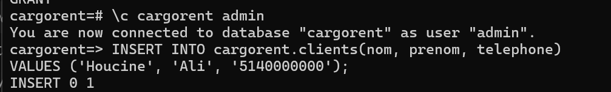

---

## 1️⃣2️⃣ `UPDATE` par `admin_user`

On vérifie la permission de mise à jour en modifiant le numéro de téléphone d'un client existant.

```sql
UPDATE gestion.clients
SET telephone = '514-999-9999'
WHERE nom = 'Taki Eddine Choufa';
-- UPDATE 1
```

La mise à jour s'effectue sans problème, confirmant que `admin_user` dispose bien de la permission `UPDATE`.

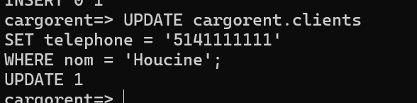

---

## 1️⃣3️⃣ `SELECT` Final — Vérification Globale

On effectue une lecture complète de la table pour confirmer que toutes les opérations (INSERT, UPDATE) ont bien été enregistrées.

```sql
SELECT * FROM gestion.clients;
```

| id | nom | email | telephone |
|---|---|---|---|
| 1 | Taki Eddine Choufa | taki@cargorent.com | 514-999-9999 |
| 2 | Lidia | lidia@cargorent.com | 514-000-0002 |
| 3 | Admin Test | admintest@cargorent.com | 514-111-0001 |

Les données reflètent fidèlement toutes les modifications apportées.

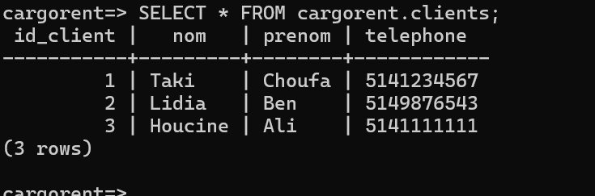

---

## 1️⃣4️⃣ Révocation des Permissions (`REVOKE`)

On retire les permissions accordées à `client_user` pour simuler une fin d'accès ou une révocation de droits.

```sql
\c cargorent postgres

REVOKE SELECT ON gestion.clients FROM client_user;
REVOKE USAGE  ON SCHEMA gestion  FROM client_user;
```

La commande `REVOKE` est l'opération inverse de `GRANT`. Elle retire immédiatement les droits spécifiés.

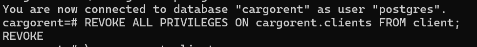

---

## 1️⃣5️⃣ `SELECT` refusé après `REVOKE`

On se reconnecte avec `client_user` et on tente un `SELECT` pour confirmer la révocation.

```sql
\c cargorent client_user

SELECT * FROM gestion.clients;
-- ERROR: permission denied for table clients
```

L'accès est bien bloqué. Les droits ont été correctement révoqués, démontrant l'efficacité du mécanisme DCL de PostgreSQL.

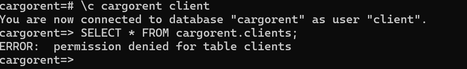

---

## 1️⃣6️⃣ Création d'un Rôle `gestionnaire`

Les **rôles** permettent de regrouper des permissions et de les attribuer à plusieurs utilisateurs simultanément, simplifiant la gestion des accès.

```sql
\c cargorent postgres

CREATE ROLE gestionnaire;

GRANT USAGE  ON SCHEMA gestion                   TO gestionnaire;
GRANT SELECT, INSERT, UPDATE ON gestion.clients  TO gestionnaire;
GRANT USAGE, SELECT ON SEQUENCE gestion.clients_id_seq TO gestionnaire;
```

Le rôle `gestionnaire` dispose des mêmes droits qu'`admin_user`, mais peut être attribué à n'importe quel utilisateur futur.

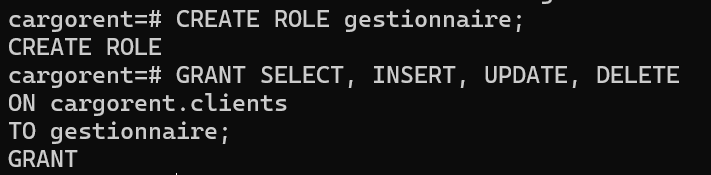

---

## 1️⃣7️⃣ Création de l'Utilisateur `agent` et Attribution du Rôle

On crée un nouvel utilisateur `agent_user` et on lui attribue le rôle `gestionnaire`.

```sql
CREATE USER agent_user WITH PASSWORD 'agent123';
GRANT gestionnaire TO agent_user;
```

Grâce à ce mécanisme, `agent_user` hérite automatiquement de toutes les permissions définies dans le rôle `gestionnaire`, sans avoir besoin de les attribuer individuellement.

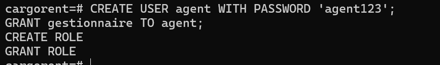

---

## 1️⃣8️⃣ Test de `agent_user` — Vérification Complète

On teste les différentes opérations avec `agent_user` pour valider que l'héritage du rôle fonctionne correctement.

```sql
\c cargorent agent_user

-- Test SELECT
SELECT * FROM gestion.clients;

-- Test INSERT
INSERT INTO gestion.clients (nom, email, telephone)
VALUES ('Agent Dupont', 'agent@cargorent.com', '514-222-0001');

-- Test UPDATE
UPDATE gestion.clients
SET telephone = '514-222-9999'
WHERE nom = 'Agent Dupont';
```

Toutes les opérations s'exécutent sans erreur. L'utilisateur `agent_user` bénéficie bien des droits du rôle `gestionnaire` sur le schéma et la séquence.

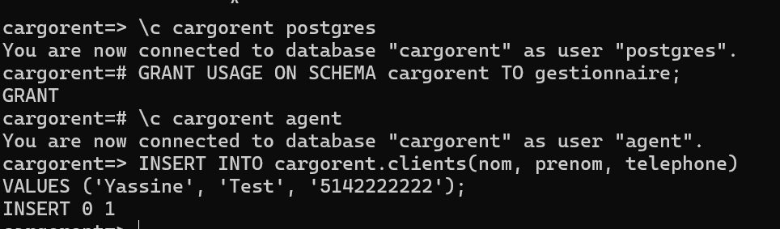

---

## 📊 Récapitulatif des Permissions

| Utilisateur / Rôle | SELECT | INSERT | UPDATE | DELETE | Schéma | Séquence |
|---|:---:|:---:|:---:|:---:|:---:|:---:|
| `client_user` | ✅ → ❌ | ❌ | ❌ | ❌ | ✅ → ❌ | ❌ |
| `admin_user` | ✅ | ✅ | ✅ | ❌ | ✅ | ✅ |
| `gestionnaire` (rôle) | ✅ | ✅ | ✅ | ❌ | ✅ | ✅ |
| `agent_user` | ✅ | ✅ | ✅ | ❌ | ✅ | ✅ |

> ✅ → ❌ signifie que la permission a été accordée puis révoquée au cours du laboratoire.

---

## 💡 Concepts Clés Appris

| Concept | Commande | Description |
|---|---|---|
| Accorder des droits | `GRANT` | Attribue des permissions à un utilisateur ou un rôle |
| Révoquer des droits | `REVOKE` | Retire des permissions précédemment accordées |
| Créer un rôle | `CREATE ROLE` | Regroupe des permissions réutilisables |
| Attribuer un rôle | `GRANT role TO user` | L'utilisateur hérite des droits du rôle |
| Permission séquence | `GRANT USAGE ON SEQUENCE` | Nécessaire pour les colonnes `SERIAL` lors d'un `INSERT` |
| Permission schéma | `GRANT USAGE ON SCHEMA` | Permet d'accéder aux objets dans un schéma |

---

## 🏁 Conclusion

Ce laboratoire a permis d'explorer en profondeur les mécanismes de **contrôle d'accès de PostgreSQL** dans un environnement Docker réaliste. La gestion des utilisateurs, des rôles et des permissions via les commandes DCL constitue une compétence fondamentale pour tout administrateur ou développeur de bases de données.

Les points clés retenus :
- Le principe du **moindre privilège** est essentiel en sécurité des données
- Les **séquences** requièrent des permissions distinctes des tables
- Les **rôles** simplifient considérablement l'administration des accès à grande échelle
- `GRANT` et `REVOKE` permettent un contrôle fin et dynamique des droits

---

<div align="center">

*Projet réalisé dans le cadre du cours **INF1099** — UQAM*  
**Taki Eddine Choufa** | 300150524

</div>
