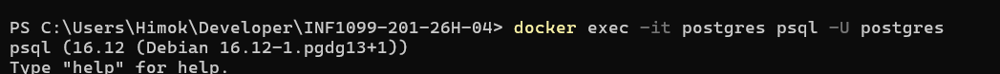
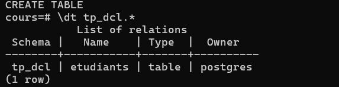
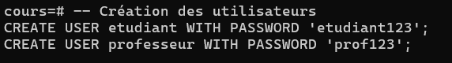
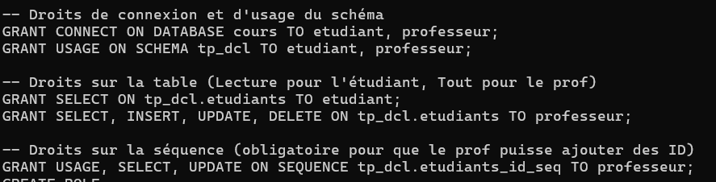
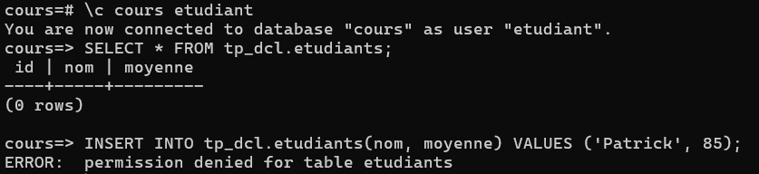
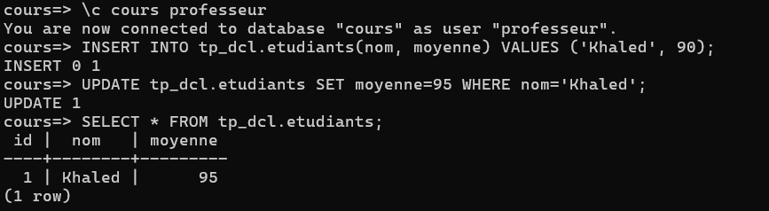
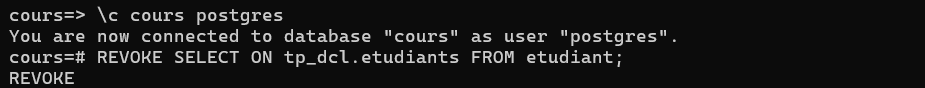
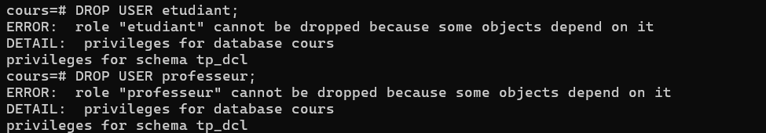

# 🔹 DCL = **Data Control Language**

# 300151825

## **Prérequis**

* PostgreSQL installé
```lua
docker container exec --interactive --tty postgres bash
```
* Accès à `psql` ou PgAdmin
* Une base de test : `cours`

---

## **1️⃣ Préparation**

Se connecter en tant que superutilisateur :

```bash
psql -U postgres
```

Créer la base de test :

```sql
CREATE DATABASE cours;
\c cours
```

Créer un schéma :

```sql
CREATE SCHEMA tp_dcl;
```

Créer une table pour l’exercice :

```sql
CREATE TABLE tp_dcl.etudiants (
    id SERIAL PRIMARY KEY,
    nom TEXT,
    moyenne NUMERIC
);
```

### 🎯 Rappel fondamental

PostgreSQL fonctionne ainsi :

```
Cluster
 ├── Base 1 (postgres)
 ├── Base 2 (cours)
 │     └── Schéma tp_dcl
 │           └── Table etudiants
 └── Base 3 (appdb)
```

Un schéma appartient à une base.
Une table appartient à un schéma.
Les droits sont liés à la base courante.

---

## **2️⃣ Créer des utilisateurs**

```sql
-- Étudiant simple (lecture)
CREATE USER etudiant WITH PASSWORD 'etudiant123';

-- Professeur (lecture/écriture)
CREATE USER professeur WITH PASSWORD 'prof123';
```


---

## **3️⃣ Donner des droits (GRANT)**

### 🔹 Connexion à la base

```sql
GRANT CONNECT ON DATABASE cours TO etudiant, professeur;
```

### 🔹 Accès au schéma

```sql
GRANT USAGE ON SCHEMA tp_dcl TO etudiant, professeur;
```

### 🔹 Droits sur la table

```sql
-- Étudiant : lecture seule
GRANT SELECT ON tp_dcl.etudiants TO etudiant;

-- Professeur : lecture + écriture
GRANT SELECT, INSERT, UPDATE, DELETE ON tp_dcl.etudiants TO professeur;

-- Donner les droits sur la séquence
GRANT USAGE, SELECT, UPDATE ON SEQUENCE tp_dcl.etudiants_id_seq TO professeur;
```

Se déconnecter:

```psql
--quit
\q 
```

---

## **4️⃣ Vérifier les droits**

Se connecter en tant qu’étudiant :

```bash
psql -U etudiant -d cours
```

Tester :

```sql
SELECT * FROM tp_dcl.etudiants;  -- OK
INSERT INTO tp_dcl.etudiants(nom, moyenne) VALUES ('Patrick', 85); -- ERREUR
```


Se connecter en tant que professeur :

```sql
psql -U professeur -d cours
```

Tester :

```sql
INSERT INTO tp_dcl.etudiants(nom, moyenne) VALUES ('Khaled', 90); -- OK
UPDATE tp_dcl.etudiants SET moyenne=95 WHERE nom='Khaled';       -- OK
```


---

## **5️⃣ Retirer des droits (REVOKE)**

```sql
-- Retirer le droit lecture à l’étudiant
REVOKE SELECT ON tp_dcl.etudiants FROM etudiant;
```

Vérifier la modification :

```sql
\c - etudiant
SELECT * FROM tp_dcl.etudiants;  -- ERREUR maintenant
```


---

## **6️⃣ Supprimer un utilisateur (DROP USER)**

```sql
DROP USER etudiant;
DROP USER professeur;
```


⚠️ PostgreSQL ne permet pas de supprimer un utilisateur si celui-ci possède encore des objets (tables, schémas). Ici, tout reste dans le schéma `tp_dcl`.

---
