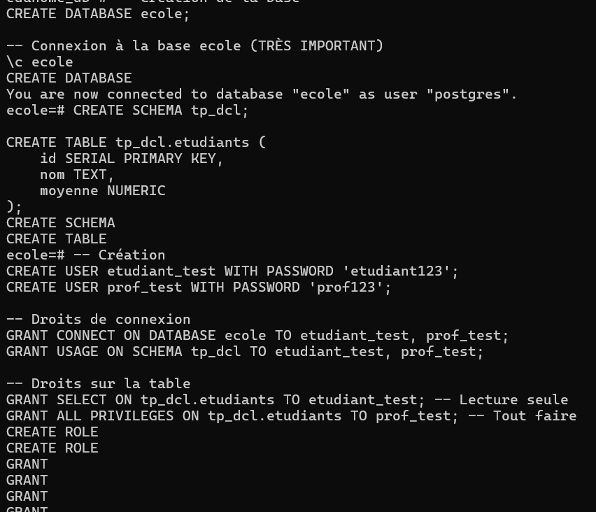
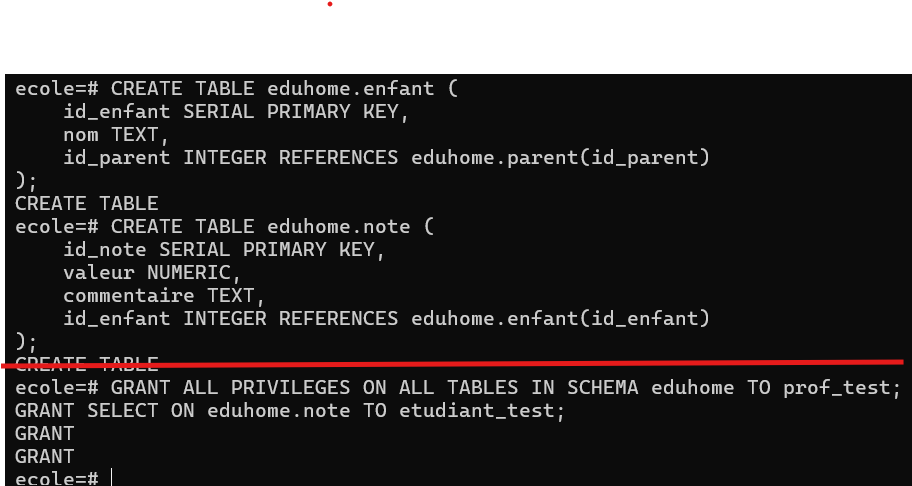

# 🔐 TP4 : Contrôle d'Accès (DCL) - Projet EduHome
**Étudiant :** Ramatoulaye Diallo 
**ID :** 300153476  
**Cours :** INF1099 - Administration de bases de données  
**Session :** Hiver 2026

---

## 📝 Présentation du Laboratoire
Ce travail pratique porte sur le **DCL (Data Control Language)**. L'objectif est d'apprendre à gérer la sécurité d'une base de données PostgreSQL en créant des utilisateurs et en leur attribuant des permissions spécifiques (Privilèges) sur le projet **EduHome**.

## 🏗️ Structure de la Base de Données
Toutes les opérations ont été effectuées dans la base de données `ecole` sous le schéma `eduhome`.

### Tables créées (Modèle 3FN) :
* **eduhome.parent** : Stocke les informations des tuteurs.
* **eduhome.enfant** : Stocke les informations des élèves.
* **eduhome.note** : Gère les évaluations et commentaires.

---

## 🚀 Étapes de Réalisation (DCL)

### 1. Création des Utilisateurs
Nous avons créé deux rôles distincts pour simuler une gestion scolaire réelle :
```sql
CREATE USER prof_test WITH PASSWORD 'prof123';
CREATE USER etudiant_test WITH PASSWORD 'etudiant123';
```
## 📊 Preuves de Fonctionnement

### ✅ TP: DCL REUSSI
<p align="center">
  
  <br><em>DCL réussie pratique</em>
</p>

### Projet eduhome
<p align="center">
  
  <br><em>DCL réussie pratique</em>
</p>
