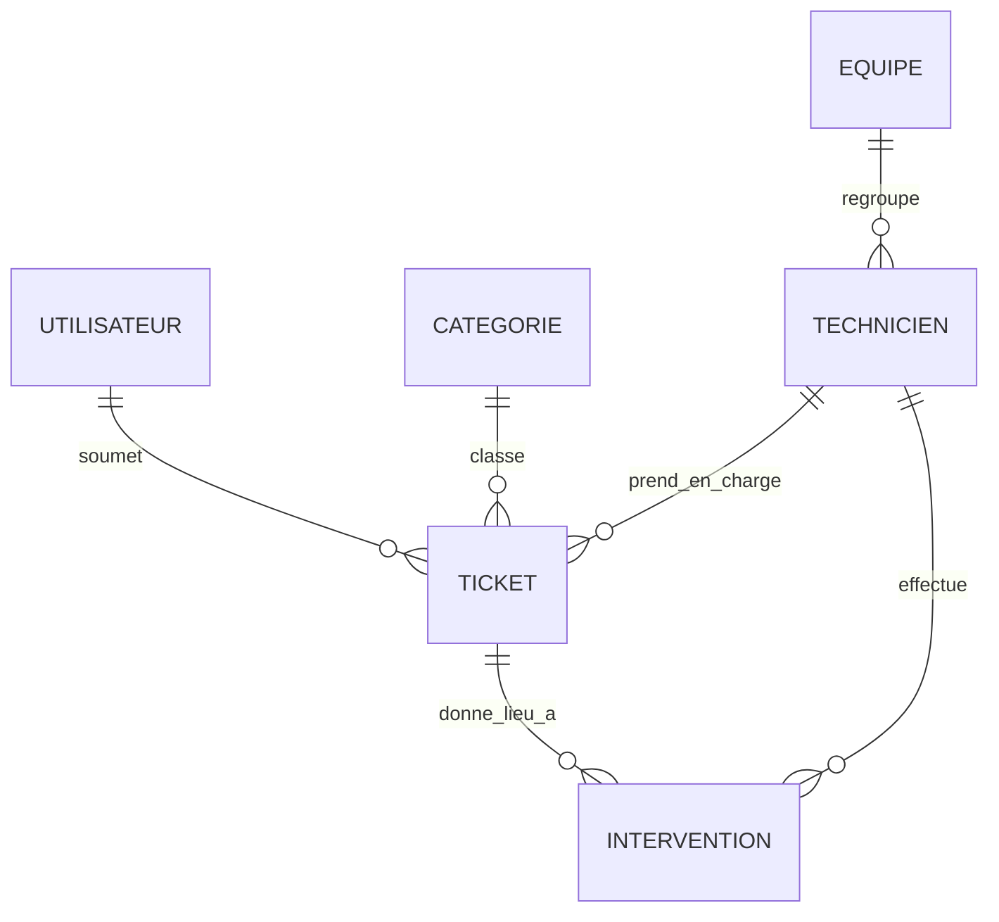

# 📝 Projet SQL – Système de gestion de tickets IT (Helpdesk)

**Nom : Amadou Sow**

---

## 🎯 Objectif

Concevoir une base de données complète pour un système de gestion de support IT permettant :

* La gestion des utilisateurs
* La création de tickets
* L’affectation des techniciens
* Le suivi des interventions
* La gestion des catégories

---

## 🧠 Démarche de modélisation

### 1️⃣ Analyse des besoins

Le système doit permettre :

* Un utilisateur peut créer plusieurs tickets
* Un ticket appartient à une catégorie
* Un technicien peut gérer plusieurs tickets
* Un ticket peut générer plusieurs interventions

---

### 2️⃣ Modélisation conceptuelle (ER)

---

### 3️⃣ Modélisation logique

Transformation en tables relationnelles avec :

* Clés primaires
* Clés étrangères
* Normalisation (jusqu’à 3NF)

---

### 4️⃣ Choix technologique

👉 **PostgreSQL** choisi pour :

* Gestion des relations complexes
* Support ACID
* Performance et extensibilité

---

### 5️⃣ Justification du diagramme

Le diagramme ER a été choisi car :

* Il représente clairement les entités
* Il facilite la compréhension des relations
* Il est adapté à la phase de conception

---

## 📊 Normalisation

La base respecte :

* 1NF → données atomiques
* 2NF → dépendances fonctionnelles
* 3NF → suppression des redondances

---

## ⚙️ Fichiers du projet

* `DDL.sql` → création des tables
* `DML.sql` → insertion des données
* `DQL.sql` → requêtes SELECT
* `DCL.sql` → gestion des permissions

---

## 🚀 Optimisation

* Index sur clés étrangères
* Requêtes optimisées
* Structure normalisée

---

## 🧠 Conclusion

Ce projet démontre :

* Une conception structurée
* Une base optimisée
* Une bonne gestion des accès

---

**✔️ Projet réalisé avec succès**
