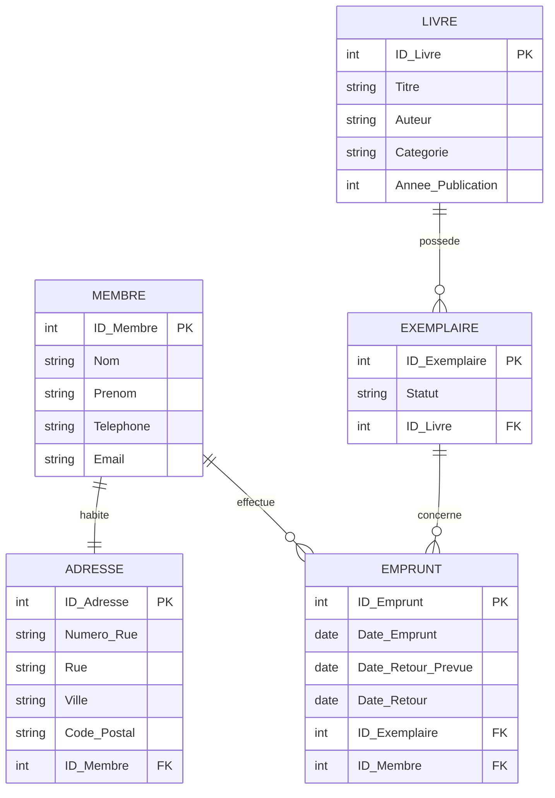

<div align="center">

# 🗃️ TP Modélisation SQL
## Gestion de Bibliothèque


</div>

---

## 📚 Table des matières

- [🎯 Aperçu du projet](#-aperçu-du-projet)
- [📁 Structure du projet](#-structure-du-projet)
- [🔄 Normalisation](#-normalisation)
- [📊 Diagramme ER](#-diagramme-er)
- [🚀 Démarrage rapide](#-démarrage-rapide)
- [🏗️ DDL — Définition des structures](#️-ddl--définition-des-structures)
- [📝 DML — Manipulation des données](#-dml--manipulation-des-données)
- [🔍 DQL — Interrogation des données](#-dql--interrogation-des-données)
- [🔐 DCL — Contrôle des accès](#-dcl--contrôle-des-accès)

---

## 🎯 Aperçu du projet

Le domaine choisi est la **gestion d'une bibliothèque**. Ce projet permet de modéliser le cycle complet : inscription des membres, enregistrement des livres, gestion des exemplaires, et suivi des emprunts et retours.

| Catégorie | Détails |
|-----------|---------|
| 🗄️ SGBD | PostgreSQL 16 |
| 🐳 Environnement | Docker |
| 📐 Schéma | `bibliotheque` |
| 🗂️ Tables | 5 tables normalisées |
| 👤 Utilisateurs | `membre_user`, `bibliothecaire_user` |

---

## 📁 Structure du projet

```
TP_SQL/
├── 📄 README.md
├── 📄 DDL.sql          ← Création des tables
├── 📄 DML.sql          ← Insertion, modification, suppression
├── 📄 DQL.sql          ← Requêtes de consultation
└── 📄 DCL.sql          ← Gestion des droits
```

> ⚠️ **Ordre d'exécution obligatoire :** `DDL.sql` → `DML.sql` → `DQL.sql` → `DCL.sql`

---

## 🔄 Normalisation

### 1️⃣ 1FN — Première Forme Normale

Toutes les données sont regroupées dans une structure plate. Chaque attribut est atomique, sans groupes répétitifs.

**Attributs :**
> Membre, Nom_Membre, Email_Membre, Livre, Titre_Livre, Auteur, Catégorie, Année_Publication, Exemplaire, Statut_Exemplaire, Emprunt, Date_Emprunt, Date_Retour_Prévue, Date_Retour

---

### 2️⃣ 2FN — Deuxième Forme Normale

Les dépendances partielles sont éliminées. Les entités principales sont séparées.

| Entité A | Cardinalité | Relation | Cardinalité | Entité B |
|----------|-------------|----------|-------------|----------|
| Membre | (1,1) | HABITE | (0,N) | Adresse |
| Livre | (1,N) | POSSÈDE | (1,1) | Exemplaire |
| Membre | (1,N) | EFFECTUE | (1,1) | Emprunt |
| Exemplaire | (0,N) | CONCERNE | (1,1) | Emprunt |

---

### 3️⃣ 3FN — Troisième Forme Normale

Toutes les dépendances transitives sont éliminées. Introduction des **Clés Primaires (ID)** et des **Clés Étrangères (#)**.

| Table | Attributs |
|-------|-----------|
| **Membre** | ID_Membre 🔑, Nom, Prénom, Téléphone, Email |
| **Adresse** | ID_Adresse 🔑, Numéro_Rue, Rue, Ville, Code_Postal, #ID_Membre |
| **Livre** | ID_Livre 🔑, Titre, Auteur, Catégorie, Année_Publication |
| **Exemplaire** | ID_Exemplaire 🔑, Statut, #ID_Livre |
| **Emprunt** | ID_Emprunt 🔑, Date_Emprunt, Date_Retour_Prévue, Date_Retour, #ID_Exemplaire, #ID_Membre |

> 💡 **Légende :** 🔑 Clé Primaire &nbsp;|&nbsp; `#` Clé Étrangère

---

## 📊 Diagramme ER



---

## 🚀 Démarrage rapide

```powershell
# 1. Entrer dans le container Docker
docker container exec --interactive --tty postgres bash

# 2. Se connecter en superutilisateur
psql -U postgres

# 3. Créer la base de données
CREATE DATABASE gestion_bibliotheque;
\c gestion_bibliotheque

# 4. Exécuter les fichiers dans l'ordre
\i DDL.sql
\i DML.sql
\i DQL.sql
\i DCL.sql
```

---

## 🏗️ DDL — Définition des structures

### Étape 1 : Connexion et création de la base

```powershell
docker container exec --interactive --tty postgres bash
psql -U postgres
```

```sql
CREATE DATABASE gestion_bibliotheque;
\c gestion_bibliotheque
CREATE SCHEMA bibliotheque;
```

---

### Étape 2 : Création des tables

```sql
CREATE TABLE bibliotheque.Membre (
    ID_Membre  SERIAL PRIMARY KEY,
    Nom        TEXT NOT NULL,
    Prenom     TEXT NOT NULL,
    Telephone  TEXT,
    Email      TEXT
);

CREATE TABLE bibliotheque.Adresse (
    ID_Adresse  SERIAL PRIMARY KEY,
    Numero_Rue  TEXT,
    Rue         TEXT NOT NULL,
    Ville       TEXT NOT NULL,
    Code_Postal TEXT NOT NULL,
    ID_Membre   INT NOT NULL REFERENCES bibliotheque.Membre(ID_Membre)
);

CREATE TABLE bibliotheque.Livre (
    ID_Livre          SERIAL PRIMARY KEY,
    Titre             TEXT NOT NULL,
    Auteur            TEXT NOT NULL,
    Categorie         TEXT,
    Annee_Publication INT
);

CREATE TABLE bibliotheque.Exemplaire (
    ID_Exemplaire SERIAL PRIMARY KEY,
    Statut        TEXT NOT NULL,
    ID_Livre      INT NOT NULL REFERENCES bibliotheque.Livre(ID_Livre)
);

CREATE TABLE bibliotheque.Emprunt (
    ID_Emprunt         SERIAL PRIMARY KEY,
    Date_Emprunt       DATE NOT NULL,
    Date_Retour_Prevue DATE NOT NULL,
    Date_Retour        DATE,
    ID_Exemplaire      INT NOT NULL REFERENCES bibliotheque.Exemplaire(ID_Exemplaire),
    ID_Membre          INT NOT NULL REFERENCES bibliotheque.Membre(ID_Membre)
);
```

---

### Étape 3 : Vérifier les tables créées

```sql
\dt bibliotheque.*
```

<details>
<summary>📋 Output attendu</summary>

```
               List of relations
   Schema      |     Name     | Type  |  Owner
---------------+--------------+-------+----------
 bibliotheque  | adresse      | table | postgres
 bibliotheque  | emprunt      | table | postgres
 bibliotheque  | exemplaire   | table | postgres
 bibliotheque  | livre        | table | postgres
 bibliotheque  | membre       | table | postgres
```
</details>

---

## 📝 DML — Manipulation des données

### Étape 4 : Insérer des données (INSERT)

```sql
-- Membres
INSERT INTO bibliotheque.Membre (Nom, Prenom, Telephone, Email) VALUES
    ('Adjaoud', 'Hocine', '514-000-1111', 'hocine.adjaoud@email.com'),
    ('Leblanc', 'Sophie', '438-222-3333', 'sophie.leblanc@email.com');

-- Adresses
INSERT INTO bibliotheque.Adresse (Numero_Rue, Rue, Ville, Code_Postal, ID_Membre) VALUES
    ('10', 'Rue de la Paix', 'Montréal', 'H2X 1Y4', 1),
    ('3', 'Avenue du Parc', 'Laval', 'H7N 2K1', 2);

-- Livres
INSERT INTO bibliotheque.Livre (Titre, Auteur, Categorie, Annee_Publication) VALUES
    ('Le Petit Prince', 'Antoine de Saint-Exupéry', 'Roman', 1943),
    ('1984', 'George Orwell', 'Science-fiction', 1949),
    ('L''Étranger', 'Albert Camus', 'Roman', 1942);

-- Exemplaires
INSERT INTO bibliotheque.Exemplaire (Statut, ID_Livre) VALUES
    ('Disponible', 1),
    ('Emprunté', 2),
    ('Disponible', 3);

-- Emprunts
INSERT INTO bibliotheque.Emprunt (Date_Emprunt, Date_Retour_Prevue, Date_Retour, ID_Exemplaire, ID_Membre) VALUES
    ('2024-03-01', '2024-03-15', NULL, 2, 1),
    ('2024-02-10', '2024-02-24', '2024-02-22', 1, 2);
```

---

### Étape 5 : Modifier des données (UPDATE)

```sql
UPDATE bibliotheque.Emprunt
SET Date_Retour = '2024-03-14'
WHERE ID_Emprunt = 1;

UPDATE bibliotheque.Exemplaire
SET Statut = 'Disponible'
WHERE ID_Exemplaire = 2;
```

---

### Étape 6 : Supprimer des données (DELETE)

```sql
DELETE FROM bibliotheque.Emprunt WHERE ID_Emprunt = 2;

-- Vérifier
SELECT * FROM bibliotheque.Emprunt;
```

<details>
<summary>📋 Output attendu</summary>

```
DELETE 1
 id_emprunt | date_emprunt | date_retour_prevue | date_retour | id_exemplaire | id_membre
------------+--------------+--------------------+-------------+---------------+-----------
          1 | 2024-03-01   | 2024-03-15         | 2024-03-14  |             2 |         1
```
</details>

---

## 🔍 DQL — Interrogation des données

### Étape 7 : SELECT simples

```sql
-- Tous les membres
SELECT * FROM bibliotheque.Membre;

-- Tous les livres disponibles
SELECT l.Titre, l.Auteur, l.Categorie
FROM bibliotheque.Livre l
JOIN bibliotheque.Exemplaire e ON l.ID_Livre = e.ID_Livre
WHERE e.Statut = 'Disponible';
```

---

### Étape 8 : SELECT avec JOIN

```sql
-- Liste complète des emprunts avec membre et livre
SELECT
    e.ID_Emprunt,
    m.Nom            AS Membre,
    l.Titre          AS Livre,
    e.Date_Emprunt,
    e.Date_Retour_Prevue,
    e.Date_Retour
FROM bibliotheque.Emprunt e
JOIN bibliotheque.Membre     m ON e.ID_Membre     = m.ID_Membre
JOIN bibliotheque.Exemplaire x ON e.ID_Exemplaire = x.ID_Exemplaire
JOIN bibliotheque.Livre      l ON x.ID_Livre      = l.ID_Livre;
```

<details>
<summary>📋 Output attendu</summary>

```
 id_emprunt |  membre  |      livre      | date_emprunt | date_retour_prevue | date_retour
------------+----------+-----------------+--------------+--------------------+-------------
          1 | Adjaoud  | 1984            | 2024-03-01   | 2024-03-15         | 2024-03-14
```
</details>

---

### Étape 9 : SELECT avec GROUP BY et agrégats

```sql
-- Nombre d'emprunts par membre
SELECT
    m.Nom,
    m.Prenom,
    COUNT(e.ID_Emprunt) AS Nb_Emprunts
FROM bibliotheque.Membre m
LEFT JOIN bibliotheque.Emprunt e ON m.ID_Membre = e.ID_Membre
GROUP BY m.ID_Membre, m.Nom, m.Prenom
ORDER BY Nb_Emprunts DESC;

-- Nombre d'exemplaires par livre
SELECT
    l.Titre,
    COUNT(x.ID_Exemplaire)                                    AS Total_Exemplaires,
    COUNT(CASE WHEN x.Statut = 'Disponible' THEN 1 END)       AS Disponibles,
    COUNT(CASE WHEN x.Statut = 'Emprunté'   THEN 1 END)       AS Empruntés
FROM bibliotheque.Livre l
LEFT JOIN bibliotheque.Exemplaire x ON l.ID_Livre = x.ID_Livre
GROUP BY l.ID_Livre, l.Titre
ORDER BY l.Titre;
```

<details>
<summary>📋 Output attendu</summary>

```
-- Emprunts par membre
   nom    | prenom | nb_emprunts
----------+--------+-------------
 Adjaoud  | Hocine |           1
 Leblanc  | Sophie |           0

-- Exemplaires par livre
      titre       | total_exemplaires | disponibles | empruntés
------------------+-------------------+-------------+-----------
 1984             |                 1 |           1 |         0
 L'Étranger       |                 1 |           1 |         0
 Le Petit Prince  |                 1 |           1 |         0
```
</details>

---

## 🔐 DCL — Contrôle des accès

### Matrice des permissions

| Permission | `membre_user` | `bibliothecaire_user` |
|------------|:-------------:|:---------------------:|
| SELECT | ✅ | ✅ |
| INSERT | ❌ | ✅ |
| UPDATE | ❌ | ✅ |
| DELETE | ❌ | ✅ |
| SEQUENCES | ❌ | ✅ |

---

### Étape 10 : Créer les utilisateurs

```sql
CREATE USER membre_user WITH PASSWORD 'membre123';
CREATE USER bibliothecaire_user WITH PASSWORD 'biblio123';
```

---

### Étape 11 : Donner les droits (GRANT)

```sql
GRANT CONNECT ON DATABASE gestion_bibliotheque TO membre_user, bibliothecaire_user;
GRANT USAGE ON SCHEMA bibliotheque TO membre_user, bibliothecaire_user;

-- Membre : lecture seule
GRANT SELECT ON ALL TABLES IN SCHEMA bibliotheque TO membre_user;

-- Bibliothécaire : accès complet
GRANT SELECT, INSERT, UPDATE, DELETE ON ALL TABLES IN SCHEMA bibliotheque TO bibliothecaire_user;
GRANT USAGE, SELECT, UPDATE ON ALL SEQUENCES IN SCHEMA bibliotheque TO bibliothecaire_user;
```

---

### Étape 12 : Tester les droits du membre

```powershell
\q
psql -U membre_user -d gestion_bibliotheque
```

```sql
SELECT * FROM bibliotheque.Emprunt;                  -- ✅ OK

INSERT INTO bibliotheque.Livre (Titre, Auteur)
VALUES ('Test', 'Test');                              -- ❌ Doit échouer
```

<details>
<summary>📋 Output attendu</summary>

```
ERROR:  permission denied for table livre
```
</details>

---

### Étape 13 : Tester les droits du bibliothécaire

```powershell
\q
psql -U bibliothecaire_user -d gestion_bibliotheque
```

```sql
INSERT INTO bibliotheque.Livre (Titre, Auteur, Categorie, Annee_Publication)
VALUES ('Dune', 'Frank Herbert', 'Science-fiction', 1965);   -- ✅ OK

UPDATE bibliotheque.Exemplaire SET Statut = 'En réparation'
WHERE ID_Exemplaire = 3;                                     -- ✅ OK

SELECT * FROM bibliotheque.Livre;                            -- ✅ OK
```

---

### Étape 14 : Retirer des droits (REVOKE)

```powershell
\q
psql -U postgres -d gestion_bibliotheque
```

```sql
REVOKE SELECT ON ALL TABLES IN SCHEMA bibliotheque FROM membre_user;
```

Vérifier :

```sql
\c - membre_user
SELECT * FROM bibliotheque.Emprunt;  -- ❌ Doit échouer
```

<details>
<summary>📋 Output attendu</summary>

```
ERROR:  permission denied for table emprunt
```
</details>

---

### Étape 15 : Supprimer les utilisateurs (DROP USER)

```sql
\c - postgres
DROP USER membre_user;
DROP USER bibliothecaire_user;
```

> ⚠️ PostgreSQL **ne permet pas** de supprimer un utilisateur s'il possède encore des privilèges actifs. Il faut d'abord révoquer tous ses droits avant d'exécuter `DROP USER`.

<details>
<summary>📋 Output attendu</summary>

```
ERROR:  role "membre_user" cannot be dropped because some objects depend on it
DETAIL:  privileges for database gestion_bibliotheque
         privileges for schema bibliotheque
```
</details>

---

## 📚 Références

- [Documentation PostgreSQL 16](https://www.postgresql.org/docs/16/)
- [Image Docker postgres:16](https://hub.docker.com/_/postgres)
- [Mermaid – Diagrammes ER](https://mermaid.js.org/syntax/entityRelationshipDiagram.html)
