<div align="center">

# 🛠️ TP Modélisation SQL
## Boutique de Réparation de Smartphones


</div>

---

## 📚 Table des matières

- [🎯 Aperçu du projet](#-aperçu-du-projet)
- [📁 Structure du projet](#-structure-du-projet)
- [🔄 Normalisation](#-normalisation)
- [📊 Diagramme ER](#-diagramme-er)
- [🚀 Démarrage rapide](#-démarrage-rapide)
- [🏗️ DDL — Définition des structures](#️-ddl--définition-des-structures)
- [📝 DML — Manipulation des données](#-dml--manipulation-des-données)
- [🔐 DCL — Contrôle des accès](#-dcl--contrôle-des-accès)

---

## 🎯 Aperçu du projet

Le domaine choisi est la **gestion d'une boutique de réparation de smartphones**. Ce sujet permet de modéliser le cycle complet depuis le dépôt d'un appareil par un client jusqu'au paiement final et à la garantie, en passant par l'affectation d'un technicien.

| Catégorie | Détails |
|-----------|---------|
| 🗄️ SGBD | PostgreSQL 16 |
| 🐳 Environnement | Docker |
| 📐 Schéma | `boutique` |
| 🗂️ Tables | 11 tables normalisées |
| 👤 Utilisateurs | `technicien_user`, `gestionnaire_user` |

---

## 📁 Structure du projet

```
TP_SQL/
├── 📄 README.md
├── 📄 ddl.sql          ← Création des tables
├── 📄 dml.sql          ← Insertion, lecture, modification, suppression
├── 📄 dcl.sql          ← Gestion des droits
└── 📁 images/
    ├── 1.png 
    ├── 2.png 
    ├── ...
    ├── 12.png  
    └── 13.png  
```

> ⚠️ **Ordre d'exécution obligatoire :** `ddl.sql` → `dml.sql` → `dcl.sql`

---

## 🔄 Normalisation

### 1️⃣ 1FN — Première Forme Normale

Dans cette phase, toutes les données sont regroupées dans une structure plate ("Flat Table"). Chaque attribut est atomique. **Il n'y a pas encore d'ID techniques.**

**Attributs :**
> Client, Adresse_Client, Appareil, Marque, Modèle, IMEI, Panne, Pièce_Rechange, Technicien, Réparation, Ligne_Réparation, Paiement, Garantie

---

### 2️⃣ 2FN — Deuxième Forme Normale

Définition des relations et des cardinalités. On sépare les entités pour éviter les redondances partielles.

| Entité A | Cardinalité | Relation | Cardinalité | Entité B |
|----------|-------------|----------|-------------|----------|
| Client | (0,N) | POSSÈDE | (1,1) | Appareil |
| Client | (1,N) | HABITE | (1,1) | Adresse_Client |
| Appareil | (0,N) | FAIT_L'OBJET | (1,1) | Réparation |
| Marque | (1,N) | FABRIQUE | (1,1) | Modèle |
| Modèle | (0,N) | DÉFINIT | (1,1) | Appareil |
| Réparation | (1,N) | DÉTAILLE | (1,1) | Ligne_Réparation |
| Pièce_Rechange | (0,N) | EST_UTILISÉE_DANS | (1,1) | Ligne_Réparation |
| Technicien | (1,N) | EFFECTUE | (1,1) | Réparation |
| Réparation | (1,1) | GÉNÈRE | (1,1) | Paiement |
| Réparation | (0,1) | ACTIVÉE | (1,1) | Garantie |

---

### 3️⃣ 3FN — Troisième Forme Normale

Structure finale. Les dépendances transitives sont éliminées. Introduction des **Clés Primaires (ID)** et des **Clés Étrangères (#)**.

| Table | Attributs |
|-------|-----------|
| **Client** | ID_Client 🔑, Nom, Prénom, Téléphone, Email |
| **Adresse** | ID_Adresse 🔑, Numéro_rue, Rue, Ville, Code_Postal, #ID_Client |
| **Marque** | ID_Marque 🔑, Nom_Marque |
| **Modèle** | ID_Modele 🔑, Nom_Modèle, Annee_Sortie, #ID_Marque |
| **Appareil** | Num_IMEI 🔑, Couleur, État_Général, #ID_Modele, #ID_Client |
| **Réparation** | ID_Reparation 🔑, Date_Dépôt, Statut, #Num_IMEI, #ID_Technicien |
| **Ligne_Réparation** | ID_Ligne 🔑, Description_Tâche, Prix_MO, #ID_Reparation, #ID_Piece |
| **Pièce_Rechange** | ID_Piece 🔑, Nom_Pièce, Prix_Unitaire |
| **Technicien** | ID_Technicien 🔑, Nom, Prénom, Spécialité |
| **Paiement** | ID_Paiement 🔑, Date_Paiement, Montant_Total, Mode_Paiement, #ID_Reparation |
| **Garantie** | ID_Garantie 🔑, Date_Fin, Conditions, #ID_Reparation |

> 💡 **Légende :** 🔑 Clé Primaire &nbsp;|&nbsp; `#` Clé Étrangère

---

## 📊 Diagramme ER

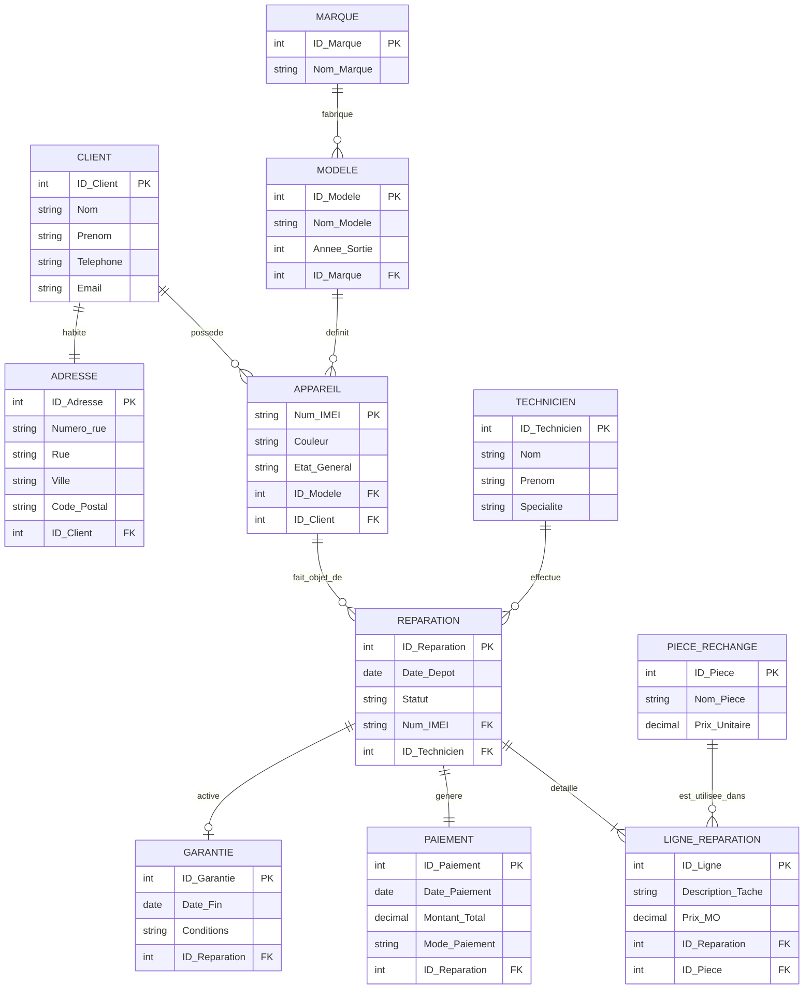

---

## 🚀 Démarrage rapide

```bash
# 1. Entrer dans le container Docker
docker container exec --interactive --tty postgres bash

# 2. Se connecter en superutilisateur
psql -U postgres

# 3. Créer la base de données
CREATE DATABASE reparation_smartphones;
\c reparation_smartphones

# 4. Exécuter les fichiers dans l'ordre
\i ddl.sql
\i dml.sql
\i dcl.sql
```

---

## 🏗️ DDL — Définition des structures

### Étape 1 : Connexion et création de la base

```bash
docker container exec --interactive --tty postgres bash
psql -U postgres
```

```sql
CREATE DATABASE reparation_smartphones;
\c reparation_smartphones
CREATE SCHEMA boutique;
```

<details>
<summary>🖼️ Capture d'écran</summary>


</details>

---

### Étape 2 : Création des tables

```sql
CREATE TABLE boutique.Marque (
    ID_Marque   SERIAL PRIMARY KEY,
    Nom_Marque  TEXT NOT NULL
);

CREATE TABLE boutique.Modele (
    ID_Modele    SERIAL PRIMARY KEY,
    Nom_Modele   TEXT NOT NULL,
    Annee_Sortie INT,
    ID_Marque    INT NOT NULL REFERENCES boutique.Marque(ID_Marque)
);

CREATE TABLE boutique.Client (
    ID_Client  SERIAL PRIMARY KEY,
    Nom        TEXT NOT NULL,
    Prenom     TEXT NOT NULL,
    Telephone  TEXT,
    Email      TEXT
);

CREATE TABLE boutique.Adresse (
    ID_Adresse  SERIAL PRIMARY KEY,
    Numero_rue  TEXT,
    Rue         TEXT NOT NULL,
    Ville       TEXT NOT NULL,
    Code_Postal TEXT NOT NULL,
    ID_Client   INT NOT NULL REFERENCES boutique.Client(ID_Client)
);

CREATE TABLE boutique.Technicien (
    ID_Technicien SERIAL PRIMARY KEY,
    Nom           TEXT NOT NULL,
    Prenom        TEXT NOT NULL,
    Specialite    TEXT
);

CREATE TABLE boutique.Appareil (
    Num_IMEI     TEXT PRIMARY KEY,
    Couleur      TEXT,
    Etat_General TEXT,
    ID_Modele    INT NOT NULL REFERENCES boutique.Modele(ID_Modele),
    ID_Client    INT NOT NULL REFERENCES boutique.Client(ID_Client)
);

CREATE TABLE boutique.Reparation (
    ID_Reparation SERIAL PRIMARY KEY,
    Date_Depot    DATE NOT NULL,
    Statut        TEXT NOT NULL,
    Num_IMEI      TEXT NOT NULL REFERENCES boutique.Appareil(Num_IMEI),
    ID_Technicien INT  NOT NULL REFERENCES boutique.Technicien(ID_Technicien)
);

CREATE TABLE boutique.Piece_Rechange (
    ID_Piece      SERIAL PRIMARY KEY,
    Nom_Piece     TEXT NOT NULL,
    Prix_Unitaire NUMERIC(10,2) NOT NULL
);

CREATE TABLE boutique.Ligne_Reparation (
    ID_Ligne          SERIAL PRIMARY KEY,
    Description_Tache TEXT,
    Prix_MO           NUMERIC(10,2),
    ID_Reparation     INT NOT NULL REFERENCES boutique.Reparation(ID_Reparation),
    ID_Piece          INT NOT NULL REFERENCES boutique.Piece_Rechange(ID_Piece)
);

CREATE TABLE boutique.Paiement (
    ID_Paiement   SERIAL PRIMARY KEY,
    Date_Paiement DATE NOT NULL,
    Montant_Total NUMERIC(10,2) NOT NULL,
    Mode_Paiement TEXT NOT NULL,
    ID_Reparation INT  NOT NULL REFERENCES boutique.Reparation(ID_Reparation)
);

CREATE TABLE boutique.Garantie (
    ID_Garantie   SERIAL PRIMARY KEY,
    Date_Fin      DATE NOT NULL,
    Conditions    TEXT,
    ID_Reparation INT NOT NULL REFERENCES boutique.Reparation(ID_Reparation)
);
```

<details>
<summary>🖼️ Capture d'écran</summary>

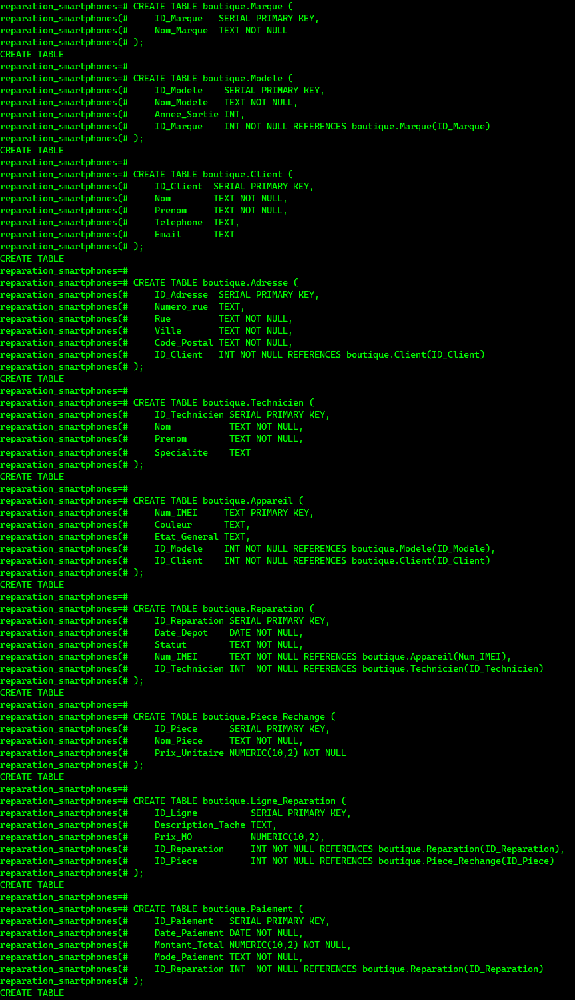

</details>

---

### Étape 3 : Vérifier les tables créées

```sql
\dt boutique.*
```

<details>
<summary>📋 Output attendu</summary>

```
              List of relations
  Schema   |       Name        | Type  |  Owner
-----------+-------------------+-------+----------
 boutique  | adresse           | table | postgres
 boutique  | appareil          | table | postgres
 boutique  | client            | table | postgres
 boutique  | garantie          | table | postgres
 boutique  | ligne_reparation  | table | postgres
 boutique  | marque            | table | postgres
 boutique  | modele            | table | postgres
 boutique  | paiement          | table | postgres
 boutique  | piece_rechange    | table | postgres
 boutique  | reparation        | table | postgres
 boutique  | technicien        | table | postgres
```
</details>

<details>
<summary>🖼️ Capture d'écran</summary>


</details>

---

## 📝 DML — Manipulation des données

### Étape 4 : Insérer des données (INSERT)

```sql
-- Marques
INSERT INTO boutique.Marque (Nom_Marque) VALUES ('Apple'), ('Samsung'), ('Google');

-- Modèles
INSERT INTO boutique.Modele (Nom_Modele, Annee_Sortie, ID_Marque) VALUES
    ('iPhone 14', 2022, 1),
    ('Galaxy S23', 2023, 2),
    ('Pixel 7', 2022, 3);

-- Clients
INSERT INTO boutique.Client (Nom, Prenom, Telephone, Email) VALUES
    ('Tremblay', 'Marie', '514-111-2222', 'marie.tremblay@email.com'),
    ('Gagnon', 'Luc', '438-333-4444', 'luc.gagnon@email.com');

-- Adresses
INSERT INTO boutique.Adresse (Numero_rue, Rue, Ville, Code_Postal, ID_Client) VALUES
    ('12', 'Rue Sainte-Catherine', 'Montréal', 'H3B 1A7', 1),
    ('5', 'Boulevard Laurier', 'Québec', 'G1V 2M2', 2);

-- Techniciens
INSERT INTO boutique.Technicien (Nom, Prenom, Specialite) VALUES
    ('Côté', 'Alex', 'Écran et batterie'),
    ('Roy', 'Sophie', 'Carte mère et logiciel');

-- Appareils
INSERT INTO boutique.Appareil (Num_IMEI, Couleur, Etat_General, ID_Modele, ID_Client) VALUES
    ('351756111111111', 'Noir', 'Écran fissuré', 1, 1),
    ('352999222222222', 'Blanc', 'Ne s''allume plus', 2, 2);

-- Pièces de rechange
INSERT INTO boutique.Piece_Rechange (Nom_Piece, Prix_Unitaire) VALUES
    ('Écran iPhone 14', 149.99),
    ('Batterie Galaxy S23', 59.99);

-- Réparations
INSERT INTO boutique.Reparation (Date_Depot, Statut, Num_IMEI, ID_Technicien) VALUES
    ('2024-03-01', 'En cours', '351756111111111', 1),
    ('2024-03-05', 'Terminée', '352999222222222', 2);

-- Lignes de réparation
INSERT INTO boutique.Ligne_Reparation (Description_Tache, Prix_MO, ID_Reparation, ID_Piece) VALUES
    ('Remplacement écran complet', 50.00, 1, 1),
    ('Remplacement batterie et nettoyage', 40.00, 2, 2);

-- Paiements
INSERT INTO boutique.Paiement (Date_Paiement, Montant_Total, Mode_Paiement, ID_Reparation) VALUES
    ('2024-03-10', 199.99, 'Carte crédit', 1),
    ('2024-03-08', 99.99, 'Comptant', 2);

-- Garanties
INSERT INTO boutique.Garantie (Date_Fin, Conditions, ID_Reparation) VALUES
    ('2024-09-10', 'Garantie 6 mois pièces et main-d''oeuvre', 1),
    ('2024-09-08', 'Garantie 6 mois sur la batterie', 2);
```

<details>
<summary>🖼️ Capture d'écran</summary>

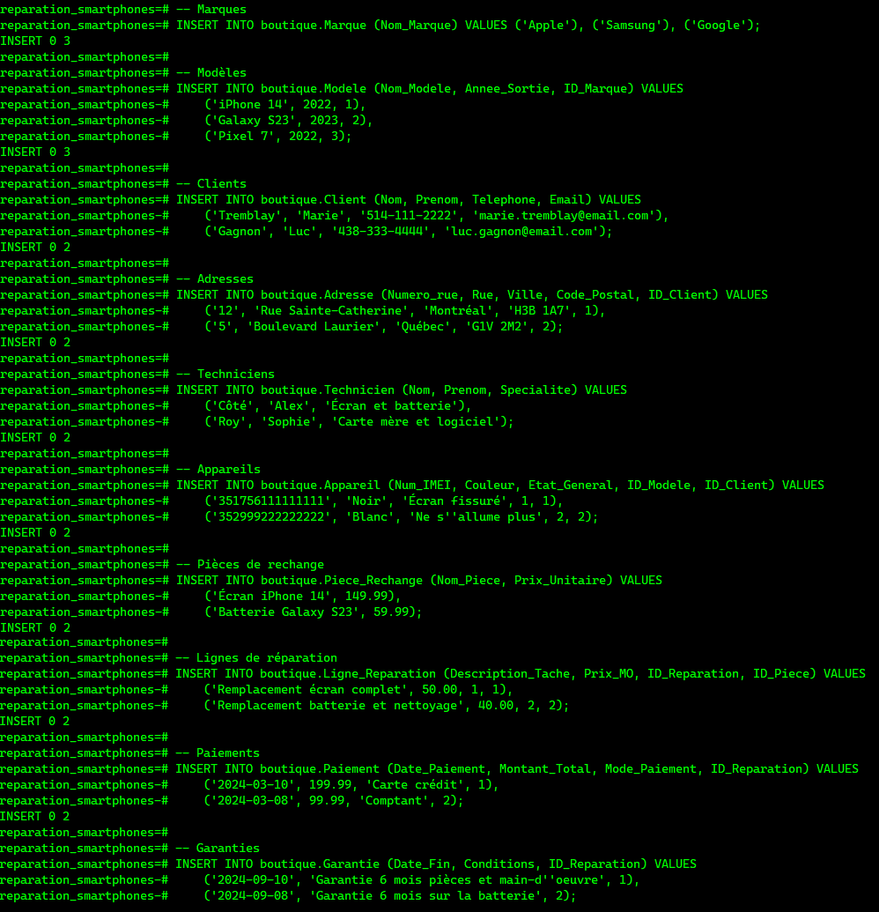

</details>

---

### Étape 5 : Lire les données (SELECT)

```sql
-- Liste des réparations avec client et technicien
SELECT
    r.ID_Reparation,
    c.Nom        AS Client,
    t.Nom        AS Technicien,
    a.Num_IMEI,
    r.Date_Depot,
    r.Statut
FROM boutique.Reparation r
JOIN boutique.Appareil   a ON r.Num_IMEI      = a.Num_IMEI
JOIN boutique.Client     c ON a.ID_Client     = c.ID_Client
JOIN boutique.Technicien t ON r.ID_Technicien = t.ID_Technicien;
```

<details>
<summary>📋 Output attendu</summary>

```
 id_reparation |  client  | technicien |     num_imei    | date_depot |  statut
---------------+----------+------------+-----------------+------------+----------
             1 | Tremblay | Côté       | 351756111111111 | 2024-03-01 | En cours
             2 | Gagnon   | Roy        | 352999222222222 | 2024-03-05 | Terminée
```
</details>

<details>
<summary>🖼️ Capture d'écran</summary>

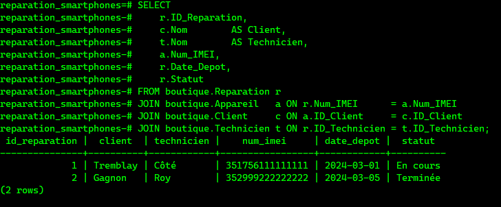

</details>

---

### Étape 6 : Modifier des données (UPDATE)

```sql
UPDATE boutique.Reparation
SET Statut = 'Terminée'
WHERE ID_Reparation = 1;

-- Vérifier
SELECT ID_Reparation, Statut FROM boutique.Reparation;
```

<details>
<summary>📋 Output attendu</summary>

```
UPDATE 1
 id_reparation |  statut
---------------+----------
             1 | Terminée
             2 | Terminée
```
</details>

<details>
<summary>🖼️ Capture d'écran</summary>

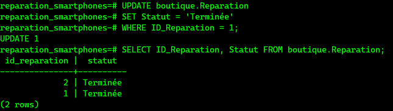

</details>

---

### Étape 7 : Supprimer des données (DELETE)

```sql
DELETE FROM boutique.Garantie WHERE ID_Garantie = 2;

-- Vérifier
SELECT * FROM boutique.Garantie;
```

<details>
<summary>📋 Output attendu</summary>

```
DELETE 1
 id_garantie |  date_fin  |              conditions               | id_reparation
-------------+------------+---------------------------------------+---------------
           1 | 2024-09-10 | Garantie 6 mois pièces et main-d'... |             1
```
</details>

<details>
<summary>🖼️ Capture d'écran</summary>

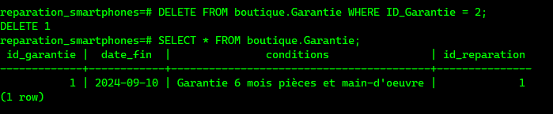

</details>

---

## 🔐 DCL — Contrôle des accès

### Matrice des permissions

| Permission | `technicien_user` | `gestionnaire_user` |
|------------|:-----------------:|:-------------------:|
| SELECT | ✅ | ✅ |
| INSERT | ❌ | ✅ |
| UPDATE | ❌ | ✅ |
| DELETE | ❌ | ✅ |
| SEQUENCES | ❌ | ✅ |

---

### Étape 8 : Créer les utilisateurs


```sql
-- Technicien : lecture seule
CREATE USER technicien_user WITH PASSWORD 'tech123';

-- Gestionnaire : accès complet
CREATE USER gestionnaire_user WITH PASSWORD 'gest123';
```

<details>
<summary>🖼️ Capture d'écran</summary>

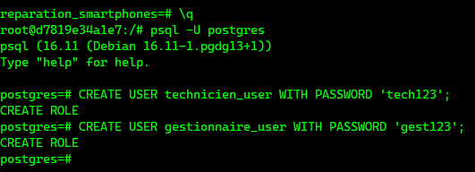

</details>

---

### Étape 9 : Donner les droits (GRANT)

```sql
-- Connexion à la base
GRANT CONNECT ON DATABASE reparation_smartphones TO technicien_user, gestionnaire_user;

-- Accès au schéma
GRANT USAGE ON SCHEMA boutique TO technicien_user, gestionnaire_user;

-- Technicien : lecture seule
GRANT SELECT ON ALL TABLES IN SCHEMA boutique TO technicien_user;

-- Gestionnaire : lecture + écriture complète
GRANT SELECT, INSERT, UPDATE, DELETE ON ALL TABLES IN SCHEMA boutique TO gestionnaire_user;
GRANT USAGE, SELECT, UPDATE ON ALL SEQUENCES IN SCHEMA boutique TO gestionnaire_user;
```

<details>
<summary>🖼️ Capture d'écran</summary>

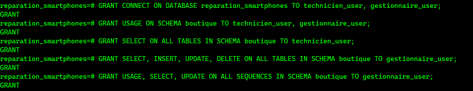

</details>

---

### Étape 10 : Tester les droits du technicien

```bash
\q
psql -U technicien_user -d reparation_smartphones
```

```sql
SELECT * FROM boutique.Reparation;                          -- ✅ OK

INSERT INTO boutique.Marque (Nom_Marque) VALUES ('OnePlus'); -- ❌ Doit échouer
```

<details>
<summary>📋 Output attendu</summary>

```
ERROR:  permission denied for table marque
```
</details>

<details>
<summary>🖼️ Capture d'écran</summary>

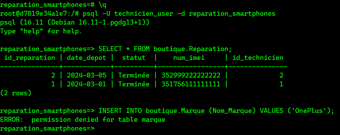

</details>

---

### Étape 11 : Tester les droits du gestionnaire

```bash
\q
psql -U gestionnaire_user -d reparation_smartphones
```

```sql
INSERT INTO boutique.Marque (Nom_Marque) VALUES ('OnePlus');                          -- ✅ OK
UPDATE boutique.Piece_Rechange SET Prix_Unitaire = 54.99 WHERE ID_Piece = 2;          -- ✅ OK
SELECT * FROM boutique.Marque;                                                         -- ✅ OK
```

<details>
<summary>🖼️ Capture d'écran</summary>

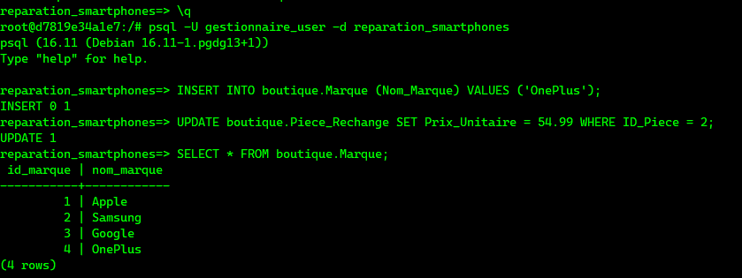

</details>

---

### Étape 12 : Retirer des droits (REVOKE)

```bash
\q
psql -U postgres -d reparation_smartphones
```

```sql
REVOKE SELECT ON ALL TABLES IN SCHEMA boutique FROM technicien_user;
```

Vérifier :

```sql
\c - technicien_user
SELECT * FROM boutique.Reparation;  -- ❌ Doit échouer
```

<details>
<summary>📋 Output attendu</summary>

```
ERROR:  permission denied for table reparation
```
</details>

<details>
<summary>🖼️ Capture d'écran</summary>

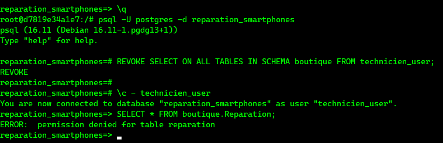

</details>

---

### Étape 13 : Supprimer les utilisateurs (DROP USER)

```bash
\c - postgres
```

```sql
DROP USER technicien_user;
DROP USER gestionnaire_user;
```

> ⚠️ PostgreSQL **ne permet pas** de supprimer un utilisateur si celui-ci possède encore des privilèges (tables, schémas). Ici, tout reste dans le schéma `boutique`.

<details>
<summary>📋 Output attendu</summary>

```
ERROR:  role "technicien_user" cannot be dropped because some objects depend on it
DETAIL:  privileges for database reparation_smartphones
         privileges for schema boutique
```
</details>

<details>
<summary>🖼️ Capture d'écran</summary>

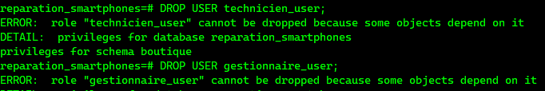

</details>