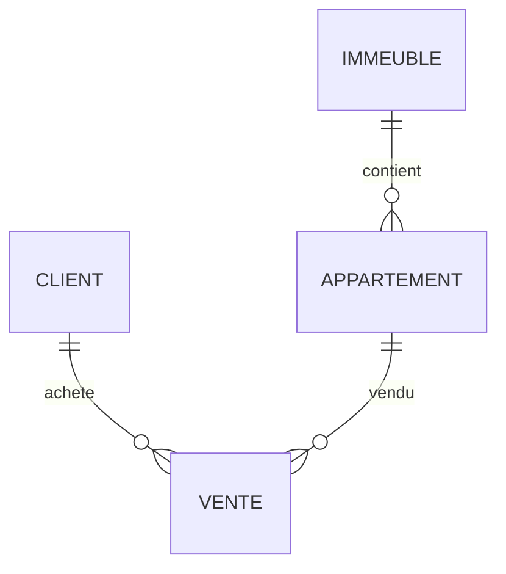

<div align="center">

# 🏢 TP Modélisation SQL

## Gestion des ventes d’appartements

**Nom : Mazigh Bareche**
**Code étudiant : 300150271**

</div>

---

## 📚 Table des matières

* Aperçu
* Normalisation
* Diagramme ER
* DDL
* DML
* Captures
* Conclusion

---

## 🎯 Aperçu

Ce projet modélise un système de gestion des ventes d’appartements dans des immeubles.

---

## 🔄 Normalisation

### 1FN

Toutes les données sont regroupées dans une seule table :

```
VENTE(IdVente, NomClient, TelClient, AdresseImmeuble, Ville, NumAppartement, Surface, Prix, DateVente)
```

❌ Problèmes :

* Redondance
* Difficulté de mise à jour
* Anomalies

---

### 2FN

Séparation des entités :

* CLIENT
* IMMEUBLE
* APPARTEMENT
* VENTE

---

### 3FN

Structure finale :

* CLIENT(IdClient, Nom, Telephone)
* IMMEUBLE(IdImmeuble, Adresse, Ville)
* APPARTEMENT(IdAppartement, NumAppartement, Surface, Prix, IdImmeuble)
* VENTE(IdVente, DateVente, IdClient, IdAppartement)

---

## 📊 Diagramme ER



---

## 🏗️ DDL

```sql
CREATE TABLE Client (
IdClient SERIAL PRIMARY KEY,
Nom TEXT,
Telephone TEXT
);

CREATE TABLE Immeuble (
IdImmeuble SERIAL PRIMARY KEY,
Adresse TEXT,
Ville TEXT
);

CREATE TABLE Appartement (
IdAppartement SERIAL PRIMARY KEY,
NumAppartement INT,
Surface FLOAT,
Prix FLOAT,
IdImmeuble INT REFERENCES Immeuble(IdImmeuble)
);

CREATE TABLE Vente (
IdVente SERIAL PRIMARY KEY,
DateVente DATE,
IdClient INT REFERENCES Client(IdClient),
IdAppartement INT REFERENCES Appartement(IdAppartement)
);
```

---

## 📝 DML

```sql
INSERT INTO Client VALUES (DEFAULT,'Ali','514000000');
INSERT INTO Client VALUES (DEFAULT,'Sara','438000000');

INSERT INTO Immeuble VALUES (DEFAULT,'Rue A','Montreal');
INSERT INTO Immeuble VALUES (DEFAULT,'Rue B','Quebec');

INSERT INTO Appartement VALUES (DEFAULT,101,75,250000,1);
INSERT INTO Appartement VALUES (DEFAULT,202,90,320000,2);

INSERT INTO Vente VALUES (DEFAULT,'2024-01-10',1,1);
INSERT INTO Vente VALUES (DEFAULT,'2024-02-15',2,2);
```

---

## 📸 Captures

### Tables créées


### Données insérées


### Résultat SELECT


### Requête JOIN


---

## ✅ Conclusion

Ce projet m’a permis de comprendre :

* La normalisation des bases de données
* La conception d’un modèle relationnel
* L’utilisation de SQL
* L’importance de structurer les données correctement

---
