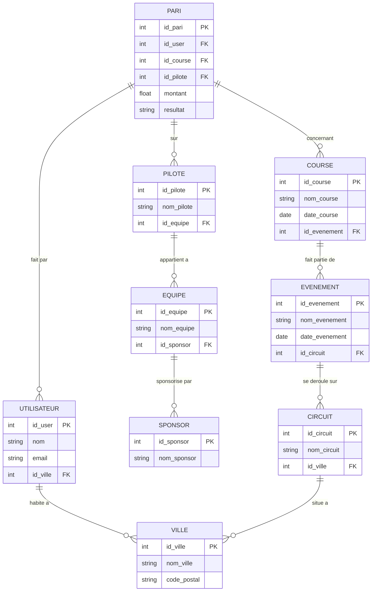

# Modelisation SQL - BetFormula
**Cours : INF1099-201-26H-04 | Etudiant : 300150295**

---

## Structure du projet
```
300150295/
├── README.md
├── images/
│   ├── Les tables créées (DDL).png
│   ├── Les données insérées (DML).png
│   ├── Les requêtes (DQL).png
│   ├── Les permissions (DCL).png
│   └── La structure du projet .png
├── DDL.sql
├── DML.sql
├── DQL.sql
└── DCL.sql
```

---

## Domaine - BetFormula

BetFormula est un site web qui permet aux utilisateurs de parier sur des pilotes participant a des courses automobiles. Les utilisateurs peuvent creer un compte, consulter les courses disponibles et placer des paris avec un montant precis.

---

## Diagramme Entite-Relation (ER)


---

## Normalisation

### 1FN - Premiere forme normale
Toutes les colonnes contiennent des valeurs atomiques (non divisibles). Chaque table possede une cle primaire unique. Aucun groupe repetitif.
```
Entites : Utilisateur, Ville, Pilote, Course, Pari, Evenement, Circuit, Equipe, Sponsor
Attributs atomiques : montant, resultat, nom, email, code_postal, date_evenement, date_course
```

### 2FN - Deuxieme forme normale
Chaque attribut non-cle depend entierement de la cle primaire. Les relations sont separees en entites distinctes pour eliminer les dependances partielles.
```
UTILISATEUR  --  FAIT       --  PARI
UTILISATEUR  --  HABITE     --  VILLE
COURSE       --  CONTIENT   --  PARI
PILOTE       --  PARTICIPE  --  COURSE
PILOTE       --  APPARTIENT --  EQUIPE
EQUIPE       --  SPONSORISE --  SPONSOR
CIRCUIT      --  ACCUEILLE  --  EVENEMENT
EVENEMENT    --  COMPREND   --  COURSE
```

### 3FN - Troisieme forme normale
Aucune dependance transitive. Chaque attribut depend uniquement et directement de la cle primaire de sa table.
```
Utilisateur (id_user, nom, email, id_ville)
Ville       (id_ville, nom_ville, code_postal)
Pilote      (id_pilote, nom_pilote, id_equipe)
Equipe      (id_equipe, nom_equipe, id_sponsor)
Sponsor     (id_sponsor, nom_sponsor)
Circuit     (id_circuit, nom_circuit, id_ville)
Evenement   (id_evenement, nom_evenement, date_evenement, id_circuit)
Course      (id_course, nom_course, date_course, id_evenement)
Pari        (id_pari, id_user, id_course, id_pilote, montant, resultat)
```

---

## DDL.sql - Definition des tables

Creation de toutes les tables avec cles primaires, cles etrangeres et contraintes d'integrite.

.png)

---

## DML.sql - Insertion des donnees

Insertion de donnees realistes : 3 villes, 3 sponsors, 3 equipes, 3 pilotes, 3 utilisateurs, 3 circuits, 3 evenements, 3 courses et 4 paris.

.png)

---

## DQL.sql - Requetes

| # | Requete | Description |
|---|---------|-------------|
| 1 | SELECT + JOIN | Tous les utilisateurs avec leur ville |
| 2 | SELECT + JOIN multiple | Tous les paris avec utilisateur, course et pilote |
| 3 | SELECT + WHERE | Paris gagnes uniquement |
| 4 | SELECT + GROUP BY | Total mise par utilisateur |
| 5 | SELECT + JOIN | Pilotes avec leur equipe et sponsor |

.png)

---

## DCL.sql - Gestion des droits

| Role | Droits |
|------|--------|
| parieur | SELECT sur Utilisateur, Course, Pilote, Pari, Evenement, Circuit |
| administrateur | ALL PRIVILEGES sur toutes les tables |

.png)

---

## Structure du projet


---

## Competences demontrees

- Analyse des besoins et modelisation conceptuelle
- Diagramme Entite-Relation (ER) avec Mermaid
- Normalisation 1FN, 2FN, 3FN appliquee au domaine BetFormula
- Creation des tables avec contraintes et cles etrangeres (DDL)
- Insertion de donnees realistes (DML)
- Requetes avancees avec JOIN, GROUP BY, WHERE (DQL)
- Gestion des roles et permissions (DCL)
