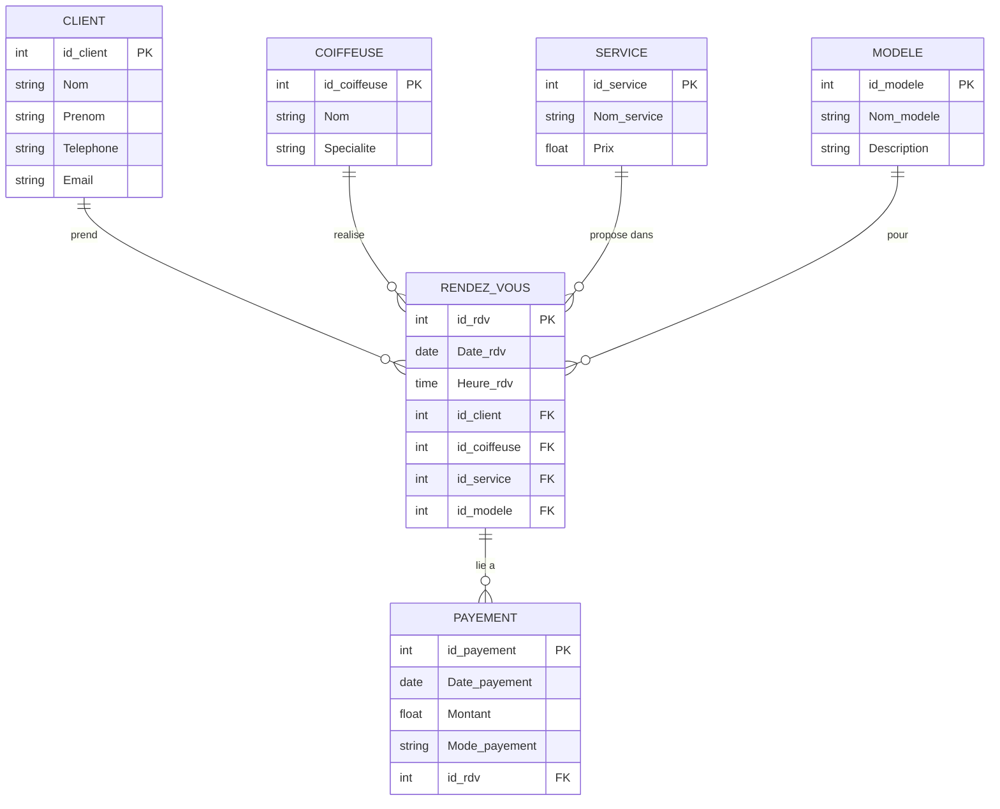

# 💇 Salon de Coiffure — Base de données PostgreSQL

> Projet de modélisation et implémentation d'une base de données relationnelle pour la gestion d'un salon de coiffure.

---

## 📋 Description

Ce projet couvre l'ensemble du cycle de conception d'une base de données relationnelle :

- ✅ Modélisation conceptuelle (diagramme ER)
- ✅ Modélisation logique (tables, clés, contraintes)
- ✅ Normalisation jusqu'en 3FN
- ✅ Implémentation physique sous **PostgreSQL**
- ✅ Scripts DDL / DML / DQL / DCL

---

## 🗂️ Structure du projet

```
📦 salon-coiffure-bd/
 ┣ 📄 DDL.sql   → Création des tables, contraintes et index
 ┣ 📄 DML.sql   → Insertion, mise à jour et suppression des données
 ┣ 📄 DQL.sql   → Requêtes de consultation (SELECT, JOIN, GROUP BY...)
 ┣ 📄 DCL.sql   → Gestion des rôles et permissions
 ┗ 📄 README.md → Documentation du projet
```

---

## 🗺️ Diagramme Entité-Relation



---

## 🏗️ Description des tables

| Table | Clé primaire | Description |
|---|---|---|
| `CLIENT` | `id_client` | Informations des clients |
| `COIFFEUSE` | `id_coiffeuse` | Coiffeuses du salon |
| `SERVICE` | `id_service` | Services proposés et leurs prix |
| `MODELE` | `id_modele` | Modèles de coiffure disponibles |
| `RENDEZ_VOUS` | `id_rdv` | Lien entre client, coiffeuse, service et modèle |
| `PAYEMENT` | `id_payement` | Paiements associés aux rendez-vous |

---

## 🔐 Rôles et permissions (DCL)

| Rôle | Droits |
|---|---|
| `admin_coiffure` | Accès complet (SUPERUSER) |
| `gerant_coiffure` | SELECT, INSERT, UPDATE sur toutes les tables |
| `coiffeuse_role` | SELECT sur RDV, CLIENT, SERVICE, MODELE |
| `lecteur_coiffure` | SELECT uniquement (lecture seule) |

---

## 🚀 Utilisation

### Prérequis

- [PostgreSQL 14+](https://www.postgresql.org/)
- psql ou un client comme [DBeaver](https://dbeaver.io/) / [pgAdmin](https://www.pgadmin.org/)

### Étapes d'exécution

```bash
# 1. Connexion à PostgreSQL
psql -U postgres

# 2. Créer la base de données
CREATE DATABASE salon_coiffure;
\c salon_coiffure

# 3. Exécuter les scripts dans l'ordre
\i DDL.sql
\i DML.sql
\i DQL.sql
\i DCL.sql
```

### Avec Docker

```bash
# Lancer PostgreSQL via Docker
docker run --name salon-pg \
  -e POSTGRES_PASSWORD=postgres \
  -e POSTGRES_DB=salon_coiffure \
  -p 5432:5432 \
  -d postgres:16

# Copier et exécuter les scripts
docker cp DDL.sql salon-pg:/DDL.sql
docker exec -it salon-pg psql -U postgres -d salon_coiffure -f /DDL.sql
docker exec -it salon-pg psql -U postgres -d salon_coiffure -f /DML.sql
```

---

## 📊 Exemples de requêtes DQL

**Liste complète des rendez-vous :**
```sql
SELECT rv.Date_rdv, rv.Heure_rdv,
       c.Nom AS Client, cf.Nom AS Coiffeuse, s.Nom_service
FROM RENDEZ_VOUS rv
JOIN CLIENT     c  ON c.id_client     = rv.id_client
JOIN COIFFEUSE  cf ON cf.id_coiffeuse = rv.id_coiffeuse
JOIN SERVICE    s  ON s.id_service    = rv.id_service
ORDER BY rv.Date_rdv;
```

**Chiffre d'affaires par coiffeuse :**
```sql
SELECT cf.Nom, SUM(p.Montant) AS CA_total
FROM COIFFEUSE cf
JOIN RENDEZ_VOUS rv ON rv.id_coiffeuse = cf.id_coiffeuse
JOIN PAYEMENT    p  ON p.id_rdv        = rv.id_rdv
GROUP BY cf.Nom
ORDER BY CA_total DESC;
```

---

## ⚙️ Optimisation

Des index ont été ajoutés dans `DDL.sql` pour optimiser les requêtes fréquentes :

- Index sur toutes les clés étrangères de `RENDEZ_VOUS`
- Index composite `(Date_rdv, id_coiffeuse)` pour les recherches par planning
- Index sur `CLIENT.Email` pour les recherches rapides

---

## 👩‍💻 Auteure

**Jesmina** — Projet de modélisation de base de données  
Programme : Systèmes et réseaux | 2025–2026
