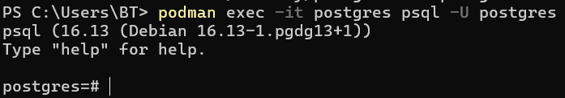
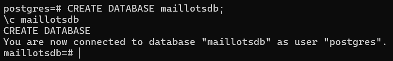
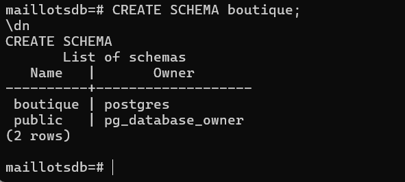
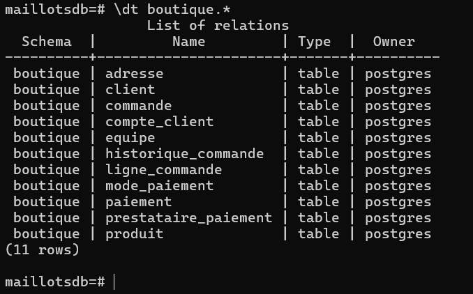
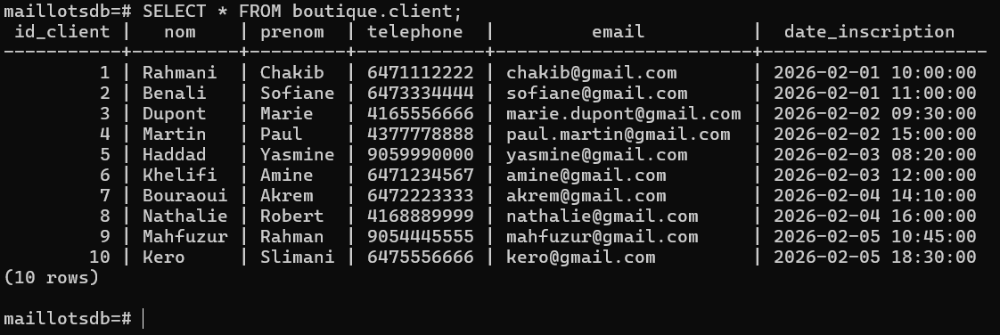
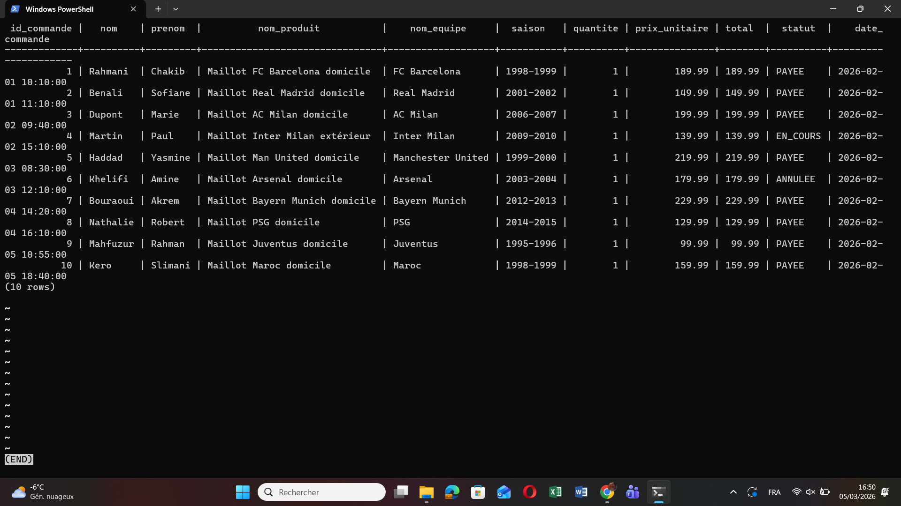
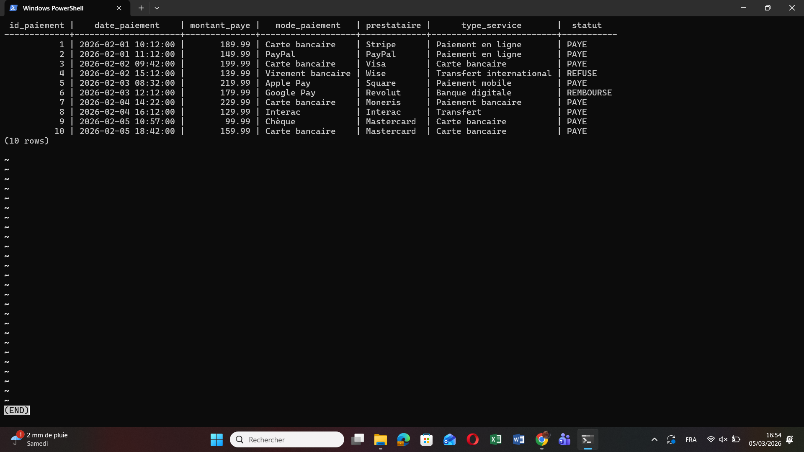
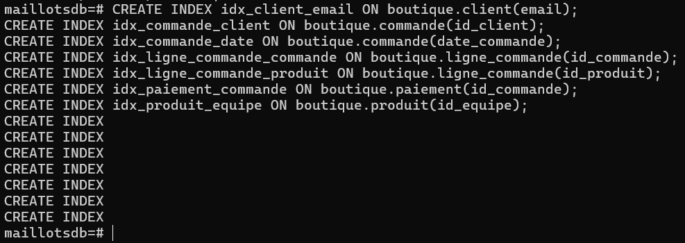
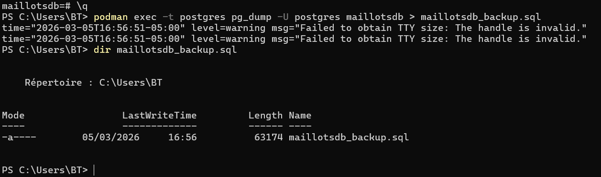

<div align="center">

# 🧢 TP Modélisation SQL — Boutique Maillots Vintage

### Base de données relationnelle pour une boutique en ligne spécialisée dans les maillots de football vintage

[](https://www.postgresql.org/)
[](https://podman.io/)
[](https://fr.wikipedia.org/wiki/Forme_normale)
[](.)
[](.)

---

> 🎽 Conception et implémentation d'une base de données relationnelle complète pour une boutique e-commerce  
> spécialisée dans la vente de maillots de football vintage — du modèle conceptuel à la sauvegarde.

---

**👤 Auteur :** Chakib Rahmani  
**📅 Session :** Travail Pratique — Modélisation de bases de données  
**🛠️ Technologies :** PostgreSQL 16 · Podman · PowerShell · SQL

</div>

---

## 📋 Table des matières

1. [🎯 Objectif général](#-objectif-général)
2. [🧠 Étapes de modélisation](#-étapes-de-modélisation)
3. [🏗️ Choix technologiques](#️-choix-technologiques)
4. [🧾 Normalisation](#-normalisation)
5. [🏛️ Modèle relationnel final (3FN)](#️-modèle-relationnel-final-3fn)
6. [⚙️ Implémentation PostgreSQL](#️-implémentation-postgresql)
   - [🧱 Création de la base et du schéma](#-création-de-la-base-et-du-schéma)
   - [🗂️ Création des tables](#️-création-des-tables)
   - [🧾 Insertion des données](#-insertion-des-données)
   - [🔍 Requêtes SQL de test](#-requêtes-sql-de-test)
7. [⚡ Optimisation](#-optimisation)
8. [💾 Sauvegarde](#-sauvegarde)
9. [✅ Conclusion](#-conclusion)

---

## 🎯 Objectif général

Ce travail pratique vise à modéliser et implémenter une base de données relationnelle complète pour une **boutique en ligne spécialisée dans les maillots de football vintage**. La démarche couvre l'ensemble du cycle de conception : de l'analyse du domaine jusqu'à l'optimisation et la sauvegarde en production.

### 📊 Tableau des fonctionnalités couvertes

| Fonctionnalité | Description | Couvert |
|---|---|:---:|
| Gestion des clients | Profil, coordonnées, adresses de livraison | ✅ |
| Catalogue produits | Maillots par équipe, saison, taille, état | ✅ |
| Gestion des commandes | Commandes multi-articles avec statut et historique | ✅ |
| Paiements | Multi-modes, prestataires, traçabilité complète | ✅ |
| Comptes clients | Statut, date de création, authentification | ✅ |
| Optimisation | Index sur colonnes critiques | ✅ |
| Sauvegarde | Export complet via `pg_dump` | ✅ |

---

## 🧠 Étapes de modélisation

La conception de cette base de données suit une démarche rigoureuse en quatre phases.

### 1️⃣ Analyse du domaine

Identification des entités principales du domaine e-commerce :
- **Clients** avec leurs comptes et adresses multiples
- **Produits** (maillots) liés à des équipes et caractérisés par saison, taille et état
- **Commandes** composées de plusieurs lignes articles
- **Paiements** avec mode de règlement et prestataire

### 2️⃣ Modèle conceptuel (Entité-Association)

Les associations clés identifiées :
- Un client **passe** plusieurs commandes
- Une commande **contient** plusieurs lignes de commande
- Un produit **appartient** à une équipe
- Un paiement **concerne** une commande et **utilise** un mode de paiement

### 3️⃣ Modèle logique

Transformation du modèle EA en tables relationnelles, avec identification des clés primaires, clés étrangères et contraintes d'intégrité.

### 4️⃣ Modèle physique

Implémentation SQL dans PostgreSQL 16 avec définition des types de données, contraintes `NOT NULL`, `UNIQUE`, `CHECK`, et création des index d'optimisation.

---

## 🏗️ Choix technologiques

### Pourquoi PostgreSQL pour ce projet ?

PostgreSQL est le SGBDR open source de référence pour les applications e-commerce transactionnelles. Voici les raisons de ce choix :

| Critère | PostgreSQL | Justification |
|---|---|---|
| **Intégrité transactionnelle** | ACID complet | Fiabilité des commandes et paiements |
| **Schémas logiques** | `CREATE SCHEMA` natif | Isolation propre du domaine `boutique` |
| **Conformité SQL** | Standard SQL:2016 | Portabilité et robustesse des requêtes |
| **Performance** | Index avancés (B-Tree, Hash) | Optimisation des recherches clients/produits |
| **Sécurité** | Rôles et privilèges granulaires | Contrôle d'accès par schéma |
| **Conteneurisation** | Image officielle disponible | Déploiement simplifié via Podman |

### Pourquoi Podman ?

Podman offre une alternative rootless à Docker, mieux adaptée aux environnements institutionnels et de TP. Il utilise la même syntaxe que Docker et ne requiert pas de démon en arrière-plan.

---

## 🧾 Normalisation

Le modèle a été normalisé jusqu'en **Troisième Forme Normale (3FN)** afin de garantir l'intégrité des données et d'éliminer toute redondance.

### Première Forme Normale (1FN)

> Chaque attribut contient une valeur atomique — pas de valeurs multiples dans une cellule.

**Application :** Les adresses de livraison sont extraites dans une table `Adresse` dédiée. Chaque maillot possède une seule taille, un seul état et un seul prix unitaire.

### Deuxième Forme Normale (2FN)

> Tout attribut non-clé dépend fonctionnellement de la clé primaire entière.

**Application :** La table `Ligne_Commande` ne stocke que `quantite` et `prix_unitaire`. Les informations du produit restent dans `Produit`, et les infos de commande dans `Commande`.

### Troisième Forme Normale (3FN)

> Aucun attribut non-clé ne dépend d'un autre attribut non-clé (pas de dépendance transitive).

**Application :** Le `nom_equipe` et le `pays` de l'équipe ne sont pas répétés dans `Produit` — ils sont isolés dans la table `Equipe`. De même, `nom_mode` est dans `Mode_Paiement` et `nom_prestataire` dans `Prestataire_Paiement`.

---

## 🏛️ Modèle relationnel final (3FN)

Le modèle final comprend **11 tables** organisées dans le schéma `boutique`.

```sql
-- Modèle relationnel final normalisé en 3FN
-- Schéma : boutique | Domaine : Maillots de football vintage

Client            (id_client, nom, prenom, telephone, email, date_inscription)
Adresse           (id_adresse, numero_rue, rue, ville, code_postal, pays, #id_client)
Compte_Client     (id_compte, date_creation, statut, #id_client)
Equipe            (id_equipe, nom_equipe, pays)
Produit           (id_produit, nom_produit, saison, taille, etat, prix, stock, #id_equipe)
Commande          (id_commande, date_commande, statut, total, #id_client, #id_adresse_livraison)
Ligne_Commande    (id_ligne, quantite, prix_unitaire, #id_commande, #id_produit)
Mode_Paiement     (id_mode_paiement, nom_mode)
Prestataire_Paiement (id_prestataire, nom_prestataire, type_service)
Paiement          (id_paiement, date_paiement, montant_paye, statut, #id_commande, #id_mode_paiement, #id_prestataire)
Historique_Commande (id_historique, date_action, action, #id_commande)
```

> Les attributs précédés de `#` représentent des **clés étrangères**.

---

## ⚙️ Implémentation PostgreSQL

### Lancer le conteneur PostgreSQL avec Podman

```powershell
podman run -d `
  --name postgres `
  -e POSTGRES_USER=postgres `
  -e POSTGRES_PASSWORD=postgres `
  -e POSTGRES_DB=appdb `
  -p 5432:5432 `
  -v postgres_data:/var/lib/postgresql/data `
  docker.io/library/postgres:16
```

### Se connecter à psql via Podman

```powershell
podman exec -it postgres psql -U postgres
```

---

### 🧱 Création de la base et du schéma

#### Connexion à psql



*Connexion réussie à l'interface `postgres=#` via `podman exec -it postgres psql -U postgres`.*

---

#### Création de la base de données et sélection

```sql
CREATE DATABASE maillotsdb;
\c maillotsdb
```



*Création de la base `maillotsdb` et connexion confirmée avec `\c maillotsdb`.*

---

#### Création du schéma boutique

```sql
CREATE SCHEMA boutique;
\dn
```



*Création du schéma `boutique` et vérification via `\dn` — le schéma apparaît bien dans la liste.*

---

### 🗂️ Création des tables

Une fois le schéma `boutique` en place, toutes les tables sont créées avec leurs contraintes d'intégrité (clés primaires, étrangères, `NOT NULL`, `CHECK`).

#### Vérification des tables créées

```sql
\dt boutique.*
```



*La commande `\dt boutique.*` confirme la présence des 11 tables du modèle relationnel.*

---

### 🧾 Insertion des données

Chaque table est alimentée avec **un minimum de 10 enregistrements** représentatifs du domaine : clients réels, maillots de clubs historiques (FC Barcelona, Juventus, Ajax, etc.), commandes multi-articles et paiements variés.

#### Vérification des données clients

```sql
SELECT * FROM boutique.client;
```



*Les 10 clients insérés s'affichent correctement avec leurs informations complètes.*

---

### 🔍 Requêtes SQL de test

Deux requêtes `JOIN` complexes permettent de valider la cohérence et les liaisons entre les tables.

#### Requête A — Commandes détaillées

Cette requête joint 5 tables pour afficher le détail complet de chaque commande avec le produit, l'équipe et le client associés.

```sql
SELECT
  co.id_commande,
  c.nom,
  c.prenom,
  p.nom_produit,
  e.nom_equipe,
  p.saison,
  lc.quantite,
  lc.prix_unitaire,
  co.total,
  co.statut,
  co.date_commande
FROM boutique.commande co
JOIN boutique.client c ON co.id_client = c.id_client
JOIN boutique.ligne_commande lc ON lc.id_commande = co.id_commande
JOIN boutique.produit p ON lc.id_produit = p.id_produit
JOIN boutique.equipe e ON p.id_equipe = e.id_equipe
ORDER BY co.date_commande;
```



*Résultat de la jointure sur 5 tables — les commandes s'affichent avec tous leurs détails produits et clients.*

---

#### Requête B — Paiements détaillés

Cette requête joint 3 tables pour afficher chaque paiement avec son mode de règlement et son prestataire.

```sql
SELECT
  pa.id_paiement,
  pa.date_paiement,
  pa.montant_paye,
  mp.nom_mode AS mode_paiement,
  pr.nom_prestataire AS prestataire,
  pr.type_service,
  pa.statut
FROM boutique.paiement pa
JOIN boutique.mode_paiement mp ON pa.id_mode_paiement = mp.id_mode_paiement
JOIN boutique.prestataire_paiement pr ON pa.id_prestataire = pr.id_prestataire
ORDER BY pa.date_paiement;
```



*Résultat de la requête paiements — mode de paiement, prestataire et statut sont clairement identifiables.*

---

## ⚡ Optimisation

### Création des index

Les index sont créés sur les colonnes les plus fréquemment utilisées dans les clauses `WHERE`, `JOIN` et `ORDER BY`, afin de réduire les temps de réponse sur les requêtes critiques.

```sql
CREATE INDEX idx_client_email           ON boutique.client(email);
CREATE INDEX idx_commande_client        ON boutique.commande(id_client);
CREATE INDEX idx_commande_date          ON boutique.commande(date_commande);
CREATE INDEX idx_ligne_commande_commande ON boutique.ligne_commande(id_commande);
CREATE INDEX idx_ligne_commande_produit  ON boutique.ligne_commande(id_produit);
CREATE INDEX idx_paiement_commande      ON boutique.paiement(id_commande);
CREATE INDEX idx_produit_equipe         ON boutique.produit(id_equipe);
```



*Les 7 index sont créés avec succès — PostgreSQL confirme chaque `CREATE INDEX`.*

### Justification des index

| Index | Colonne indexée | Raison |
|---|---|---|
| `idx_client_email` | `client.email` | Authentification et recherche rapide d'un client |
| `idx_commande_client` | `commande.id_client` | JOIN fréquent client ↔ commande |
| `idx_commande_date` | `commande.date_commande` | Tri et filtrage par période |
| `idx_ligne_commande_commande` | `ligne_commande.id_commande` | JOIN critique dans les détails de commande |
| `idx_ligne_commande_produit` | `ligne_commande.id_produit` | JOIN produit ↔ ligne de commande |
| `idx_paiement_commande` | `paiement.id_commande` | Récupération rapide des paiements par commande |
| `idx_produit_equipe` | `produit.id_equipe` | Filtrage du catalogue par équipe |

---

## 💾 Sauvegarde

### Export complet de la base avec `pg_dump`

La sauvegarde est réalisée directement depuis le conteneur Podman, sans nécessiter de client PostgreSQL local.

```powershell
podman exec -t postgres pg_dump -U postgres maillotsdb > maillotsdb_backup.sql
dir maillotsdb_backup.sql
```



*Le fichier `maillotsdb_backup.sql` est généré avec succès — la commande `dir` confirme sa présence et sa taille.*

> 💡 Le fichier de sauvegarde contient l'intégralité du schéma, des tables, des contraintes, des index et des données insérées. Il peut être restauré avec `psql -U postgres maillotsdb < maillotsdb_backup.sql`.

---

## ✅ Conclusion

Ce travail pratique a permis de concevoir et d'implémenter une base de données relationnelle robuste et normalisée pour une boutique e-commerce de maillots de football vintage. L'ensemble du cycle de vie d'un projet de modélisation a été couvert avec succès.

### 📊 Tableau bilan

| Étape | Résultat | Bénéfice |
|---|---|---|
| Analyse du domaine | Entités et associations identifiées | Périmètre fonctionnel clair |
| Modélisation ER | Diagramme entité-association complet | Base conceptuelle solide |
| Normalisation 3FN | 11 tables sans redondance | Intégrité et cohérence des données |
| Implémentation SQL | Schéma `boutique` opérationnel sous PostgreSQL | Base prête à l'exploitation |
| Insertion de données | 10+ enregistrements par table | Jeu de données représentatif |
| Requêtes de test | 2 requêtes JOIN validées | Liaisons entre tables confirmées |
| Optimisation | 7 index créés sur colonnes critiques | Performances améliorées |
| Sauvegarde | Export `pg_dump` complet | Récupération possible en cas d'incident |

---

<div align="center">

---

*Made by the one and only **Chkips*** 

[](https://www.postgresql.org/)
[](https://podman.io/)

</div>
