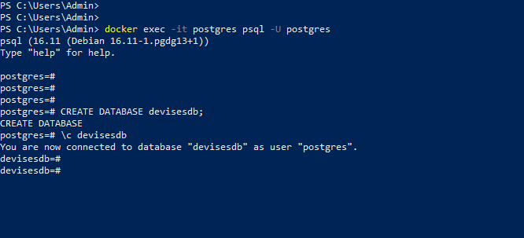
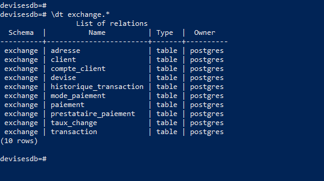
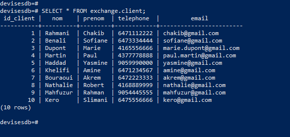
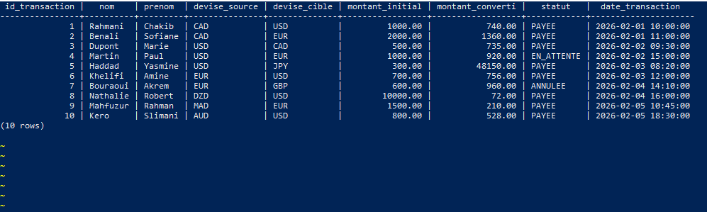
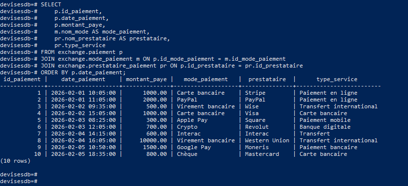
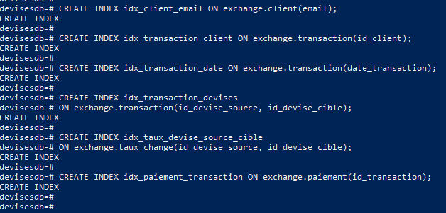
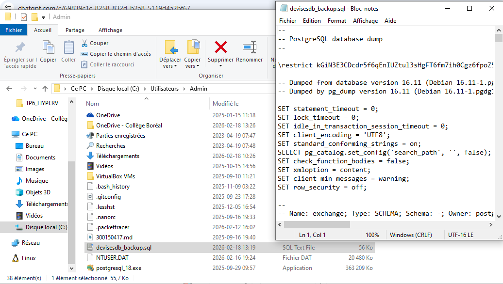

<div align="center">

# 💱 TP Modélisation Base de Données
## Site d'échange de devises — PostgreSQL


<br/>

> Conception et implémentation d'une base de données relationnelle complète  
> pour un site d'échange de devises en ligne — normalisée jusqu'en **3FN**

<br/>

**👤 Abdelatif Nemous**

</div>

---

## 📋 Table des matières

1. [Objectif général](#-objectif-général)
2. [Étapes de modélisation](#-étapes-de-modélisation)
3. [Choix technologiques](#-choix-technologiques)
4. [Normalisation](#-normalisation)
5. [Modèle relationnel final](#-modèle-relationnel-final-3fn)
6. [Implémentation PostgreSQL](#-implémentation-postgresql)
7. [Création des tables](#-création-des-tables)
8. [Insertion des données](#-insertion-des-données)
9. [Requêtes SQL de test](#-requêtes-sql-de-test)
10. [Optimisation](#-optimisation)
11. [Sauvegarde](#-sauvegarde)
12. [Conclusion](#-conclusion)

---

## 🎯 Objectif général

L'objectif de ce TP est de concevoir une base de données relationnelle adaptée à un **site d'échange de devises**, permettant :

| Fonctionnalité | Description |
|---|---|
| 👥 Clients | Inscription et gestion des profils |
| 💶 Devises | Référentiel de toutes les devises |
| 📈 Taux de change | Enregistrement et mise à jour des taux |
| 🔄 Transactions | Création de conversions de devises |
| 💳 Paiements | Gestion des modes et prestataires |
| 📜 Historique | Traçabilité complète des actions |

> Cette base de données est **performante, évolutive, normalisée et cohérente**.

---

## 🧠 Étapes de modélisation

```
Analyse des besoins  →  Modélisation conceptuelle  →  Modélisation logique  →  Modélisation physique
```

### 2.1 Analyse des besoins
- Identifier les utilisateurs (clients, administrateurs)
- Déterminer les données à stocker
- Définir les règles d'affaires

### 2.2 Modélisation conceptuelle
- Création d'un diagramme Entité-Relation (ER)
- Identification des entités, attributs et relations

### 2.3 Modélisation logique
- Transformation du modèle ER en tables relationnelles
- Définition des clés primaires et étrangères
- Normalisation (1FN → 2FN → 3FN)

### 2.4 Modélisation physique
- Choix du SGBD
- Création des index
- Optimisation et tests de requêtes

---

## 🏗️ Choix technologiques

### Pourquoi PostgreSQL ?

```
✅ Transactions ACID garanties
✅ Gestion avancée des JOIN complexes
✅ Forte intégrité des données (PK, FK, CHECK)
✅ Performant et robuste pour les systèmes financiers
✅ Open-source et largement éprouvé
```

> PostgreSQL est particulièrement adapté aux systèmes financiers comme l'échange de devises.

---

## 🧾 Normalisation

### 1FN — Première Forme Normale
Structure plate initiale avec tous les attributs dans une seule table :

```
Client_Nom, Client_Prenom, Client_Tel, Client_Email,
Num_Rue, Rue, Ville, Code_Postal, Pays_Client,
Devise_Source, Devise_Cible, Taux_Change,
Montant_Initial, Montant_Converti, Date_Transaction, Statut_Transaction,
Mode_Paiement, Montant_Paye, Nom_Prestataire_Paiement
```

> ⚠️ **Problème :** redondance importante et répétition des informations client/devise.

---

### 2FN — Deuxième Forme Normale
Séparation des entités pour éviter les dépendances partielles :

```
CLIENT (1,N) ──── EFFECTUE ──── (1,1) TRANSACTION
CLIENT (1,1) ──── HABITE ──── (1,1) ADRESSE
CLIENT (1,1) ──── POSSÈDE ──── (1,1) COMPTE_CLIENT

DEVISE (1,N) ──── EST_SOURCE_DE ──── (1,1) TRANSACTION
DEVISE (1,N) ──── EST_CIBLE_DE ──── (1,1) TRANSACTION
DEVISE (1,1) ──── POSSÈDE ──── (1,N) TAUX_CHANGE

TRANSACTION (1,1) ──── EST_PAYÉE_PAR ──── (1,1) PAIEMENT
PAIEMENT (1,1) ──── UTILISE ──── (1,1) MODE_PAIEMENT
PAIEMENT (1,1) ──── PASSE_PAR ──── (1,1) PRESTATAIRE_PAIEMENT

TRANSACTION (1,1) ──── GÉNÈRE ──── (0,N) HISTORIQUE_TRANSACTION
```

---

### 3FN — Troisième Forme Normale
Suppression de toutes les dépendances transitives. Chaque table dépend **uniquement** de sa clé primaire.

---

## 🏛️ Modèle relationnel final (3FN)

```sql
Client            (ID_Client, Nom, Prénom, Téléphone, Email)
Adresse           (ID_Adresse, Numéro_Rue, Rue, Ville, Code_Postal, Pays, #ID_Client)
Compte_Client     (ID_Compte, Date_Création, Statut, #ID_Client)
Devise            (ID_Devise, Code_Devise, Nom_Devise, Symbole)
Taux_Change       (ID_Taux, Valeur_Taux, Date_Mise_À_Jour, #ID_Devise_Source, #ID_Devise_Cible)
Transaction       (ID_Transaction, Date_Transaction, Montant_Initial, Montant_Converti,
                   Statut, #ID_Client, #ID_Devise_Source, #ID_Devise_Cible, #ID_Taux)
Paiement          (ID_Paiement, Date_Paiement, Montant_Payé, #ID_Transaction,
                   #ID_Mode_Paiement, #ID_Prestataire)
Mode_Paiement     (ID_Mode_Paiement, Nom_Mode)
Prestataire_Pmt   (ID_Prestataire, Nom_Prestataire, Type_Service)
Historique_Trans  (ID_Historique, Date_Action, Action, #ID_Transaction)
```

---

## ⚙️ Implémentation PostgreSQL

### Lancer PostgreSQL dans Podman

```powershell
podman run -d `
  --name postgres `
  -e POSTGRES_USER=postgres `
  -e POSTGRES_PASSWORD=postgres `
  -e POSTGRES_DB=appdb `
  -p 5432:5432 `
  -v postgres_data:/var/lib/postgresql/data `
  postgres:16
```

### Se connecter à PostgreSQL

```powershell
podman exec -it postgres psql -U postgres
```

---

## 🧱 Création de la base et du schéma

```sql
CREATE DATABASE devisesdb;
\c devisesdb;

CREATE SCHEMA exchange;
```




---

## 🏗️ Création des tables

Toutes les tables ont été créées dans le schéma `exchange` :

```
exchange.client              exchange.adresse
exchange.compte_client       exchange.devise
exchange.taux_change         exchange.transaction
exchange.paiement            exchange.mode_paiement
exchange.prestataire_paiement exchange.historique_transaction
```

**Vérification :**
```sql
\dt exchange.*
```



---

## 🧾 Insertion des données

Des données de test ont été insérées (10 entrées par table) pour valider le bon fonctionnement du modèle.

**Vérification :**
```sql
SELECT COUNT(*) FROM exchange.client;
```



---

## 🔍 Requêtes SQL de test

### 12.1 — Transactions avec infos client + devises

```sql
SELECT 
    t.id_transaction,
    c.nom,
    c.prenom,
    d1.code_devise AS devise_source,
    d2.code_devise AS devise_cible,
    t.montant_initial,
    t.montant_converti,
    t.statut,
    t.date_transaction
FROM exchange.transaction t
JOIN exchange.client c ON t.id_client = c.id_client
JOIN exchange.devise d1 ON t.id_devise_source = d1.id_devise
JOIN exchange.devise d2 ON t.id_devise_cible = d2.id_devise
ORDER BY t.date_transaction;
```



---

### 12.2 — Paiements avec mode et prestataire

```sql
SELECT
    p.id_paiement,
    p.date_paiement,
    p.montant_paye,
    m.nom_mode AS mode_paiement,
    pr.nom_prestataire AS prestataire,
    pr.type_service
FROM exchange.paiement p
JOIN exchange.mode_paiement m ON p.id_mode_paiement = m.id_mode_paiement
JOIN exchange.prestataire_paiement pr ON p.id_prestataire = pr.id_prestataire
ORDER BY p.date_paiement;
```



---

## ⚡ Optimisation

### Index recommandés

```sql
-- Accélère les recherches par email
CREATE INDEX idx_client_email ON exchange.client(email);

-- Optimise les JOINs sur transactions
CREATE INDEX idx_transaction_client ON exchange.transaction(id_client);

-- Optimise les filtrages par date
CREATE INDEX idx_transaction_date ON exchange.transaction(date_transaction);

-- Optimise les conversions de devises
CREATE INDEX idx_transaction_devises 
ON exchange.transaction(id_devise_source, id_devise_cible);

-- Optimise la recherche de taux
CREATE INDEX idx_taux_devise_source_cible
ON exchange.taux_change(id_devise_source, id_devise_cible);

-- Optimise les JOINs paiement ↔ transaction
CREATE INDEX idx_paiement_transaction ON exchange.paiement(id_transaction);
```



---

## 💾 Sauvegarde

### Créer un dump SQL (dans PowerShell, hors psql)

```powershell
docker exec -t postgres pg_dump -U postgres devisesdb > devisesdb_backup.sql
```

### Vérifier la sauvegarde

```powershell
dir devisesdb_backup.sql
```



---

## ✅ Conclusion

Ce TP a permis de concevoir une **base de données relationnelle complète** pour un site d'échange de devises.

Grâce à la normalisation jusqu'en 3FN :

| Résultat | Bénéfice |
|---|---|
| 🔻 Redondance réduite | Données cohérentes et non dupliquées |
| 🛡️ Intégrité assurée | Contraintes PK, FK, CHECK respectées |
| 🧹 Structure claire | Maintenance simplifiée |
| 📦 Évolutivité | Ajout de fonctionnalités facilité |
| ⚡ Performances | Améliorées grâce aux index stratégiques |

> **PostgreSQL** est un choix pertinent pour ce projet : il garantit **cohérence, fiabilité et performance** pour un système transactionnel financier.

---

<div align="center">

Made with ❤️ by **Abdelatif Nemous**

</div>
