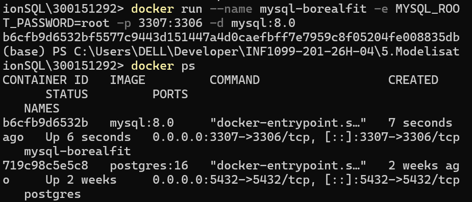
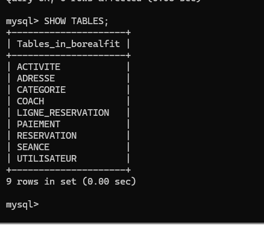
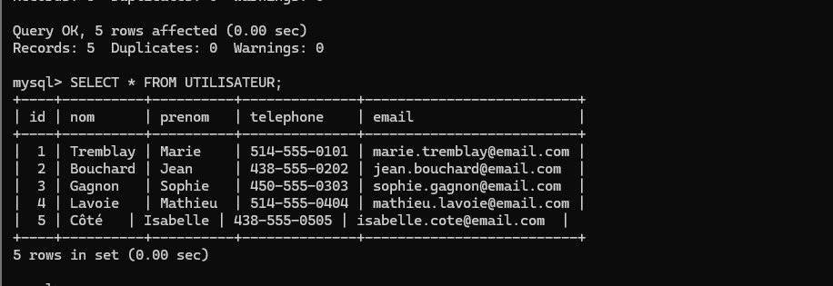
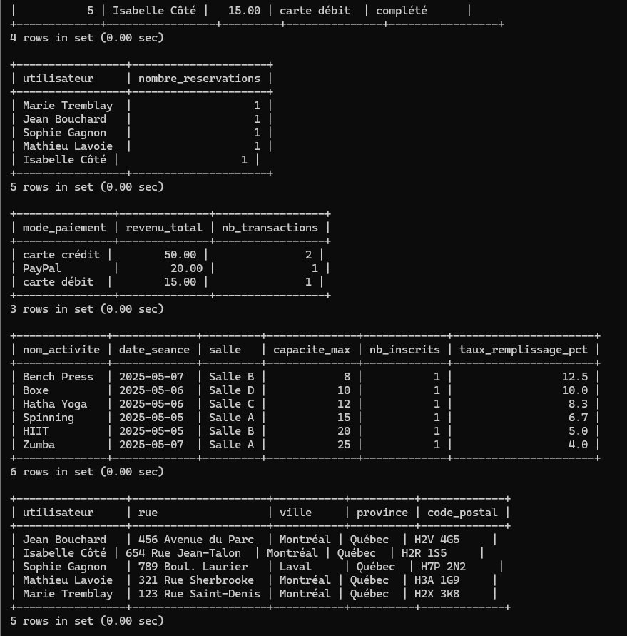
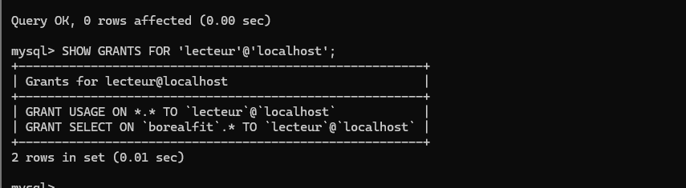
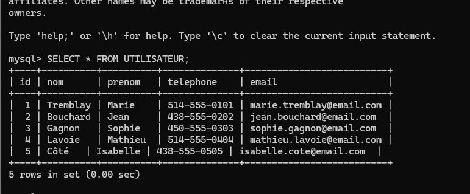
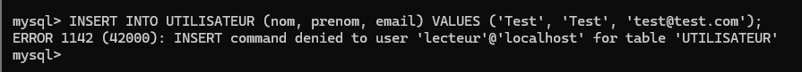
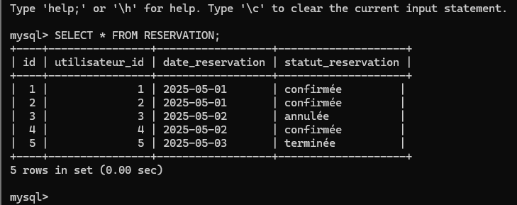
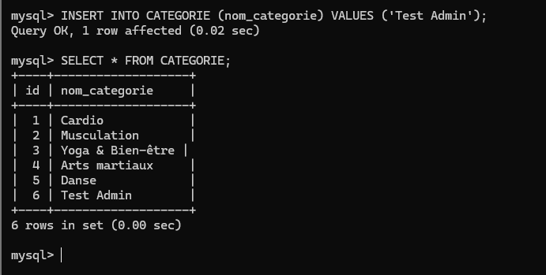

# 🏋️ TP Modélisation SQL
## Gestion de réservations sportives — BorealFit

  

Conception et implémentation d'une base de données relationnelle pour la gestion d'une plateforme de réservation de séances de sport.

**Auteur : Amine Kahil**  |  **No. étudiant : 300151292**  |  **SGBD : MySQL 8.0**

---

## 📋 Table des matières

- [🎯 Aperçu du projet](#-aperçu-du-projet)
- [🔄 Normalisation](#-normalisation)
- [🚀 Démarrage rapide](#-démarrage-rapide)
- [🏗️ DDL — Définition des structures](#-ddl--définition-des-structures)
- [📝 DML — Manipulation des données](#-dml--manipulation-des-données)
- [🔎 DQL — Requêtes SELECT](#-dql--requêtes-select)
- [🔐 DCL — Gestion des accès](#-dcl--gestion-des-accès)
- [🎯 Conclusion](#-conclusion)

---

## 🎯 Aperçu du projet

BorealFit est une plateforme de réservation de séances de sport destinée aux étudiants et aux membres d'un centre de remise en forme. Le site permet aux utilisateurs de planifier leurs activités sportives de manière simple et efficace.

Le site permet aux utilisateurs de :

- créer un compte utilisateur,
- enregistrer une ou plusieurs adresses,
- consulter les activités sportives classées par catégorie,
- réserver des séances selon une date et une heure,
- effectuer des paiements sécurisés,
- participer à des séances encadrées par des coachs dans des salles dédiées.

Chaque réservation est suivie à travers différents statuts (confirmée, annulée, terminée), garantissant un bon suivi du processus de réservation.

La base de données permet de gérer :

| Entité | Description |
|--------|-------------|
| 👤 Utilisateurs | Les membres inscrits sur la plateforme |
| 📍 Adresses | Les adresses associées à chaque utilisateur |
| 🏷️ Catégories | Les classifications des activités sportives |
| 🏃 Activités | Les activités sportives disponibles |
| 🧑‍🏫 Coachs | Les coachs animant les séances |
| 📅 Séances | Les séances planifiées avec date, heure et salle |
| 📋 Réservations | Les réservations effectuées par les utilisateurs |
| 🔗 Lignes de réservation | La table de jonction séance ↔ réservation (N:N) |
| 💳 Paiements | Les paiements associés aux réservations |

**Concepts appliqués :** modélisation · normalisation · gestion des droits d'accès SQL

---

## 🔄 Normalisation

### 1️⃣ Première Forme Normale (1FN)

- Attributs atomiques — aucune répétition de colonnes
- Une clé primaire unique par table
- Entités : `utilisateur`, `adresse`, `categorie`, `activite`, `coach`, `seance`, `reservation`, `paiement`

### 2️⃣ Deuxième Forme Normale (2FN)

Dépendances partielles éliminées par séparation des entités :

| Entité A | Relation | Entité B |
|----------|----------|----------|
| Utilisateur | possède | Adresse |
| Utilisateur | effectue | Réservation |
| Réservation | contient via | Ligne_Réservation |
| Séance | appartient à | Activité |
| Activité | classée dans | Catégorie |
| Séance | encadrée par | Coach |

### 3️⃣ Troisième Forme Normale (3FN)

Dépendances transitives supprimées — relations assurées par clés étrangères.

Tables finales :

| Table | Description | Clé primaire |
|-------|-------------|--------------|
| `UTILISATEUR` | Membres de la plateforme | `id` |
| `ADRESSE` | Adresses des utilisateurs | `id` |
| `CATEGORIE` | Types d'activités | `id` |
| `ACTIVITE` | Activités sportives | `id` |
| `COACH` | Coachs disponibles | `id` |
| `SEANCE` | Séances planifiées | `id` |
| `RESERVATION` | Réservations des membres | `id` |
| `LIGNE_RESERVATION` | Jonction réservation ↔ séance | `(reservation_id, seance_id)` |
| `PAIEMENT` | Paiements effectués | `id` |

---

## 🚀 Démarrage rapide

> ⚠️ **Ordre d'exécution obligatoire :** `DDL.sql` → `DML.sql` → `DQL.sql` → `DCL.sql`

**Étape 1 — Lancer le conteneur MySQL**
```powershell
docker run --name mysql-borealfit -e MYSQL_ROOT_PASSWORD=root -p 3307:3306 -d mysql:8.0
docker ps
```

✅ Conteneur `mysql-borealfit` démarré sur le port 3307



**Étape 2 — Copier les fichiers SQL dans le conteneur**
```powershell
docker cp DDL.sql mysql-borealfit:/DDL.sql
docker cp DML.sql mysql-borealfit:/DML.sql
docker cp DQL.sql mysql-borealfit:/DQL.sql
docker cp DCL.sql mysql-borealfit:/DCL.sql
```

**Étape 3 — Entrer dans le conteneur et se connecter**
```powershell
docker exec -it mysql-borealfit bash
mysql -u root -proot
```

**Étape 4 — Créer la base et exécuter les scripts**
```sql
CREATE DATABASE borealfit;
USE borealfit;
SOURCE /DDL.sql;
SOURCE /DML.sql;
SOURCE /DQL.sql;
SOURCE /DCL.sql;
```

---

## 🏗️ DDL — Définition des structures

Exemple — Table `UTILISATEUR`
```sql
CREATE TABLE UTILISATEUR (
    id        INT AUTO_INCREMENT PRIMARY KEY,
    nom       VARCHAR(100) NOT NULL,
    prenom    VARCHAR(100) NOT NULL,
    telephone VARCHAR(20),
    email     VARCHAR(150) NOT NULL UNIQUE
);
```

Exemple — Table `SEANCE`
```sql
CREATE TABLE SEANCE (
    id           INT AUTO_INCREMENT PRIMARY KEY,
    activite_id  INT NOT NULL,
    coach_id     INT NOT NULL,
    date_seance  DATE NOT NULL,
    heure_debut  TIME NOT NULL,
    heure_fin    TIME NOT NULL,
    salle        VARCHAR(100) NOT NULL,
    capacite_max INT NOT NULL DEFAULT 20,
    FOREIGN KEY (activite_id) REFERENCES ACTIVITE(id),
    FOREIGN KEY (coach_id)    REFERENCES COACH(id)
);
```

✅ **9 tables créées** avec clés primaires, clés étrangères et contraintes CHECK



---

## 📝 DML — Manipulation des données

Exemples d'insertions :
```sql
INSERT INTO UTILISATEUR (nom, prenom, telephone, email) VALUES
('Tremblay', 'Marie', '514-555-0101', 'marie.tremblay@email.com'),
('Bouchard', 'Jean',  '438-555-0202', 'jean.bouchard@email.com');

INSERT INTO CATEGORIE (nom_categorie) VALUES
('Cardio'), ('Musculation'), ('Yoga & Bien-être');

INSERT INTO RESERVATION (utilisateur_id, date_reservation, statut_reservation) VALUES
(1, '2025-05-01', 'confirmée'),
(2, '2025-05-01', 'confirmée');
```

✅ Données insérées — vérification avec `SELECT * FROM UTILISATEUR`



---

## 🔎 DQL — Requêtes SELECT

**Afficher les séances avec activité et coach**
```sql
SELECT
    a.nom_activite,
    c.nom          AS coach,
    s.date_seance,
    s.heure_debut,
    s.salle
FROM SEANCE s
JOIN ACTIVITE a ON s.activite_id = a.id
JOIN COACH    c ON s.coach_id    = c.id;
```

**Réservations confirmées avec utilisateur**
```sql
SELECT
    r.id AS reservation_id,
    CONCAT(u.prenom, ' ', u.nom) AS utilisateur,
    r.date_reservation,
    r.statut_reservation
FROM RESERVATION r
JOIN UTILISATEUR u ON r.utilisateur_id = u.id
WHERE r.statut_reservation = 'confirmée';
```

**Taux de remplissage · Revenus par mode de paiement · Adresses**

✅ Résultats des requêtes d'analyse



---

## 🔐 DCL — Gestion des accès

**Utilisateurs créés**

| Utilisateur | Rôle | SELECT | INSERT | UPDATE | DELETE |
|-------------|------|--------|--------|--------|--------|
| `lecteur` | Lecture seule | ✅ | ❌ | ❌ | ❌ |
| `gestionnaire` | Opérations courantes | ✅ | ✅ | ✅ | ❌ |
| `coach_app` | Consultation séances | ✅ | ❌ | ❌ | ❌ |
| `admin_borealfit` | Accès complet | ✅ | ✅ | ✅ | ✅ |

**Création des utilisateurs**
```sql
CREATE USER 'admin_borealfit'@'localhost' IDENTIFIED BY 'AdminBF2025!';
CREATE USER 'gestionnaire'@'localhost'    IDENTIFIED BY 'GestBF2025!';
CREATE USER 'lecteur'@'localhost'         IDENTIFIED BY 'LectureBF2025!';
CREATE USER 'coach_app'@'localhost'       IDENTIFIED BY 'CoachBF2025!';
```

**Attribution des permissions**
```sql
GRANT ALL PRIVILEGES ON borealfit.* TO 'admin_borealfit'@'localhost';
GRANT SELECT, INSERT, UPDATE ON borealfit.RESERVATION TO 'gestionnaire'@'localhost';
GRANT SELECT ON borealfit.* TO 'lecteur'@'localhost';
GRANT SELECT ON borealfit.SEANCE TO 'coach_app'@'localhost';
FLUSH PRIVILEGES;
```

✅ Vérification des droits de `lecteur`



---

**✅ Test — `lecteur` (lecture seule)**

SELECT autorisé — les données s'affichent correctement



INSERT refusé — `ERROR 1142: INSERT command denied`



---

**✅ Test — `admin_borealfit` (accès complet)**

SELECT sur RESERVATION fonctionne



INSERT et SELECT sur CATEGORIE fonctionnent sans restriction



---

**⛔ Révocation d'un droit**
```sql
REVOKE UPDATE ON borealfit.PAIEMENT FROM 'gestionnaire'@'localhost';
```

---

## 🎯 Conclusion

Ce projet a permis de mettre en pratique les concepts fondamentaux des bases de données relationnelles :

- ✅ **Modélisation de données** — diagramme ER, entités et relations
- ✅ **Normalisation** — 1FN, 2FN, 3FN appliquées rigoureusement
- ✅ **Création de structures SQL** — DDL complet avec clés primaires et étrangères
- ✅ **Manipulation des données** — insertions et requêtes JOIN complexes
- ✅ **Requêtes d'analyse** — agrégations, taux de remplissage, revenus par mode de paiement
- ✅ **Gestion des permissions** — GRANT, REVOKE, utilisateurs différenciés
- ✅ **Environnement Docker** — portabilité et reproductibilité

---

*Modélisation SQL · MySQL 8.0 · Amine Kahil · 300151292*
