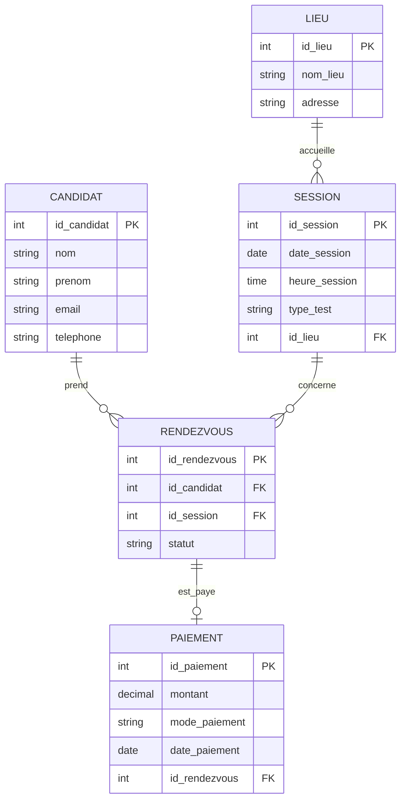

# Modélisation SQL — Gestion des rendez-vous TCF Canada

**Auteure :** Rabia BOUHALI  
**Matricule :** 300151469  
**Cours :** INF1099-201-26H-04  

---

## 1. Description du projet

Ce projet consiste à concevoir une base de données relationnelle permettant de gérer les rendez-vous pour le test TCF (Test de Connaissance du Français) au Canada.

La base de données permet :
- la gestion des candidats
- la gestion des sessions d'examen
- l'organisation des lieux
- la prise de rendez-vous
- la gestion des paiements

---

## 2. Étapes de modélisation

La conception de cette base de données a suivi un processus structuré :

1. Analyse des besoins (identification des utilisateurs et des données)
2. Modélisation conceptuelle (diagramme Entité-Relation)
3. Modélisation logique (création des tables, clés primaires et étrangères)
4. Normalisation (réduction de la redondance des données)
5. Implémentation SQL (création et manipulation de la base)

---

## 3. Fichiers du projet

| Fichier | Description |
|---------|-------------|
| `README.md` | Documentation du projet |
| `DDL.sql` | Création de la base et des tables |
| `DML.sql` | Insertion des données |
| `DQL.sql` | Requêtes SQL (SELECT, JOIN…) |
| `DCL.sql` | Gestion des droits et permissions |
| `images/` | Captures d'écran de l'exécution |

---

## 4. Diagramme ER

Le diagramme Entité-Relation représente les entités, leurs attributs et leurs relations.

---

## 5. Choix de conception

**Diagramme ER** — choisi car il permet de visualiser clairement les entités, leurs attributs et leurs relations avant l'implémentation technique.

**SGBD relationnel (MySQL)** — utilisé car le projet nécessite :
- des relations fortes entre les données
- des transactions fiables (ACID)
- une bonne intégrité des données

---

## 6. Analyse critique

Le modèle pourrait être amélioré en ajoutant :
- la gestion des disponibilités des sessions
- la gestion des annulations et remboursements
- des index pour améliorer les performances

---

## 7. Conclusion

Ce projet a permis d'appliquer les concepts de modélisation SQL, notamment :
- la conception d'une base de données relationnelle
- la création d'un diagramme ER
- la structuration des tables et des relations
- l'implémentation SQL complète
