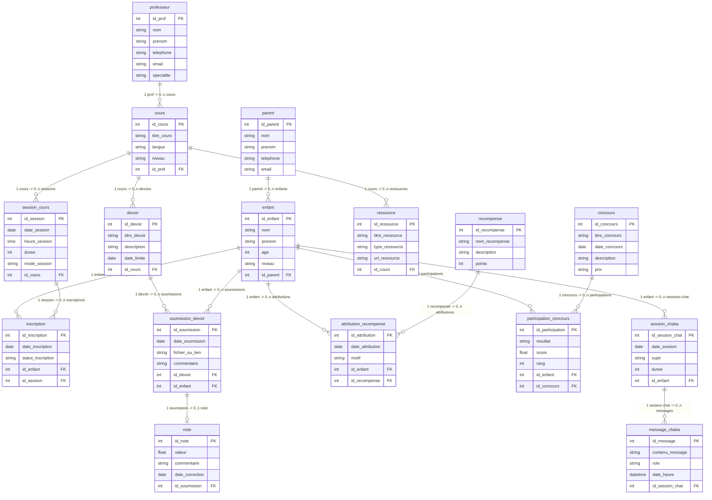

# 📚 Plateforme Éducative pour Enfants — Base de données
> **Modélisation et implémentation d'une base de données relationnelle en PostgreSQL**

**Auteure :** Ramatoulaye Diallo — `300153476`
**Cours :** INF1099 — Modélisation SQL
**Établissement :** Collège Boréal
**Date :** Mars 2026

---

## 📋 Table des matières

1. [Description du projet](#-description-du-projet)
2. [Analyse des besoins](#-analyse-des-besoins)
3. [Modélisation](#-modélisation)
4. [Structure de la base de données — 3FN](#-structure-de-la-base-de-données--3fn)
5. [Choix technologique](#-choix-technologique)
6. [Structure du dépôt](#-structure-du-dépôt)
7. [Contenu des fichiers SQL](#-contenu-des-fichiers-sql)
8. [Plan d'optimisation](#-plan-doptimisation)
9. [Contrôle d'accès — Rôles et permissions](#-contrôle-daccès--rôles-et-permissions)
10. [Instructions d'exécution](#-instructions-dexécution)

---

## 🎯 Description du projet

Ce projet consiste à concevoir, modéliser et implémenter une base de données relationnelle complète pour une **plateforme éducative destinée aux enfants**. La plateforme permet de :

- Gérer les **parents**, les **enfants** et les **professeurs**
- Organiser des **cours**, **sessions** et **devoirs**
- Suivre les **soumissions** et les **notes**
- Attribuer des **récompenses** et organiser des **concours**
- Offrir un système de **chat avec une IA** pour l'aide aux devoirs

La base de données est conçue selon les principes de la **3e Forme Normale (3FN)**, garantissant l'absence de redondance et l'intégrité des données.

---

## 🔍 Analyse des besoins

### Utilisateurs identifiés

| Profil | Rôle dans le système |
|--------|----------------------|
| **Administrateur** | Gestion complète de la plateforme |
| **Professeur** | Création de cours, devoirs, correction des notes |
| **Parent** | Suivi des progrès de ses enfants |
| **Enfant** | Suivre des cours, soumettre des devoirs, utiliser le chat IA |
| **Auditeur** | Lecture seule pour rapports et surveillance |

### Règles d'affaires principales

- Un enfant est obligatoirement rattaché à un parent
- Un enfant ne peut s'inscrire qu'**une seule fois** au même cours
- Chaque soumission de devoir reçoit au maximum **une note**
- Un enfant ne peut participer qu'**une seule fois** à un concours donné
- Les messages ChatIA appartiennent à une session, pas directement à l'enfant
- Un professeur peut enseigner **plusieurs cours**, mais chaque cours n'a qu'**un seul** professeur responsable

---

## 🗂️ Modélisation

### Étapes de conception suivies

```
1. Analyse des besoins       → Identification des entités et règles d'affaires
2. Modélisation conceptuelle → Diagramme Entité-Relation (ER)
3. Modélisation logique      → Transformation en tables, normalisation 3FN
4. Modélisation physique     → PostgreSQL, index, contraintes
5. Implémentation et tests   → DDL → DCL → DML → DQL
```

### Justification du diagramme ER

Le **diagramme Entité-Relation (ER)** a été choisi car il permet de :

- Représenter clairement les **entités**, leurs **attributs** et leurs **relations** avant l'implémentation technique
- Visualiser les **cardinalités** (1:1, 1:N, N:M) de façon intuitive
- Communiquer la structure aux parties prenantes sans prérequis technique
- Servir de référence lors des **itérations** de conception

> *« Un diagramme ER traduit les règles d'affaires en une représentation visuelle compréhensible par tous — développeurs, professeurs et administrateurs. »*

### Diagramme ER

> Le diagramme est disponible dans le dossier [`images/`](images/)

## 🧩 Diagramme Entité / Relation (E/R)



---

## 🗃️ Structure de la base de données — 3FN

La base de données respecte la **3e Forme Normale** :
- ✅ **1FN** — chaque attribut contient une valeur atomique, pas de groupes répétés
- ✅ **2FN** — chaque attribut non-clé dépend entièrement de la clé primaire
- ✅ **3FN** — aucune dépendance transitive entre attributs non-clés

### Tables — 16 entités organisées par niveau de dépendance

#### Niveau 1 — Entités indépendantes (aucune FK)

| Table | Description | Attributs clés |
|-------|-------------|----------------|
| `Parent` | Responsable légal des enfants | `id_parent`, `Nom`, `Prenom`, `Email` |
| `Professeur` | Enseignant responsable des cours | `id_prof`, `Nom`, `Prenom`, `Specialite` |
| `Recompense` | Badge ou trophée attribuable | `id_recompense`, `Nom_recompense`, `Points` |
| `Concours` | Compétition ouverte aux enfants | `id_concours`, `Titre_concours`, `Date_concours` |

#### Niveau 2 — Dépendances simples (1 FK)

| Table | Dépend de | Description |
|-------|-----------|-------------|
| `Enfant` | `Parent` | Apprenant rattaché à un parent |
| `Cours` | `Professeur` | Matière enseignée par un professeur |

#### Niveau 3 — Dépendances composées (2 FK ou plus)

| Table | Dépend de | Description |
|-------|-----------|-------------|
| `Session_Cours` | `Cours` | Occurrence planifiée d'un cours |
| `Inscription` | `Enfant`, `Cours` | Enregistrement d'un enfant dans un cours |
| `Devoir` | `Cours` | Travail à remettre dans un cours |
| `Ressource` | `Cours` | Matériel pédagogique associé |
| `Attribution_Recompense` | `Enfant`, `Recompense` | Récompense obtenue par un enfant |
| `Participation_Concours` | `Enfant`, `Concours` | Inscription et résultat à un concours |
| `Session_ChatIA` | `Enfant` | Séance de conversation avec l'IA |

#### Niveau 4 — Dépendances profondes

| Table | Dépend de | Description |
|-------|-----------|-------------|
| `Soumission_Devoir` | `Devoir`, `Enfant` | Travail rendu par un enfant |
| `Message_ChatIA` | `Session_ChatIA` | Message échangé dans une session IA |

#### Niveau 5 — Dépendance maximale

| Table | Dépend de | Description |
|-------|-----------|-------------|
| `Note` | `Soumission_Devoir` | Évaluation attribuée à une soumission (1:1) |

### Contraintes d'intégrité notables

```sql
-- Un enfant ne peut s'inscrire qu'une seule fois au même cours
CONSTRAINT uq_inscription_enfant_cours UNIQUE (id_enfant, id_cours)

-- Une seule note par soumission (relation 1:1)
id_soumission INT NOT NULL UNIQUE

-- Un enfant ne peut participer qu'une seule fois à un concours
CONSTRAINT uq_participation UNIQUE (id_enfant, id_concours)

-- Âge de l'enfant validé entre 3 et 18 ans
Age SMALLINT NOT NULL CHECK (Age BETWEEN 3 AND 18)

-- Note obligatoirement entre 0 et 100
Valeur NUMERIC(5,2) NOT NULL CHECK (Valeur BETWEEN 0 AND 100)
```

---

## ⚙️ Choix technologique

### SGBD : PostgreSQL

| Critère | Justification |
|---------|---------------|
| **Relations fortes** | La plateforme contient de nombreuses FK et jointures (Parent→Enfant, Cours→Devoir→Soumission→Note) |
| **Transactions ACID** | Intégrité critique : une note ne doit jamais être associée à une mauvaise soumission |
| **Contraintes avancées** | CHECK, UNIQUE composites, FOREIGN KEY avec CASCADE |
| **Fonctions analytiques** | RANK(), AVG() OVER(), PARTITION BY — pour les classements et bulletins |
| **Types de données riches** | SERIAL, NUMERIC, TIMESTAMP, TEXT |

> *« PostgreSQL a été choisi plutôt que MySQL car le projet nécessite des transactions complexes, des fonctions de fenêtre analytiques et des relations fortes entre entités. MongoDB n'a pas été retenu car toutes les données sont structurées et relationnelles. »*

---

## 📁 Structure du dépôt

```
plateforme-educative-db/
│
├── images/
│   └── diagramme_ER.png          ← Diagramme Entité-Relation
│
├── DDL.sql                        ← Création des tables et index
├── DCL.sql                        ← Rôles, utilisateurs et permissions
├── DML.sql                        ← Insertion, mise à jour, suppression
├── DQL.sql                        ← Requêtes SELECT (7 blocs progressifs)
└── README.md                      ← Ce fichier
```

---

## 📄 Contenu des fichiers SQL

### `DDL.sql` — Data Definition Language
> Définit la **structure** de la base de données

- Section `0` — Nettoyage (`DROP TABLE IF EXISTS` dans l'ordre inverse des FK)
- Section `1` — Entités indépendantes (`Parent`, `Professeur`, `Recompense`, `Concours`)
- Section `2` — Entités avec 1 FK (`Enfant`, `Cours`)
- Section `3` — Entités avec 2 FK+ (`Session_Cours`, `Inscription`, `Devoir`, `Ressource`, `Attribution_Recompense`, `Participation_Concours`, `Session_ChatIA`)
- Section `4` — Niveau profond (`Soumission_Devoir`, `Message_ChatIA`)
- Section `5` — Niveau maximum (`Note`)
- Section `6` — **14 index** sur toutes les FK pour optimiser les jointures

### `DCL.sql` — Data Control Language
> Définit les **accès et permissions**

| Rôle | Permissions |
|------|-------------|
| `admin_plateforme` | `ALL PRIVILEGES` sur toutes les tables et séquences |
| `professeur_role` | `SELECT, INSERT, UPDATE, DELETE` sur cours/devoirs/notes · `SELECT` sur élèves |
| `parent_role` | `SELECT` sur tout ce qui concerne ses enfants · `UPDATE` de ses coordonnées |
| `enfant_role` | `SELECT` cours/devoirs · `INSERT` soumissions et sessions ChatIA |
| `lecture_seule` | `SELECT` uniquement — pour audit et rapports |

Utilisateurs concrets créés : `admin_diallo`, `prof_martin`, `parent_tremblay`, `enfant_emma`, `auditeur_sys`

### `DML.sql` — Data Manipulation Language
> **Manipule les données** dans les tables

**INSERT** — Données réalistes pour les 16 tables :
- 8 parents · 6 professeurs · 12 enfants (maternelle/primaire/secondaire)
- 12 cours · 15 sessions · 28 inscriptions
- 12 devoirs · 14 ressources pédagogiques
- 21 soumissions · 21 notes · 10 récompenses attribuées
- 15 participations aux concours · 15 sessions ChatIA · 20 messages IA

**UPDATE** — 8 modifications : correction de note, prolongation de date limite, mise à jour de statut d'inscription, validation de rang de concours

**DELETE** — 3 suppressions ciblées : inscription suspendue, ressource obsolète, session test trop courte

### `DQL.sql` — Data Query Language
> **Interroge** la base de données — 7 blocs progressifs

| Bloc | Type | Exemples |
|------|------|----------|
| **1** | SELECT simples | Liste des enfants, cours avec professeur, devoirs par urgence |
| **2** | Filtres WHERE | Enfants en secondaire, cours en anglais, notes < 80 |
| **3** | Agrégations | Moyenne par cours, cours avec > 3 inscrits, points de récompenses |
| **4** | Jointures multiples | Tableau complet enfant→cours→devoir→note, historique ChatIA |
| **5** | Sous-requêtes | Enfants au-dessus de la moyenne, cours sans inscrits, meilleure note par cours |
| **6** | Vues | `v_bulletin_enfants`, `v_stats_enfants`, `v_tableau_bord_prof` |
| **7** | Fonctions avancées | `RANK()`, moyenne cumulative `OVER()`, podium des concours |

---

## 🚀 Plan d'optimisation

### Index stratégiques (déjà inclus dans DDL.sql)

```sql
-- Index sur toutes les clés étrangères (jointures les plus fréquentes)
CREATE INDEX idx_enfant_parent      ON Enfant(id_parent);
CREATE INDEX idx_cours_prof         ON Cours(id_prof);
CREATE INDEX idx_inscription_enfant ON Inscription(id_enfant);
CREATE INDEX idx_inscription_cours  ON Inscription(id_cours);
CREATE INDEX idx_soumission_devoir  ON Soumission_Devoir(id_devoir);
CREATE INDEX idx_note_soumission    ON Note(id_soumission);
CREATE INDEX idx_message_session    ON Message_ChatIA(id_session_chat);
-- ... 14 index au total
```

### Bonnes pratiques appliquées

| Pratique | Application dans ce projet |
|----------|---------------------------|
| **Éviter SELECT \*** | Toutes les requêtes DQL précisent les colonnes nécessaires |
| **Index sur FK** | 14 index couvrent toutes les clés étrangères |
| **Contraintes CHECK** | Validation en base (âge, note, statut, mode session) |
| **Nommage des contraintes** | Toutes les FK ont un nom (`CONSTRAINT fk_...`) pour faciliter la maintenance |
| **COALESCE pour les NULL** | Utilisé dans les vues pour éviter les résultats NULL |
| **Vues pour les requêtes répétitives** | 3 vues évitent la répétition des jointures complexes |

### Surveillance recommandée

```sql
-- Analyser une requête lente avec PostgreSQL
EXPLAIN ANALYZE
SELECT e.Nom, AVG(n.Valeur)
FROM Enfant e
JOIN Soumission_Devoir sd ON e.id_enfant = sd.id_enfant
JOIN Note n ON sd.id_soumission = n.id_soumission
GROUP BY e.id_enfant;
```

---

## 🔐 Contrôle d'accès — Rôles et permissions

```
admin_plateforme   → ALL PRIVILEGES (tables + séquences)
       │
       ├── admin_diallo (LOGIN)
       │
professeur_role    → CRUD cours/devoirs/notes + SELECT élèves
       │
       ├── prof_martin (LOGIN)
       │
parent_role        → SELECT tout + UPDATE ses coordonnées
       │
       ├── parent_tremblay (LOGIN)
       │
enfant_role        → SELECT cours + INSERT soumissions/chat
       │
       ├── enfant_emma (LOGIN)
       │
lecture_seule      → SELECT uniquement (audit)
       │
       └── auditeur_sys (LOGIN)
```

---

## ▶️ Instructions d'exécution

### Prérequis

- PostgreSQL 14+ installé
- Accès à `psql` ou pgAdmin

### Ordre d'exécution obligatoire

```bash
# 1. Connexion à PostgreSQL
psql -U postgres

# 2. Créer la base de données
CREATE DATABASE plateforme_educative;
\c plateforme_educative

# 3. Exécuter dans cet ordre OBLIGATOIRE
\i DDL.sql    -- Crée la structure (tables + index)
\i DCL.sql    -- Crée les rôles et permissions
\i DML.sql    -- Insère les données de test
\i DQL.sql    -- Exécute les requêtes de démonstration
```

### Vérifications rapides après exécution

```sql
-- Vérifier les tables créées
SELECT tablename FROM pg_tables WHERE schemaname = 'public' ORDER BY tablename;

-- Vérifier le nombre de rangées par table
SELECT 'Parent'    AS table_name, COUNT(*) FROM Parent     UNION ALL
SELECT 'Enfant',                  COUNT(*) FROM Enfant      UNION ALL
SELECT 'Cours',                   COUNT(*) FROM Cours       UNION ALL
SELECT 'Note',                    COUNT(*) FROM Note;

-- Tester une vue
SELECT * FROM v_stats_enfants ORDER BY Moyenne_generale DESC NULLS LAST;

-- Vérifier les rôles créés
SELECT rolname, rolcanlogin FROM pg_roles
WHERE rolname IN ('admin_plateforme','professeur_role','parent_role','enfant_role','lecture_seule')
ORDER BY rolname;
```

---

## ✅ Résumé — Objectifs atteints

| Objectif | Statut |
|----------|--------|
| Analyse des besoins et règles d'affaires | ✅ |
| Modélisation conceptuelle (Diagramme ER) | ✅ |
| Normalisation en 3e Forme Normale (3FN) | ✅ |
| Choix et justification du SGBD (PostgreSQL) | ✅ |
| DDL — 16 tables avec contraintes complètes | ✅ |
| DCL — 5 rôles, 5 utilisateurs, permissions granulaires | ✅ |
| DML — Données réalistes (INSERT, UPDATE, DELETE) | ✅ |
| DQL — 7 blocs progressifs + 3 vues + fonctions avancées | ✅ |
| Index stratégiques sur toutes les FK | ✅ |
| Plan d'optimisation documenté | ✅ |

---

*Projet réalisé dans le cadre du cours INF1099 — Collège Boréal, 2026*
