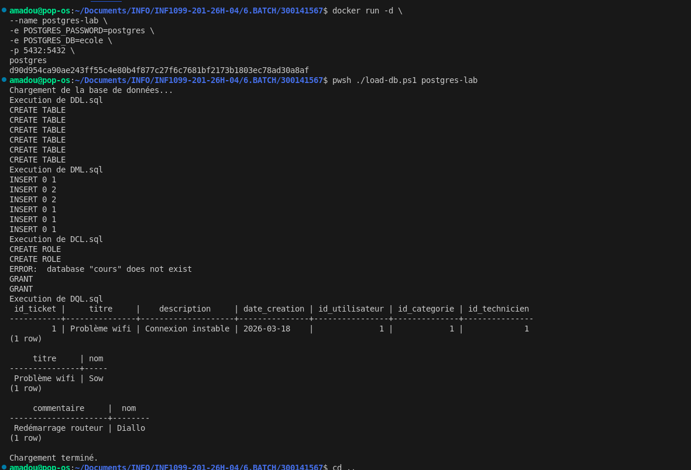

# 🧪 Laboratoire BATCH – PostgreSQL avec Docker

**Nom : Amadou Sow**

---

## 🎯 Objectifs

* Automatiser le chargement d’une base PostgreSQL
* Utiliser Docker avec PostgreSQL
* Exécuter des scripts SQL via PowerShell
* Comprendre les types SQL (DDL, DML, DQL, DCL)

---

## 📂 Structure du projet

```
├── DDL.sql
├── DML.sql
├── DCL.sql
├── DQL.sql
├── load-db.ps1
```

---

## 🧠 Types de scripts SQL

| Type | Description | Exemple      |
| ---- | ----------- | ------------ |
| DDL  | Structure   | CREATE TABLE |
| DML  | Données     | INSERT       |
| DQL  | Requêtes    | SELECT       |
| DCL  | Permissions | GRANT        |

---

## ⚙️ Étapes d’exécution

### 1. Lancer PostgreSQL avec Docker

```bash
docker run -d \
--name postgres-lab \
-e POSTGRES_PASSWORD=postgres \
-e POSTGRES_DB=ecole \
-p 5432:5432 \
postgres
```

---

### 2. Exécuter le script

```bash
pwsh ./load-db.ps1 postgres-lab
```



---

## 📜 Fonctionnement du script

Le script :

1. Vérifie que le conteneur est actif
2. Vérifie que les fichiers SQL existent
3. Exécute les fichiers dans l’ordre :

   * DDL
   * DML
   * DCL
   * DQL
4. Génère un fichier log

---

## 📊 Exemple de sortie

```
Execution de DDL.sql
Execution de DML.sql
Execution de DCL.sql
Execution de DQL.sql

Base de données chargée avec succès.
```

---

## ⏱️ Performance

Le script mesure le temps d’exécution total.

---

