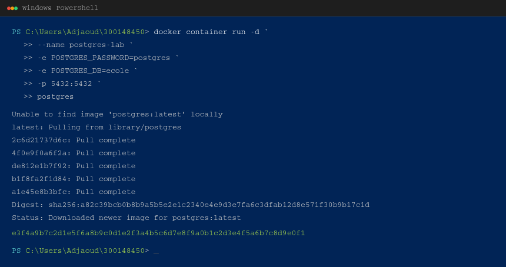
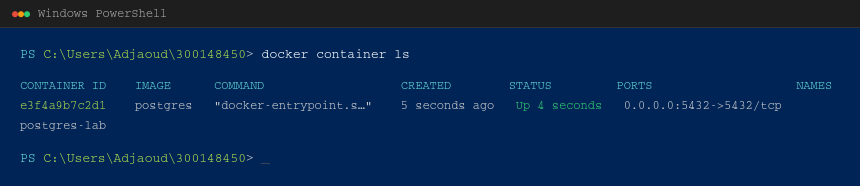
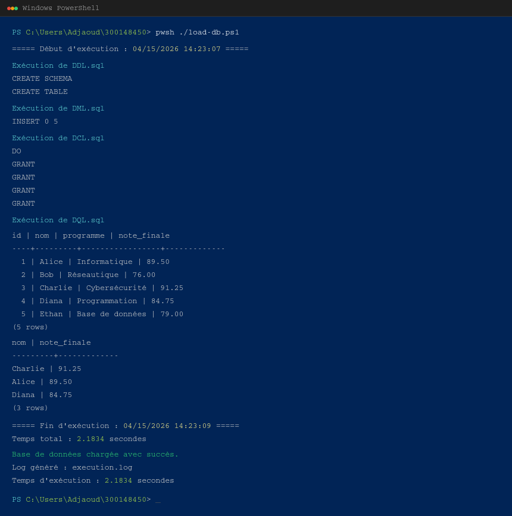
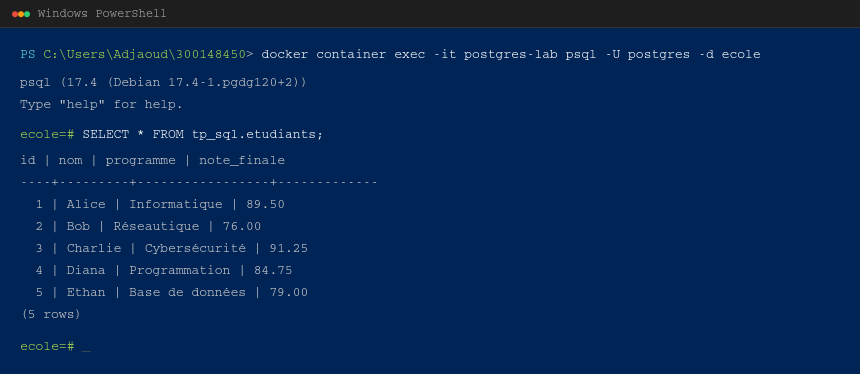
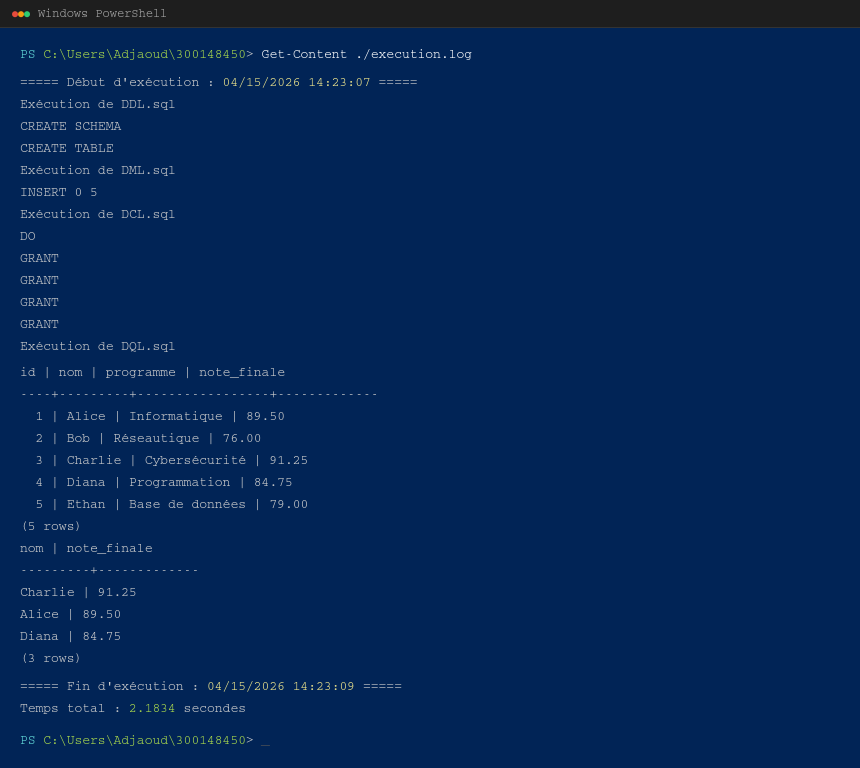

# 🐘 TP PostgreSQL — Automatisation des scripts SQL avec Docker & PowerShell

## 👤 Informations de l'étudiant
- **Nom :** Adjaoud Hocine  
- **Numéro étudiant :** 300148450  

---

## 📌 Description du laboratoire

Ce laboratoire a pour objectif de mettre en pratique l'utilisation des différents types de scripts SQL ainsi que leur automatisation à l'aide d'un script PowerShell dans un environnement Docker.

L'approche consiste à séparer les opérations SQL en plusieurs fichiers selon leur rôle (DDL, DML, DCL, DQL), puis à automatiser leur exécution dans un conteneur PostgreSQL.

---

## 🎯 Objectifs pédagogiques

À la fin de ce laboratoire, l'étudiant est capable de :

- Comprendre les différents types de scripts SQL  
- Utiliser Docker pour exécuter PostgreSQL  
- Écrire un script PowerShell d'automatisation  
- Charger automatiquement plusieurs scripts SQL  
- Vérifier le bon fonctionnement d'une base de données  

---

## 🧠 Types de scripts SQL

| Type | Signification | Exemple |
|------|-------------|---------|
| **DDL** | Data Definition Language | CREATE TABLE |
| **DML** | Data Manipulation Language | INSERT |
| **DQL** | Data Query Language | SELECT |
| **DCL** | Data Control Language | GRANT |

---

## 📁 Structure du projet

```
300148450/
├── DDL.sql
├── DML.sql
├── DCL.sql
├── DQL.sql
└── load-db.ps1
```

---

## ⚙️ Environnement technique

- **SGBD :** PostgreSQL  
- **Conteneurisation :** Docker  
- **Langage script :** PowerShell  
- **Base de données :** ecole  

---

## 🚀 Mise en place

### 🔹 Lancement du conteneur PostgreSQL

```powershell
docker container run -d `
  --name postgres-lab `
  -e POSTGRES_PASSWORD=postgres `
  -e POSTGRES_DB=ecole `
  -p 5432:5432 `
  postgres
```

**Capture 1 — Lancement du conteneur :**  


### 🔹 Vérification

```powershell
docker container ls
```

**Capture 2 — Vérification du conteneur actif :**  


---

## 🔄 Automatisation avec PowerShell

Le script `load-db.ps1` permet de charger automatiquement tous les fichiers SQL dans le bon ordre :

```
DDL → DML → DCL → DQL
```

### 🔹 Fonctionnement du script

- Vérifie que le conteneur est actif  
- Vérifie que les fichiers existent  
- Exécute chaque script SQL  
- Génère un fichier de log  
- Mesure le temps d'exécution  

---

## ▶️ Exécution du script

```powershell
pwsh ./load-db.ps1
```

Ou avec paramètre :

```powershell
pwsh ./load-db.ps1 -Container postgres-lab
```

**Capture 3 — Exécution complète de `load-db.ps1` :**  


---

## 🧪 Résultats attendus

- Création de la structure de la base (DDL)  
- Insertion des données (DML)  
- Attribution des permissions (DCL)  
- Affichage des données (DQL)  

---

## 🔍 Vérification dans PostgreSQL

```powershell
docker container exec -it postgres-lab psql -U postgres -d ecole
```

Puis :

```sql
SELECT * FROM tp_sql.etudiants;
```

**Capture 4 — Connexion psql et vérification des données :**  


---

## 📋 Fichier de log généré

```powershell
Get-Content ./execution.log
```

**Capture 5 — Contenu du fichier `execution.log` :**  


---

## ⚠️ Points importants

- L'ordre des scripts est essentiel  
- Le conteneur Docker doit être actif  
- Tous les fichiers doivent être présents  
- Les permissions doivent être correctement définies  

---

## 🧠 Analyse

Ce laboratoire démontre l'importance de :

- La séparation des responsabilités dans les scripts SQL  
- L'automatisation pour éviter les erreurs humaines  
- L'utilisation de Docker pour un environnement reproductible  
- La gestion des permissions pour sécuriser les données  

---

## 🚀 Améliorations possibles

- Ajouter des rôles PostgreSQL plus avancés  
- Sécuriser les mots de passe  
- Ajouter des tests automatisés  
- Intégrer le projet dans un pipeline CI/CD  

---

## 🧾 Conclusion

Ce TP permet de combiner plusieurs compétences essentielles :

- Administration de bases de données  
- Automatisation avec PowerShell  
- Utilisation de Docker  
- Organisation et structuration de projets  

Il constitue une base solide pour des environnements professionnels où l'automatisation et la sécurité sont indispensables.

---

## 📎 Remarque

Ce travail a été réalisé dans un contexte pédagogique afin de maîtriser les concepts fondamentaux liés à PostgreSQL et à l'automatisation des scripts SQL.

**Étudiant :** Adjaoud Hocine — **No. étudiant :** 300148450
