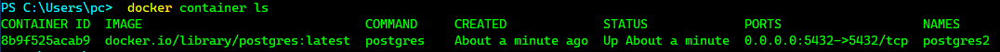
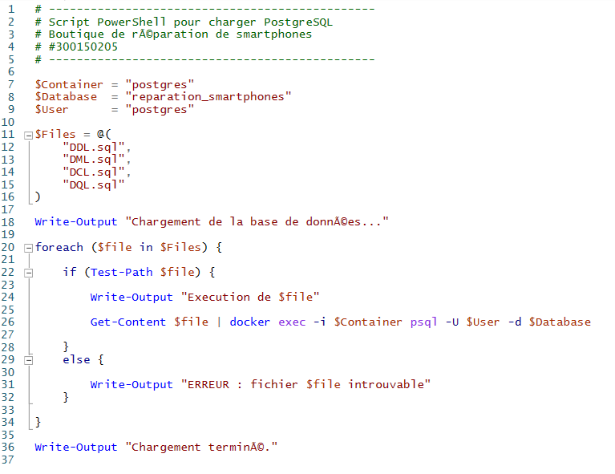
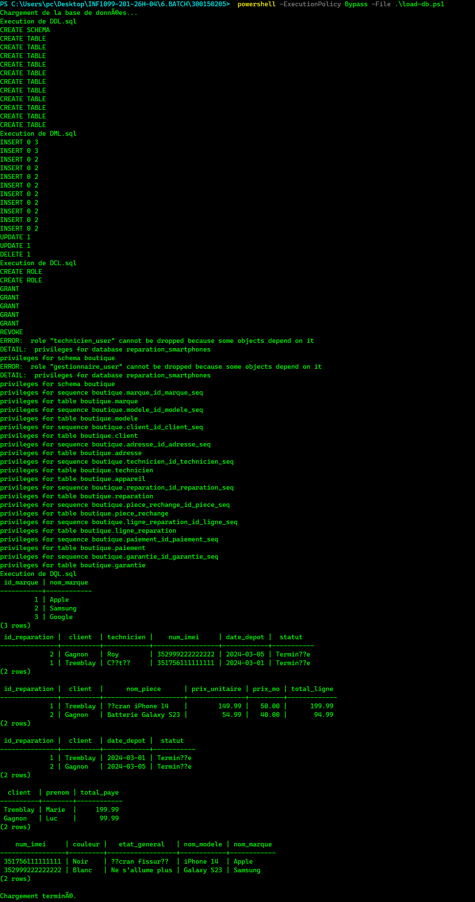
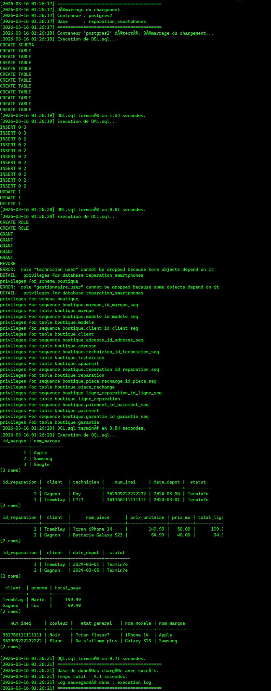
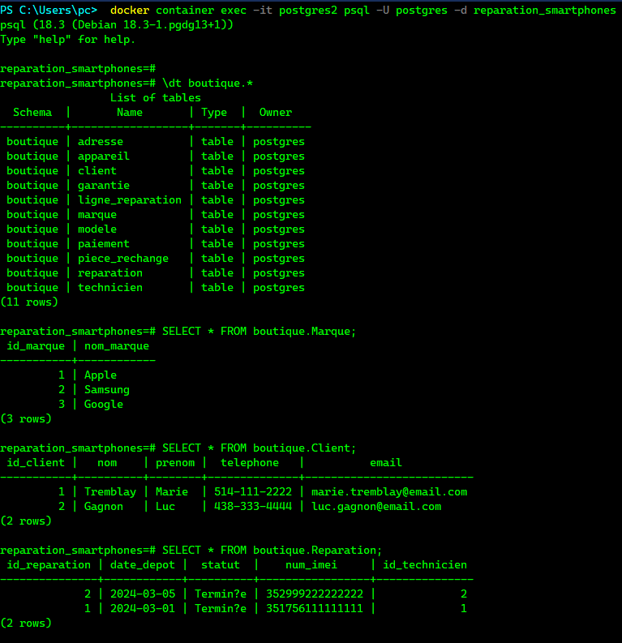
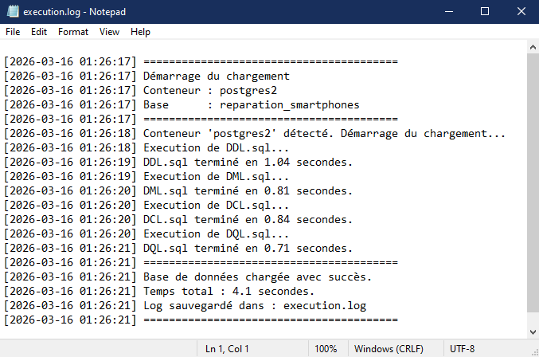

<div align="center">

# ⚙️ TP Batch — PowerShell & PostgreSQL
### Boutique de Réparation de Smartphones


<p align="center">
  
</p>

</div>

---

## 🎯 Objectifs

À la fin de ce laboratoire, l'étudiant sera capable de :

| # | Objectif |
|---|----------|
| 1 | Comprendre les types de scripts SQL |
| 2 | Utiliser Docker pour exécuter PostgreSQL |
| 3 | Écrire un script PowerShell d'automatisation |
| 4 | Charger plusieurs scripts SQL automatiquement |

---

## 📁 Structure du projet

```
300150205/
├── 📄 DDL.sql
├── 📄 DML.sql
├── 📄 DCL.sql
├── 📄 DQL.sql
├── 📄 load-db.ps1
└── 📄 load-db-advanced.ps1
```

> ⚠️ **Ordre d'exécution obligatoire :** `DDL` → `DML` → `DCL` → `DQL`

---

## 🗂️ Types de scripts SQL

| Type | Signification | Exemple | Fichier |
|------|--------------|---------|---------|
| **DDL** | Data Definition Language | `CREATE TABLE` | `DDL.sql` |
| **DML** | Data Manipulation Language | `INSERT`, `UPDATE`, `DELETE` | `DML.sql` |
| **DCL** | Data Control Language | `GRANT`, `REVOKE` | `DCL.sql` |
| **DQL** | Data Query Language | `SELECT` | `DQL.sql` |

---

## 🐳 Démarrer PostgreSQL avec Docker

### Étape 1 : Créer et lancer le conteneur

```powershell
docker run -d `
  --name postgres2 `
  -e POSTGRES_PASSWORD=postgres `
  -e POSTGRES_DB=reparation_smartphones `
  -p 5432:5432 `
  postgres
```

### Étape 2 : Vérifier que le conteneur est actif

```powershell
docker container ls
```

<details>
<summary>📋 Output attendu</summary>

```
CONTAINER ID   IMAGE      STATUS        PORTS                    NAMES
a1b2c3d4e5f6   postgres   Up 1 second   0.0.0.0:5432->5432/tcp   postgres2
```
</details>

<details>
<summary>🖼️ Capture d'écran</summary>



</details>

---

## 📝 Script de base — `load-db.ps1`

### Étape 3 : Créer le fichier `load-db.ps1`

```powershell
# -----------------------------------------------
# Script PowerShell pour charger PostgreSQL
# Boutique de réparation de smartphones
# #300150205
# -----------------------------------------------

$Container = "postgres2"
$Database  = "reparation_smartphones"
$User      = "postgres"

$Files = @(
    "DDL.sql",
    "DML.sql",
    "DCL.sql",
    "DQL.sql"
)

Write-Output "Chargement de la base de données..."

foreach ($file in $Files) {

    if (Test-Path $file) {

        Write-Output "Execution de $file"

        Get-Content $file | docker exec -i $Container psql -U $User -d $Database

    }
    else {

        Write-Output "ERREUR : fichier $file introuvable"
    }

}

Write-Output "Chargement terminé."
```

<details>
<summary>🖼️ Capture d'écran</summary>



</details>

---

## 🚀 Exécuter le script

### Étape 4 : Lancer le script dans PowerShell

> ℹ️ **Note :** La commande `pwsh` nécessite PowerShell 7+. Si elle n'est pas reconnue, utilisez `powershell` à la place (PowerShell 5.1, préinstallé sur Windows).

```powershell
powershell -ExecutionPolicy Bypass -File .\load-db.ps1
```

<details>
<summary>📋 Output attendu</summary>

```
Chargement de la base de données...

Execution de DDL.sql
CREATE SCHEMA
CREATE TABLE
...

Execution de DML.sql
INSERT 0 3
INSERT 0 2
...

Execution de DCL.sql
CREATE ROLE
GRANT
...

Execution de DQL.sql
 id_marque | nom_marque
-----------+------------
         1 | Apple
         2 | Samsung
         3 | Google

Chargement terminé.
```
</details>

<details>
<summary>🖼️ Capture d'écran</summary>



</details>

---

## 🔍 Explication du script

### Liste des fichiers

```powershell
$Files = @(
    "DDL.sql",
    "DML.sql",
    "DCL.sql",
    "DQL.sql"
)
```

Tableau PowerShell contenant les scripts SQL dans l'ordre d'exécution.

---

### Vérification du fichier

```powershell
Test-Path $file
```

Permet de vérifier que le fichier existe avant de l'envoyer. Évite les erreurs silencieuses.

---

### Envoi du script dans le conteneur

```powershell
Get-Content $file | docker exec -i $Container psql -U $User -d $Database
```

| Commande | Rôle |
|----------|------|
| `Get-Content` | Lit le contenu du fichier SQL |
| `\|` | Redirige le contenu vers la commande suivante |
| `docker exec -i` | Exécute une commande dans le conteneur actif |
| `psql` | Client PostgreSQL qui reçoit et exécute le SQL |

---

## 🔥 Version avancée — `load-db-advanced.ps1`

> ✅ **Script recommandé** — même résultat que la version de base, avec en plus la vérification du conteneur, un fichier log horodaté et le chronomètre.

| Bonus | Description |
|-------|-------------|
| 🧩 **Paramètre** | Nom du conteneur passé en argument CLI |
| 📋 **Fichier log** | Toutes les étapes horodatées dans `execution.log` |
| ⏱️ **Chronomètre** | Temps d'exécution par fichier et au total |

### Étape 5 : Exécuter la version avancée

```powershell
# Conteneur par défaut (postgres2)
powershell -ExecutionPolicy Bypass -File .\load-db-advanced.ps1

# Conteneur personnalisé
powershell -ExecutionPolicy Bypass -File .\load-db-advanced.ps1 mon-conteneur
```


<details>
<summary>🖼️ Capture d'écran</summary>



</details>

---

## ✅ Vérification

### Étape 6 : Se connecter dans le conteneur

```powershell
docker container exec -it postgres2 psql -U postgres -d reparation_smartphones
```

### Vérifier les tables créées

```sql
\dt boutique.*
```

### Vérifier les données insérées

```sql
SELECT * FROM boutique.Marque;
SELECT * FROM boutique.Client;
SELECT * FROM boutique.Reparation;
```


<details>
<summary>🖼️ Capture d'écran</summary>



</details>

---

## 🏆 Défi bonus

### 1️⃣ Conteneur en paramètre

```powershell
param (
    [string]$Container = "postgres2"
)
```

```powershell
powershell -ExecutionPolicy Bypass -File .\load-db-advanced.ps1 mon-conteneur
```

---

### 2️⃣ Fichier log `execution.log`

```powershell
function Write-Log {
    param ([string]$Message)
    $timestamp = Get-Date -Format "yyyy-MM-dd HH:mm:ss"
    $line = "[$timestamp] $Message"
    Write-Output $line
    Add-Content -Path $LogFile -Value $line
}
```

Chaque étape est horodatée et sauvegardée dans `execution.log`.

---

### 3️⃣ Temps d'exécution

```powershell
$startTime = Get-Date
# ... exécution ...
$totalSeconds = ($endTime - $startTime).TotalSeconds
Write-Log "Temps total : $([math]::Round($totalSeconds, 2)) secondes."
```

<details>
<summary>🖼️ Capture d'écran</summary>



</details>

---

## 📌 Conclusion

Ce laboratoire m'a permis de mettre en pratique l'automatisation du chargement
d'une base de données PostgreSQL via un script PowerShell et Docker.

Les quatre types de scripts SQL (DDL, DML, DCL, DQL) ont été exécutés avec succès
en **4.1 secondes** sur le conteneur `postgres2`, avec journalisation complète
dans `execution.log`.

---

<details>
<summary>👤 Auteur</summary>

<div align="center">


*Rédigé par un humain... probablement.* 

</div>

</details>