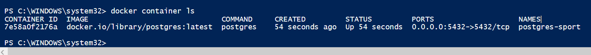
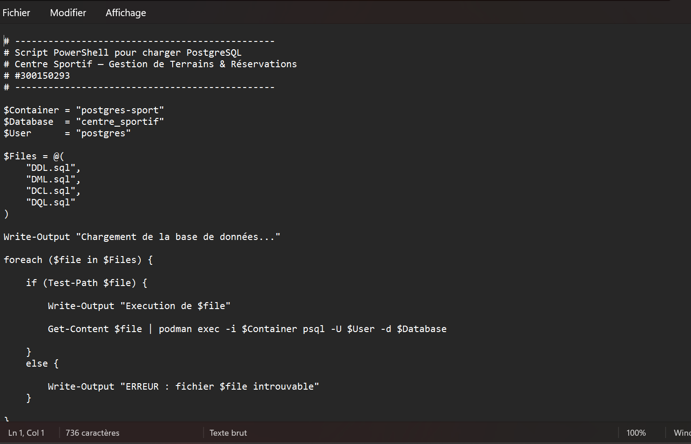
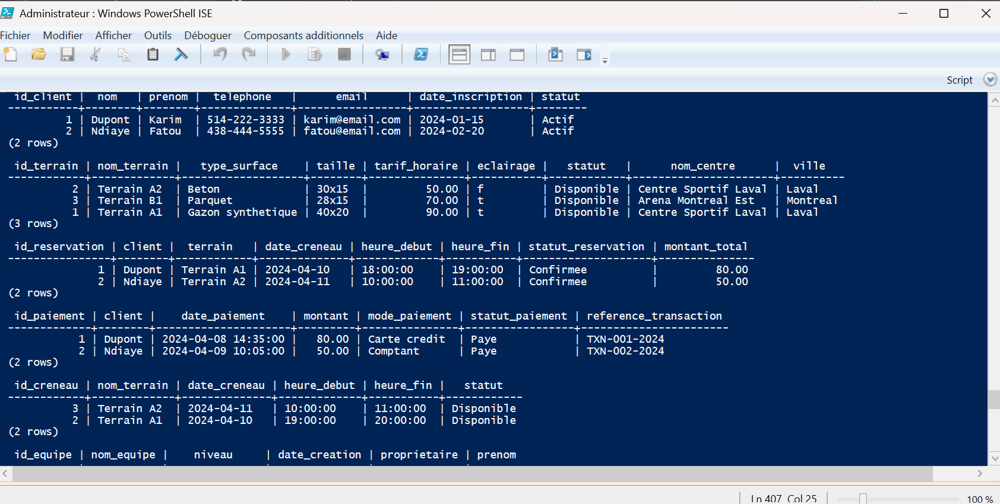
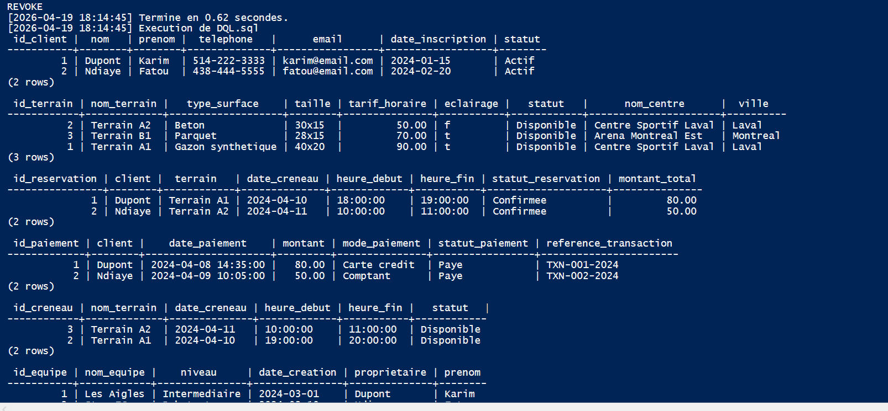
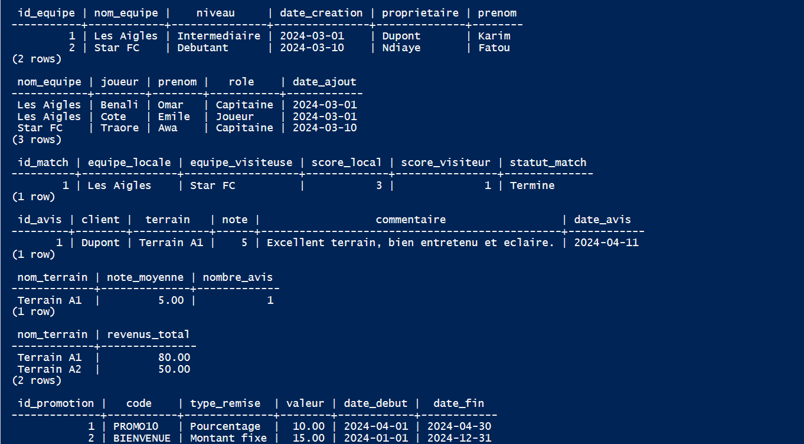
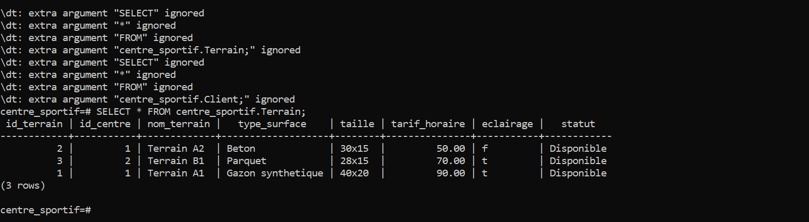
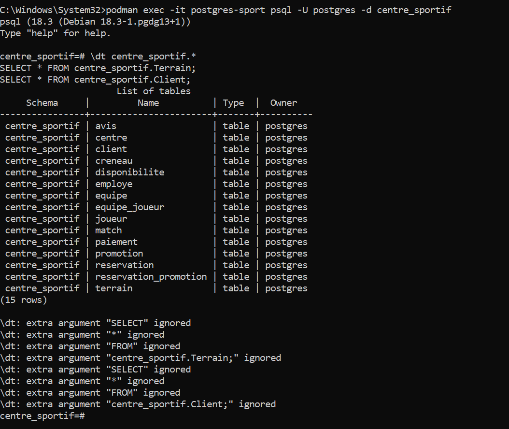
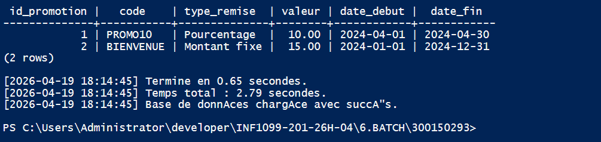

# ⚙️ TP Batch — PowerShell et PostgreSQL
## Centre Sportif — Gestion de Terrains & Réservations


---

## 🎯 Objectifs

À la fin de ce laboratoire, l'étudiant sera capable de :

| # | Objectif |
|---|----------|
| 1 | Comprendre les types de scripts SQL |
| 2 | Utiliser Docker pour exécuter PostgreSQL |
| 3 | Écrire un script PowerShell d'automatisation |
| 4 | Charger plusieurs scripts SQL automatiquement |

---

## 📁 Structure du projet

```
300150293/
├── 📄 DDL.sql
├── 📄 DML.sql
├── 📄 DCL.sql
├── 📄 DQL.sql
├── 📄 load-db.ps1
└── 📄 load-db-advanced.ps1
```

> ⚠️ **Ordre d'exécution obligatoire :** `DDL` → `DML` → `DCL` → `DQL`

---

## 🗂️ Types de scripts SQL

| Type | Signification | Exemple | Fichier |
|------|--------------|---------|---------|
| DDL | Langage de définition de données | `CREATE TABLE` | DDL.sql |
| DML | Langage de manipulation de données | `INSERT, UPDATE, DELETE` | DML.sql |
| DCL | Langage de contrôle des données | `GRANT, REVOKE` | DCL.sql |
| DQL | Langage de requête de données | `SELECT` | DQL.sql |

---

## 🐳 Lancez PostgreSQL avec Docker

### Étape 1 : Créer et lancer le conteneur

```powershell
docker run -d `
  --name postgres-sport `
  -e POSTGRES_PASSWORD=postgres `
  -e POSTGRES_DB=centre_sportif `
  -p 5432:5432 `
  postgres
```

### Étape 2 : Vérifier que le conteneur est actif

```powershell
docker container ls
```

<details>
<summary>📋 Résultat attendu</summary>

```
CONTAINER ID   IMAGE                              STATUS         PORTS                    NAMES
7e58a0f2176a   docker.io/library/postgres:latest  Up 54 seconds  0.0.0.0:5432->5432/tcp   postgres-sport
```

</details>

<details>
<summary>🖼️ Capture d'écran</summary>



</details>

---

## 📝 Script de base — `load-db.ps1`

### Étape 3 : Créer le fichier `load-db.ps1`

```powershell
# -----------------------------------------------
# Script PowerShell pour charger PostgreSQL
# Centre Sportif — Gestion de Terrains & Réservations
# #300150293
# -----------------------------------------------

$Container = "postgres-sport"
$Database  = "centre_sportif"
$User      = "postgres"

$Files = @(
    "DDL.sql",
    "DML.sql",
    "DCL.sql",
    "DQL.sql"
)

Write-Output "Chargement de la base de données..."

foreach ($file in $Files) {

    if (Test-Path $file) {

        Write-Output "Execution de $file"

        Get-Content $file | podman exec -i $Container psql -U $User -d $Database

    }
    else {

        Write-Output "ERREUR : fichier $file introuvable"
    }

}

Write-Output "Chargement terminé."
```

<details>
<summary>🖼️ Capture d'écran</summary>



</details>

---

## 🚀 Exécuter le script

### Étape 4 : Lancer le script dans PowerShell

> ℹ️ **Remarque :** La commande `pwsh` nécessite PowerShell 7+. Si elle n'est pas reconnue, utilisez `powershell` à la place (PowerShell 5.1, préinstallé sur Windows).

```powershell
powershell -ExecutionPolicy Bypass -File .\load-db.ps1
```

<details>
<summary>📋 Résultat attendu</summary>

```
Chargement de la base de données...

Execution de DDL.sql
DROP SCHEMA
CREATE SCHEMA
CREATE TABLE
...

Execution de DML.sql
INSERT 0 2
INSERT 0 2
...

Execution de DCL.sql
CREATE ROLE
GRANT
...

Execution de DQL.sql
 id_terrain | nom_terrain |   type_surface    | taille | tarif_horaire
------------+-------------+-------------------+--------+--------------
          1 | Terrain A1  | Gazon synthetique | 40x20  |         90.00
          2 | Terrain A2  | Beton             | 30x15  |         50.00
          3 | Terrain B1  | Parquet           | 28x15  |         70.00

Chargement terminé.
```

</details>

<details>
<summary>🖼️ Capture d'écran</summary>



</details>

---

## 🔍 Explication du script

### Liste des fichiers

```powershell
$Files = @(
    "DDL.sql",
    "DML.sql",
    "DCL.sql",
    "DQL.sql"
)
```

Tableau PowerShell contenant les scripts SQL dans l'ordre d'exécution.

### Vérification du fichier

```powershell
Test-Path $file
```

Permet de vérifier que le fichier existe avant de l'envoyer. Évite les erreurs silencieuses.

### Envoi du script dans le conteneur

```powershell
Get-Content $file | podman exec -i $Container psql -U $User -d $Database
```

| Commande | Rôle |
|----------|------|
| `Get-Content` | Lit le contenu du fichier SQL |
| `\|` | Redirige le contenu vers la commande suivante |
| `podman exec -i` | Exécute une commande dans le conteneur actif |
| `psql` | Client PostgreSQL qui reçoit et exécute le SQL |

---

## 🔥 Version avancée — `load-db-advanced.ps1`

> ✅ **Script recommandé** — même résultat que la version de base, avec en plus la vérification du conteneur, un fichier log horodaté et le chronomètre.

| Prime | Description |
|-------|-------------|
| 🧩 Paramètre | Nom du conteneur passé en argument CLI |
| 📋 Fichier journal | Toutes les étapes horodatées dans `execution.log` |
| ⏱️ Chronomètre | Temps d'exécution par fichier et au total |

```powershell
# -----------------------------------------------
# Script PowerShell avancé pour charger PostgreSQL
# Centre Sportif — Gestion de Terrains & Réservations
# #300150293
# -----------------------------------------------

param (
    [string]$Container = "postgres-sport"
)

$Database = "centre_sportif"
$User     = "postgres"
$LogFile  = "execution.log"
$Files    = "DDL.sql","DML.sql","DCL.sql","DQL.sql"

function Write-Log {
    param ([string]$Message)
    $timestamp = Get-Date -Format "yyyy-MM-dd HH:mm:ss"
    $line = "[$timestamp] $Message"
    Write-Output $line
    Add-Content -Path $LogFile -Value $line
}

# Vérification du conteneur
$containerRunning = podman ps --format "{{.Names}}" | Select-String $Container

if (-not $containerRunning) {
    Write-Log "ERREUR : le conteneur $Container n'est pas actif."
    exit
}

$globalStart = Get-Date
Write-Log "Chargement de la base de données centre_sportif..."

foreach ($file in $Files) {

    if (-not (Test-Path $file)) {
        Write-Log "ERREUR : fichier manquant : $file"
        exit
    }

    $startTime = Get-Date
    Write-Log "Execution de $file"

    Get-Content $file | podman exec -i $Container psql -U $User -d $Database

    $endTime = Get-Date
    $seconds = ($endTime - $startTime).TotalSeconds
    Write-Log "Termine en $([math]::Round($seconds, 2)) secondes."
}

$globalEnd    = Get-Date
$totalSeconds = ($globalEnd - $globalStart).TotalSeconds
Write-Log "Temps total : $([math]::Round($totalSeconds, 2)) secondes."
Write-Log "Base de données chargée avec succès."
```

### Étape 5 : Exécuter la version avancée

```powershell
# Conteneur par défaut (postgres-sport)
powershell -ExecutionPolicy Bypass -File .\load-db-advanced.ps1

# Conteneur personnalisé
powershell -ExecutionPolicy Bypass -File .\load-db-advanced.ps1 postgres-sport
```

<details>
<summary>🖼️ Capture d'écran — Résultats DQL</summary>



</details>

<details>
<summary>🖼️ Capture d'écran — Fin du script</summary>



</details>

---

## ✅ Vérification

### Étape 6 : Se connecter dans le conteneur

```powershell
podman exec -it postgres-sport psql -U postgres -d centre_sportif
```

### Vérifier les tables créées

```sql
\dt centre_sportif.*
```

### Vérifier les données insérées

```sql
SELECT * FROM centre_sportif.Terrain;
SELECT * FROM centre_sportif.Client;
SELECT * FROM centre_sportif.Reservation;
```

<details>
<summary>🖼️ Capture d'écran — 15 tables</summary>



</details>

<details>
<summary>🖼️ Capture d'écran — SELECT Terrain</summary>



</details>

---

## 🏆 Défi bonus

### 1️⃣ Conteneur en paramètre

```powershell
param (
    [string]$Container = "postgres-sport"
)
powershell -ExecutionPolicy Bypass -File .\load-db-advanced.ps1 postgres-sport
```

### 2️⃣ Fichier journal `execution.log`

```powershell
function Write-Log {
    param ([string]$Message)
    $timestamp = Get-Date -Format "yyyy-MM-dd HH:mm:ss"
    $line = "[$timestamp] $Message"
    Write-Output $line
    Add-Content -Path $LogFile -Value $line
}
```

Chaque étape est horodatée et sauvegardée dans `execution.log`.

### 3️⃣ Temps d'exécution

```powershell
$startTime = Get-Date
# ... exécution ...
$totalSeconds = ($endTime - $startTime).TotalSeconds
Write-Log "Temps total : $([math]::Round($totalSeconds, 2)) secondes."
```

<details>
<summary>🖼️ Capture d'écran — Défi bonus avec paramètre</summary>



</details>

---

## 📌 Conclusion

Ce laboratoire m'a permis de mettre en pratique l'automatisation du chargement d'une base de données PostgreSQL via un script PowerShell et Docker/Podman.

Les quatre types de scripts SQL (DDL, DML, DCL, DQL) ont été exécutés avec succès en **2.79 secondes** sur le conteneur `postgres-sport`, avec journalisation complète dans `execution.log`.
