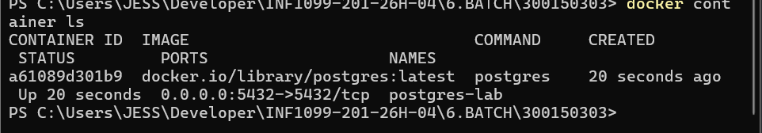
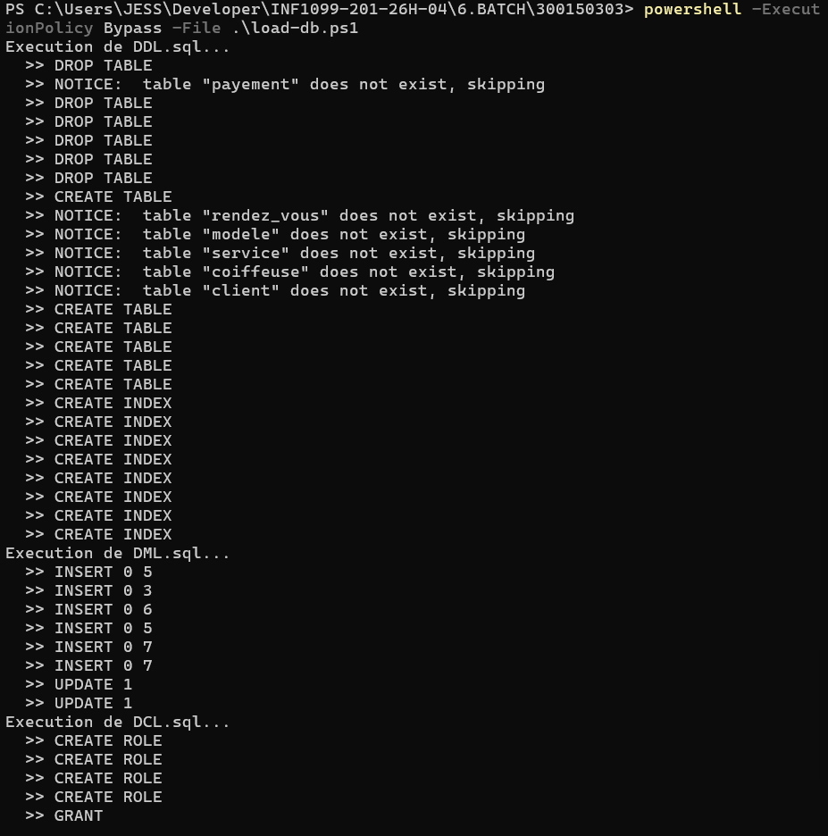
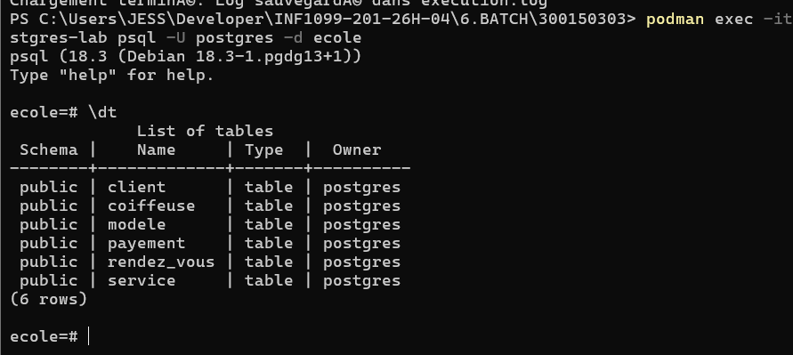
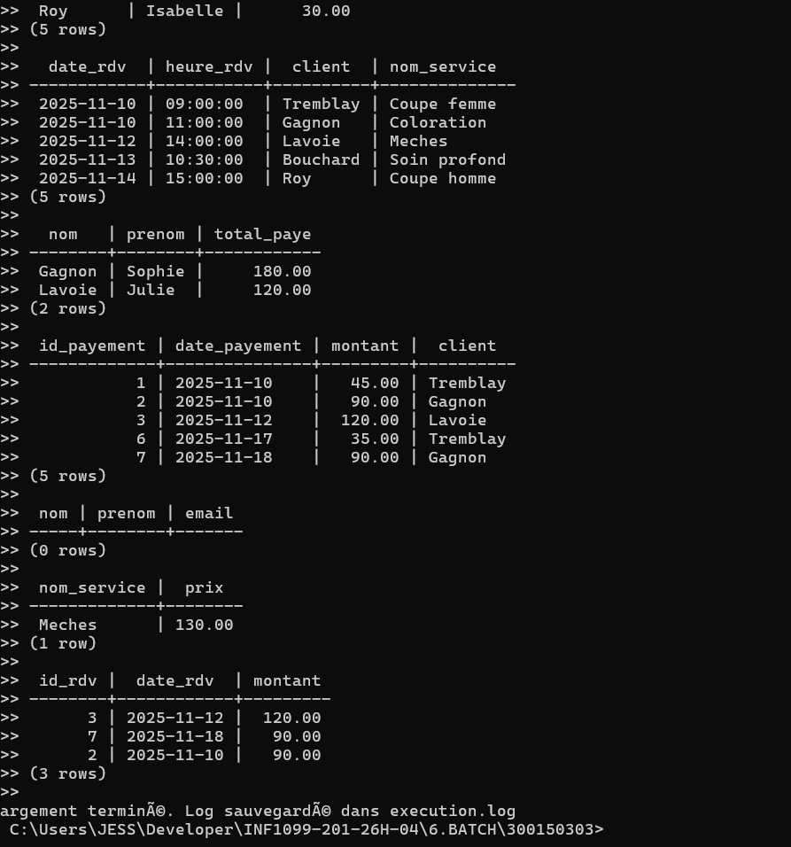

# salon de coiffure — PostgreSQL Lab

> Automated database loading with Docker/Podman and PowerShell  
> Author: Jesmina DOS-REIS 300150303

---

## 📋 Table of Contents

1. [Project Overview](#project-overview)
2. [Project Structure](#project-structure)
3. [SQL Script Types](#sql-script-types)
4. [Database Schema](#database-schema)
5. [Prerequisites](#prerequisites)
6. [Getting Started](#getting-started)
7. [Running the Script](#running-the-script)
8. [Script Explanation](#script-explanation)
9. [Verifying the Data](#verifying-the-data)
10. [Execution Log](#execution-log)
11. [Bonus Features](#bonus-features)

---

## 📌 Project Overview

This lab demonstrates how to:
- Design and manage a **relational PostgreSQL database** for a hair salon
- Organize SQL scripts by type (DDL, DML, DQL, DCL)
- Spin up a **PostgreSQL instance using Docker/Podman**
- Automate the full database loading process with a **PowerShell script**
- Generate an **execution log** for traceability

---

## 📁 Project Structure

```
📁 salon-coiffure/
├── DDL.sql          # Table definitions (structure)
├── DML.sql          # Data insertion and updates
├── DCL.sql          # Roles and access control
├── DQL.sql          # Query examples
├── load-db.ps1      # PowerShell automation script
├── execution.log    # Auto-generated log file
├── images/          # Screenshots
└── README.md        # This file
```

---

## 🗂️ SQL Script Types

| Type | Full Name                  | Purpose                        | Example        |
|------|----------------------------|--------------------------------|----------------|
| DDL  | Data Definition Language   | Create/drop tables and indexes | `CREATE TABLE` |
| DML  | Data Manipulation Language | Insert, update, delete data    | `INSERT`       |
| DQL  | Data Query Language        | Read and query data            | `SELECT`       |
| DCL  | Data Control Language      | Manage roles and permissions   | `GRANT`        |

### ⚠️ Execution Order

The scripts **must** be run in this specific order to respect dependencies:

```
DDL → DML → DCL → DQL
```

> DDL creates the tables first, DML populates them, DCL assigns permissions, and DQL queries the data.

---

## 🗄️ Database Schema

The database models a hair salon with the following tables:

```
CLIENT          — Customers (name, phone, email)
COIFFEUSE       — Hairdressers (name, specialty)
SERVICE         — Services offered (name, price)
MODELE          — Hair models/styles (name, description)
RENDEZ_VOUS     — Appointments (links client, hairdresser, service, model)
PAYEMENT        — Payments (amount, method, linked to appointment)
```

### Relationships

```
CLIENT ──────────┐
COIFFEUSE ───────┤──▶ RENDEZ_VOUS ──▶ PAYEMENT
SERVICE ─────────┤
MODELE ──────────┘
```

---

## ✅ Prerequisites

| Tool             | Purpose                       |
|------------------|-------------------------------|
| Docker or Podman | Run the PostgreSQL container  |
| PowerShell 7+    | Run the automation script     |

Verify your installations:

```powershell
podman --version
pwsh --version
```

---

## 🚀 Getting Started

### Step 1 — Start the PostgreSQL Container

```powershell
podman container run -d `
  --name postgres-lab `
  -e POSTGRES_PASSWORD=postgres `
  -e POSTGRES_DB=ecole `
  -p 5432:5432 `
  postgres
```

### Step 2 — Confirm the Container is Running

```powershell
podman container ls
```

You should see `postgres-lab` listed with status `Up`.



> ✅ The container `postgres-lab` is active and listening on port `5432`.

---

## ▶️ Running the Script

Place all files in the **same folder**, open PowerShell in that folder, then run:

```powershell
powershell -ExecutionPolicy Bypass -File .\load-db.ps1
```

### Custom container name (Bonus feature):

```powershell
powershell -ExecutionPolicy Bypass -File .\load-db.ps1 my-container
```

### Script execution output:



> ✅ The script executes all 4 SQL files in order: DDL → DML → DCL → DQL.  
> Each file reports its result: `CREATE TABLE`, `INSERT`, `CREATE ROLE`, `GRANT`, etc.

---

## 🔍 Script Explanation

### Container name parameter
```powershell
param (
    [string]$Container = "postgres-lab"
)
```
Accepts a custom container name. Defaults to `postgres-lab` if not provided.

### Podman/Docker alias
```powershell
$env:PATH += ";C:\Program Files\RedHat\Podman"
Set-Alias -Name docker -Value podman
```
Makes the script work with both Docker and Podman.

### File verification
```powershell
if (-not (Test-Path $file)) { ... }
```
Checks every SQL file exists before executing anything.

### Container check
```powershell
$containerRunning = docker ps --format "{{.Names}}" | Select-String -Pattern "^$Container$"
```
Verifies the container is active before trying to connect.

### Sending SQL to PostgreSQL
```powershell
Get-Content $file | docker exec -i $Container psql -U $User -d $Database
```

| Command        | Role                                |
|----------------|-------------------------------------|
| `Get-Content`  | Reads the SQL file                  |
| `docker exec`  | Runs a command inside the container |
| `psql`         | PostgreSQL command-line client      |

### Log file generation
```powershell
$output | Out-File $LogFile -Append
```
Every execution result is saved to `execution.log` automatically.

---

## 🔎 Verifying the Data

Connect to the PostgreSQL container:

```powershell
podman exec -it postgres-lab psql -U postgres -d ecole
```

### List all tables with `\dt`



> ✅ All 6 tables are created successfully: `client`, `coiffeuse`, `modele`, `payement`, `rendez_vous`, `service`.

### Query results from DQL.sql



> ✅ The queries return correct data: appointments by date, payments by card, clients who spent over $100, and the most expensive service (Mèches at $130).

Then run these queries manually if needed:

```sql
-- List all tables
\dt

-- Check clients
SELECT * FROM CLIENT;

-- Check appointments
SELECT * FROM RENDEZ_VOUS;

-- Check payments
SELECT * FROM PAYEMENT;

-- Exit
\q
```

---

## 📄 Execution Log

The script automatically generates an `execution.log` file in the same folder.

Example content:
```
=== Start: 2025-11-10 09:12:00 ===
[DDL.sql] DROP TABLE / CREATE TABLE / CREATE INDEX
[DML.sql] INSERT 0 5 / INSERT 0 3
[DCL.sql] CREATE ROLE / GRANT
[DQL.sql] SELECT results...
=== End: 2025-11-10 09:12:05 ===
```

---

## 🌟 Bonus Features

| Feature | Description |
|---------|-------------|
| ✅ Container name parameter | Pass any container name as argument: `.\load-db.ps1 my-container` |
| ✅ Execution log | All output saved automatically to `execution.log` |
| ✅ File validation | Script stops with a clear error if any SQL file is missing |
| ✅ Container validation | Script stops with a clear error if the container is not running |
| ✅ Podman support | Works with both Docker and Podman |
