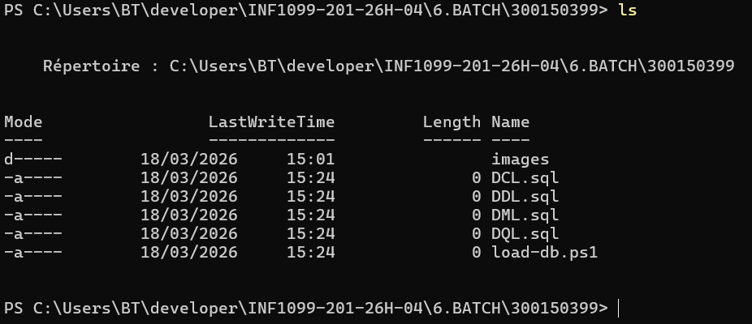
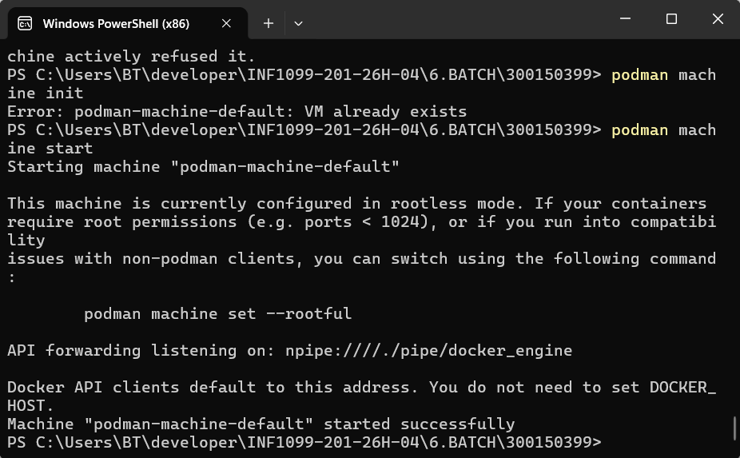
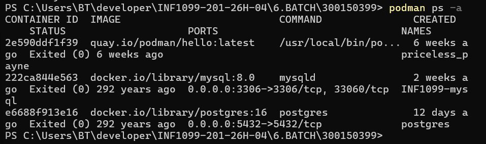
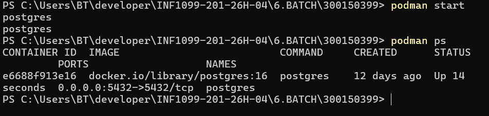
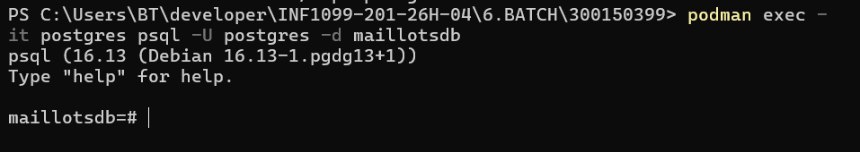
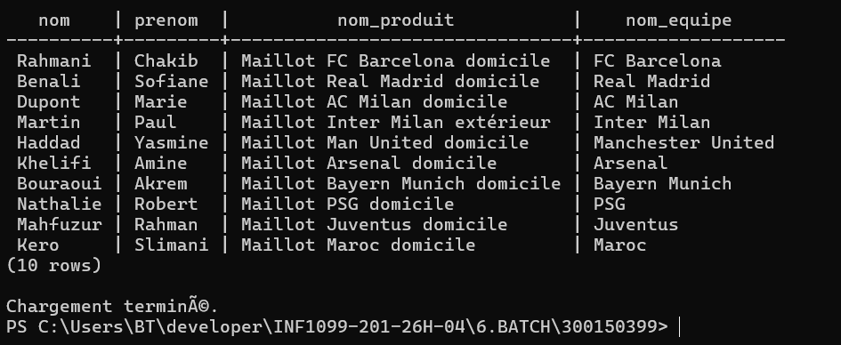
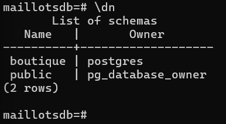
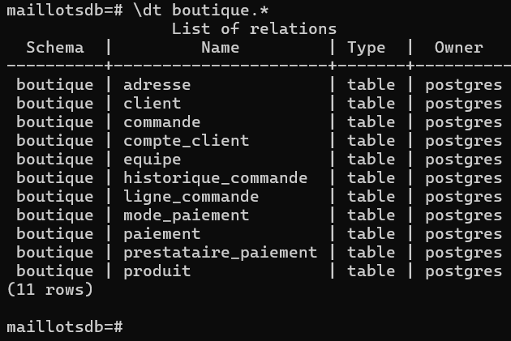
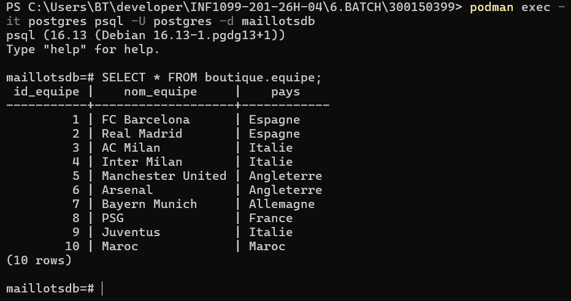

# 🧢 TP Batch — PowerShell & PostgreSQL

<div align="center">


**Automatisation du chargement d'une base PostgreSQL avec PowerShell**

*Boutique Maillots Vintage — E-commerce de maillots de football vintage*

---

| 👤 Étudiant | 🆔 Numéro étudiant | 📘 Cours |
|:-----------:|:------------------:|:--------:|
| Chakib Rahmani | 300150399 | INF1099-201-26H-04 |

</div>

---

## 📋 Table des matières

1. [Introduction](#-introduction)
2. [Objectifs du TP](#-objectifs-du-tp)
3. [Structure du projet](#-structure-du-projet)
4. [Scripts SQL](#-types-de-scripts-sql)
5. [Modèle de données](#-modèle-de-données)
6. [Mise en place du conteneur PostgreSQL](#-mise-en-place-du-conteneur-postgresql)
7. [Script PowerShell](#-script-powershell)
8. [Exécution automatique](#-exécution-automatique)
9. [Vérification de la base](#-vérification-de-la-base)
10. [Conclusion](#-conclusion)

---

## 🏪 Introduction

Ce projet de laboratoire porte sur la **boutique Maillots Vintage**, une boutique e-commerce spécialisée dans la vente de maillots de football vintage. L'objectif est de concevoir et d'automatiser le chargement complet d'une base de données PostgreSQL représentant le modèle métier de cette boutique.

Le travail repose sur l'utilisation d'un **conteneur PostgreSQL géré avec Podman**, d'une série de **scripts SQL organisés par type** (DDL, DML, DCL, DQL), et d'un **script PowerShell** qui orchestre leur exécution de manière automatisée.

---

## 🎯 Objectifs du TP

Ce laboratoire a pour objectifs de :

- ✅ Démarrer et configurer un conteneur PostgreSQL avec Podman
- ✅ Organiser les scripts SQL en plusieurs fichiers selon leur type
- ✅ Automatiser leur exécution avec un script PowerShell
- ✅ Charger automatiquement une base de données complète
- ✅ Vérifier le bon fonctionnement avec des requêtes SQL de test

---

## 📁 Structure du projet

```
300150399/
├── DDL.sql                  # Data Definition Language — création des tables
├── DML.sql                  # Data Manipulation Language — insertion des données
├── DCL.sql                  # Data Control Language — rôles et permissions
├── DQL.sql                  # Data Query Language — requêtes de test
├── load-db.ps1              # Script PowerShell principal
├── load-db-advanced.ps1     # Script PowerShell avancé
└── images/                  # Captures d'écran
```

> 📸 *Capture de la structure réelle du dossier (18/03/2026) :*



---

## 🗃️ Types de scripts SQL

Les scripts SQL sont organisés en **4 types distincts**, exécutés dans l'ordre suivant :

```
DDL → DML → DCL → DQL
```

| Ordre | Fichier | Type | Rôle |
|:-----:|---------|------|------|
| 1️⃣ | `DDL.sql` | Data Definition Language | Création du schéma et des tables |
| 2️⃣ | `DML.sql` | Data Manipulation Language | Insertion des données |
| 3️⃣ | `DCL.sql` | Data Control Language | Gestion des rôles et permissions |
| 4️⃣ | `DQL.sql` | Data Query Language | Requêtes de vérification |

> ⚠️ L'ordre d'exécution est **obligatoire** : DDL doit précéder DML, qui doit précéder DCL, etc.

---

## 🗂️ Modèle de données

La base `maillotsdb` contient un schéma unique nommé **`boutique`**, composé de **11 tables** :

```
boutique
├── client                    # Informations sur les clients
├── adresse                   # Adresses des clients
├── compte_client             # Comptes utilisateurs
├── equipe                    # Équipes de football
├── produit                   # Maillots disponibles
├── commande                  # Commandes passées
├── ligne_commande            # Détail des commandes
├── mode_paiement             # Modes de paiement disponibles
├── prestataire_paiement      # Prestataires de paiement
├── paiement                  # Paiements effectués
└── historique_commande       # Historique des statuts de commande
```

---

## 🐳 Mise en place du conteneur PostgreSQL

### Étape 1 — Démarrage de Podman

Avant de lancer le conteneur, la machine virtuelle Podman doit être démarrée :

```powershell
podman machine start
```

> 📸 *Démarrage de la machine Podman :*



---

### Étape 2 — Vérification des conteneurs existants

```powershell
podman ps -a
```

> 📸 *Liste de tous les conteneurs disponibles :*



---

### Étape 3 — Lancement du conteneur PostgreSQL

Le conteneur PostgreSQL est créé et lancé avec la commande suivante :

```powershell
podman run -d `
  --name postgres `
  -e POSTGRES_USER=postgres `
  -e POSTGRES_PASSWORD=postgres `
  -e POSTGRES_DB=maillotsdb `
  -p 5432:5432 `
  -v postgres_data:/var/lib/postgresql/data `
  docker.io/library/postgres:16
```

| Paramètre | Valeur |
|-----------|--------|
| Image | `postgres:16` |
| Nom du conteneur | `postgres` |
| Utilisateur | `postgres` |
| Mot de passe | `postgres` |
| Base de données | `maillotsdb` |
| Port exposé | `5432` |

Pour démarrer un conteneur déjà existant :

```powershell
podman start postgres
```

> 📸 *Conteneur postgres démarré et en cours d'exécution :*



---

### Étape 4 — Connexion à PostgreSQL

```powershell
podman exec -it postgres psql -U postgres -d maillotsdb
```

> 📸 *Connexion interactive à la base maillotsdb via psql :*



---

## ⚙️ Script PowerShell

Le script `load-db.ps1` automatise l'exécution séquentielle des fichiers SQL dans le conteneur PostgreSQL.

### Principe de fonctionnement

```
1. Définir le chemin du dossier courant
2. Pour chaque fichier SQL (DDL → DML → DCL → DQL) :
   ├── Vérifier que le fichier existe
   ├── Lire son contenu
   ├── L'envoyer à PostgreSQL via `podman exec`
   └── Afficher la progression
3. Afficher un message de confirmation à la fin
```

### Extrait de logique du script

```powershell
$scripts = @("DDL.sql", "DML.sql", "DCL.sql", "DQL.sql")

foreach ($script in $scripts) {
    $path = Join-Path $PSScriptRoot $script
    if (Test-Path $path) {
        $content = Get-Content $path -Raw
        $content | podman exec -i postgres psql -U postgres -d maillotsdb
        Write-Host "✅ $script exécuté avec succès."
    } else {
        Write-Host "❌ Fichier introuvable : $script"
    }
}
Write-Host "Chargement terminé."
```

---

## ▶️ Exécution automatique

Pour exécuter le script de chargement, lancer la commande suivante depuis le dossier `300150399/` :

```powershell
.\load-db.ps1
```

> 📸 *Résultat de l'exécution du script PowerShell avec requêtes JOIN de vérification :*



---

## 🔍 Vérification de la base

### Vérification du schéma

Une fois connecté à `maillotsdb`, vérifier la présence du schéma `boutique` :

```sql
\dn
```

> 📸 *Schéma boutique confirmé avec `\dn` :*



---

### Vérification des tables

```sql
\dt boutique.*
```

> 📸 *Liste complète des 11 tables du schéma boutique :*



---

### Requêtes de vérification des données

```sql
-- Vérifier les équipes chargées
SELECT * FROM boutique.equipe;

-- Vérifier les clients
SELECT * FROM boutique.client;

-- Requête JOIN : clients, produits et équipes
SELECT c.nom, c.prenom, p.nom_produit, e.nom_equipe
FROM boutique.client c
JOIN boutique.commande co ON c.id_client = co.id_client
JOIN boutique.ligne_commande lc ON co.id_commande = lc.id_commande
JOIN boutique.produit p ON lc.id_produit = p.id_produit
JOIN boutique.equipe e ON p.id_equipe = e.id_equipe;
```

> 📸 *Résultats des requêtes SQL — 10 équipes chargées et requête JOIN sur les commandes :*



---

## ✅ Conclusion

Ce travail pratique a permis de mettre en œuvre plusieurs compétences fondamentales en administration de bases de données et en automatisation :

- 📌 **Compréhension des scripts SQL** — distinction claire entre DDL, DML, DCL et DQL et leur rôle respectif dans le cycle de vie d'une base de données.
- 🐳 **Utilisation de PostgreSQL dans un conteneur** — maîtrise de Podman pour isoler et gérer un environnement de base de données reproductible.
- ⚙️ **Automatisation avec PowerShell** — développement d'un script capable d'orchestrer l'exécution séquentielle de fichiers SQL avec gestion des erreurs et affichage de progression.
- 🗂️ **Structuration d'un projet de base de données** — organisation rigoureuse des fichiers et respect des conventions de nommage et d'ordre d'exécution.

Ce TP constitue une base solide pour des projets plus complexes impliquant l'intégration continue, la migration de données et l'automatisation d'environnements de bases de données en entreprise.

---

<div align="center">

*Chakib Rahmani — 300150399 — INF1099-201-26H-04 — 2026*


</div>
