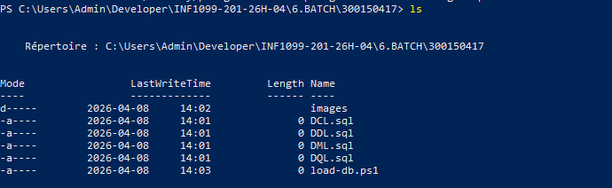
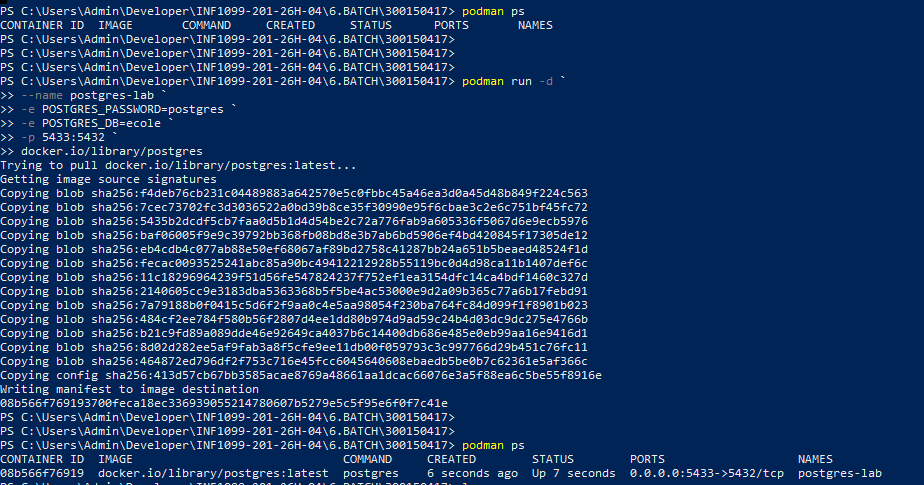
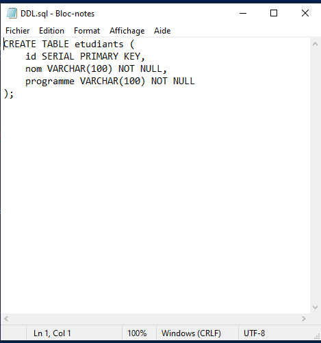
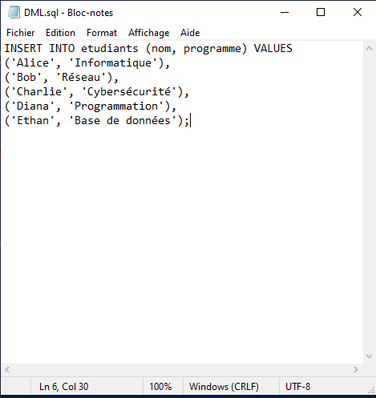
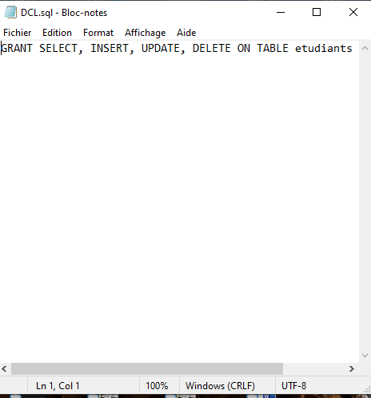
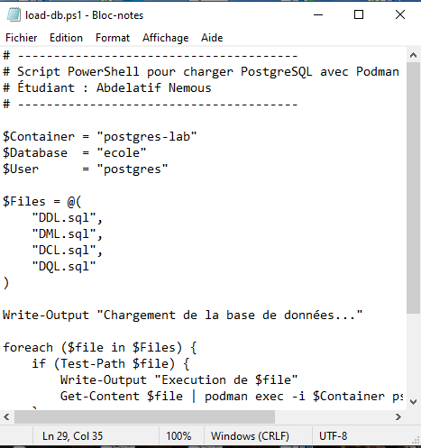
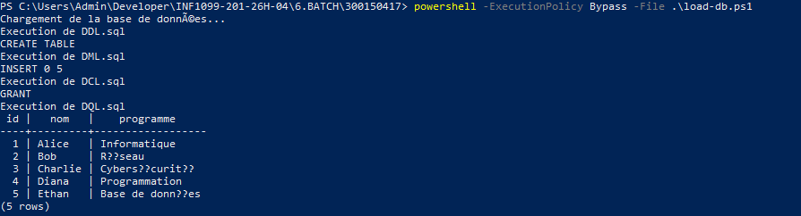

# 🗄️ Laboratoire — Automatisation SQL avec PostgreSQL & Podman

> **INF1099-201-26H-04 · Laboratoire 6 · Étudiant : Abdelatif Nemous**

---

## 📋 Objectifs

À la fin de ce laboratoire, l'étudiant est capable de :

- Comprendre les quatre types de scripts SQL (DDL, DML, DCL, DQL)
- Lancer un conteneur PostgreSQL avec **Podman**
- Écrire un script **PowerShell** d'automatisation
- Charger plusieurs scripts SQL automatiquement dans la base de données

---

## 🗂️ Types de scripts SQL

| Type | Signification | Exemple |
|------|--------------|---------|
| **DDL** | Data Definition Language | `CREATE TABLE` |
| **DML** | Data Manipulation Language | `INSERT` |
| **DCL** | Data Control Language | `GRANT` |
| **DQL** | Data Query Language | `SELECT` |

> ⚠️ **Ordre d'exécution obligatoire :** `DDL → DML → DCL → DQL`

---

## 📁 Structure du projet

```
300150417/
├── DDL.sql          ← Création de la table
├── DML.sql          ← Insertion des données
├── DCL.sql          ← Attribution des droits
├── DQL.sql          ← Requête de vérification
├── load-db.ps1      ← Script d'automatisation PowerShell
└── images/
```



---

## 🐘 Démarrer PostgreSQL avec Podman

### Lancer le conteneur

```powershell
podman run -d `
  --name postgres-lab `
  -e POSTGRES_PASSWORD=postgres `
  -e POSTGRES_DB=ecole `
  -p 5433:5432 `
  docker.io/library/postgres
```

> 📌 **Note :** Le port `5433` sur la machine hôte est mappé au port `5432` du conteneur (utile si PostgreSQL est déjà installé localement).

### Vérifier que le conteneur est actif

```powershell
podman ps
```



---

## 📝 Contenu des fichiers SQL

### `DDL.sql` — Création de la table

```sql
CREATE TABLE etudiants (
    id        SERIAL PRIMARY KEY,
    nom       VARCHAR(100) NOT NULL,
    programme VARCHAR(100) NOT NULL
);
```



---

### `DML.sql` — Insertion des données

```sql
INSERT INTO etudiants (nom, programme) VALUES
('Alice',   'Informatique'),
('Bob',     'Réseau'),
('Charlie', 'Cybersécurité'),
('Diana',   'Programmation'),
('Ethan',   'Base de données');
```



---

### `DCL.sql` — Attribution des droits

```sql
GRANT SELECT, INSERT, UPDATE, DELETE ON TABLE etudiants TO postgres;
```



---

### `DQL.sql` — Requête de vérification

```sql
SELECT * FROM etudiants;
```

---

## ⚙️ Script PowerShell — `load-db.ps1`

```powershell
# ---------------------------------------
# Script PowerShell pour charger PostgreSQL avec Podman
# Étudiant : Abdelatif Nemous
# ---------------------------------------

$Container = "postgres-lab"
$Database  = "ecole"
$User      = "postgres"

$Files = @(
    "DDL.sql",
    "DML.sql",
    "DCL.sql",
    "DQL.sql"
)

Write-Output "Chargement de la base de données..."

foreach ($file in $Files) {
    if (Test-Path $file) {
        Write-Output "Execution de $file"
        Get-Content $file | podman exec -i $Container psql -U $User -d $Database
    }
    else {
        Write-Output "ERREUR : fichier $file introuvable"
    }
}

Write-Output "Chargement terminé."
```



### Explication des commandes clés

| Commande | Rôle |
|----------|------|
| `$Files = @(...)` | Tableau PowerShell listant les scripts dans l'ordre d'exécution |
| `Test-Path $file` | Vérifie l'existence du fichier avant de l'exécuter |
| `Get-Content $file` | Lit le contenu du fichier SQL |
| `podman exec -i` | Exécute une commande à l'intérieur du conteneur |
| `psql -U $User -d $Database` | Lance le client PostgreSQL dans le conteneur |

---

## ▶️ Exécution du script

Depuis PowerShell, dans le répertoire du projet :

```powershell
powershell -ExecutionPolicy Bypass -File .\load-db.ps1
```

> ℹ️ `pwsh` n'étant pas disponible dans cet environnement, on utilise `powershell` avec le flag `-ExecutionPolicy Bypass`.

### Sortie attendue

```
Chargement de la base de données...
Execution de DDL.sql
CREATE TABLE
Execution de DML.sql
INSERT 0 5
Execution de DCL.sql
GRANT
Execution de DQL.sql
 id |   nom   |    programme
----+---------+------------------
  1 | Alice   | Informatique
  2 | Bob     | Réseau
  3 | Charlie | Cybersécurité
  4 | Diana   | Programmation
  5 | Ethan   | Base de données
(5 rows)

Chargement terminé.
```



---

## ✅ Vérification dans le conteneur

Se connecter directement à PostgreSQL :

```powershell
podman exec -it postgres-lab psql -U postgres -d ecole
```

Puis exécuter la requête :

```sql
SELECT * FROM etudiants;
```

---

## 🔍 Résumé du flux d'exécution

```
load-db.ps1
    │
    ├─▶ DDL.sql  ──▶  CREATE TABLE etudiants
    ├─▶ DML.sql  ──▶  INSERT 5 lignes
    ├─▶ DCL.sql  ──▶  GRANT permissions
    └─▶ DQL.sql  ──▶  SELECT * (vérification)
```

---

## 🛠️ Dépendances

| Outil | Version | Rôle |
|-------|---------|------|
| Podman | ≥ 4.x | Gestionnaire de conteneurs |
| PostgreSQL | 18.3 (image Docker) | Base de données |
| PowerShell | 5.1+ | Automatisation |

---

*Laboratoire réalisé le 8 avril 2026 · INF1099-201-26H-04*