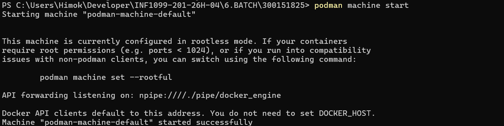
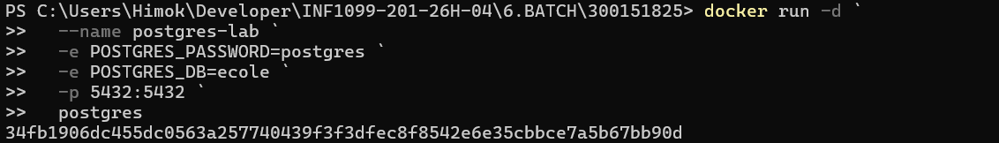
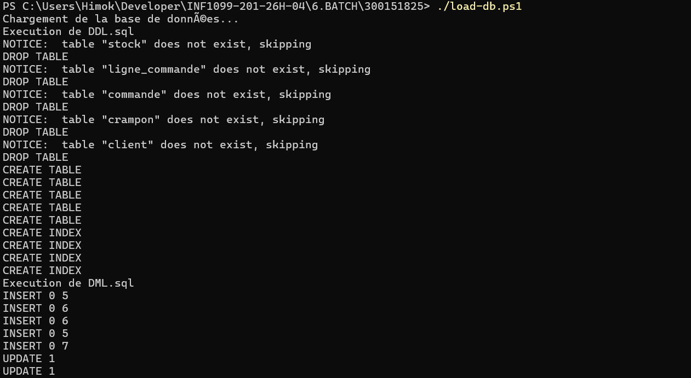
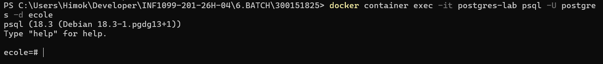
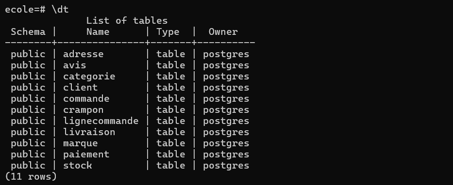

# 🪤 BATCH REALISÉ par Freedy EBAH

## 1. Démarrer Podman
```powershell
podman machine start
```
Résultat:


## 2. Créer le conteneur PostgreSQL
```powershell
docker run -d `
  --name postgres-lab `
  -e POSTGRES_PASSWORD=postgres `
  -e POSTGRES_DB=ecole `
  -p 5432:5432 `
  postgres
```
Résultat:


## 3. Vérifier le conteneur
```powershell
docker container ls
```
Résultat:


## 4. Exécuter le script PowerShell
```powershell
./load-db.ps1
```
Résultat:


## 5. Se connecter à la base de données
```powershell
docker container exec -it postgres-lab psql -U postgres -d ecole
```
Résultat:


## 6. Vérifier les tables
```sql
\dt
```
Résultat:


Résultat:


## 7. Requête sur la table client
```sql
SELECT * FROM client;
```
Résultat:

