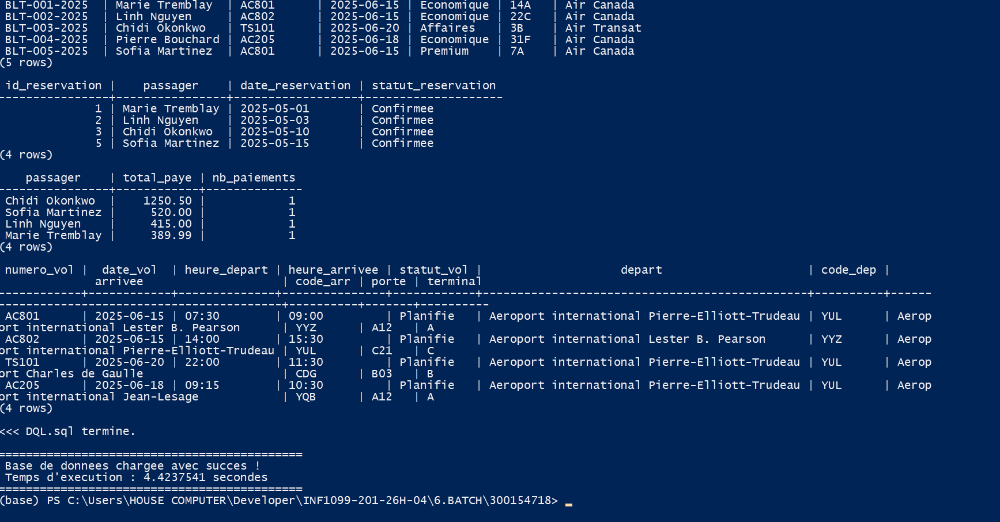
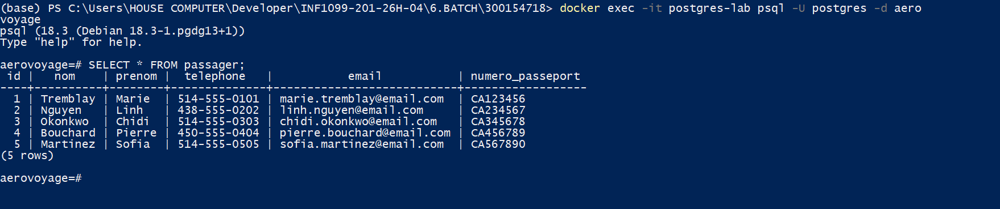

# 🧪 Lab BATCH — Automatisation PostgreSQL avec PowerShell & Docker

> **INF1099 — Bases de données** · AeroVoyage (Compagnie Aerienne)

---

## 📋 Table des matières

- [Objectif](#-objectif)
- [Technologies](#-technologies)
- [Structure du projet](#-structure-du-projet)
- [Mise en place](#-mise-en-place)
- [Script PowerShell](#️-script-powershell)
- [Vérification](#-vérification-des-données)
- [Résultats](#-résultats)

---

## 🎯 Objectif

Automatiser le déploiement complet d'une base de données **PostgreSQL** via un script **PowerShell**, en exécutant une série de scripts SQL dans un ordre précis :

| Étape | Fichier | Rôle |
|-------|---------|------|
| 1️⃣ | `DDL.sql` | Création du schéma et des tables |
| 2️⃣ | `DML.sql` | Insertion des données |
| 3️⃣ | `DCL.sql` | Gestion des utilisateurs et permissions |
| 4️⃣ | `DQL.sql` | Vérification et requêtes de contrôle |

---

## 🛠 Technologies


---

## 📁 Structure du projet

```
6.BATCH/
│
├── 📄 DDL.sql          # Création du schéma et des tables
├── 📄 DML.sql          # Insertion des données
├── 📄 DCL.sql          # Gestion des utilisateurs et permissions
├── 📄 DQL.sql          # Requêtes de vérification
├── ⚙️  load-db.ps1     # Script d'automatisation PowerShell
└── 🖼️  images/         # Captures d'écran du laboratoire
```


---

## 🐳 Mise en place

### 1. Lancer le conteneur PostgreSQL

```powershell
docker run -d `
  --name postgres-lab `
  -e POSTGRES_PASSWORD=postgres `
  -e POSTGRES_DB=aerovoyage `
  -p 5432:5432 `
  postgres
```

### 2. Vérifier que le conteneur est actif

```powershell
docker ps
```


> ✅ Le conteneur `postgres-lab` apparaît avec le statut **Up**.

---

## ⚙️ Script PowerShell

### Fonctionnement de `load-db.ps1`

Le script exécute automatiquement les fichiers SQL dans l'ordre suivant :

```
DDL ──► DML ──► DCL ──► DQL
```

**Étapes du script :**

1. ✔️ Vérifie que le conteneur Docker est actif
2. ✔️ Vérifie que tous les fichiers SQL sont présents
3. ✔️ Exécute les scripts SQL dans PostgreSQL
4. ✔️ Affiche le temps d'exécution

### Exécution

```powershell
powershell -ExecutionPolicy Bypass -File .\load-db.ps1
```



---

## 📊 Vérification des données

### Connexion au conteneur

```powershell
docker exec -it postgres-lab psql -U postgres -d aerovoyage
```

### Requêtes de vérification

```sql
SELECT * FROM passager;
SELECT * FROM vol;
SELECT * FROM billet;
```



---

## ✅ Résultats

Le script PowerShell permet d'automatiser **complètement** le déploiement de la base de données PostgreSQL :

- 🏗️ Les tables sont créées via `DDL.sql`
- 📥 Les données sont insérées via `DML.sql`
- 🔐 Les permissions sont appliquées via `DCL.sql`
- 🔍 Les résultats sont vérifiés via `DQL.sql`

> Cette approche réduit les erreurs humaines et accélère le déploiement répétable d'environnements de base de données.

---

*Cours INF1099 — Bases de données · AeroVoyage*
