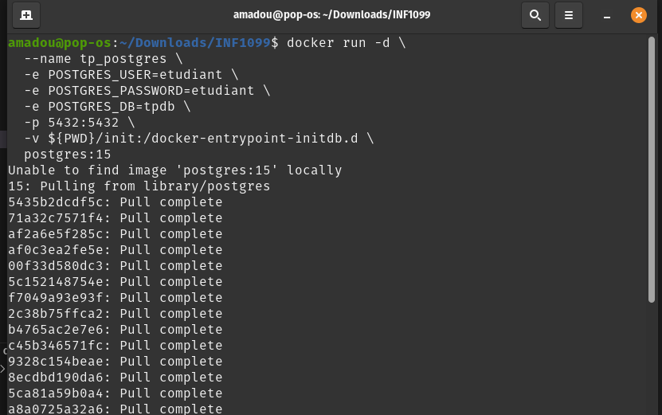
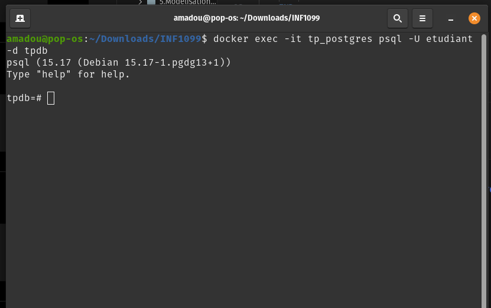
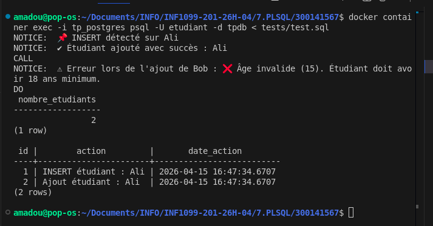

# 🐳 TP PostgreSQL — Languages Procéduraux (PL/pgSQL)

## 📌 Description du laboratoire

Ce laboratoire a pour objectif de comprendre et manipuler les **langages procéduraux SQL (PL)**, en particulier **PL/pgSQL (PostgreSQL)**.

Vous allez apprendre à :

- Créer des **fonctions**
- Créer des **procédures stockées**
- Utiliser des **triggers**
- Gérer des **exceptions**
- Automatiser des règles métier directement dans la base de données

---

## 🎯 Objectifs pédagogiques

À la fin de ce TP, l’étudiant sera capable de :

1. Différencier **fonction** et **procédure stockée**
2. Implémenter des fonctions en PL/pgSQL
3. Créer des procédures avec logique métier
4. Utiliser des triggers pour automatiser des actions
5. Gérer les erreurs et exceptions dans PostgreSQL

---

# 🐳 **TP PostgreSQL — Stored Proc**

## 1️⃣ Structure du projet

```
🆔/
│
├── init/
│   ├── 01-ddl.sql
│   ├── 02-dml.sql
│   └── 03-programmation.sql   <-- À compléter par l’étudiant
│
├── tests/
│   └── test.sql
│
└── README.md
```

---

## 2️⃣ Lancer PostgreSQL avec Docker

- [ ] 🪟 PowerShell

```powershell
docker run -d `
  --name tp_postgres `
  -e POSTGRES_USER=etudiant `
  -e POSTGRES_PASSWORD=etudiant `
  -e POSTGRES_DB=tpdb `
  -p 5432:5432 `
  -v ${PWD}/init:/docker-entrypoint-initdb.d `
  postgres:15
```

- [ ] 🐧 *nix

```bash
docker run -d \
  --name tp_postgres \
  -e POSTGRES_USER=etudiant \
  -e POSTGRES_PASSWORD=etudiant \
  -e POSTGRES_DB=tpdb \
  -p 5432:5432 \
  -v ${PWD}/init:/docker-entrypoint-initdb.d \
  postgres:15
```



### Explications

* `-v $(pwd)/init:/docker-entrypoint-initdb.d` → tous les fichiers SQL dans `init/` sont exécutés automatiquement au démarrage.
* `-p 5432:5432` → exposer PostgreSQL sur ton PC.
* Les étudiants peuvent compléter `03-programmation.sql` sans toucher à Docker.

---

## 3️⃣ Fichiers fournis

### 3.1 `01-ddl.sql`

```sql
CREATE TABLE etudiants (
    id SERIAL PRIMARY KEY,
    nom TEXT NOT NULL,
    age INT,
    email TEXT UNIQUE,
    date_creation TIMESTAMP DEFAULT CURRENT_TIMESTAMP
);

CREATE TABLE logs (
    id SERIAL PRIMARY KEY,
    action TEXT,
    date_action TIMESTAMP DEFAULT CURRENT_TIMESTAMP
);
```

### 3.2 `02-dml.sql`

```sql
INSERT INTO etudiants (nom, age, email)
VALUES ('Test', 20, 'test@email.com');
```

### 3.3 `03-programmation.sql`

```sql

CREATE OR REPLACE PROCEDURE ajouter_etudiant(
    p_nom TEXT,
    p_age INT,
    p_email TEXT
)
LANGUAGE plpgsql
AS $$
BEGIN

    -- 🔎 Validation âge
    IF p_age < 18 THEN
        RAISE EXCEPTION '❌ Âge invalide (%). Étudiant doit avoir 18 ans minimum.', p_age;
    END IF;

    -- 🔎 Validation email
    IF p_email !~* '^[^@]+@[^@]+\.[^@]+$' THEN
        RAISE EXCEPTION '❌ Email invalide : %', p_email;
    END IF;

    -- 📥 Insertion étudiant
    INSERT INTO etudiants(nom, age, email)
    VALUES (p_nom, p_age, p_email);

    -- 📝 Log automatique
    INSERT INTO logs(action)
    VALUES ('Ajout étudiant : ' || p_nom);

    -- ✅ Message succès
    RAISE NOTICE '✔ Étudiant ajouté avec succès : %', p_nom;

EXCEPTION
    WHEN others THEN
        -- ❌ Gestion erreur globale
        RAISE NOTICE '⚠ Erreur lors de l''ajout de % : %', p_nom, SQLERRM;
END;
$$;


CREATE OR REPLACE FUNCTION nombre_etudiants()
RETURNS INT
LANGUAGE plpgsql
AS $$
DECLARE
    total INT;
BEGIN

    SELECT COUNT(*) INTO total FROM etudiants;

    RETURN total;

END;
$$;


CREATE OR REPLACE FUNCTION verifier_age()
RETURNS TRIGGER
LANGUAGE plpgsql
AS $$
BEGIN

    IF NEW.age < 18 THEN
        RAISE EXCEPTION '❌ Trigger : âge invalide (%).', NEW.age;
    END IF;

    RETURN NEW;

END;
$$;

CREATE TRIGGER trg_verifier_age
BEFORE INSERT ON etudiants
FOR EACH ROW
EXECUTE FUNCTION verifier_age();


CREATE OR REPLACE FUNCTION log_etudiant()
RETURNS TRIGGER
LANGUAGE plpgsql
AS $$
BEGIN

    -- 🔁 Détection type d'opération
    IF TG_OP = 'INSERT' THEN
        INSERT INTO logs(action)
        VALUES ('INSERT étudiant : ' || NEW.nom);

        RAISE NOTICE '📌 INSERT détecté sur %', NEW.nom;

    ELSIF TG_OP = 'UPDATE' THEN
        INSERT INTO logs(action)
        VALUES ('UPDATE étudiant : ' || NEW.nom);

        RAISE NOTICE '📌 UPDATE détecté sur %', NEW.nom;

    ELSIF TG_OP = 'DELETE' THEN
        INSERT INTO logs(action)
        VALUES ('DELETE étudiant : ' || OLD.nom);

        RAISE NOTICE '📌 DELETE détecté sur %', OLD.nom;
    END IF;

    RETURN NULL;

END;
$$;

CREATE TRIGGER trg_log_etudiant
AFTER INSERT OR UPDATE OR DELETE ON etudiants
FOR EACH ROW
EXECUTE FUNCTION log_etudiant();


```

---

## 4️⃣ Fichier tests/test.sql

```sql
-- Test insertion valide
CALL ajouter_etudiant('Ali', 22, 'ali@email.com');

-- Test insertion invalide
DO $$
BEGIN
    BEGIN
        CALL ajouter_etudiant('Bob', 15, 'bob@email.com');
    EXCEPTION
        WHEN others THEN
            RAISE NOTICE 'Erreur attendue OK';
    END;
END;
$$;

-- Test fonction
SELECT nombre_etudiants();

-- Vérifier logs
SELECT * FROM logs;
```

---

## 5️⃣ Connexion à PostgreSQL

```bash
docker container exec -it tp_postgres psql -U etudiant -d tpdb
```

---

## 6️⃣ Automatiser les tests


- [ ] 🪟 Windows

```powershell
Get-Content tests/test.sql | docker exec -i tp_postgres psql -U etudiant -d tpdb
```

- [ ] 🐧 *nix

```bash
docker container exec -i tp_postgres psql -U etudiant -d tpdb < tests/test.sql
```

> Les étudiants verront directement les résultats des triggers et procédures.


---

## 7️⃣ Avantages de cette version

* Très simple : **une seule commande Docker** pour lancer PostgreSQL.
* Les volumes `init/` permettent aux étudiants de remettre leur code facilement.

---

**Fichier `03-programmation.sql` , les exemples et **les parties à compléter en commentaires** à coder.

---

```sql
-- ==================================================================================
-- 03-programmation.sql
-- TP PostgreSQL : Fonctions, Procédures Stockées et Triggers
-- ==================================================================================

-- ============================================================
-- 1️⃣ Procédure : ajouter_etudiant
-- ============================================================
-- Objectif : Ajouter un étudiant avec validations et journalisation
-- Étudiant doit compléter : la partie RAISE NOTICE, exceptions, validations
-- ============================================================

CREATE OR REPLACE PROCEDURE ajouter_etudiant(nom TEXT, age INT, email TEXT)
LANGUAGE plpgsql
AS $$
BEGIN
    -- TODO : Vérifier que l'âge >= 18
    IF age < 18 THEN
        RAISE EXCEPTION 'Age invalide pour %', nom;
    END IF;

    -- TODO : Vérifier que l'email est valide et unique
    IF email !~* '^[^@]+@[^@]+\.[^@]+$' THEN
        RAISE EXCEPTION 'Email invalide pour %', nom;
    END IF;

    -- Insertion de l'étudiant
    INSERT INTO etudiants(nom, age, email)
    VALUES (nom, age, email);

    -- TODO : Ajouter journalisation dans logs
    INSERT INTO logs(action)
    VALUES ('Ajout étudiant : ' || nom);

    -- TODO : RAISE NOTICE indiquant succès
    RAISE NOTICE 'Etudiant ajouté : %', nom;

EXCEPTION
    WHEN others THEN
        -- TODO : RAISE NOTICE indiquant erreur
        RAISE NOTICE 'Erreur lors de l’ajout de % : %', nom, SQLERRM;
END;
$$;

-- ============================================================
-- 2️⃣ Fonction : nombre_etudiants_par_age
-- ============================================================
-- Objectif : Retourne le nombre d'étudiants dans une tranche d'âge
-- Étudiant doit compléter : éventuellement optimisations ou validations supplémentaires
-- ============================================================

CREATE OR REPLACE FUNCTION nombre_etudiants_par_age(min_age INT, max_age INT)
RETURNS INT
LANGUAGE plpgsql
AS $$
DECLARE
    total INT;
BEGIN
    SELECT COUNT(*) INTO total
    FROM etudiants
    WHERE age BETWEEN min_age AND max_age;

    RETURN total;
END;
$$;

-- ============================================================
-- 3️⃣ Procédure : inscrire_etudiant_cours
-- ============================================================
-- Objectif : Inscrire un étudiant à un cours
-- Étudiant doit compléter : vérification existence étudiant/cours, gestion erreurs
-- ============================================================

CREATE OR REPLACE PROCEDURE inscrire_etudiant_cours(etudiant_email TEXT, cours_nom TEXT)
LANGUAGE plpgsql
AS $$
DECLARE
    etudiant_id INT;
    cours_id INT;
BEGIN
    -- TODO : récupérer id étudiant et vérifier existence
    SELECT id INTO etudiant_id FROM etudiants WHERE email = etudiant_email;
    IF etudiant_id IS NULL THEN
        RAISE EXCEPTION 'Etudiant non trouvé : %', etudiant_email;
    END IF;

    -- TODO : récupérer id cours et vérifier existence
    SELECT id INTO cours_id FROM cours WHERE nom = cours_nom;
    IF cours_id IS NULL THEN
        RAISE EXCEPTION 'Cours non trouvé : %', cours_nom;
    END IF;

    -- TODO : Vérifier que l'inscription n'existe pas déjà
    IF EXISTS(SELECT 1 FROM inscriptions WHERE etudiant_id = etudiant_id AND cours_id = cours_id) THEN
        RAISE EXCEPTION 'Etudiant déjà inscrit à ce cours';
    END IF;

    -- Insertion dans inscriptions
    INSERT INTO inscriptions(etudiant_id, cours_id)
    VALUES (etudiant_id, cours_id);

    -- Journalisation
    INSERT INTO logs(action)
    VALUES ('Inscription étudiant ' || etudiant_email || ' au cours ' || cours_nom);

    RAISE NOTICE 'Inscription réussie : % -> %', etudiant_email, cours_nom;

EXCEPTION
    WHEN others THEN
        RAISE NOTICE 'Erreur inscription : %', SQLERRM;
END;
$$;

-- ============================================================
-- 4️⃣ Trigger validation avant insertion d'un étudiant
-- ============================================================
-- Objectif : Valider âge et email avant insertions automatiques
-- Étudiant doit compléter : éventuellement messages d'erreur plus détaillés
-- ============================================================

CREATE OR REPLACE FUNCTION valider_etudiant()
RETURNS trigger AS $$
BEGIN
    IF NEW.age < 18 THEN
        RAISE EXCEPTION 'Age invalide pour %', NEW.nom;
    END IF;

    IF NEW.email !~* '^[^@]+@[^@]+\.[^@]+$' THEN
        RAISE EXCEPTION 'Email invalide pour %', NEW.nom;
    END IF;

    RETURN NEW;
END;
$$ LANGUAGE plpgsql;

CREATE TRIGGER trg_valider_etudiant
BEFORE INSERT ON etudiants
FOR EACH ROW
EXECUTE FUNCTION valider_etudiant();

-- ============================================================
-- 5️⃣ Trigger log automatique sur etudiants et inscriptions
-- ============================================================
-- Objectif : journaliser toutes les modifications (INSERT, UPDATE, DELETE)
-- Étudiant doit compléter : gestion des OLD/NEW pour logs plus détaillés
-- ============================================================

CREATE OR REPLACE FUNCTION log_action()
RETURNS trigger AS $$
BEGIN
    INSERT INTO logs(action)
    VALUES (TG_OP || ' sur ' || TG_TABLE_NAME || ': ' || COALESCE(NEW.nom::text, OLD.nom::text));
    RETURN NEW;
END;
$$ LANGUAGE plpgsql;

CREATE TRIGGER trg_log_etudiant
AFTER INSERT OR UPDATE OR DELETE ON etudiants
FOR EACH ROW
EXECUTE FUNCTION log_action();

CREATE TRIGGER trg_log_inscription
AFTER INSERT OR UPDATE OR DELETE ON inscriptions
FOR EACH ROW
EXECUTE FUNCTION log_action();
```

---

✅ **Résumé pour l’étudiant** :

* Tout le squelette est fourni.
* **À compléter** :

  * Messages RAISE NOTICE personnalisés
  * Gestion des exceptions détaillée
  * Optimisations possibles dans les fonctions et procédures
  * Eventuellement amélioration des logs (OLD/NEW)