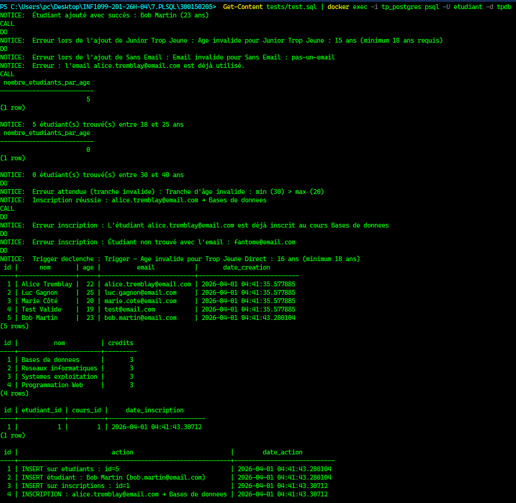
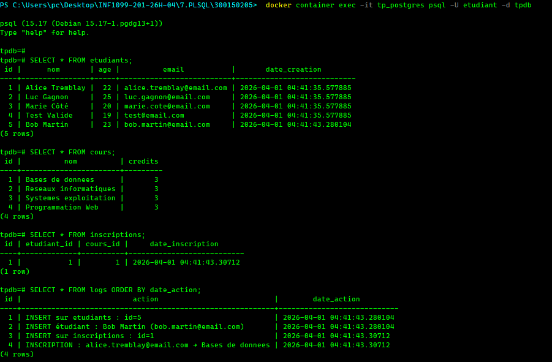

<div align="center">

# 🗄️ TP PostgreSQL — Stored Procedures
### Fonctions, Procédures Stockées et Triggers


<p align="center">
  
</p>

</div>

---

## 🎯 Objectifs

| # | Objectif |
|---|----------|
| 1 | Expliquer la différence entre fonction et procédure stockée |
| 2 | Créer et appeler des fonctions et procédures en PL/pgSQL |
| 3 | Utiliser les triggers pour automatiser la logique métier |
| 4 | Gérer les exceptions et le logging dans PostgreSQL |

---

## 📁 Structure du projet

```
300150205/
│
├── init/
│   ├── 01-ddl.sql             ← Création des tables
│   ├── 02-dml.sql             ← Données initiales
│   └── 03-programmation.sql   ← Fonctions, procédures, triggers
│
├── tests/
│   └── test.sql               ← Fichier de tests complets
│
└── README.md
```

---

## 🗂️ Définitions clés

| Élément | Description | Exemple d'appel |
|---------|-------------|-----------------|
| **FUNCTION** | Retourne une valeur, utilisable dans un `SELECT` | `SELECT nombre_etudiants_par_age(18, 25);` |
| **PROCEDURE** | Ne retourne pas de valeur, gère les transactions | `CALL ajouter_etudiant('Alice', 22, 'alice@email.com');` |
| **TRIGGER** | Exécuté automatiquement sur `INSERT`, `UPDATE`, `DELETE` | Automatique |

---

## 🐳 Démarrer PostgreSQL avec Docker

### Étape 1 : Créer et lancer le conteneur

```powershell
docker run -d `
  --name tp_postgres `
  -e POSTGRES_USER=etudiant `
  -e POSTGRES_PASSWORD=etudiant `
  -e POSTGRES_DB=tpdb `
  -p 5432:5432 `
  -v ${PWD}/init:/docker-entrypoint-initdb.d `
  postgres:15
```

> ℹ️ Le flag `-v` monte le dossier `init/` dans le conteneur — PostgreSQL exécute automatiquement tous les fichiers `.sql` au démarrage dans l'ordre alphabétique.

### Étape 2 : Vérifier que le conteneur est actif

```powershell
docker container ls
```

<details>
<summary>📋 Output attendu</summary>

```
CONTAINER ID   IMAGE         STATUS        PORTS                    NAMES
a1b2c3d4e5f6   postgres:15   Up 2 seconds  0.0.0.0:5432->5432/tcp   tp_postgres
```
</details>

---

## 📝 Fichiers SQL

### `01-ddl.sql` — Structure des tables

| Table | Description |
|-------|-------------|
| `etudiants` | Étudiants avec nom, âge, email |
| `cours` | Cours disponibles avec crédits |
| `inscriptions` | Lien étudiant ↔ cours |
| `logs` | Journal automatique de toutes les opérations |

---

### `02-dml.sql` — Données initiales

- 4 étudiants de test
- 4 cours disponibles

---

### `03-programmation.sql` — PL/pgSQL

#### 1️⃣ Procédure `ajouter_etudiant`

```sql
CALL ajouter_etudiant('Alice', 22, 'alice@email.com');
```

Validations :
- Âge ≥ 18
- Format email valide
- Email unique
- Journalisation automatique dans `logs`

---

#### 2️⃣ Fonction `nombre_etudiants_par_age`

```sql
SELECT nombre_etudiants_par_age(18, 25);
```

- Retourne le nombre d'étudiants dans une tranche d'âge
- Valide que `min_age <= max_age`

---

#### 3️⃣ Procédure `inscrire_etudiant_cours`

```sql
CALL inscrire_etudiant_cours('alice@email.com', 'Bases de données');
```

Validations :
- Étudiant existe
- Cours existe
- Pas de doublon d'inscription
- Journalisation dans `logs`

---

#### 4️⃣ Trigger `trg_valider_etudiant`

- Déclenché **BEFORE INSERT** sur `etudiants`
- Valide âge et format email automatiquement
- Bloque l'insertion si invalide

---

#### 5️⃣ Triggers `trg_log_etudiant` et `trg_log_inscription`

- Déclenchés **AFTER INSERT / UPDATE / DELETE**
- Journalisent chaque opération avec les valeurs `OLD` et `NEW`
- Permettent un historique complet des modifications

---

## ✅ Exécuter les tests

### Option A — Manuellement (connecté dans le conteneur)

```powershell
docker container exec -it tp_postgres psql -U etudiant -d tpdb
```

Puis taper les commandes SQL directement dans le terminal PostgreSQL.

### Option B — Automatiquement (depuis PowerShell, hors conteneur)

```powershell
Get-Content tests/test.sql | docker exec -i tp_postgres psql -U etudiant -d tpdb
```

<details>
<summary>📋 Tests couverts</summary>

| # | Test | Résultat attendu |
|---|------|-----------------|
| 1 | Insertion valide | ✅ Étudiant ajouté |
| 2 | Âge invalide (< 18) | ✅ Exception capturée |
| 3 | Email mal formé | ✅ Exception capturée |
| 4 | Email doublon | ✅ Erreur unique_violation |
| 5 | Fonction tranche d'âge valide | ✅ Nombre retourné |
| 6 | Tranche d'âge invalide (min > max) | ✅ Exception capturée |
| 7 | Inscription valide | ✅ Inscription créée |
| 8 | Inscription doublon | ✅ Exception capturée |
| 9 | Étudiant inexistant | ✅ Exception capturée |
| 10 | Trigger INSERT direct invalide | ✅ Trigger déclenché |

</details>

<details>
<summary>🖼️ Capture d'écran</summary>



</details>

---

## 🔍 Vérification finale

Se connecter d'abord au conteneur :

```powershell
docker container exec -it tp_postgres psql -U etudiant -d tpdb
```

Puis exécuter :

```sql
SELECT * FROM etudiants;
SELECT * FROM cours;
SELECT * FROM inscriptions;
SELECT * FROM logs ORDER BY date_action;
```

<details>
<summary>🖼️ Capture d'écran</summary>



</details>

