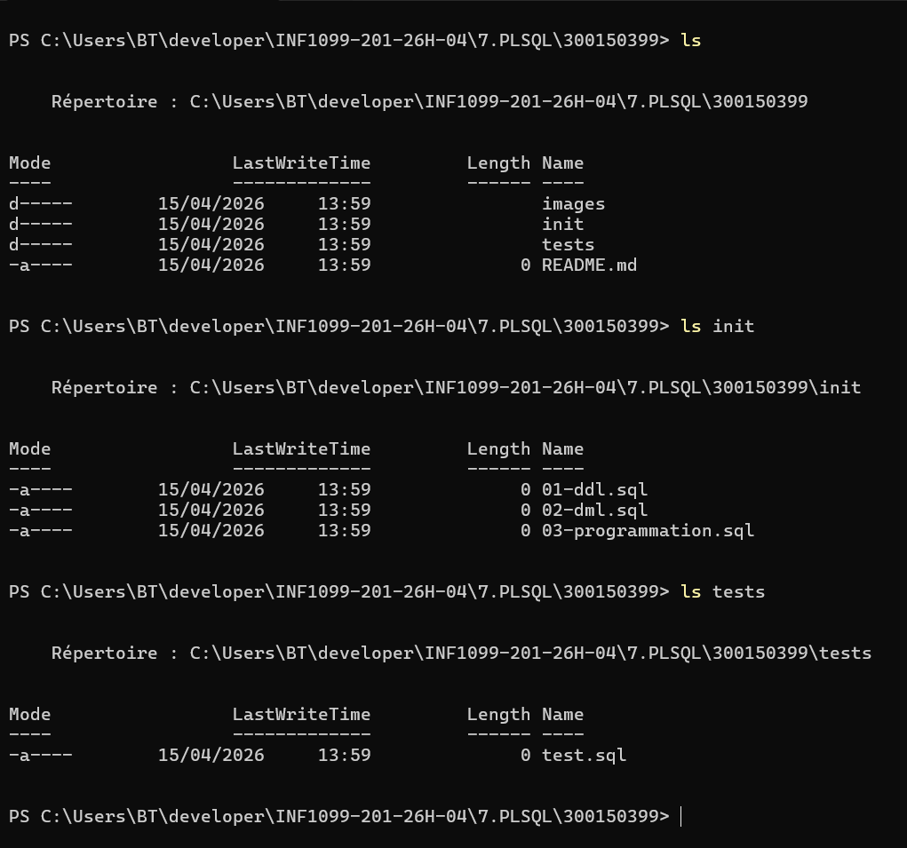
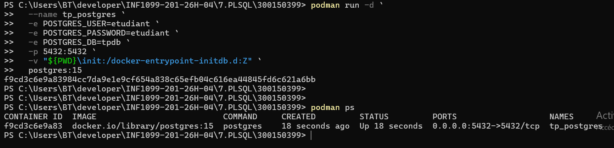
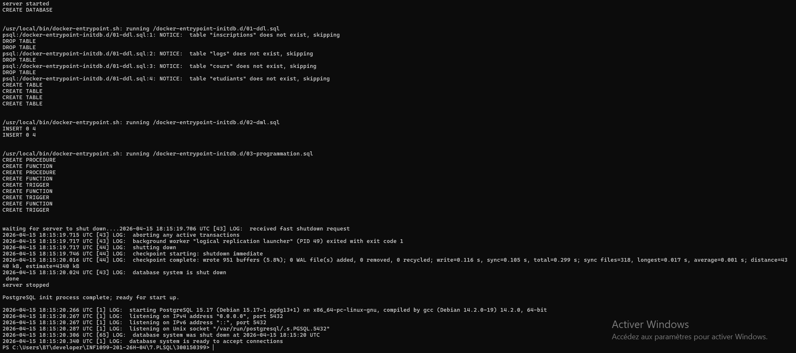
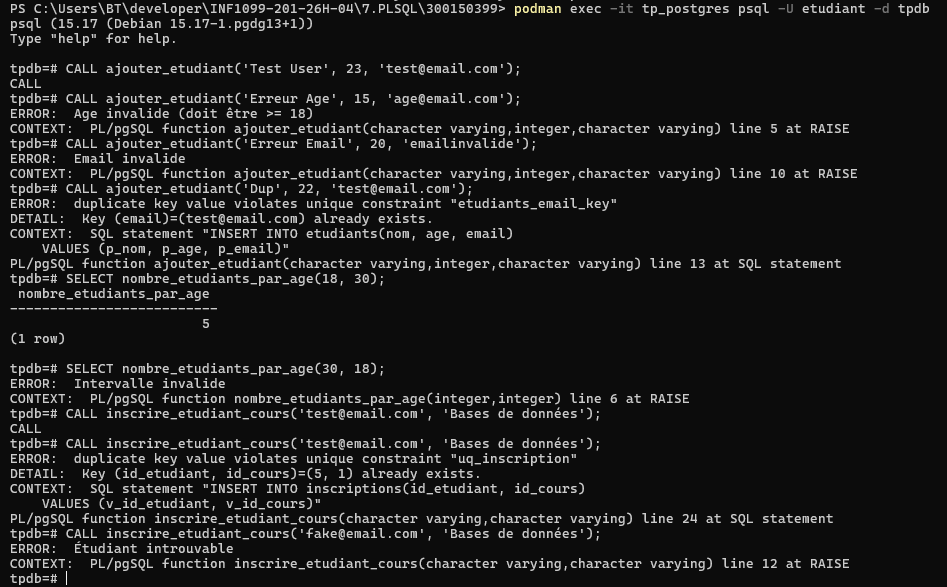
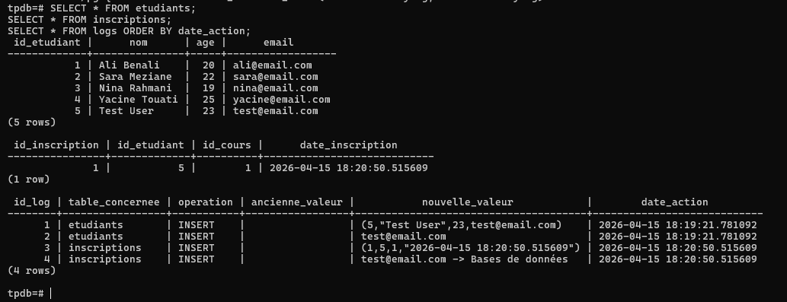

<div align="center">

<!-- HEADER BANNER -->


<br/>

<!-- BADGES ROW 1 -->


<!-- BADGES ROW 2 -->
<br/>


<br/>

> **Travail pratique portant sur la programmation avancée en PostgreSQL :**
> création de fonctions, procédures stockées et triggers en PL/pgSQL,
> déployés via un conteneur Podman.

<br/>

</div>

---

## 📋 Table des matières

| Section | Description |
|---|---|
| [🎯 Objectifs](#-objectifs) | But pédagogique du TP |
| [✨ Fonctionnalités](#-fonctionnalités) | Ce que le projet implémente |
| [🛠️ Technologies](#️-technologies-utilisées) | Stack technique utilisée |
| [📁 Structure du projet](#-structure-du-projet) | Arborescence des fichiers |
| [🗂️ Définitions clés](#️-définitions-clés) | FUNCTION vs PROCEDURE vs TRIGGER |
| [🐳 Démarrage avec Podman](#-démarrage-avec-podman) | Lancer l'environnement |
| [📝 Fichiers SQL](#-fichiers-sql) | Description de chaque fichier |
| [⚙️ Procédures & Fonctions](#️-procédures-fonctions-et-triggers) | Détail de chaque objet PL/pgSQL |
| [🧪 Cas de test](#-cas-de-test) | Scénarios de validation |
| [📊 Résultats obtenus](#-résultats-obtenus) | Captures et vérifications |
| [🚀 Compétences développées](#-compétences-développées) | Apprentissages clés |
| [✅ Conclusion](#-conclusion) | Bilan du travail pratique |

---

## 🎯 Objectifs

Ce travail pratique vise à maîtriser la programmation côté serveur dans PostgreSQL à travers quatre objectifs fondamentaux :

| # | Objectif | Maîtrisé |
|:---:|---|:---:|
| 1 | Expliquer la différence entre une **fonction** et une **procédure stockée** | ✅ |
| 2 | Créer et appeler des fonctions et procédures en **PL/pgSQL** | ✅ |
| 3 | Utiliser les **triggers** pour automatiser la logique métier | ✅ |
| 4 | Gérer les **exceptions** et le **logging** dans PostgreSQL | ✅ |

---

## ✨ Fonctionnalités

```
╔══════════════════════════════════════════════════════════════════╗
║              FONCTIONNALITÉS IMPLÉMENTÉES                       ║
╠══════════════════════════════════════════════════════════════════╣
║  ➤  Ajout d'étudiants avec validation métier complète           ║
║  ➤  Calcul dynamique d'étudiants par tranche d'âge              ║
║  ➤  Inscription à des cours avec contrôle de doublons           ║
║  ➤  Validation automatique via trigger (âge + email)            ║
║  ➤  Journalisation automatique de toutes les opérations         ║
║  ➤  Gestion des exceptions avec messages d'erreur explicites    ║
╚══════════════════════════════════════════════════════════════════╝
```

---

## 🛠️ Technologies utilisées

| Technologie | Rôle | Version |
|---|---|:---:|
|  | Système de gestion de bases de données | 15 |
|  | Langage procédural PostgreSQL | natif |
|  | Containerisation sans daemon root | latest |
|  | DDL / DML / Requêtes | standard |

---

## 📁 Structure du projet

```text
300150399/
│
├── 📂 images/
│   ├── 1.png          ← Structure du projet
│   ├── 2.png          ← Conteneur lancé
│   ├── 3.png          ← Logs PostgreSQL
│   ├── 4.png          ← Exécution des tests
│   └── 5.png          ← Vérification finale
│
├── 📂 init/
│   ├── 01-ddl.sql     ← Création des tables
│   ├── 02-dml.sql     ← Insertion des données initiales
│   └── 03-programmation.sql  ← Fonctions, procédures et triggers
│
├── 📂 tests/
│   └── test.sql       ← Scénarios de tests complets
│
└── 📄 README.md
```

<div align="center">

**📸 Aperçu de la structure**



</div>

---

## 🗂️ Définitions clés

> Comprendre la distinction fondamentale entre les objets programmables PostgreSQL.

| Élément | Définition | Retour | Syntaxe d'appel |
|:---:|---|:---:|---|
| **`FUNCTION`** | Bloc PL/pgSQL qui **retourne une valeur** ; utilisable directement dans un `SELECT` | ✅ Valeur | `SELECT nombre_etudiants_par_age(18, 25);` |
| **`PROCEDURE`** | Bloc PL/pgSQL qui **exécute une action** sans nécessairement retourner de valeur | ❌ Rien | `CALL ajouter_etudiant('Alice', 22, 'alice@email.com');` |
| **`TRIGGER`** | Fonction déclenchée **automatiquement** sur un événement (`INSERT`, `UPDATE`, `DELETE`) | Automatique | *(déclenché par l'événement)* |

---

## 🐳 Démarrage avec Podman

### 1️⃣ Lancer le conteneur PostgreSQL

```powershell
podman run -d `
  --name tp_postgres `
  -e POSTGRES_USER=etudiant `
  -e POSTGRES_PASSWORD=etudiant `
  -e POSTGRES_DB=tpdb `
  -p 5432:5432 `
  -v "${PWD}\init:/docker-entrypoint-initdb.d:Z" `
  postgres:15
```

<div align="center">

<br/><em>Conteneur tp_postgres démarré avec succès</em>
</div>

<br/>

### 2️⃣ Vérifier que le conteneur est actif

```bash
podman ps
```

### 3️⃣ Consulter les logs d'initialisation SQL

```bash
podman logs tp_postgres
```

<div align="center">

<br/><em>Initialisation automatique des scripts SQL au démarrage</em>
</div>

---

## 📝 Fichiers SQL

### `01-ddl.sql` — Structure des tables

> Définit le schéma relationnel de la base de données.

| Table | Description | Colonnes clés |
|---|---|---|
| `etudiants` | Registre des étudiants | `nom`, `age`, `email` (unique) |
| `cours` | Catalogue des cours disponibles | `nom_cours`, `credits` |
| `inscriptions` | Table de liaison étudiant ↔ cours | `etudiant_id`, `cours_id` |
| `logs` | Journal automatique des opérations | `operation`, `details`, `date_action` |

---

### `02-dml.sql` — Données initiales

> Peuple la base avec des données de départ pour les tests.

- **4 étudiants** de test pré-insérés
- **4 cours** disponibles dans le catalogue

---

### `03-programmation.sql` — PL/pgSQL

> Cœur du TP — contient tous les objets programmables.

| Objet | Type | Rôle |
|---|:---:|---|
| `ajouter_etudiant` | `PROCEDURE` | Ajout avec validations métier |
| `nombre_etudiants_par_age` | `FUNCTION` | Comptage par tranche d'âge |
| `inscrire_etudiant_cours` | `PROCEDURE` | Inscription avec contrôle de doublons |
| `trg_valider_etudiant` | `TRIGGER` | Validation automatique à l'insertion |
| Triggers de logs | `TRIGGER` | Journalisation automatique |

---

## ⚙️ Procédures, Fonctions et Triggers

### 1. `ajouter_etudiant` — Procédure

Ajoute un étudiant en appliquant des règles de validation strictes avant l'insertion.

```sql
CALL ajouter_etudiant('Test User', 23, 'test@email.com');
```

**Validations appliquées :**

| Règle | Condition | Comportement si échec |
|---|---|---|
| Âge minimum | `age >= 18` | Exception levée |
| Format email | Contient `@` et `.` | Exception levée |
| Unicité email | Email non déjà présent | Exception levée |

---

### 2. `nombre_etudiants_par_age` — Fonction

Retourne le **nombre d'étudiants** dont l'âge est compris entre deux bornes inclusives.

```sql
SELECT nombre_etudiants_par_age(18, 30);
```

> Retourne un entier. Utilisable directement dans des requêtes `SELECT`.

---

### 3. `inscrire_etudiant_cours` — Procédure

Inscrit un étudiant à un cours après validation de l'existence des deux entités et de l'absence de doublon.

```sql
CALL inscrire_etudiant_cours('test@email.com', 'Bases de données');
```

**Validations appliquées :**

| Règle | Vérification |
|---|---|
| Étudiant existant | L'email doit correspondre à un étudiant en base |
| Cours existant | Le nom du cours doit exister dans la table `cours` |
| Pas de doublon | La paire `(etudiant_id, cours_id)` ne doit pas déjà exister |

---

### 4. `trg_valider_etudiant` — Trigger

Trigger de type `BEFORE INSERT` qui valide automatiquement chaque insertion dans la table `etudiants`.

```
Événement : INSERT sur etudiants
Moment    : BEFORE
Validations: âge ≥ 18 | format email valide
```

---

### 5. Triggers de logging

Enregistrent automatiquement toute opération dans la table `logs` afin de garder une traçabilité complète.

```
Événement : INSERT / UPDATE / DELETE
Table cible: logs
Colonnes  : operation | details | date_action
```

---

## 🧪 Cas de test

### Connexion à la base de données

```bash
podman exec -it tp_postgres psql -U etudiant -d tpdb
```

---

### Tests de la procédure `ajouter_etudiant`

```sql
-- ✅ Cas valide : insertion normale
CALL ajouter_etudiant('Test User', 23, 'test@email.com');

-- ❌ Cas invalide : âge inférieur à 18
CALL ajouter_etudiant('Erreur Age', 15, 'age@email.com');

-- ❌ Cas invalide : format email incorrect
CALL ajouter_etudiant('Erreur Email', 20, 'emailinvalide');

-- ❌ Cas invalide : email déjà utilisé (doublon)
CALL ajouter_etudiant('Dup', 22, 'test@email.com');
```

---

### Tests de la fonction `nombre_etudiants_par_age`

```sql
-- ✅ Cas valide : tranche d'âge normale
SELECT nombre_etudiants_par_age(18, 30);

-- ❌ Cas limite : bornes inversées
SELECT nombre_etudiants_par_age(30, 18);
```

---

### Tests de la procédure `inscrire_etudiant_cours`

```sql
-- ✅ Cas valide : première inscription
CALL inscrire_etudiant_cours('test@email.com', 'Bases de données');

-- ❌ Cas invalide : doublon d'inscription
CALL inscrire_etudiant_cours('test@email.com', 'Bases de données');

-- ❌ Cas invalide : étudiant inexistant
CALL inscrire_etudiant_cours('fake@email.com', 'Bases de données');
```

<div align="center">

<br/><em>Résultats de l'exécution des tests — cas valides et invalides</em>
</div>

---

## 📊 Résultats obtenus

### Requêtes de vérification finale

```sql
-- Lister tous les étudiants
SELECT * FROM etudiants;

-- Lister toutes les inscriptions
SELECT * FROM inscriptions;

-- Consulter le journal des opérations (ordre chronologique)
SELECT * FROM logs ORDER BY date_action;
```

<div align="center">

<br/><em>État final de la base — données, inscriptions et journal des logs</em>
</div>

<br/>

### Tableau récapitulatif des résultats

| Scénario de test | Résultat attendu | Résultat obtenu |
|---|:---:|:---:|
| Insertion étudiant valide | ✅ Succès | ✅ |
| Insertion âge < 18 | ❌ Exception | ✅ |
| Insertion email invalide | ❌ Exception | ✅ |
| Insertion email dupliqué | ❌ Exception | ✅ |
| Comptage par tranche d'âge valide | Entier retourné | ✅ |
| Bornes d'âge inversées | 0 ou exception | ✅ |
| Inscription cours valide | ✅ Succès | ✅ |
| Inscription en doublon | ❌ Exception | ✅ |
| Inscription étudiant inexistant | ❌ Exception | ✅ |
| Journalisation automatique | Entrée dans `logs` | ✅ |

> **Tous les cas de test ont produit le comportement attendu.**

---

## 🚀 Compétences développées

```
┌─────────────────────────────────────────────────────────────┐
│                   APPRENTISSAGES CLÉS                       │
├─────────────────────────────────────────────────────────────┤
│  🗄️  Conception de schémas relationnels normalisés           │
│  🔧  Programmation PL/pgSQL (blocs, conditions, exceptions)  │
│  📦  Containerisation de base de données avec Podman         │
│  🔁  Automatisation via triggers BEFORE/AFTER               │
│  🛡️  Validation et contrôle d'intégrité côté serveur        │
│  📋  Journalisation et traçabilité des opérations            │
│  🧪  Rédaction et exécution de cas de test structurés        │
└─────────────────────────────────────────────────────────────┘
```

---

## ✅ Conclusion

Ce travail pratique a permis de mettre en œuvre une base de données PostgreSQL complète et fonctionnelle, intégrant des mécanismes avancés de programmation côté serveur.

À travers ce projet, les points suivants ont été maîtrisés :

- **Conception relationnelle** — création de tables liées avec contraintes d'intégrité
- **Programmation PL/pgSQL** — écriture de procédures et fonctions avec gestion d'exceptions
- **Automatisation** — mise en place de triggers pour la validation et la journalisation
- **Tests rigoureux** — validation de cas valides et invalides pour chaque objet programmable
- **Containerisation** — déploiement reproductible via Podman sans configuration manuelle

> Ce TP démontre qu'une logique métier robuste peut être entièrement gérée au niveau de la base de données, garantissant cohérence et intégrité indépendamment de l'application cliente.

---

<div align="center">


**Chakib Rahmani — 300150399**


</div>
