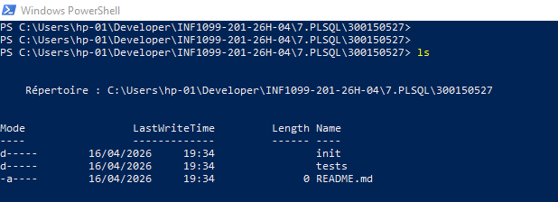
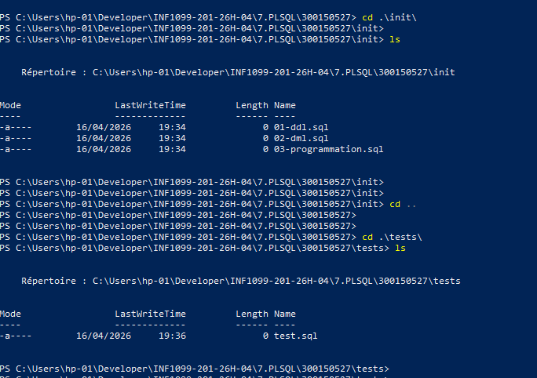
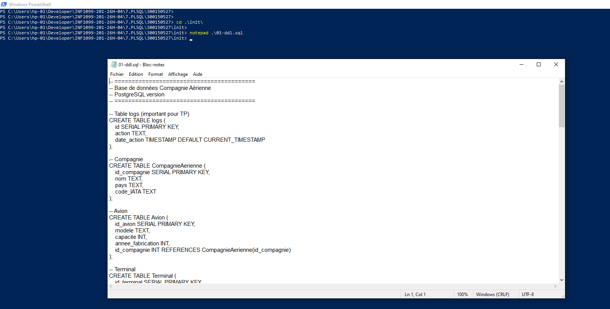
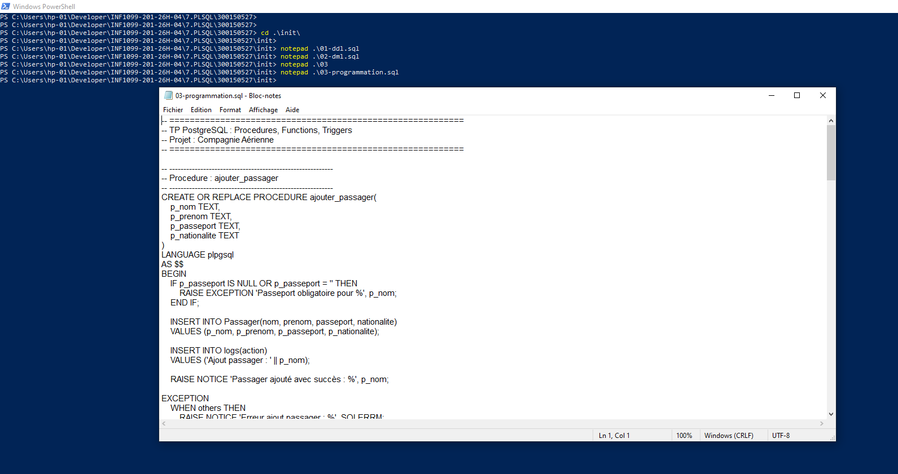
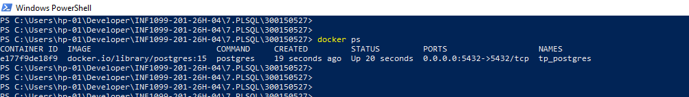

# ✈️ TP PostgreSQL – Compagnie Aérienne

> **INF1099 – Collège Boréal** &nbsp;|&nbsp; Étudiant : `300150527`

Base de données PostgreSQL pour la gestion d'une compagnie aérienne — modélisation relationnelle, DDL, DML, programmation avancée PL/pgSQL et tests automatisés avec Docker.

---
## 📌 ✨ Présentation du projet

Ce projet consiste à concevoir et implémenter une **base de données complète pour une compagnie aérienne** en utilisant PostgreSQL.

Il couvre :

* 🧱 Modélisation des données (NF1, NF2, NF3)
* 🗄️ Création des tables (DDL)
* 📊 Insertion des données (DML)
* ⚙️ Programmation avancée (PL/pgSQL)
* 🧪 Tests automatisés avec Docker

---

## 📂 Structure du projet

```
300150527/
│
├── init/
│   ├── 01-ddl.sql              # Création des tables
│   ├── 02-dml.sql              # Insertion des données
│   └── 03-programmation.sql    # Procédures, fonctions, triggers
│
├── tests/
│   └── test.sql                # Scénarios de test
│
├── images/                     # Captures d'écran
│
└── README.md
```




---

## 🧱 Modèle de données

| Entité | Description |
|---|---|
| `CompagnieAerienne` | Données des compagnies (nom, pays, code IATA) |
| `Avion` | Parc d'avions avec référence compagnie |
| `Terminal` / `Gate` | Infrastructure aéroportuaire |
| `Runway` | Pistes avec statut de disponibilité |
| `Vol` | Vols avec départ, arrivée, avion et gate |
| `Passager` | Passagers avec passeport et nationalité |
| `Reservation` | Réservations liées aux vols et passagers |
| `logs` | Journal automatique des actions |

Le système représente plusieurs entités du domaine aérien :

* ✈️ CompagnieAerienne
* 🛫 Avion
* 🏢 Terminal / Gate
* 🛬 Runway
* 🧭 Vol
* 👤 Passager
* 🎫 Reservation / Billet
* 🧳 Bagage
* 👷 Personnel / Sécurité
* 🛠️ Maintenance
* ⚠️ Incident
* 🧹 ServiceSol
* 📄 logs (journal des actions)


---

## 🗄️ Contenu des fichiers

### 🔹 `01-ddl.sql` — Schéma de la base

Création de toutes les tables avec clés primaires, clés étrangères et contraintes.



---

### 🔹 `02-dml.sql` — Données initiales

Les scripts DML permettent d’insérer :

* 1 compagnie aérienne
* 1 avion
* 1 terminal + gate
* 1 piste (runway)
* 1 vol (Alger → Paris)
* 1 passager initial
* 1 réservation + billet
* Données de sécurité, maintenance, service sol

ex :

- **Compagnie** : Air Algérie (`AH`, Algérie)
- **Avion** : Boeing 737, capacité 180, fabriqué en 2015
- **Terminal** : Terminal 1, capacité 500 — **Gate** : G1 — **Runway** : R1 (Disponible)
- **Vol** : AH100 (Alger → Paris)
- **Passager** : Ali Ahmed, passeport AA12345


---

### 🔹 `03-programmation.sql` — Programmation PL/pgSQL

### 🔹 Procédure : `ajouter_passager`

* Vérifie que le passeport n’est pas vide
* Insère un nouveau passager
* Ajoute une entrée dans `logs`
* Gère les erreurs avec `EXCEPTION`

---

### 🔹 Fonction : `nombre_passagers_par_vol`

* Retourne le nombre de réservations pour un vol donné

---

### 🔹 Procédure : `reserver_vol`

* Vérifie l’existence du passager
* Vérifie l’existence du vol
* Empêche les doublons
* Insère la réservation
* Enregistre un log

---

### 🔹 Trigger : validation des passagers

* Empêche l’insertion d’un passager sans passeport

---

### 🔹 Trigger : log automatique sur `Reservation`

* Capture automatiquement :

  * INSERT
  * UPDATE
  * DELETE
* Enregistre les détails (passager, vol, statut)




---

### 🔹 `tests/test.sql` — Suite de tests

Le fichier `test.sql` couvre :

### ✔️ Cas valides

* Ajout de plusieurs passagers
* Création de réservations
* Calcul du nombre de passagers

### ❌ Cas d’erreurs

* Passeport vide
* Réservation en double

### 📊 Vérifications

* Contenu de `Passager`
* Contenu de `Reservation`
* Contenu de `logs`


| Test | Résultat attendu |
|---|---|
| Ajout de 3 passagers (Karim, Yacine, Nadia) | ✔️ Succès |
| Ajout sans passeport | ✔️ Erreur capturée |
| Réservations vol 1 (passagers 2, 3, 4) | ✔️ Confirmées |
| Réservation en doublon | ✔️ Erreur détectée |
| `SELECT nombre_passagers_par_vol(1)` | ✔️ Retourne 4 |
| Affichage `Passager`, `Reservation`, `logs` | ✔️ Données correctes |


---

## 🐳 Lancement avec Docker

### 1. Démarrer le conteneur PostgreSQL

```powershell
docker run -d `
  --name tp_postgres `
  -e POSTGRES_USER=etudiant `
  -e POSTGRES_PASSWORD=etudiant `
  -e POSTGRES_DB=tpdb `
  -p 5432:5432 `
  -v ${PWD}/init:/docker-entrypoint-initdb.d `
  postgres:15
```


### 2. Vérifier que le conteneur est actif

```powershell
docker ps
```



### 3. Exécuter les tests

```powershell
Get-Content tests/test.sql | docker exec -i tp_postgres psql -U etudiant -d tpdb
```

### 4. Accès interactif à la base

```powershell
docker container exec -it tp_postgres psql -U etudiant -d tpdb
```

---

## 🧪 Résultats obtenus

### Exécution des tests via PowerShell


### Vérification interactive via psql


| Élément vérifié | Résultat |
|---|---|
| Passagers insérés | 4 (Ali, Karim, Yacine, Nadia) |
| Réservations confirmées | 4 |
| Erreur passeport vide | ✔️ Gérée |
| Doublon de réservation | ✔️ Détecté |
| Logs automatiques | 9 entrées |
| `nombre_passagers_par_vol(1)` | 4 |

---

## 🚀 Fonctionnalités principales

- ✨ Gestion complète des passagers
- ✨ Réservation de vols avec contrôle métier
- ✨ Validation des données via exceptions PL/pgSQL
- ✨ Logs automatiques via triggers (INSERT / UPDATE / DELETE)
- ✨ Suite de tests reproductible

---

## 🧠 Conclusion

Ce projet démontre :

- ✔️ Maîtrise du modèle relationnel (NF1, NF2, NF3)
- ✔️ Utilisation avancée de PostgreSQL et PL/pgSQL
- ✔️ Gestion robuste des erreurs et des cas limites
- ✔️ Utilisation des triggers pour l'automatisation
- ✔️ Déploiement et exécution dans un environnement Docker isolé

---

## 👨‍💻 Auteur

| Champ | Valeur |
|---|---|
| Étudiant | `300150527` |
| Cours | INF1099 |
| Institution | Collège Boréal |
| Date | Avril 2026 |
